# The Comprehensive Practical Guide: Clean Architecture + Feature-Based Pattern + SOLID in JavaScript

[اللغة العربية](Readme_ar.md)

[For Dart developers](../dart/Readme.md)

> An extensive English reference that combines **Part One**, covering Clean Architecture and the Feature-Based Pattern, with **Part Two**, covering the application of SOLID principles within this architecture, including Mermaid diagrams, code, tests, and checklists.

## Guide Scope

This edition focuses on modern JavaScript. It uses Node.js and ES Modules and treats Express only as a Delivery Adapter. The Domain remains independent, so Express or the database can be replaced without changing the Use Cases.

## How to Read This Guide

1. Read the foundations before copying any code.
2. Implement the case study one file at a time.
3. Use the SOLID chapters to review the design.
4. Run the tests after every step.
5. Review the checklists before opening a Pull Request.

## Conventions

- Concept names and programming symbols remain in English.
- The explanation is in English.
- An inward-pointing arrow means that details depend on policies.
- A Feature means a vertical business unit such as `auth` or `orders`.
- A Contract describes behavior without coupling it to an implementation.
- An Adapter translates between the system and an external detail.

## Short Table of Contents

- [Part One: Foundations](#part-one-foundations)
- [Part Two: Clean Architecture Layers](#part-two-clean-architecture-layers)
- [Part Three: Feature-Based Pattern](#part-three-feature-based-pattern)
- [Part Four: Data Flow and Dependencies](#part-four-data-flow-and-dependencies)
- [Part Five: End-to-End Case Study](#part-five-end-to-end-case-study)
- [Part Six: SOLID Principles](#part-six-solid-principles)
- [Part Seven: Testing and Quality](#part-seven-testing-and-quality)
- [Part Eight: Security, Performance, and Observability](#part-eight-security-performance-and-observability)
- [Part Nine: Migrating from a Traditional Project](#part-nine-migrating-from-a-traditional-project)
- [Part Ten: Checklists, Glossary, and Exercises](#part-ten-checklists-glossary-and-exercises)
## Part One: Foundations

### 1. Why Do We Need Architecture?

In a small project, placing UI, HTTP, SQL, and business rules in one file may seem faster. That speed is temporary, however: every small change touches many parts, testing becomes slow, and Framework details spread everywhere.

The real purpose of Architecture is to **reduce the cost of change**. Good architecture keeps the impact of a decision local and prevents volatile details from controlling stable policies.
- Change the database without rewriting the Use Cases.
- Change the UI or Framework without changing the Domain.
- Test business rules without a network or storage.
- Divide work into independent Features.
- Understand the operation flow from file names and boundaries alone.

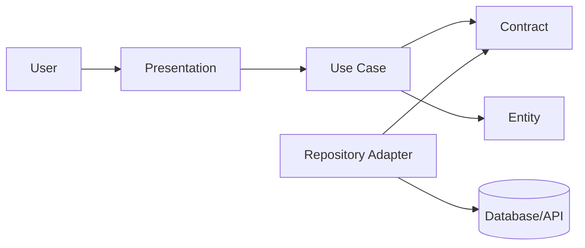

### 2. Clean Code vs. Clean Architecture

| Dimension | Clean Code | Clean Architecture |
| --- | --- | --- |
| Scope | Function or Class | System, boundaries, and dependencies |
| Question | Is the code clear? | Is the dependency direction correct? |
| Tool | Good names and small functions | Layers, Contracts, and Adapters |
| Failure mode | Local complexity | Framework leakage and mixed responsibilities |
| Testing | Small unit tests | Testing policies in isolation from details |

> **Rule:** Clean code does not compensate for bad architecture, and good architecture does not justify poor local code.

### 3. Dependency Rule

Dependencies point inward. The inner layer does not know Framework, SDK, or SQL names. The outside knows the inside and implements the Contracts defined by the inside.
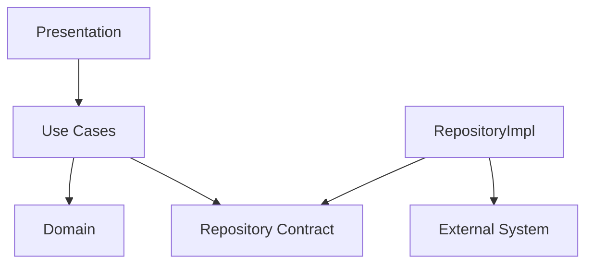

- An Entity does not import a Controller.
- A Use Case does not import an HTTP client.
- A Repository implementation imports its Contract because it implements it.
- The Composition Root knows all details because it wires them together.
- The Framework stays at the outer edge.

### 4. Policies and Details

| Policy | Detail |
| --- | --- |
| Register a user according to system rules | Send a POST request to an endpoint |
| Calculate a discount | Read a row from a database |
| Determine whether an order is valid | Verify a JWT with a specific library |
| Send a notification | Use an Email or SMS provider |
| Manage inventory | Use Redis as a Cache |

### 5. Boundaries

A Boundary separates two different reasons to change. If one file changes because of business requirements and another changes because of an external SDK, they deserve a clear boundary. A boundary succeeds when it contains the change.
- A boundary between UI and Use Case.
- A boundary between Use Case and Repository.
- A boundary between Entity and DTO.
- A boundary between the application and an external provider.
- A boundary between one Feature and another.

### 6. When Is the Architecture Overkill?

A static page or a short-lived utility does not need dozens of Contracts. Use boundaries when there are business rules, a long expected lifetime, multiple data sources, or a strong need for testing. Add a layer when it isolates real volatility, not merely to imitate a diagram.
## Part Two: Clean Architecture Layers

### 7. Domain

The system's internal language: Entities, Value Objects, business rules, and Contracts.
- It does not know the UI.
- It does not know JSON.
- It does not know the database.
- It protects invariants.

### 8. Entities

Objects with identity and behavior that persist over time.
- They protect their state.
- They validate transitions.
- They do not return DTOs.
- They use Value Objects.

### 9. Value Objects

Values defined by their attributes, such as Email and Money.
- Construction either succeeds or returns a Failure.
- Equality is based on value.
- They are immutable whenever possible.
- They reduce repeated validation.

### 10. Use Cases

A single goal for a user or the system.
- Its name is a clear verb.
- It orchestrates the operation.
- It does not construct Infrastructure.
- It returns a clear Result.

### 11. Repository Contracts

What the Domain needs from data, expressed in business language.
- It does not expose the ORM.
- It does not return a Data Model.
- It uses names such as `findByEmail`.
- It exposes meaningful errors.

### 12. Data Layer

Implements Contracts and manages Data Sources and Mapping.
- Hides HTTP and database details.
- Translates errors.
- Cache policy.
- Uses explicit Mapping.

### 13. Presentation

Receives input, manages state or protocol concerns, and then invokes a Use Case.
- It contains no Business Rules.
- It does not call an implementation directly.
- It transforms the result for presentation.
- It manages loading and error states.

### 14. Core / Shared

Truly stable shared components, not a dumping ground.
- Result and Failure.
- Clock and IdGenerator.
- Logging contracts.
- A small set of Utilities.

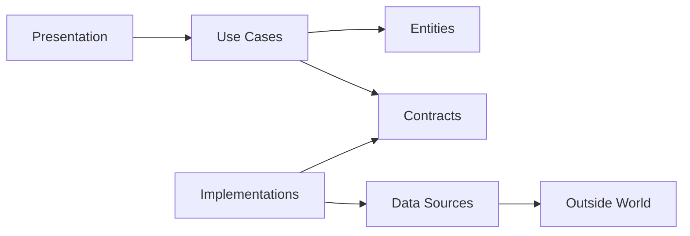

### 15. DTO, Model, and Entity

| Type | Role | Change Cycle |
| --- | --- | --- |
| DTO | External transport shape | Changes with the API |
| Data Model | Persistence shape | Changes with the database |
| Entity | Business rules | Changes with the domain |

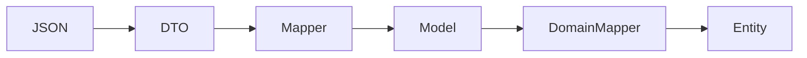

### 16. Result and Failure

| Failure | Meaning | Handling |
| --- | --- | --- |
| ValidationFailure | Invalid input | Field-level message |
| UnauthorizedFailure | Authentication rejected | Generic message |
| ConflictFailure | State conflict | 409 or an appropriate state |
| NetworkFailure | Temporary failure | Measured Retry |
| UnexpectedFailure | Unexpected error | Log + generic message |

### 17. Composition Root

The only place that constructs Adapters, Repositories, Use Cases, and Controllers and wires them together. It prevents detail construction from spreading across layers.
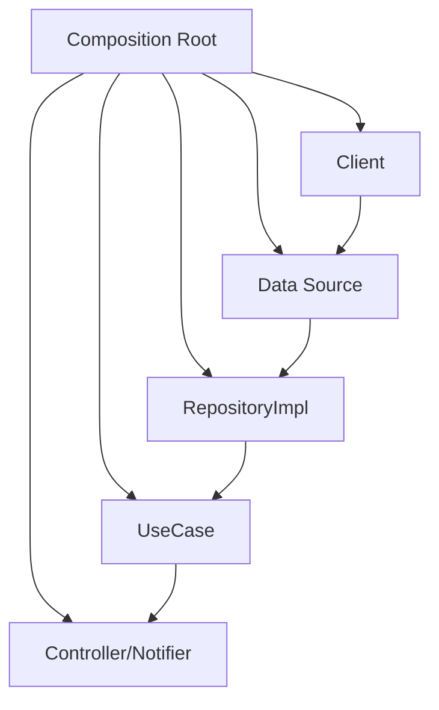

## Part Three: Feature-Based Pattern

### 18. Why Feature-First?

Organizing by file type makes changing one feature require navigating many generic folders. Organizing by Feature keeps the changing context together while preserving the internal layers.
| Layer-First | Feature-First |
| --- | --- |
| All controllers together | Controller inside the Feature |
| Horizontal growth | Vertical growth |
| Unclear ownership | Clearer ownership |
| Deleting a Feature is difficult | Deleting it is safer |

### 19. The Hybrid Structure

```text
src-or-lib/
  core/
  features/
    auth/
      domain/
      data/
      presentation/
    products/
      domain/
      data/
      presentation/
  composition/
  main
```

### 20. File Ownership

| File | Location | Reason |
| --- | --- | --- |
| AuthRepositoryImpl | auth/data | Feature-specific detail |
| LoginUseCase | auth/domain | Business goal |
| LoginPage/Route | auth/presentation | Feature interface |
| Money | core/domain | Stable shared concept |
| HttpClient | core/network | Shared infrastructure |

### 21. Communication Between Features

Avoid importing internals from another Feature. Use a Public API, a shared Contract, or a Domain Event. For example, `orders` should depend on `CurrentUserProvider`, not on `AuthRepositoryImpl`.
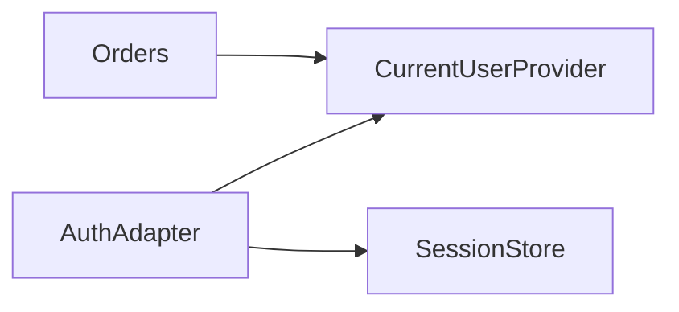

### 22. A Feature's Public API

- Export the required Use Cases or Facades.
- Do not export persistence Models.
- Do not export UI internals.
- Document errors and expectations.
- Use Contract Tests.

### 23. When Should Something Move to Core?

1. Is the name meaningful outside the Feature?
2. Is the behavior identical across all Features?
3. Is its change cycle slower?
4. Does moving it reduce coupling?
5. Can it be tested without a feature-specific context?

## Part Four: Data Flow and Dependencies

### 24. Request Flow

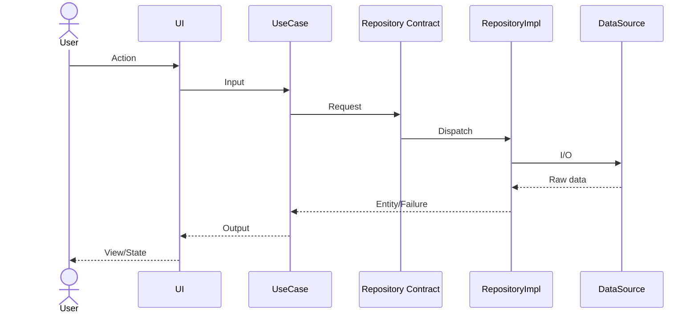

### 25. Commands and Queries

| Type | Examples | Note |
| --- | --- | --- |
| Command | RegisterUser, PlaceOrder | Changes state |
| Query | GetProfile, ListProducts | Read with no side effect |
| Policy | CalculateDiscount | Pure rule |
| Gateway | PaymentGateway | External Contract |

### 26. Validation by Level

| Level | Responsibility | Example |
| --- | --- | --- |
| Presentation | Field format | Required |
| Value Object | Value validity | Valid Email |
| Use Case | Context rule | Email is unused |
| Database | Final constraint | Unique index |
| External API | Provider constraint | Supported currency |

### 27. Transaction Boundary

Place the transaction boundary around the business operation that must succeed or fail as a unit. Do not let the Controller decide the transaction if the rule belongs to the Use Case.
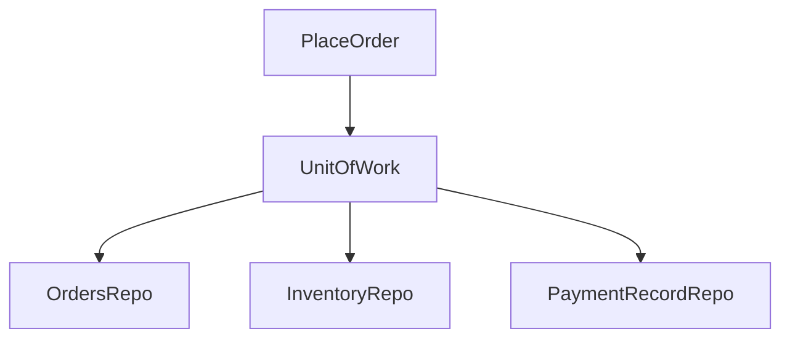

### 28. Domain Events

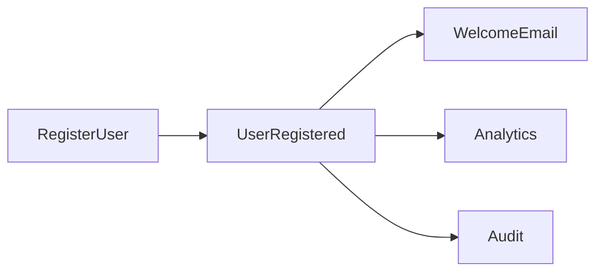

> **Warning:** If a consumer is required for the operation to succeed, do not hide it behind an unreliable event. Use an explicit dependency or an Outbox.

### 29. Cache

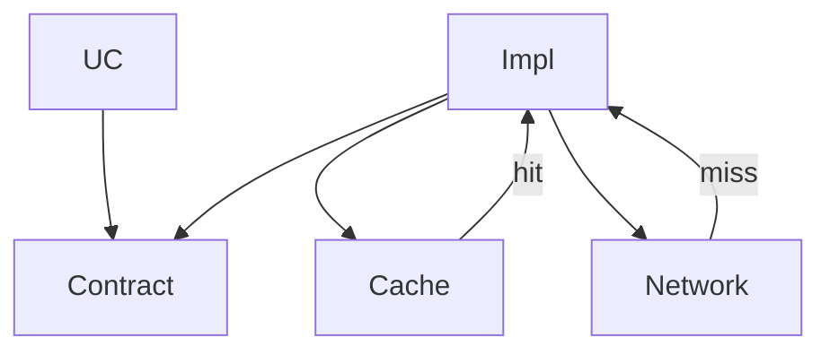

### 30. Retry and Idempotency

- Retry only safe operations or operations protected by an idempotency key.
- Do not retry payments blindly.
- Put backoff in the Adapter.
- Distinguish permanent failures from transient failures.
- Record the correlation id.

## Part Five: End-to-End Case Study

### 31. JavaScript Assumptions

- Node.js 20+ and ES Modules.
- The Domain does not depend on Express.
- Express is only a Delivery Adapter.
- `node:test` is used for tests.
- In-memory storage is replaceable.
- Wiring happens in the Composition Root.

### 32. Project Tree

```text
src/
  core/
    failure.js
    result.js
    clock.js
  features/
    auth/
      domain/
        entities/user.js
        value-objects/email.js
        contracts/auth-repository.js
        use-cases/register-user.js
        use-cases/login-user.js
      data/
        models/user-model.js
        mappers/user-mapper.js
        data-sources/in-memory-user-data-source.js
        repositories/auth-repository-impl.js
      presentation/
        http/auth-controller.js
        http/auth-routes.js
  composition/container.js
  server.js
test/
  unit/
  contract/
  integration/
```

### 33. Failure and Result

```javascript
// src/core/failure.js
export class Failure extends Error {
  constructor(code, message, details = undefined) {
    super(message);
    this.name = "Failure";
    this.code = code;
    this.details = details;
  }
}

export class ValidationFailure extends Failure {
  constructor(message, details) {
    super("VALIDATION", message, details);
  }
}

export class ConflictFailure extends Failure {
  constructor(message, details) {
    super("CONFLICT", message, details);
  }
}

export class UnauthorizedFailure extends Failure {
  constructor(message = "Invalid credentials") {
    super("UNAUTHORIZED", message);
  }
}

export class UnexpectedFailure extends Failure {
  constructor(message = "Unexpected error", details) {
    super("UNEXPECTED", message, details);
  }
}
```

```javascript
// src/core/result.js
export class Result {
  static ok(value) {
    return new Result(true, value, undefined);
  }

  static fail(failure) {
    return new Result(false, undefined, failure);
  }

  constructor(ok, value, failure) {
    this.ok = ok;
    this.value = value;
    this.failure = failure;
    Object.freeze(this);
  }

  map(fn) {
    return this.ok ? Result.ok(fn(this.value)) : this;
  }

  flatMap(fn) {
    return this.ok ? fn(this.value) : this;
  }
}
```

### 34. Email Value Object

```javascript
import { Result } from "../../../../core/result.js";
import { ValidationFailure } from "../../../../core/failure.js";

const EMAIL_PATTERN = /^[^\s@]+@[^\s@]+\.[^\s@]+$/;

export class Email {
  static create(raw) {
    const value = String(raw ?? "").trim().toLowerCase();

    if (!EMAIL_PATTERN.test(value)) {
      return Result.fail(
        new ValidationFailure("Email is invalid", { field: "email" }),
      );
    }

    return Result.ok(new Email(value));
  }

  constructor(value) {
    this.value = value;
    Object.freeze(this);
  }

  equals(other) {
    return other instanceof Email && other.value === this.value;
  }

  toString() {
    return this.value;
  }
}
```

### 35. User Entity

```javascript
export class User {
  constructor({ id, email, displayName, passwordHash, createdAt }) {
    if (!id) throw new Error("User id is required");
    if (!email) throw new Error("Email is required");
    if (!passwordHash) throw new Error("Password hash is required");

    this.id = id;
    this.email = email;
    this.displayName = displayName;
    this.passwordHash = passwordHash;
    this.createdAt = createdAt;
  }

  rename(nextName) {
    const name = String(nextName ?? "").trim();
    if (name.length < 2) {
      throw new Error("Display name is too short");
    }
    this.displayName = name;
  }

  snapshot() {
    return Object.freeze({
      id: this.id,
      email: this.email.toString(),
      displayName: this.displayName,
      createdAt: this.createdAt,
    });
  }
}
```

### 36. AuthRepository Contract

```javascript
export class AuthRepository {
  async findByEmail(_email) {
    throw new Error("findByEmail must be implemented");
  }

  async save(_user) {
    throw new Error("save must be implemented");
  }

  async verifyPassword(_user, _plainPassword) {
    throw new Error("verifyPassword must be implemented");
  }
}
```

### 37. RegisterUser UseCase

```javascript
import { Email } from "../value-objects/email.js";
import { User } from "../entities/user.js";
import { Result } from "../../../../core/result.js";
import {
  ConflictFailure,
  ValidationFailure,
  UnexpectedFailure,
} from "../../../../core/failure.js";

export class RegisterUser {
  constructor({ authRepository, passwordHasher, idGenerator, clock }) {
    this.authRepository = authRepository;
    this.passwordHasher = passwordHasher;
    this.idGenerator = idGenerator;
    this.clock = clock;
  }

  async execute(input) {
    const emailResult = Email.create(input.email);
    if (!emailResult.ok) return emailResult;

    const displayName = String(input.displayName ?? "").trim();
    if (displayName.length < 2) {
      return Result.fail(
        new ValidationFailure("Display name is too short"),
      );
    }

    const password = String(input.password ?? "");
    if (password.length < 10) {
      return Result.fail(
        new ValidationFailure("Password is too short"),
      );
    }

    const existing =
      await this.authRepository.findByEmail(emailResult.value);

    if (existing) {
      return Result.fail(
        new ConflictFailure("Email is already in use"),
      );
    }

    try {
      const user = new User({
        id: this.idGenerator.next(),
        email: emailResult.value,
        displayName,
        passwordHash: await this.passwordHasher.hash(password),
        createdAt: this.clock.now(),
      });

      await this.authRepository.save(user);
      return Result.ok(user.snapshot());
    } catch (error) {
      return Result.fail(
        new UnexpectedFailure("Could not register user", {
          cause: error,
        }),
      );
    }
  }
}
```

### 38. LoginUser UseCase

```javascript
import { Email } from "../value-objects/email.js";
import { Result } from "../../../../core/result.js";
import { UnauthorizedFailure } from "../../../../core/failure.js";

export class LoginUser {
  constructor({ authRepository, tokenIssuer }) {
    this.authRepository = authRepository;
    this.tokenIssuer = tokenIssuer;
  }

  async execute(input) {
    const emailResult = Email.create(input.email);
    if (!emailResult.ok) return emailResult;

    const user =
      await this.authRepository.findByEmail(emailResult.value);

    if (!user) {
      return Result.fail(new UnauthorizedFailure());
    }

    const matches =
      await this.authRepository.verifyPassword(
        user,
        String(input.password ?? ""),
      );

    if (!matches) {
      return Result.fail(new UnauthorizedFailure());
    }

    const accessToken = await this.tokenIssuer.issue({
      subject: user.id,
      email: user.email.toString(),
    });

    return Result.ok({
      accessToken,
      user: user.snapshot(),
    });
  }
}
```

### 39. Data Model and Mapper

```javascript
export class UserModel {
  constructor({
    id,
    email,
    display_name,
    password_hash,
    created_at,
  }) {
    this.id = id;
    this.email = email;
    this.display_name = display_name;
    this.password_hash = password_hash;
    this.created_at = created_at;
  }
}
```

```javascript
import { User } from "../../domain/entities/user.js";
import { Email } from "../../domain/value-objects/email.js";
import { UserModel } from "../models/user-model.js";

export class UserMapper {
  static toDomain(model) {
    const email = Email.create(model.email);
    if (!email.ok) throw email.failure;

    return new User({
      id: model.id,
      email: email.value,
      displayName: model.display_name,
      passwordHash: model.password_hash,
      createdAt: new Date(model.created_at),
    });
  }

  static toModel(entity) {
    return new UserModel({
      id: entity.id,
      email: entity.email.toString(),
      display_name: entity.displayName,
      password_hash: entity.passwordHash,
      created_at: entity.createdAt.toISOString(),
    });
  }
}
```

### 40. Data Source

```javascript
export class InMemoryUserDataSource {
  constructor() {
    this.rows = new Map();
  }

  async findByEmail(email) {
    for (const row of this.rows.values()) {
      if (row.email === email) return structuredClone(row);
    }
    return null;
  }

  async insert(row) {
    if (await this.findByEmail(row.email)) {
      const error = new Error("Unique constraint");
      error.code = "CONFLICT";
      throw error;
    }

    this.rows.set(row.id, structuredClone(row));
  }
}
```

### 41. AuthRepositoryImpl

```javascript
import { AuthRepository } from "../../domain/contracts/auth-repository.js";
import { UserMapper } from "../mappers/user-mapper.js";

export class AuthRepositoryImpl extends AuthRepository {
  constructor({ userDataSource, passwordHasher }) {
    super();
    this.userDataSource = userDataSource;
    this.passwordHasher = passwordHasher;
  }

  async findByEmail(email) {
    const row =
      await this.userDataSource.findByEmail(email.toString());
    return row ? UserMapper.toDomain(row) : null;
  }

  async save(user) {
    await this.userDataSource.insert(UserMapper.toModel(user));
  }

  async verifyPassword(user, plainPassword) {
    return this.passwordHasher.verify(
      plainPassword,
      user.passwordHash,
    );
  }
}
```

### 42. AuthController

```javascript
export class AuthController {
  constructor({ registerUser, loginUser }) {
    this.registerUser = registerUser;
    this.loginUser = loginUser;
  }

  register = async (req, res) => {
    const result = await this.registerUser.execute(req.body);
    return this.#toHttp(result, res, 201);
  };

  login = async (req, res) => {
    const result = await this.loginUser.execute(req.body);
    return this.#toHttp(result, res, 200);
  };

  #toHttp(result, res, successStatus) {
    if (result.ok) {
      return res.status(successStatus).json({
        data: result.value,
      });
    }

    const statusByCode = {
      VALIDATION: 400,
      UNAUTHORIZED: 401,
      CONFLICT: 409,
      UNEXPECTED: 500,
    };

    return res.status(
      statusByCode[result.failure.code] ?? 500,
    ).json({
      error: {
        code: result.failure.code,
        message: result.failure.message,
        details: result.failure.details,
      },
    });
  }
}
```

### 43. Routes

```javascript
import { Router } from "express";

export function createAuthRouter(controller) {
  const router = Router();

  router.post("/register", controller.register);
  router.post("/login", controller.login);

  return router;
}
```

### 44. Composition Root

```javascript
import { RegisterUser } from "../features/auth/domain/use-cases/register-user.js";
import { LoginUser } from "../features/auth/domain/use-cases/login-user.js";
import { InMemoryUserDataSource } from "../features/auth/data/data-sources/in-memory-user-data-source.js";
import { AuthRepositoryImpl } from "../features/auth/data/repositories/auth-repository-impl.js";
import { AuthController } from "../features/auth/presentation/http/auth-controller.js";

export function buildContainer({
  passwordHasher,
  tokenIssuer,
  clock,
  idGenerator,
}) {
  const userDataSource = new InMemoryUserDataSource();

  const authRepository = new AuthRepositoryImpl({
    userDataSource,
    passwordHasher,
  });

  const registerUser = new RegisterUser({
    authRepository,
    passwordHasher,
    idGenerator,
    clock,
  });

  const loginUser = new LoginUser({
    authRepository,
    tokenIssuer,
  });

  return {
    authController: new AuthController({
      registerUser,
      loginUser,
    }),
    registerUser,
    loginUser,
    authRepository,
  };
}
```

### 45. Server Adapter

```javascript
import express from "express";
import { buildContainer } from "./composition/container.js";
import { createAuthRouter } from "./features/auth/presentation/http/auth-routes.js";

const app = express();
app.use(express.json());

const container = buildContainer({
  passwordHasher: createPasswordHasher(),
  tokenIssuer: createTokenIssuer(),
  clock: { now: () => new Date() },
  idGenerator: { next: () => crypto.randomUUID() },
});

app.use(
  "/auth",
  createAuthRouter(container.authController),
);

app.listen(3000, () => {
  console.log("Listening on http://localhost:3000");
});
```

### 46. Unit Test

```javascript
import test from "node:test";
import assert from "node:assert/strict";
import { RegisterUser } from "../../src/features/auth/domain/use-cases/register-user.js";

class FakeAuthRepository {
  constructor() {
    this.saved = [];
  }

  async findByEmail() {
    return null;
  }

  async save(user) {
    this.saved.push(user);
  }
}

test("registers a valid user", async () => {
  const repo = new FakeAuthRepository();

  const useCase = new RegisterUser({
    authRepository: repo,
    passwordHasher: { hash: async () => "hash" },
    idGenerator: { next: () => "user-1" },
    clock: {
      now: () => new Date("2026-01-01T00:00:00Z"),
    },
  });

  const result = await useCase.execute({
    email: "USER@example.com",
    displayName: "Anwar",
    password: "very-strong-password",
  });

  assert.equal(result.ok, true);
  assert.equal(result.value.email, "user@example.com");
  assert.equal(repo.saved.length, 1);
});
```

### 47. Contract Test

```javascript
export function authRepositoryContract(
  name,
  createRepository,
) {
  test(`${name}: missing user returns null`, async () => {
    const repository = await createRepository();
    const email = Email.create("missing@example.com").value;

    const result = await repository.findByEmail(email);

    assert.equal(result, null);
  });

  test(`${name}: save then find returns same identity`, async () => {
    const repository = await createRepository();
    const email = Email.create("a@example.com").value;
    const user = createUser({ id: "1", email });

    await repository.save(user);
    const loaded = await repository.findByEmail(email);

    assert.equal(loaded.id, "1");
  });
}
```

### 48. Integration Test

```javascript
test("POST /auth/register returns 201", async () => {
  const response = await fetch(
    "http://localhost:3000/auth/register",
    {
      method: "POST",
      headers: { "content-type": "application/json" },
      body: JSON.stringify({
        email: "new@example.com",
        displayName: "New User",
        password: "a-secure-password",
      }),
    },
  );

  assert.equal(response.status, 201);

  const body = await response.json();
  assert.equal(body.data.email, "new@example.com");
});
```

## Part Six: SOLID Principles

### 49. Overview

| Principle | Question | Effect |
| --- | --- | --- |
| SRP | How many reasons does the component have to change? | Clearer responsibilities and boundaries |
| OCP | Can I add behavior without modifying stable code? | Extensions behind Contracts |
| LSP | Is the implementation substitutable? | Honest Contracts |
| ISP | Does the client see methods it does not need? | Small interfaces |
| DIP | Does the policy depend on details? | Dependence on Abstractions |

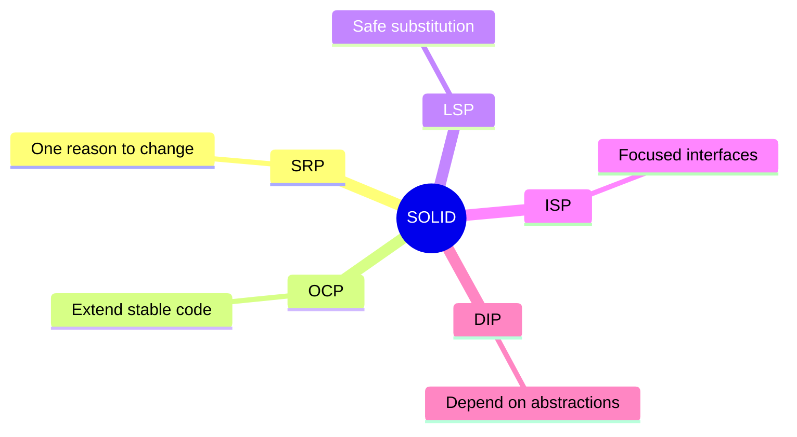

### 50. SRP — Single Responsibility Principle

SRP does not mean one method per Class; it means one reason to change. In a Feature-Based Pattern, it applies to layers and files together.
#### Bad Example

```javascript
export async function register(req, res) {
  if (!req.body.email?.includes("@")) {
    return res.status(400).json({ error: "Invalid email" });
  }

  const existing = await db.query(
    "select id from users where email = $1",
    [req.body.email],
  );

  if (existing.rowCount > 0) {
    return res.status(409).json({ error: "Email exists" });
  }

  const hash = await bcrypt.hash(req.body.password, 12);

  const row = await db.query(
    "insert into users(email, password_hash) values($1, $2) returning *",
    [req.body.email, hash],
  );

  await mailer.sendWelcome(req.body.email);
  return res.status(201).json(row.rows[0]);
}
```

- Changes with HTTP.
- Changes with SQL.
- Changes with the password policy.
- Changes with the email provider.
- Requires the full Infrastructure to test.

#### Splitting the Responsibilities

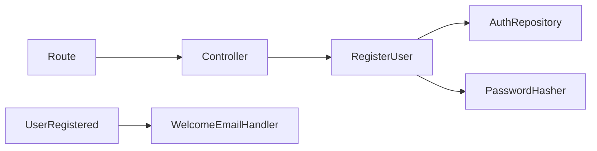

```javascript
export class RegisterController {
  constructor(registerUser) {
    this.registerUser = registerUser;
  }

  handle = async (req, res) => {
    const result =
      await this.registerUser.execute(req.body);

    return presentResult(result, res);
  };
}
```

#### SRP Questions

- Can the file's responsibility be described without using the word “and”?
- Do the imports come from different axes of change?
- Does the test require setup unrelated to the file's role?
- Does a UI change force a Domain change?
- Does a database change force a Controller change?

### 51. OCP — Open/Closed Principle

A component should be open for extension and closed for modification. Achieve this through Contracts, Strategies, and Composition, not through ever-growing `if/else` blocks.
```javascript
export async function sendNotification(
  type,
  message,
  target,
) {
  if (type === "email") {
    return emailSdk.send(target, message);
  }

  if (type === "sms") {
    return smsSdk.send(target, message);
  }

  if (type === "push") {
    return pushSdk.send(target, message);
  }

  throw new Error("Unsupported channel");
}
```

```javascript
export class NotificationSender {
  async send(_notification) {
    throw new Error("send must be implemented");
  }
}

export class EmailNotificationSender
    extends NotificationSender {
  constructor(client) {
    super();
    this.client = client;
  }

  send(notification) {
    return this.client.send({
      to: notification.target,
      subject: notification.subject,
      body: notification.body,
    });
  }
}

export class PushNotificationSender
    extends NotificationSender {
  constructor(client) {
    super();
    this.client = client;
  }

  send(notification) {
    return this.client.push({
      deviceToken: notification.target,
      message: notification.body,
    });
  }
}
```

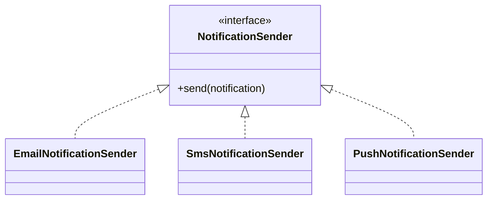

> **Trade-off:** Do not create an abstraction without a real axis of change. OCP is a tool for protecting stable code from expected extensions.

### 52. LSP — Liskov Substitution Principle

A substitute implementation must preserve the Contract's signature, behavior, errors, preconditions, and postconditions.
```javascript
// LSP violation
class ReadOnlyUserRepository extends AuthRepository {
  async save() {
    throw new Error(
      "UnsupportedOperationException",
    );
  }
}
```

```javascript
export class UserReader {
  async findByEmail(_email) {
    throw new Error("Not implemented");
  }
}

export class UserWriter {
  async save(_user) {
    throw new Error("Not implemented");
  }
}
```

```javascript
export function userReaderContract(
  name,
  createReader,
) {
  test(`${name}: missing user returns null`, async () => {
    const reader = await createReader();
    const email =
      Email.create("missing@example.com").value;

    assert.equal(
      await reader.findByEmail(email),
      null,
    );
  });
}
```

- Do not strengthen preconditions.
- Do not weaken postconditions.
- Preserve the meaning of `null` and Failure.
- Do not add surprising exceptions.
- Run the same Contract Test against every implementation.

### 53. ISP — Interface Segregation Principle

Do not force a client to depend on methods it does not use. In JavaScript, small Contracts can be represented with convention-based abstract classes or JSDoc types.
```javascript
// Oversized Contract
export class UserRepository {
  findById() {}
  findByEmail() {}
  save() {}
  delete() {}
  search() {}
  exportCsv() {}
  resetPassword() {}
  updateAvatar() {}
}
```

```javascript
export class UserReader {
  findById(_id) {}
  findByEmail(_email) {}
}

export class UserWriter {
  save(_user) {}
}

export class PasswordResetGateway {
  sendReset(_user) {}
}

export class AvatarStore {
  upload(_userId, _bytes) {}
}
```

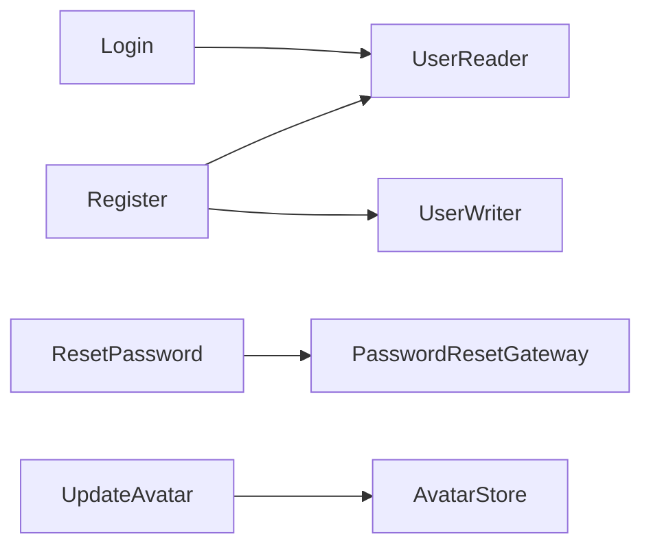

> **Warning sign:** If Fakes contain empty methods only to satisfy the Contract, the Contract is too large.

### 54. DIP — Dependency Inversion Principle

High-level and low-level modules depend on Abstractions. In JavaScript, apply this through constructor injection and wiring in the Composition Root.
```javascript
// Wrong
import { MongoAuthRepository }
  from "../../data/mongo-auth-repository.js";

export class LoginUser {
  constructor() {
    this.repository =
      new MongoAuthRepository();
  }
}
```

```javascript
// Better
export class LoginUser {
  constructor({
    authRepository,
    tokenIssuer,
  }) {
    this.authRepository = authRepository;
    this.tokenIssuer = tokenIssuer;
  }
}

const authRepository =
  new MongoAuthRepository(mongoClient);

const loginUser = new LoginUser({
  authRepository,
  tokenIssuer,
});
```

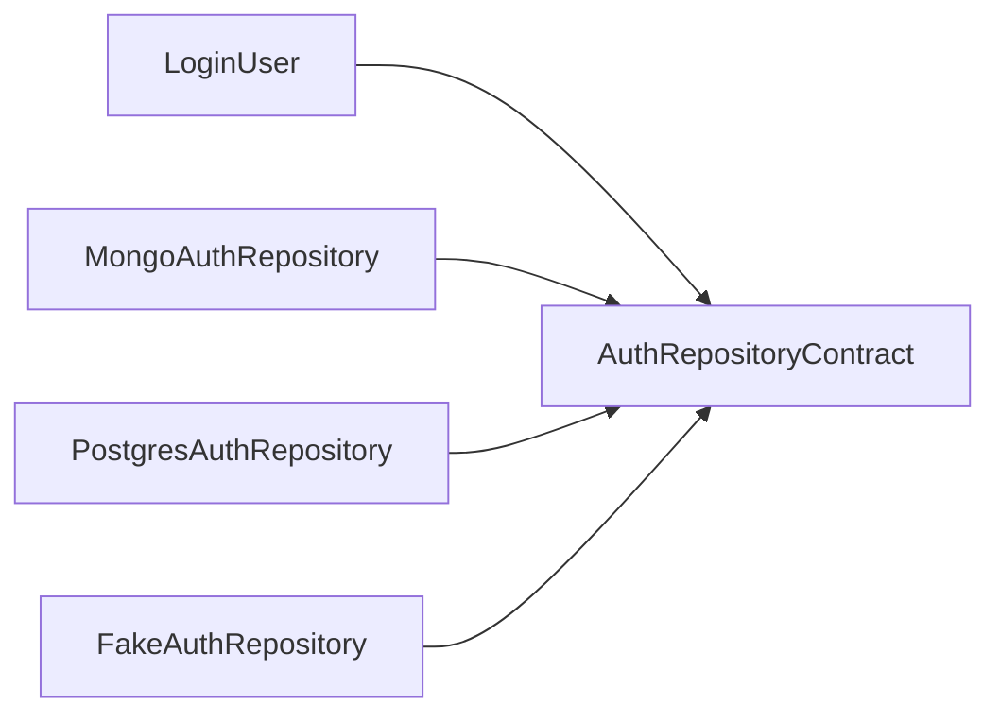

- The inside owns the Contract.
- The outside implements the Contract.
- The Composition Root selects the implementation.
- Tests inject a Fake.
- The Use Case does not know the SDK.

## Part Seven: Testing and Quality

### 55. The Testing Pyramid

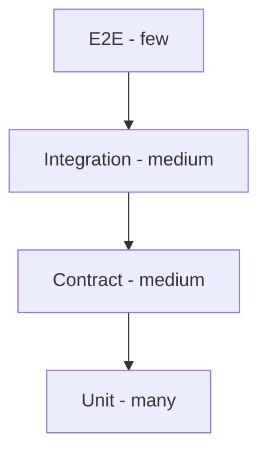

| Type | What It Tests | Speed | Example |
| --- | --- | --- | --- |
| Unit | Entity/UseCase | Fast | Calculation or registration |
| Contract | Behavior of every implementation | Fast/medium | Repository |
| Integration | Adapter with DB/API | Medium | Mapping and SQL |
| Presentation | UI/HTTP adapter | Medium | state/status |
| E2E | Complete flow | Slow | login then home |

### 56. Mocks and Fakes

- Use a simple Fake for internal Contracts.
- Use a Mock for an important interaction, not for every call.
- Do not mock an Entity.
- Test real Adapters with Integration tests.
- Use Contract Tests to prevent the Fake from diverging from production.

### 57. Characteristics of a Good Test

1. It describes behavior, not an implementation.
2. It fails for one reason.
3. It does not depend on execution order.
4. It controls time and IDs.
5. It tests both success and failure.
6. It does not duplicate production logic.

### 58. Architecture Review

- Does the Domain import a Framework?
- Does the Repository return a DTO?
- Does the Use Case construct a concrete dependency?
- Is there a deep cross-feature import?
- Is the Failure translated at the boundary?
- Is the Contract small and honest?
- Are Contract Tests present?
- Is the Composition Root clear?

### 59. Metrics

| Metric | What It Reveals | Caution |
| --- | --- | --- |
| Coupling | Boundary leakage | Do not interpret it in isolation |
| File size | Possible bloat | Length is not always a defect |
| Test duration | Excess Infrastructure | Integration may be necessary |
| Coverage | Untested areas | Does not measure assertion quality |
| Co-change | Poor boundaries | Requires Git history |

### 60. Fitness Functions

```text
Suggested automated rules:
- `domain/**` must not import `data/**`.
- `domain/**` must not import `presentation/**`.
- `domain/**` must not import Framework packages.
- `presentation/**` must not import `*RepositoryImpl`.
- Feature A must not import internals from Feature B.
```

### 61. Definition of Done

1. The Use Case is documented.
2. The Domain contains no Framework code.
3. Contracts live on the inside.
4. Mapping is explicit.
5. Unit tests.
6. Contract tests.
7. Integration tests cover boundaries.
8. Security review.
9. Observability.
10. An ADR records any long-lived decision.

## Part Eight: Security, Performance, and Observability

### 62. Security Boundaries

- Do not return `passwordHash`.
- Keep authorization inside a Use Case or Policy.
- Apply rate limiting in the Delivery Adapter.
- Do not log tokens.
- Translate authentication failures into a generic message.
- Treat external IDs as untrusted.
- Use trusted hashing libraries.
- Keep secrets out of source code.

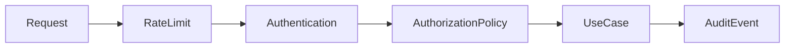

### 63. Secret Management

- Secrets never enter Git.
- Configuration is read in the Composition Root.
- The Domain does not read the environment.
- Rotate keys without modifying Use Cases.
- Separate test secrets from production secrets.
- Log the version name, not the secret.

### 64. Performance Without Breaking Boundaries

| Problem | Location | Solution |
| --- | --- | --- |
| N+1 | RepositoryImpl | Batch/Join |
| Large JSON payload | DTO/Presenter | Projection/Pagination |
| Expensive calculation | Domain Service | Memoization |
| Slow network | Data Source | Timeout/Retry |
| Repeated reads | Data Layer | Cache |
| UI rebuilds excessively | Presentation | State slicing |

### 65. Logging and Tracing

- Propagate `correlationId`.
- Adapters add technical details.
- Do not mix logging with the Result.
- Use consistent log levels.
- Redact PII.
- Link traces to the business event.

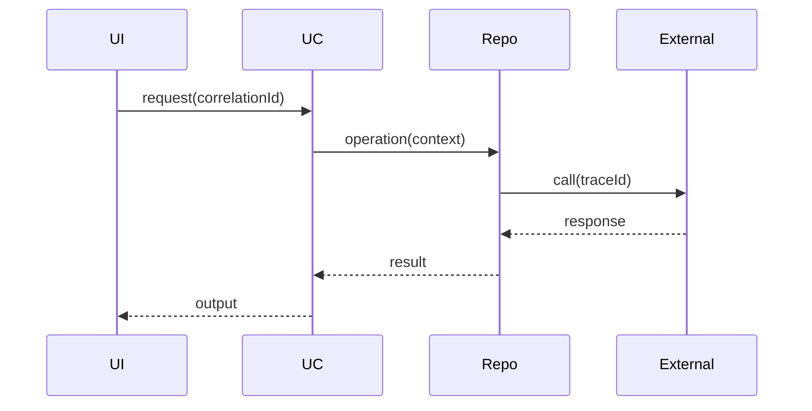

### 66. Resilience

- Set a Timeout for every connection.
- Use a Circuit Breaker for repeated failures.
- Retry with backoff and jitter.
- Use a Bulkhead to isolate resources.
- Use a Fallback only when it is valid for the business.
- Use an Outbox for important events.

## Part Nine: Migrating from a Traditional Project

### 67. Strangler Pattern

Do not rewrite the entire project at once. Put a Facade in front of the legacy implementation, then move one Feature or Use Case at a time behind a new Contract.
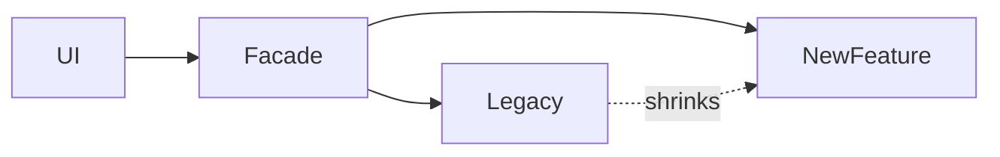

### 68. Migration Steps

1. Diagram the current flow.
2. Write characterization tests.
3. Extract a Use Case.
4. Create a Contract.
5. Wrap the legacy code in an Adapter.
6. Move Mapping out.
7. Create the Composition Root.
8. Add a new implementation.
9. Shift traffic gradually.
10. Delete the legacy path.

### 69. Characterization Tests

Characterization tests preserve current behavior during extraction. Once the migration is stable, convert them into behavioral tests; do not let them preserve bugs forever.
### 70. Signs of Incorrect Boundaries

- The Domain imports a Framework.
- Core is a dumping ground for helpers.
- Every test requires a database.
- One Feature imports another Feature's internals.
- A Repository returns raw Models.
- A Use Case passes request/response objects.
- Composition is scattered through the UI.
- One interface is enormous.

### 71. A 30-Day Plan

| Week | Goal | Deliverable |
| --- | --- | --- |
| 1 | Map the system and current coverage | Diagram + risks |
| 2 | Extract one Feature | Domain + Contract + Adapter |
| 3 | Tests + Composition | CI rules |
| 4 | Standardize and document | Playbook + ADRs |

### 72. Architecture Decision Records

#### ADR-001: Feature-First

**Status:** Accepted

**Context:** Generic folders have become huge.

**Decision:** Organize by Feature, with internal layers.

**Positive consequences:** Clearer boundaries and easier tests.

**Trade-offs:** Additional files and wiring require discipline.

#### ADR-002: Framework-Free Domain

**Status:** Accepted

**Context:** Tests are slow.

**Decision:** Disallow external imports in the Domain.

**Positive consequences:** Clearer boundaries and easier tests.

**Trade-offs:** Additional files and wiring require discipline.

#### ADR-003: Result

**Status:** Accepted

**Context:** Exceptions are undocumented.

**Decision:** Use Result for expected errors.

**Positive consequences:** Clearer boundaries and easier tests.

**Trade-offs:** Additional files and wiring require discipline.

#### ADR-004: Contract Tests

**Status:** Accepted

**Context:** Implementations behave differently.

**Decision:** Run a shared suite against every implementation.

**Positive consequences:** Clearer boundaries and easier tests.

**Trade-offs:** Additional files and wiring require discipline.

#### ADR-005: Composition Root

**Status:** Accepted

**Context:** `new` is scattered throughout the codebase.

**Decision:** Centralize wiring.

**Positive consequences:** Clearer boundaries and easier tests.

**Trade-offs:** Additional files and wiring require discipline.

#### ADR-006: Domain Events

**Status:** Accepted

**Context:** Secondary operations are tightly coupled.

**Decision:** Publish Events after a Use Case succeeds.

**Positive consequences:** Clearer boundaries and easier tests.

**Trade-offs:** Additional files and wiring require discipline.

#### ADR-007: DTOs Outside the Domain

**Status:** Accepted

**Context:** API changes break Entities.

**Decision:** Use explicit Mapping.

**Positive consequences:** Clearer boundaries and easier tests.

**Trade-offs:** Additional files and wiring require discipline.

#### ADR-008: Small Interfaces

**Status:** Accepted

**Context:** Mocks are complex.

**Decision:** Split interfaces by capability.

**Positive consequences:** Clearer boundaries and easier tests.

**Trade-offs:** Additional files and wiring require discipline.

#### ADR-009: Cache in the Data Layer

**Status:** Accepted

**Context:** Use Cases know about Redis.

**Decision:** Hide the Cache behind a Repository.

**Positive consequences:** Clearer boundaries and easier tests.

**Trade-offs:** Additional files and wiring require discipline.

#### ADR-010: Clock and IDs

**Status:** Accepted

**Context:** Tests are non-deterministic.

**Decision:** Inject Clock and IdGenerator.

**Positive consequences:** Clearer boundaries and easier tests.

**Trade-offs:** Additional files and wiring require discipline.

### 73. Anti-Pattern Catalog

#### 1. God Controller

- **Symptom:** HTTP, SQL, and business rules in one file.
- **Remedy:** Extract a Use Case and Repository.
- **Test:** Prove that replacing the detail does not change the policy.
- **Review:** Inspect import direction and Feature boundaries.

#### 2. Anemic Domain

- **Symptom:** Entities are just fields.
- **Remedy:** Move invariants into the Domain.
- **Test:** Prove that replacing the detail does not change the policy.
- **Review:** Inspect import direction and Feature boundaries.

#### 3. Framework Leakage

- **Symptom:** The Domain imports a Framework.
- **Remedy:** Use an Adapter.
- **Test:** Prove that replacing the detail does not change the policy.
- **Review:** Inspect import direction and Feature boundaries.

#### 4. Generic Repository

- **Symptom:** Generic CRUD for everything.
- **Remedy:** Define a Contract in business language.
- **Test:** Prove that replacing the detail does not change the policy.
- **Review:** Inspect import direction and Feature boundaries.

#### 5. Fat Interface

- **Symptom:** Many unnecessary methods.
- **Remedy:** Apply ISP.
- **Test:** Prove that replacing the detail does not change the policy.
- **Review:** Inspect import direction and Feature boundaries.

#### 6. Service Locator

- **Symptom:** Dependencies are obtained from globals.
- **Remedy:** Use constructor injection.
- **Test:** Prove that replacing the detail does not change the policy.
- **Review:** Inspect import direction and Feature boundaries.

#### 7. Hidden I/O

- **Symptom:** A getter performs network I/O.
- **Remedy:** Make I/O explicit.
- **Test:** Prove that replacing the detail does not change the policy.
- **Review:** Inspect import direction and Feature boundaries.

#### 8. DTO Everywhere

- **Symptom:** DTOs leak into Domain or UI.
- **Remedy:** Map at boundaries.
- **Test:** Prove that replacing the detail does not change the policy.
- **Review:** Inspect import direction and Feature boundaries.

#### 9. Shared Dump

- **Symptom:** Everything is placed in `shared`.
- **Remedy:** Apply strict criteria for Core.
- **Test:** Prove that replacing the detail does not change the policy.
- **Review:** Inspect import direction and Feature boundaries.

#### 10. Cross-Import

- **Symptom:** Features depend on each other's internals.
- **Remedy:** Expose a Public API.
- **Test:** Prove that replacing the detail does not change the policy.
- **Review:** Inspect import direction and Feature boundaries.

#### 11. Exception Soup

- **Symptom:** SDK errors propagate upward.
- **Remedy:** Translate them into Failures.
- **Test:** Prove that replacing the detail does not change the policy.
- **Review:** Inspect import direction and Feature boundaries.

#### 12. Boolean Blindness

- **Symptom:** Too many booleans.
- **Remedy:** Use an enum or Strategy.
- **Test:** Prove that replacing the detail does not change the policy.
- **Review:** Inspect import direction and Feature boundaries.

#### 13. Temporal Coupling

- **Symptom:** The order of calls is hidden.
- **Remedy:** Coordinate them in one Use Case.
- **Test:** Prove that replacing the detail does not change the policy.
- **Review:** Inspect import direction and Feature boundaries.

#### 14. Primitive Obsession

- **Symptom:** Email is just a String.
- **Remedy:** Use a Value Object.
- **Test:** Prove that replacing the detail does not change the policy.
- **Review:** Inspect import direction and Feature boundaries.

#### 15. Shotgun Surgery

- **Symptom:** One change modifies dozens of files.
- **Remedy:** Reconsider the Boundary.
- **Test:** Prove that replacing the detail does not change the policy.
- **Review:** Inspect import direction and Feature boundaries.

#### 16. Golden Hammer

- **Symptom:** A Repository is used for everything.
- **Remedy:** Introduce a Domain Service when appropriate.
- **Test:** Prove that replacing the detail does not change the policy.
- **Review:** Inspect import direction and Feature boundaries.

#### 17. Over-Abstraction

- **Symptom:** An Interface exists for every Class.
- **Remedy:** Remove abstractions that add no value.
- **Test:** Prove that replacing the detail does not change the policy.
- **Review:** Inspect import direction and Feature boundaries.

#### 18. Under-Abstraction

- **Symptom:** A Use Case depends on an SDK.
- **Remedy:** Introduce a Gateway Contract.
- **Test:** Prove that replacing the detail does not change the policy.
- **Review:** Inspect import direction and Feature boundaries.

#### 19. Mixed Validation

- **Symptom:** Rules are duplicated.
- **Remedy:** Place each rule at the appropriate level.
- **Test:** Prove that replacing the detail does not change the policy.
- **Review:** Inspect import direction and Feature boundaries.

#### 20. Leaky Cache

- **Symptom:** A Use Case knows Cache keys.
- **Remedy:** Keep Cache policy in the Data Layer.
- **Test:** Prove that replacing the detail does not change the policy.
- **Review:** Inspect import direction and Feature boundaries.

#### 21. Test-only Design

- **Symptom:** The API is distorted to make Mocks easier.
- **Remedy:** Design for the real Contract.
- **Test:** Prove that replacing the detail does not change the policy.
- **Review:** Inspect import direction and Feature boundaries.

#### 22. Massive Mapper

- **Symptom:** The Mapper contains business rules.
- **Remedy:** Move them to the Domain.
- **Test:** Prove that replacing the detail does not change the policy.
- **Review:** Inspect import direction and Feature boundaries.

#### 23. Circular Dependency

- **Symptom:** Features form a dependency cycle.
- **Remedy:** Use an Event or Facade.
- **Test:** Prove that replacing the detail does not change the policy.
- **Review:** Inspect import direction and Feature boundaries.

#### 24. Global Mutable State

- **Symptom:** Session state is global.
- **Remedy:** Define a clear scope.
- **Test:** Prove that replacing the detail does not change the policy.
- **Review:** Inspect import direction and Feature boundaries.

#### 25. Retry Everywhere

- **Symptom:** Retry logic exists in every layer.
- **Remedy:** Centralize it in one Policy.
- **Test:** Prove that replacing the detail does not change the policy.
- **Review:** Inspect import direction and Feature boundaries.

#### 26. Silent Failure

- **Symptom:** Every error becomes `null`.
- **Remedy:** Distinguish Failures.
- **Test:** Prove that replacing the detail does not change the policy.
- **Review:** Inspect import direction and Feature boundaries.

#### 27. Inconsistent Result

- **Symptom:** Result shapes are inconsistent.
- **Remedy:** Adopt one consistent convention.
- **Test:** Prove that replacing the detail does not change the policy.
- **Review:** Inspect import direction and Feature boundaries.

#### 28. Infrastructure Entity

- **Symptom:** The ORM model is treated as the Entity.
- **Remedy:** Separate Mapping.
- **Test:** Prove that replacing the detail does not change the policy.
- **Review:** Inspect import direction and Feature boundaries.

#### 29. Route-driven Domain

- **Symptom:** Use Cases are named after endpoints.
- **Remedy:** Use business language.
- **Test:** Prove that replacing the detail does not change the policy.
- **Review:** Inspect import direction and Feature boundaries.

#### 30. Premature Microservices

- **Symptom:** The system is split across the network before boundaries are understood.
- **Remedy:** Start with a Modular Monolith.
- **Test:** Prove that replacing the detail does not change the policy.
- **Review:** Inspect import direction and Feature boundaries.

## Part Ten: Checklists, Glossary, and Exercises

### 74. Feature Creation Checklist

- [ ] 01. A one-sentence business goal.
- [ ] 02. An Actor or trigger.
- [ ] 03. Use Case input independent of the protocol.
- [ ] 04. Entities and Value Objects.
- [ ] 05. Invariants.
- [ ] 06. Expected Failures.
- [ ] 07. A Contract where needed.
- [ ] 08. Implementation in the Data Layer.
- [ ] 09. Explicit Mapper.
- [ ] 10. Transaction boundary.
- [ ] 11. Authorization policy.
- [ ] 12. Idempotency.
- [ ] 13. Timeout.
- [ ] 14. Cache policy.
- [ ] 15. Unit tests.
- [ ] 16. Contract tests.
- [ ] 17. Integration tests.
- [ ] 18. Presentation test.
- [ ] 19. Logging.
- [ ] 20. Tracing.
- [ ] 21. Security review.
- [ ] 22. ADR.
- [ ] 23. Import review.
- [ ] 24. SOLID review.
- [ ] 25. Deletion path.

### 75. Checklist SOLID

#### SRP

- [ ] One reason to change?
- [ ] Does it mix protocol and business concerns?
- [ ] Does testing it require excessive setup?
- [ ] Does the name describe one role?
- [ ] Do imports come from many axes of change?

#### OCP

- [ ] Does adding a provider modify stable code?
- [ ] Are `if/else` branches growing?
- [ ] Is the extension axis known?
- [ ] Is a Strategy appropriate?
- [ ] Does the abstraction justify its cost?

#### LSP

- [ ] Does the implementation honor the Contract?
- [ ] Are errors consistent?
- [ ] Does `null` have the same meaning everywhere?
- [ ] Are preconditions and postconditions consistent?
- [ ] Are there Contract Tests?

#### ISP

- [ ] Are there unused methods?
- [ ] Do Fakes contain empty methods?
- [ ] Are unrelated operations grouped together?
- [ ] Should capabilities be split?
- [ ] Are the Contracts understandable?

#### DIP

- [ ] Is `new` used inside a Use Case?
- [ ] Does the Domain import an SDK?
- [ ] Does the inside own the Contract?
- [ ] Is Composition clear?
- [ ] Is creating a Fake easy?

### 76. Glossary

- **Abstraction:** Required behavior without a specific implementation.
- **Adapter:** A translator between the system and the outside world.
- **Boundary:** A limit that separates reasons to change.
- **Business Rule:** A domain rule.
- **Cache:** A temporary copy.
- **Command:** An intention to change state.
- **Composition Root:** The place where dependencies are wired.
- **Contract:** A behavioral agreement.
- **Controller:** An Adapter for an incoming request.
- **Coupling:** The degree of dependency.
- **CQRS:** Separation of reads and writes.
- **Data Source:** A direct connection to an external system.
- **Dependency Injection:** Supplying a dependency from the outside.
- **Domain:** The domain model and its rules.
- **Domain Event:** A fact that has occurred.
- **DTO:** A transport shape.
- **Entity:** An object with identity.
- **Facade:** A simplified interface.
- **Failure:** A translated expected error.
- **Feature:** A vertical business unit.
- **Gateway:** A Contract for an external system.
- **Idempotency:** Safe repetition.
- **Infrastructure:** Technical details.
- **Invariant:** A condition that must always hold.
- **Mapper:** Converts between shapes.
- **Model:** A layer-specific representation.
- **Policy:** A business decision.
- **Presenter:** Converts output for display.
- **Public API:** The permitted surface.
- **Query:** A read with no side effect.
- **Repository:** Access to Domain objects.
- **Result:** Success or Failure.
- **Strategy:** A replaceable algorithm.
- **Transaction:** Atomic changes.
- **Use Case:** A user goal.
- **Value Object:** A value with no identity.
- **ViewModel:** Presentation data.
- **Unit of Work:** Coordinates a transaction.
- **Outbox:** Guarantees events after commit.
- **Circuit Breaker:** Temporarily stops calls after repeated failure.
- **Bulkhead:** Resource isolation.
- **Correlation ID:** Connects logs for one request.
- **Contract Test:** A shared suite for all implementations.
- **Characterization Test:** Locks down current behavior.
- **Fitness Function:** An automated architecture rule.
- **Modular Monolith:** One application composed of modules.
- **Anti-Corruption Layer:** Isolates an external model.
- **Read Model:** A model optimized for reads.
- **Aggregate:** A Domain consistency boundary.
- **Port:** Another name for a boundary Contract.

### 77. Exercises

#### Exercise 1: Google Login

- **Task:** Add a Gateway without modifying the Use Case.
- **Deliverables:** Mermaid diagram + Contract + Use Case + tests.
- **Question:** Which detail is replaceable?
- **Review:** Which SOLID principles apply?

#### Exercise 2: Profile Cache

- **Task:** Hide the Cache behind a Repository.
- **Deliverables:** Mermaid diagram + Contract + Use Case + tests.
- **Question:** Which detail is replaceable?
- **Review:** Which SOLID principles apply?

#### Exercise 3: Read-Only Repository

- **Task:** Do not violate LSP.
- **Deliverables:** Mermaid diagram + Contract + Use Case + tests.
- **Question:** Which detail is replaceable?
- **Review:** Which SOLID principles apply?

#### Exercise 4: GraphQL

- **Task:** Replace the Delivery Adapter.
- **Deliverables:** Mermaid diagram + Contract + Use Case + tests.
- **Question:** Which detail is replaceable?
- **Review:** Which SOLID principles apply?

#### Exercise 5: Payment Provider

- **Task:** Apply OCP.
- **Deliverables:** Mermaid diagram + Contract + Use Case + tests.
- **Question:** Which detail is replaceable?
- **Review:** Which SOLID principles apply?

#### Exercise 6: Authorization

- **Task:** Create an independent Policy.
- **Deliverables:** Mermaid diagram + Contract + Use Case + tests.
- **Question:** Which detail is replaceable?
- **Review:** Which SOLID principles apply?

#### Exercise 7: Split Repository

- **Task:** Apply ISP.
- **Deliverables:** Mermaid diagram + Contract + Use Case + tests.
- **Question:** Which detail is replaceable?
- **Review:** Which SOLID principles apply?

#### Exercise 8: Offline-First

- **Task:** Coordinate Local and Remote sources.
- **Deliverables:** Mermaid diagram + Contract + Use Case + tests.
- **Question:** Which detail is replaceable?
- **Review:** Which SOLID principles apply?

#### Exercise 9: OrderPlaced

- **Task:** Introduce a Domain Event.
- **Deliverables:** Mermaid diagram + Contract + Use Case + tests.
- **Question:** Which detail is replaceable?
- **Review:** Which SOLID principles apply?

#### Exercise 10: Legacy Adapter

- **Task:** Perform a Strangler migration.
- **Deliverables:** Mermaid diagram + Contract + Use Case + tests.
- **Question:** Which detail is replaceable?
- **Review:** Which SOLID principles apply?

#### Exercise 11: Cancel Order

- **Task:** Model state transitions.
- **Deliverables:** Mermaid diagram + Contract + Use Case + tests.
- **Question:** Which detail is replaceable?
- **Review:** Which SOLID principles apply?

#### Exercise 12: Money

- **Task:** Create a Value Object.
- **Deliverables:** Mermaid diagram + Contract + Use Case + tests.
- **Question:** Which detail is replaceable?
- **Review:** Which SOLID principles apply?

#### Exercise 13: Pagination

- **Task:** Separate the HTTP query from the application input.
- **Deliverables:** Mermaid diagram + Contract + Use Case + tests.
- **Question:** Which detail is replaceable?
- **Review:** Which SOLID principles apply?

#### Exercise 14: Avatar

- **Task:** Define an `AvatarStore` Contract.
- **Deliverables:** Mermaid diagram + Contract + Use Case + tests.
- **Question:** Which detail is replaceable?
- **Review:** Which SOLID principles apply?

#### Exercise 15: Clock

- **Task:** Implement a `FakeClock`.
- **Deliverables:** Mermaid diagram + Contract + Use Case + tests.
- **Question:** Which detail is replaceable?
- **Review:** Which SOLID principles apply?

#### Exercise 16: Multi-Currency

- **Task:** Define an `ExchangeRateGateway`.
- **Deliverables:** Mermaid diagram + Contract + Use Case + tests.
- **Question:** Which detail is replaceable?
- **Review:** Which SOLID principles apply?

#### Exercise 17: Retry Payment

- **Task:** Apply Idempotency.
- **Deliverables:** Mermaid diagram + Contract + Use Case + tests.
- **Question:** Which detail is replaceable?
- **Review:** Which SOLID principles apply?

#### Exercise 18: Audit

- **Task:** Use an Event or Port.
- **Deliverables:** Mermaid diagram + Contract + Use Case + tests.
- **Question:** Which detail is replaceable?
- **Review:** Which SOLID principles apply?

#### Exercise 19: Product Search

- **Task:** Build a Query Service.
- **Deliverables:** Mermaid diagram + Contract + Use Case + tests.
- **Question:** Which detail is replaceable?
- **Review:** Which SOLID principles apply?

#### Exercise 20: Analytics

- **Task:** Create a separate Handler.
- **Deliverables:** Mermaid diagram + Contract + Use Case + tests.
- **Question:** Which detail is replaceable?
- **Review:** Which SOLID principles apply?

### 78. Review Questions

1. Explain the Dependency Rule.
2. When does a Repository become overkill?
3. What is the difference between a DTO and an Entity?
4. Where should validation live?
5. How do you test implementations?
6. What is the difference between DIP and DI?
7. How do you detect an LSP violation?
8. When should you use a Domain Event?
9. How do you prevent cross-feature coupling?
10. What is the role of the Composition Root?
11. How do you apply OCP without over-engineering?
12. Why can a Generic Repository be harmful?
13. How do you isolate a Cache?
14. Where should exceptions be translated?
15. What is a Feature's Public API?
16. How do you migrate legacy code?
17. When should you use a Query Service?
18. How do you isolate time?
19. How do you prevent Framework leakage?
20. What is the difference between a Unit test and a Contract Test?

### 79. Conclusion

Clean Architecture is not a fixed folder layout, the Feature-Based Pattern is not merely moving files, and SOLID is not a set of slogans. They work together when dependency direction is clear, Contracts are small and honest, details live in Adapters, and business rules are testable.

Start from the business flow, design the inside first, and then allow the outside to implement what the inside needs.
### 80. Additional Review Cards

#### Card 1: The Database Changed

- **Diagnosis:** The Adapter should change, not the Use Case.
- **Dependency direction:** Adapter toward an internal Contract.
- **Test:** Replace the detail and verify that the policy remains unchanged.
- **SOLID:** Review SRP, OCP, and DIP, then LSP and ISP.

#### Card 2: The API Added a Field

- **Diagnosis:** Update only the DTO/Mapper unless a new business rule is introduced.
- **Dependency direction:** Adapter toward an internal Contract.
- **Test:** Replace the detail and verify that the policy remains unchanged.
- **SOLID:** Review SRP, OCP, and DIP, then LSP and ISP.

#### Card 3: A Feature Needs the Current User

- **Diagnosis:** Depend on `CurrentUserProvider`.
- **Dependency direction:** Adapter toward an internal Contract.
- **Test:** Replace the detail and verify that the policy remains unchanged.
- **SOLID:** Review SRP, OCP, and DIP, then LSP and ISP.

#### Card 4: A Test Requires `sleep`

- **Diagnosis:** Inject a Clock or Scheduler.
- **Dependency direction:** Adapter toward an internal Contract.
- **Test:** Replace the detail and verify that the policy remains unchanged.
- **SOLID:** Review SRP, OCP, and DIP, then LSP and ISP.

#### Card 5: A Use Case Returns an HTTP Status

- **Diagnosis:** Return an Output or Failure instead.
- **Dependency direction:** Adapter toward an internal Contract.
- **Test:** Replace the detail and verify that the policy remains unchanged.
- **SOLID:** Review SRP, OCP, and DIP, then LSP and ISP.

#### Card 6: A Widget/Route Imports an HTTP Client

- **Diagnosis:** Move the call into a Data Source.
- **Dependency direction:** Adapter toward an internal Contract.
- **Test:** Replace the detail and verify that the policy remains unchanged.
- **SOLID:** Review SRP, OCP, and DIP, then LSP and ISP.

#### Card 7: A Repository Returns a Map

- **Diagnosis:** Convert it into an Entity or Read Model.
- **Dependency direction:** Adapter toward an internal Contract.
- **Test:** Replace the detail and verify that the policy remains unchanged.
- **SOLID:** Review SRP, OCP, and DIP, then LSP and ISP.

#### Card 8: Implementations Return Different Errors

- **Diagnosis:** Translate them into one consistent Failure model.
- **Dependency direction:** Adapter toward an internal Contract.
- **Test:** Replace the detail and verify that the policy remains unchanged.
- **SOLID:** Review SRP, OCP, and DIP, then LSP and ISP.

#### Card 9: Adding a Notification Channel

- **Diagnosis:** Add an Extension behind a Contract.
- **Dependency direction:** Adapter toward an internal Contract.
- **Test:** Replace the detail and verify that the policy remains unchanged.
- **SOLID:** Review SRP, OCP, and DIP, then LSP and ISP.

#### Card 10: An Interface Has 20 Methods

- **Diagnosis:** Split it by capabilities.
- **Dependency direction:** Adapter toward an internal Contract.
- **Test:** Replace the detail and verify that the policy remains unchanged.
- **SOLID:** Review SRP, OCP, and DIP, then LSP and ISP.

#### Card 11: A Fake Does Not Resemble Production

- **Diagnosis:** Add a Contract Test.
- **Dependency direction:** Adapter toward an internal Contract.
- **Test:** Replace the detail and verify that the policy remains unchanged.
- **SOLID:** Review SRP, OCP, and DIP, then LSP and ISP.

#### Card 12: A Feature Is Difficult to Delete

- **Diagnosis:** Review its Public API and imports.
- **Dependency direction:** Adapter toward an internal Contract.
- **Test:** Replace the detail and verify that the policy remains unchanged.
- **SOLID:** Review SRP, OCP, and DIP, then LSP and ISP.

#### Card 13: Core Keeps Growing

- **Diagnosis:** Move feature-specific elements back into their Features.
- **Dependency direction:** Adapter toward an internal Contract.
- **Test:** Replace the detail and verify that the policy remains unchanged.
- **SOLID:** Review SRP, OCP, and DIP, then LSP and ISP.

#### Card 14: A Mapper Calculates a Discount

- **Diagnosis:** Move the rule into the Domain.
- **Dependency direction:** Adapter toward an internal Contract.
- **Test:** Replace the detail and verify that the policy remains unchanged.
- **SOLID:** Review SRP, OCP, and DIP, then LSP and ISP.

#### Card 15: A Controller Decides Authorization

- **Diagnosis:** Put the Policy in the Use Case.
- **Dependency direction:** Adapter toward an internal Contract.
- **Test:** Replace the detail and verify that the policy remains unchanged.
- **SOLID:** Review SRP, OCP, and DIP, then LSP and ISP.

#### Card 16: A Use Case Creates a UUID

- **Diagnosis:** Introduce an `IdGenerator` Contract.
- **Dependency direction:** Adapter toward an internal Contract.
- **Test:** Replace the detail and verify that the policy remains unchanged.
- **SOLID:** Review SRP, OCP, and DIP, then LSP and ISP.

#### Card 17: A Business Rule Uses `now` Directly

- **Diagnosis:** Introduce a Clock Contract.
- **Dependency direction:** Adapter toward an internal Contract.
- **Test:** Replace the detail and verify that the policy remains unchanged.
- **SOLID:** Review SRP, OCP, and DIP, then LSP and ISP.

#### Card 18: Retry Exists in Three Layers

- **Diagnosis:** Define one Policy at the Boundary.
- **Dependency direction:** Adapter toward an internal Contract.
- **Test:** Replace the detail and verify that the policy remains unchanged.
- **SOLID:** Review SRP, OCP, and DIP, then LSP and ISP.

#### Card 19: Cache Miss Means Not Found

- **Diagnosis:** Distinguish the meanings or hide the distinction.
- **Dependency direction:** Adapter toward an internal Contract.
- **Test:** Replace the detail and verify that the policy remains unchanged.
- **SOLID:** Review SRP, OCP, and DIP, then LSP and ISP.

#### Card 20: A Different Read Model Is Needed

- **Diagnosis:** Introduce a specialized Query Service.
- **Dependency direction:** Adapter toward an internal Contract.
- **Test:** Replace the detail and verify that the policy remains unchanged.
- **SOLID:** Review SRP, OCP, and DIP, then LSP and ISP.

#### Card 21: The Database Changed

- **Diagnosis:** The Adapter should change, not the Use Case.
- **Dependency direction:** Adapter toward an internal Contract.
- **Test:** Replace the detail and verify that the policy remains unchanged.
- **SOLID:** Review SRP, OCP, and DIP, then LSP and ISP.

#### Card 22: The API Added a Field

- **Diagnosis:** Update only the DTO/Mapper unless a new business rule is introduced.
- **Dependency direction:** Adapter toward an internal Contract.
- **Test:** Replace the detail and verify that the policy remains unchanged.
- **SOLID:** Review SRP, OCP, and DIP, then LSP and ISP.

#### Card 23: A Feature Needs the Current User

- **Diagnosis:** Depend on `CurrentUserProvider`.
- **Dependency direction:** Adapter toward an internal Contract.
- **Test:** Replace the detail and verify that the policy remains unchanged.
- **SOLID:** Review SRP, OCP, and DIP, then LSP and ISP.

#### Card 24: A Test Requires `sleep`

- **Diagnosis:** Inject a Clock or Scheduler.
- **Dependency direction:** Adapter toward an internal Contract.
- **Test:** Replace the detail and verify that the policy remains unchanged.
- **SOLID:** Review SRP, OCP, and DIP, then LSP and ISP.

#### Card 25: A Use Case Returns an HTTP Status

- **Diagnosis:** Return an Output or Failure instead.
- **Dependency direction:** Adapter toward an internal Contract.
- **Test:** Replace the detail and verify that the policy remains unchanged.
- **SOLID:** Review SRP, OCP, and DIP, then LSP and ISP.

#### Card 26: A Widget/Route Imports an HTTP Client

- **Diagnosis:** Move the call into a Data Source.
- **Dependency direction:** Adapter toward an internal Contract.
- **Test:** Replace the detail and verify that the policy remains unchanged.
- **SOLID:** Review SRP, OCP, and DIP, then LSP and ISP.

#### Card 27: A Repository Returns a Map

- **Diagnosis:** Convert it into an Entity or Read Model.
- **Dependency direction:** Adapter toward an internal Contract.
- **Test:** Replace the detail and verify that the policy remains unchanged.
- **SOLID:** Review SRP, OCP, and DIP, then LSP and ISP.

#### Card 28: Implementations Return Different Errors

- **Diagnosis:** Translate them into one consistent Failure model.
- **Dependency direction:** Adapter toward an internal Contract.
- **Test:** Replace the detail and verify that the policy remains unchanged.
- **SOLID:** Review SRP, OCP, and DIP, then LSP and ISP.

#### Card 29: Adding a Notification Channel

- **Diagnosis:** Add an Extension behind a Contract.
- **Dependency direction:** Adapter toward an internal Contract.
- **Test:** Replace the detail and verify that the policy remains unchanged.
- **SOLID:** Review SRP, OCP, and DIP, then LSP and ISP.

#### Card 30: An Interface Has 20 Methods

- **Diagnosis:** Split it by capabilities.
- **Dependency direction:** Adapter toward an internal Contract.
- **Test:** Replace the detail and verify that the policy remains unchanged.
- **SOLID:** Review SRP, OCP, and DIP, then LSP and ISP.

#### Card 31: A Fake Does Not Resemble Production

- **Diagnosis:** Add a Contract Test.
- **Dependency direction:** Adapter toward an internal Contract.
- **Test:** Replace the detail and verify that the policy remains unchanged.
- **SOLID:** Review SRP, OCP, and DIP, then LSP and ISP.

#### Card 32: A Feature Is Difficult to Delete

- **Diagnosis:** Review its Public API and imports.
- **Dependency direction:** Adapter toward an internal Contract.
- **Test:** Replace the detail and verify that the policy remains unchanged.
- **SOLID:** Review SRP, OCP, and DIP, then LSP and ISP.

#### Card 33: Core Keeps Growing

- **Diagnosis:** Move feature-specific elements back into their Features.
- **Dependency direction:** Adapter toward an internal Contract.
- **Test:** Replace the detail and verify that the policy remains unchanged.
- **SOLID:** Review SRP, OCP, and DIP, then LSP and ISP.

#### Card 34: A Mapper Calculates a Discount

- **Diagnosis:** Move the rule into the Domain.
- **Dependency direction:** Adapter toward an internal Contract.
- **Test:** Replace the detail and verify that the policy remains unchanged.
- **SOLID:** Review SRP, OCP, and DIP, then LSP and ISP.

#### Card 35: A Controller Decides Authorization

- **Diagnosis:** Put the Policy in the Use Case.
- **Dependency direction:** Adapter toward an internal Contract.
- **Test:** Replace the detail and verify that the policy remains unchanged.
- **SOLID:** Review SRP, OCP, and DIP, then LSP and ISP.

#### Card 36: A Use Case Creates a UUID

- **Diagnosis:** Introduce an `IdGenerator` Contract.
- **Dependency direction:** Adapter toward an internal Contract.
- **Test:** Replace the detail and verify that the policy remains unchanged.
- **SOLID:** Review SRP, OCP, and DIP, then LSP and ISP.

#### Card 37: A Business Rule Uses `now` Directly

- **Diagnosis:** Introduce a Clock Contract.
- **Dependency direction:** Adapter toward an internal Contract.
- **Test:** Replace the detail and verify that the policy remains unchanged.
- **SOLID:** Review SRP, OCP, and DIP, then LSP and ISP.

#### Card 38: Retry Exists in Three Layers

- **Diagnosis:** Define one Policy at the Boundary.
- **Dependency direction:** Adapter toward an internal Contract.
- **Test:** Replace the detail and verify that the policy remains unchanged.
- **SOLID:** Review SRP, OCP, and DIP, then LSP and ISP.

#### Card 39: Cache Miss Means Not Found

- **Diagnosis:** Distinguish the meanings or hide the distinction.
- **Dependency direction:** Adapter toward an internal Contract.
- **Test:** Replace the detail and verify that the policy remains unchanged.
- **SOLID:** Review SRP, OCP, and DIP, then LSP and ISP.

#### Card 40: A Different Read Model Is Needed

- **Diagnosis:** Introduce a specialized Query Service.
- **Dependency direction:** Adapter toward an internal Contract.
- **Test:** Replace the detail and verify that the policy remains unchanged.
- **SOLID:** Review SRP, OCP, and DIP, then LSP and ISP.

#### Card 41: The Database Changed

- **Diagnosis:** The Adapter should change, not the Use Case.
- **Dependency direction:** Adapter toward an internal Contract.
- **Test:** Replace the detail and verify that the policy remains unchanged.
- **SOLID:** Review SRP, OCP, and DIP, then LSP and ISP.

#### Card 42: The API Added a Field

- **Diagnosis:** Update only the DTO/Mapper unless a new business rule is introduced.
- **Dependency direction:** Adapter toward an internal Contract.
- **Test:** Replace the detail and verify that the policy remains unchanged.
- **SOLID:** Review SRP, OCP, and DIP, then LSP and ISP.

#### Card 43: A Feature Needs the Current User

- **Diagnosis:** Depend on `CurrentUserProvider`.
- **Dependency direction:** Adapter toward an internal Contract.
- **Test:** Replace the detail and verify that the policy remains unchanged.
- **SOLID:** Review SRP, OCP, and DIP, then LSP and ISP.

#### Card 44: A Test Requires `sleep`

- **Diagnosis:** Inject a Clock or Scheduler.
- **Dependency direction:** Adapter toward an internal Contract.
- **Test:** Replace the detail and verify that the policy remains unchanged.
- **SOLID:** Review SRP, OCP, and DIP, then LSP and ISP.

#### Card 45: A Use Case Returns an HTTP Status

- **Diagnosis:** Return an Output or Failure instead.
- **Dependency direction:** Adapter toward an internal Contract.
- **Test:** Replace the detail and verify that the policy remains unchanged.
- **SOLID:** Review SRP, OCP, and DIP, then LSP and ISP.

#### Card 46: A Widget/Route Imports an HTTP Client

- **Diagnosis:** Move the call into a Data Source.
- **Dependency direction:** Adapter toward an internal Contract.
- **Test:** Replace the detail and verify that the policy remains unchanged.
- **SOLID:** Review SRP, OCP, and DIP, then LSP and ISP.

#### Card 47: A Repository Returns a Map

- **Diagnosis:** Convert it into an Entity or Read Model.
- **Dependency direction:** Adapter toward an internal Contract.
- **Test:** Replace the detail and verify that the policy remains unchanged.
- **SOLID:** Review SRP, OCP, and DIP, then LSP and ISP.

#### Card 48: Implementations Return Different Errors

- **Diagnosis:** Translate them into one consistent Failure model.
- **Dependency direction:** Adapter toward an internal Contract.
- **Test:** Replace the detail and verify that the policy remains unchanged.
- **SOLID:** Review SRP, OCP, and DIP, then LSP and ISP.

#### Card 49: Adding a Notification Channel

- **Diagnosis:** Add an Extension behind a Contract.
- **Dependency direction:** Adapter toward an internal Contract.
- **Test:** Replace the detail and verify that the policy remains unchanged.
- **SOLID:** Review SRP, OCP, and DIP, then LSP and ISP.

#### Card 50: An Interface Has 20 Methods

- **Diagnosis:** Split it by capabilities.
- **Dependency direction:** Adapter toward an internal Contract.
- **Test:** Replace the detail and verify that the policy remains unchanged.
- **SOLID:** Review SRP, OCP, and DIP, then LSP and ISP.

