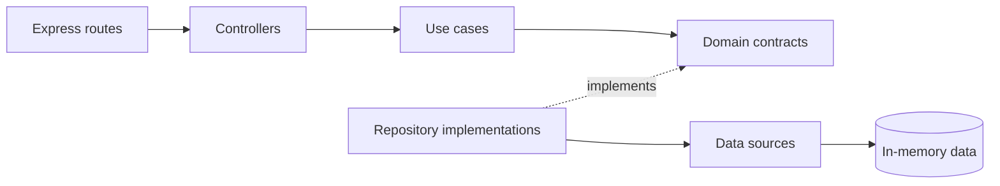

# JavaScript Example Project

A runnable **Node.js + Express** REST API demonstrating:

- Clean Architecture
- Feature-Based Pattern
- SOLID principles
- Manual dependency injection
- Repository contracts and implementations
- Built-in `node:test` tests
- A small architecture-boundary check

## Architecture



Dependencies point toward the domain. Domain code does not import Express, data sources, or controllers.

## Feature structure

```text
src/
├── core/
├── features/
│   ├── auth/
│   │   ├── domain/
│   │   ├── data/
│   │   └── presentation/
│   └── notifications/
│       ├── domain/
│       ├── data/
│       └── presentation/
└── infrastructure/
```

## Requirements

- Node.js 20+
- npm

## Run

```bash
npm install
npm run dev
```

The API starts at `http://localhost:3000`.

## Demo credentials

```text
email: anwar@example.com
password: password123
```

## Try the API

### Health

```bash
curl http://localhost:3000/health
```

### Login

```bash
curl -X POST http://localhost:3000/api/auth/login \
  -H 'Content-Type: application/json' \
  -d '{"email":"anwar@example.com","password":"password123"}'
```

### Send a notification

```bash
curl -X POST http://localhost:3000/api/notifications/send \
  -H 'Content-Type: application/json' \
  -d '{"channel":"email","recipient":"student@example.com","message":"Welcome to Clean Architecture"}'
```

Supported channels: `email`, `sms`, and `push`.

## Tests

```bash
npm test
npm run check:architecture
```

## SOLID mapping

| Principle | Project example |
|---|---|
| SRP | Controllers, use cases, repositories, and data sources each have one reason to change. |
| OCP | Add a notification sender and register it without changing `SendNotification`. |
| LSP | Any valid `AuthRepository` implementation can replace another. |
| ISP | Small contracts: `AuthRepository`, `NotificationGateway`, and `NotificationSender`. |
| DIP | Use cases depend on contracts; infrastructure injects implementations. |

## Add a new notification provider

1. Create a class implementing `NotificationSender`.
2. Register it in `src/infrastructure/container.js`.
3. Do not modify the `SendNotification` use case.

This is the Open/Closed Principle in practice.
