# The Comprehensive Practical Guide: Clean Architecture + Feature-Based Pattern + SOLID in Dart and Flutter

[اللغة العربية](Readme_ar.md)

[For JavaScript developers](../Javascript/Readme.md)

> An extensive English reference that combines **Part One**, covering Clean Architecture and the Feature-Based Pattern, with **Part Two**, covering the application of SOLID principles within this architecture, including Mermaid diagrams, code, tests, and checklists.

## Guide Scope

This edition focuses on Dart with a practical Flutter implementation. The Domain is written in pure Dart, while Riverpod is used in the Presentation layer as an example that can be replaced by Bloc or Cubit.

## How to Read This Guide

1. Read the foundations before copying any code.
2. Implement the case study one file at a time.
3. Use the SOLID chapters to review the design.
4. Run the tests after every step.
5. Review the checklists before opening a Pull Request.

## Conventions

- Concept names and programming symbols remain in English.
- The explanation is in English.
- An inward-pointing arrow means that details depend on policies.
- A Feature means a vertical business unit such as `auth` or `orders`.
- A Contract describes behavior without coupling it to an implementation.
- An Adapter translates between the system and an external detail.

## Short Table of Contents

- [Part One: Foundations](#part-one-foundations)
- [Part Two: Clean Architecture Layers](#part-two-clean-architecture-layers)
- [Part Three: Feature-Based Pattern](#part-three-feature-based-pattern)
- [Part Four: Data Flow and Dependencies](#part-four-data-flow-and-dependencies)
- [Part Five: End-to-End Case Study](#part-five-end-to-end-case-study)
- [Part Six: SOLID Principles](#part-six-solid-principles)
- [Part Seven: Testing and Quality](#part-seven-testing-and-quality)
- [Part Eight: Security, Performance, and Observability](#part-eight-security-performance-and-observability)
- [Part Nine: Migrating from a Traditional Project](#part-nine-migrating-from-a-traditional-project)
- [Part Ten: Checklists, Glossary, and Exercises](#part-ten-checklists-glossary-and-exercises)
## Part One: Foundations

### 1. Why Do We Need Architecture?

In a small project, placing UI, HTTP, SQL, and business rules in one file may seem faster. That speed is temporary, however: every small change touches many parts, testing becomes slow, and Framework details spread everywhere.

The real purpose of Architecture is to **reduce the cost of change**. Good architecture keeps the impact of a decision local and prevents volatile details from controlling stable policies.
- Change the database without rewriting the Use Cases.
- Change the UI or Framework without changing the Domain.
- Test business rules without a network or storage.
- Divide work into independent Features.
- Understand the operation flow from file names and boundaries alone.

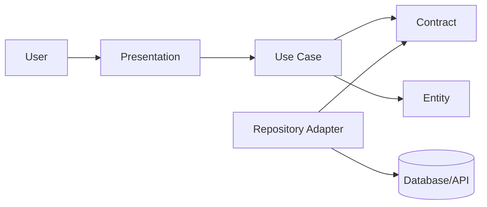

### 2. Clean Code vs. Clean Architecture

| Dimension | Clean Code | Clean Architecture |
| --- | --- | --- |
| Scope | Function or Class | System, boundaries, and dependencies |
| Question | Is the code clear? | Is the dependency direction correct? |
| Tool | Good names and small functions | Layers, Contracts, and Adapters |
| Failure mode | Local complexity | Framework leakage and mixed responsibilities |
| Testing | Small unit tests | Testing policies in isolation from details |

> **Rule:** Clean code does not compensate for bad architecture, and good architecture does not justify poor local code.

### 3. Dependency Rule

Dependencies point inward. The inner layer does not know Framework, SDK, or SQL names. The outside knows the inside and implements the Contracts defined by the inside.
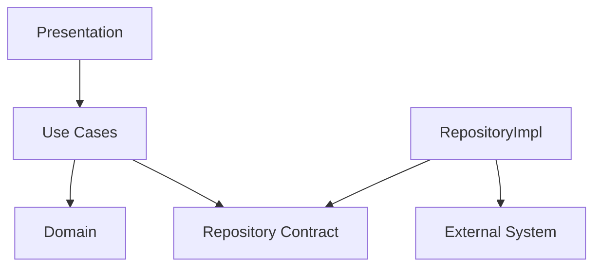

- An Entity does not import a Controller.
- A Use Case does not import an HTTP client.
- A Repository implementation imports its Contract because it implements it.
- The Composition Root knows all details because it wires them together.
- The Framework stays at the outer edge.

### 4. Policies and Details

| Policy | Detail |
| --- | --- |
| Register a user according to system rules | Send a POST request to an endpoint |
| Calculate a discount | Read a row from a database |
| Determine whether an order is valid | Verify a JWT with a specific library |
| Send a notification | Use an Email or SMS provider |
| Manage inventory | Use Redis as a Cache |

### 5. Boundaries

A Boundary separates two different reasons to change. If one file changes because of business requirements and another changes because of an external SDK, they deserve a clear boundary. A boundary succeeds when it contains the change.
- A boundary between UI and Use Case.
- A boundary between Use Case and Repository.
- A boundary between Entity and DTO.
- A boundary between the application and an external provider.
- A boundary between one Feature and another.

### 6. When Is the Architecture Overkill?

A static page or a short-lived utility does not need dozens of Contracts. Use boundaries when there are business rules, a long expected lifetime, multiple data sources, or a strong need for testing. Add a layer when it isolates real volatility, not merely to imitate a diagram.
## Part Two: Clean Architecture Layers

### 7. Domain

The system's internal language: Entities, Value Objects, business rules, and Contracts.
- It does not know the UI.
- It does not know JSON.
- It does not know the database.
- It protects invariants.

### 8. Entities

Objects with identity and behavior that persist over time.
- They protect their state.
- They validate transitions.
- They do not return DTOs.
- They use Value Objects.

### 9. Value Objects

Values defined by their attributes, such as Email and Money.
- Construction either succeeds or returns a Failure.
- Equality is based on value.
- They are immutable whenever possible.
- They reduce repeated validation.

### 10. Use Cases

A single goal for a user or the system.
- Its name is a clear verb.
- It orchestrates the operation.
- It does not construct Infrastructure.
- It returns a clear Result.

### 11. Repository Contracts

What the Domain needs from data, expressed in business language.
- It does not expose the ORM.
- It does not return a Data Model.
- It uses names such as `findByEmail`.
- It exposes meaningful errors.

### 12. Data Layer

Implements Contracts and manages Data Sources and Mapping.
- Hides HTTP and database details.
- Translates errors.
- Cache policy.
- Uses explicit Mapping.

### 13. Presentation

Receives input, manages state or protocol concerns, and then invokes a Use Case.
- It contains no Business Rules.
- It does not call an implementation directly.
- It transforms the result for presentation.
- It manages loading and error states.

### 14. Core / Shared

Truly stable shared components, not a dumping ground.
- Result and Failure.
- Clock and IdGenerator.
- Logging contracts.
- A small set of Utilities.

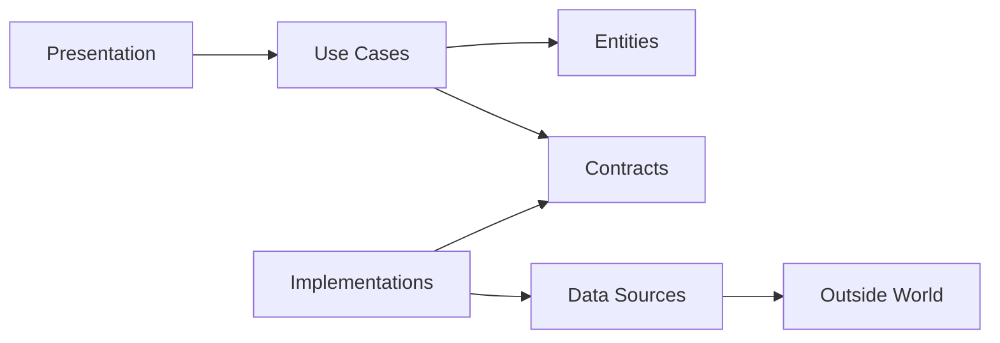

### 15. DTO, Model, and Entity

| Type | Role | Change Cycle |
| --- | --- | --- |
| DTO | External transport shape | Changes with the API |
| Data Model | Persistence shape | Changes with the database |
| Entity | Business rules | Changes with the domain |

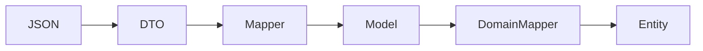

### 16. Result and Failure

| Failure | Meaning | Handling |
| --- | --- | --- |
| ValidationFailure | Invalid input | Field-level message |
| UnauthorizedFailure | Authentication rejected | Generic message |
| ConflictFailure | State conflict | 409 or an appropriate state |
| NetworkFailure | Temporary failure | Measured Retry |
| UnexpectedFailure | Unexpected error | Log + generic message |

### 17. Composition Root

The only place that constructs Adapters, Repositories, Use Cases, and Controllers and wires them together. It prevents detail construction from spreading across layers.
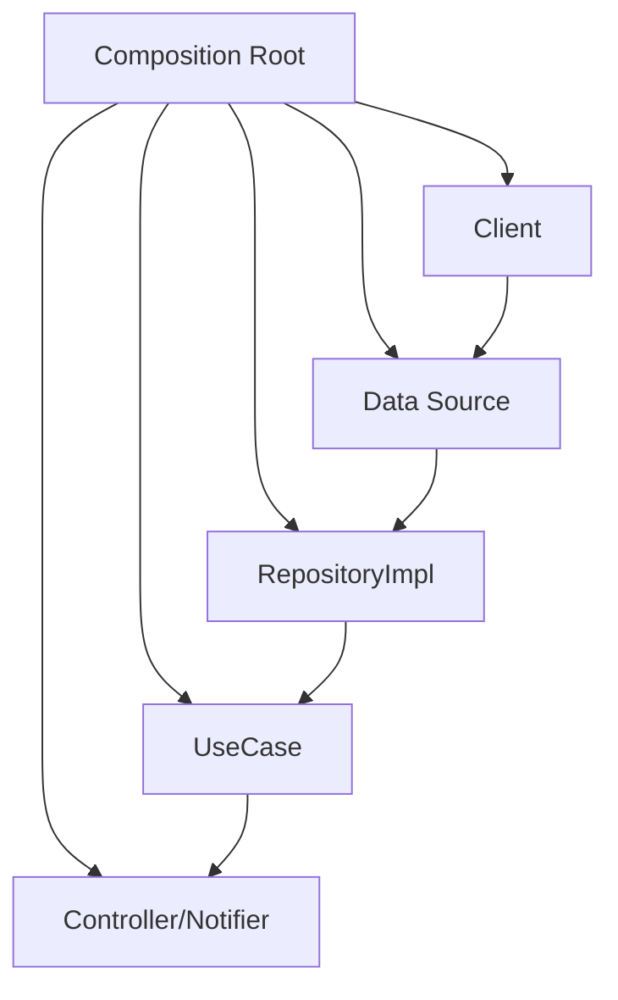

## Part Three: Feature-Based Pattern

### 18. Why Feature-First?

Organizing by file type makes changing one feature require navigating many generic folders. Organizing by Feature keeps the changing context together while preserving the internal layers.
| Layer-First | Feature-First |
| --- | --- |
| All controllers together | Controller inside the Feature |
| Horizontal growth | Vertical growth |
| Unclear ownership | Clearer ownership |
| Deleting a Feature is difficult | Deleting it is safer |

### 19. The Hybrid Structure

```text
src-or-lib/
  core/
  features/
    auth/
      domain/
      data/
      presentation/
    products/
      domain/
      data/
      presentation/
  composition/
  main
```

### 20. File Ownership

| File | Location | Reason |
| --- | --- | --- |
| AuthRepositoryImpl | auth/data | Feature-specific detail |
| LoginUseCase | auth/domain | Business goal |
| LoginPage/Route | auth/presentation | Feature interface |
| Money | core/domain | Stable shared concept |
| HttpClient | core/network | Shared infrastructure |

### 21. Communication Between Features

Avoid importing internals from another Feature. Use a Public API, a shared Contract, or a Domain Event. For example, `orders` should depend on `CurrentUserProvider`, not on `AuthRepositoryImpl`.
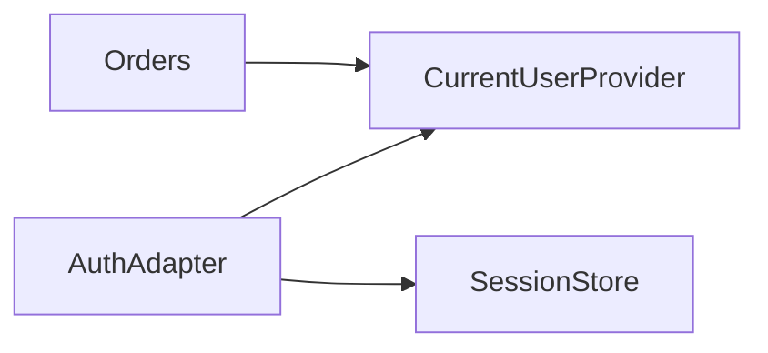

### 22. A Feature's Public API

- Export the required Use Cases or Facades.
- Do not export persistence Models.
- Do not export UI internals.
- Document errors and expectations.
- Use Contract Tests.

### 23. When Should Something Move to Core?

1. Is the name meaningful outside the Feature?
2. Is the behavior identical across all Features?
3. Is its change cycle slower?
4. Does moving it reduce coupling?
5. Can it be tested without a feature-specific context?

## Part Four: Data Flow and Dependencies

### 24. Request Flow

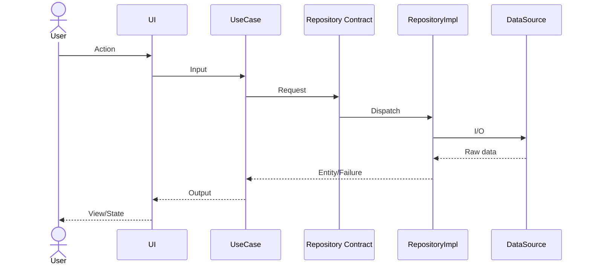

### 25. Commands and Queries

| Type | Examples | Note |
| --- | --- | --- |
| Command | RegisterUser, PlaceOrder | Changes state |
| Query | GetProfile, ListProducts | Read with no side effect |
| Policy | CalculateDiscount | Pure rule |
| Gateway | PaymentGateway | External Contract |

### 26. Validation by Level

| Level | Responsibility | Example |
| --- | --- | --- |
| Presentation | Field format | Required |
| Value Object | Value validity | Valid Email |
| Use Case | Context rule | Email is unused |
| Database | Final constraint | Unique index |
| External API | Provider constraint | Supported currency |

### 27. Transaction Boundary

Place the transaction boundary around the business operation that must succeed or fail as a unit. Do not let the Controller decide the transaction if the rule belongs to the Use Case.
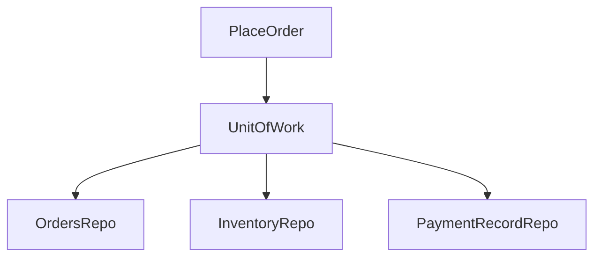

### 28. Domain Events

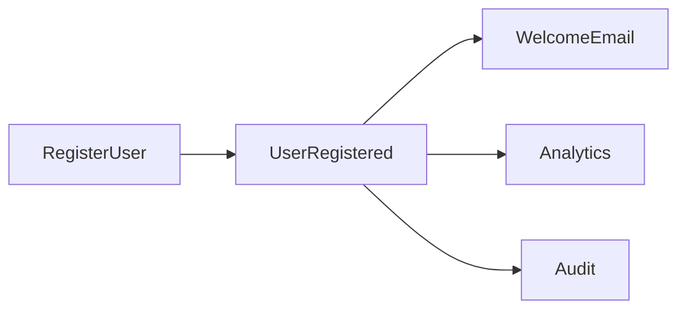

> **Warning:** If a consumer is required for the operation to succeed, do not hide it behind an unreliable event. Use an explicit dependency or an Outbox.

### 29. Cache

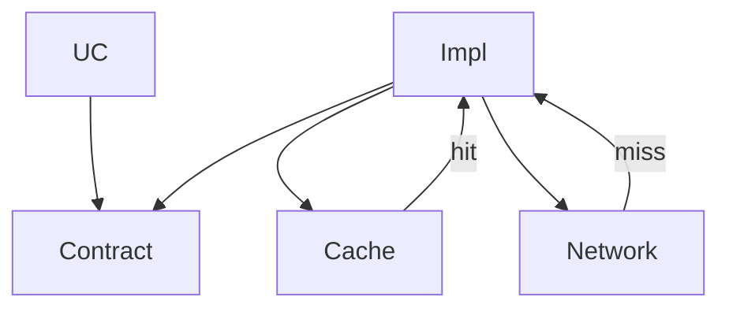

### 30. Retry and Idempotency

- Retry only safe operations or operations protected by an idempotency key.
- Do not retry payments blindly.
- Put backoff in the Adapter.
- Distinguish permanent failures from transient failures.
- Record the correlation id.

## Part Five: End-to-End Case Study

### 31. Dart Assumptions

- Dart 3+.
- Flutter is used only in the Presentation layer.
- The Domain is written in pure Dart.
- Riverpod is the state-management example.
- `package:test` and `flutter_test` are used for testing.
- In-memory storage is replaceable.

### 32. Project Tree

```text
lib/
  core/
    failure.dart
    result.dart
  features/
    auth/
      domain/
        entities/user.dart
        value_objects/email.dart
        repositories/auth_repository.dart
        usecases/register_user.dart
        usecases/login_user.dart
      data/
        models/user_model.dart
        mappers/user_mapper.dart
        datasources/user_data_source.dart
        repositories/auth_repository_impl.dart
      presentation/
        providers/auth_providers.dart
        controllers/auth_controller.dart
        pages/login_page.dart
  composition/app_scope.dart
  main.dart
test/
  unit/
  contract/
  widget/
```

### 33. Failure and Result

```dart
sealed class Failure {
  const Failure(this.code, this.message, [this.details]);

  final String code;
  final String message;
  final Object? details;
}

final class ValidationFailure extends Failure {
  const ValidationFailure(String message, [Object? details])
      : super('VALIDATION', message, details);
}

final class ConflictFailure extends Failure {
  const ConflictFailure(String message, [Object? details])
      : super('CONFLICT', message, details);
}

final class UnauthorizedFailure extends Failure {
  const UnauthorizedFailure([String message = 'Invalid credentials'])
      : super('UNAUTHORIZED', message);
}

final class UnexpectedFailure extends Failure {
  const UnexpectedFailure(String message, [Object? details])
      : super('UNEXPECTED', message, details);
}
```

```dart
sealed class Result<T> {
  const Result();

  R fold<R>({
    required R Function(T value) onSuccess,
    required R Function(Failure failure) onFailure,
  }) {
    return switch (this) {
      Success<T>(:final value) => onSuccess(value),
      FailureResult<T>(:final failure) => onFailure(failure),
    };
  }
}

final class Success<T> extends Result<T> {
  const Success(this.value);
  final T value;
}

final class FailureResult<T> extends Result<T> {
  const FailureResult(this.failure);
  final Failure failure;
}
```

### 34. Email Value Object

```dart
final class Email {
  Email._(this.value);

  final String value;

  static final RegExp _pattern =
      RegExp(r'^[^\s@]+@[^\s@]+\.[^\s@]+$');

  static Result<Email> create(String? raw) {
    final value = (raw ?? '').trim().toLowerCase();

    if (!_pattern.hasMatch(value)) {
      return const FailureResult(
        ValidationFailure('Email is invalid'),
      );
    }

    return Success(Email._(value));
  }

  @override
  bool operator ==(Object other) =>
      other is Email && other.value == value;

  @override
  int get hashCode => value.hashCode;

  @override
  String toString() => value;
}
```

### 35. User Entity

```dart
final class User {
  User({
    required this.id,
    required this.email,
    required this.displayName,
    required this.passwordHash,
    required this.createdAt,
  });

  final String id;
  final Email email;
  String displayName;
  final String passwordHash;
  final DateTime createdAt;

  void rename(String nextName) {
    final value = nextName.trim();

    if (value.length < 2) {
      throw ArgumentError('Display name is too short');
    }

    displayName = value;
  }

  UserView snapshot() => (
    id: id,
    email: email.value,
    displayName: displayName,
    createdAt: createdAt,
  );
}

typedef UserView = ({
  String id,
  String email,
  String displayName,
  DateTime createdAt,
});
```

### 36. Contracts

```dart
abstract interface class AuthRepository {
  Future<User?> findByEmail(Email email);
  Future<void> save(User user);
  Future<bool> verifyPassword(
    User user,
    String plainPassword,
  );
}

abstract interface class PasswordHasher {
  Future<String> hash(String plainPassword);
  Future<bool> verify(String plainPassword, String hash);
}

abstract interface class TokenIssuer {
  Future<String> issue({
    required String subject,
    required String email,
  });
}
```

### 37. RegisterUser UseCase

```dart
final class RegisterUserInput {
  const RegisterUserInput({
    required this.email,
    required this.displayName,
    required this.password,
  });

  final String email;
  final String displayName;
  final String password;
}

final class RegisterUser {
  const RegisterUser({
    required AuthRepository authRepository,
    required PasswordHasher passwordHasher,
    required IdGenerator idGenerator,
    required Clock clock,
  })  : _authRepository = authRepository,
        _passwordHasher = passwordHasher,
        _idGenerator = idGenerator,
        _clock = clock;

  final AuthRepository _authRepository;
  final PasswordHasher _passwordHasher;
  final IdGenerator _idGenerator;
  final Clock _clock;

  Future<Result<UserView>> call(
    RegisterUserInput input,
  ) async {
    final emailResult = Email.create(input.email);

    if (emailResult case FailureResult<Email>(:final failure)) {
      return FailureResult(failure);
    }

    final email = (emailResult as Success<Email>).value;
    final displayName = input.displayName.trim();

    if (displayName.length < 2) {
      return const FailureResult(
        ValidationFailure('Display name is too short'),
      );
    }

    if (input.password.length < 10) {
      return const FailureResult(
        ValidationFailure('Password is too short'),
      );
    }

    if (await _authRepository.findByEmail(email) != null) {
      return const FailureResult(
        ConflictFailure('Email is already in use'),
      );
    }

    try {
      final user = User(
        id: _idGenerator.next(),
        email: email,
        displayName: displayName,
        passwordHash:
            await _passwordHasher.hash(input.password),
        createdAt: _clock.now(),
      );

      await _authRepository.save(user);
      return Success(user.snapshot());
    } catch (error, stackTrace) {
      return FailureResult(
        UnexpectedFailure(
          'Could not register user',
          (error: error, stackTrace: stackTrace),
        ),
      );
    }
  }
}
```

### 38. LoginUser UseCase

```dart
typedef LoginOutput = ({
  String accessToken,
  String userId,
  String email,
  String displayName,
});

final class LoginUser {
  const LoginUser({
    required AuthRepository authRepository,
    required TokenIssuer tokenIssuer,
  })  : _authRepository = authRepository,
        _tokenIssuer = tokenIssuer;

  final AuthRepository _authRepository;
  final TokenIssuer _tokenIssuer;

  Future<Result<LoginOutput>> call({
    required String email,
    required String password,
  }) async {
    final emailResult = Email.create(email);

    if (emailResult case FailureResult<Email>(:final failure)) {
      return FailureResult(failure);
    }

    final validEmail =
        (emailResult as Success<Email>).value;

    final user =
        await _authRepository.findByEmail(validEmail);

    if (user == null) {
      return const FailureResult(
        UnauthorizedFailure(),
      );
    }

    final matches =
        await _authRepository.verifyPassword(
          user,
          password,
        );

    if (!matches) {
      return const FailureResult(
        UnauthorizedFailure(),
      );
    }

    final token = await _tokenIssuer.issue(
      subject: user.id,
      email: user.email.value,
    );

    return Success((
      accessToken: token,
      userId: user.id,
      email: user.email.value,
      displayName: user.displayName,
    ));
  }
}
```

### 39. Model and Mapper

```dart
final class UserModel {
  const UserModel({
    required this.id,
    required this.email,
    required this.displayName,
    required this.passwordHash,
    required this.createdAtIso,
  });

  final String id;
  final String email;
  final String displayName;
  final String passwordHash;
  final String createdAtIso;

  factory UserModel.fromJson(
    Map<String, Object?> json,
  ) {
    return UserModel(
      id: json['id']! as String,
      email: json['email']! as String,
      displayName:
          json['display_name']! as String,
      passwordHash:
          json['password_hash']! as String,
      createdAtIso:
          json['created_at']! as String,
    );
  }

  Map<String, Object?> toJson() => {
    'id': id,
    'email': email,
    'display_name': displayName,
    'password_hash': passwordHash,
    'created_at': createdAtIso,
  };
}
```

```dart
final class UserMapper {
  static User toDomain(UserModel model) {
    final result = Email.create(model.email);

    final email = switch (result) {
      Success<Email>(:final value) => value,
      _ => throw StateError('Stored email is invalid'),
    };

    return User(
      id: model.id,
      email: email,
      displayName: model.displayName,
      passwordHash: model.passwordHash,
      createdAt: DateTime.parse(model.createdAtIso),
    );
  }

  static UserModel toModel(User user) {
    return UserModel(
      id: user.id,
      email: user.email.value,
      displayName: user.displayName,
      passwordHash: user.passwordHash,
      createdAtIso:
          user.createdAt.toUtc().toIso8601String(),
    );
  }
}
```

### 40. Data Source

```dart
abstract interface class UserDataSource {
  Future<UserModel?> findByEmail(String email);
  Future<void> insert(UserModel model);
}

final class InMemoryUserDataSource
    implements UserDataSource {
  final Map<String, UserModel> _rows = {};

  @override
  Future<UserModel?> findByEmail(
    String email,
  ) async {
    for (final row in _rows.values) {
      if (row.email == email) return row;
    }
    return null;
  }

  @override
  Future<void> insert(UserModel model) async {
    if (await findByEmail(model.email) != null) {
      throw StateError('CONFLICT');
    }

    _rows[model.id] = model;
  }
}
```

### 41. AuthRepositoryImpl

```dart
final class AuthRepositoryImpl
    implements AuthRepository {
  const AuthRepositoryImpl({
    required UserDataSource userDataSource,
    required PasswordHasher passwordHasher,
  })  : _userDataSource = userDataSource,
        _passwordHasher = passwordHasher;

  final UserDataSource _userDataSource;
  final PasswordHasher _passwordHasher;

  @override
  Future<User?> findByEmail(Email email) async {
    final model =
        await _userDataSource.findByEmail(
          email.value,
        );

    return model == null
        ? null
        : UserMapper.toDomain(model);
  }

  @override
  Future<void> save(User user) {
    return _userDataSource.insert(
      UserMapper.toModel(user),
    );
  }

  @override
  Future<bool> verifyPassword(
    User user,
    String plainPassword,
  ) {
    return _passwordHasher.verify(
      plainPassword,
      user.passwordHash,
    );
  }
}
```

### 42. Riverpod Composition

```dart
final userDataSourceProvider =
    Provider<UserDataSource>(
  (ref) => InMemoryUserDataSource(),
);

final passwordHasherProvider =
    Provider<PasswordHasher>(
  (ref) => BcryptPasswordHasher(),
);

final authRepositoryProvider =
    Provider<AuthRepository>(
  (ref) => AuthRepositoryImpl(
    userDataSource:
        ref.watch(userDataSourceProvider),
    passwordHasher:
        ref.watch(passwordHasherProvider),
  ),
);

final loginUserProvider = Provider<LoginUser>(
  (ref) => LoginUser(
    authRepository:
        ref.watch(authRepositoryProvider),
    tokenIssuer:
        ref.watch(tokenIssuerProvider),
  ),
);
```

### 43. AuthController

```dart
sealed class AuthState {
  const AuthState();
}

final class AuthIdle extends AuthState {
  const AuthIdle();
}

final class AuthLoading extends AuthState {
  const AuthLoading();
}

final class Authenticated extends AuthState {
  const Authenticated(this.output);
  final LoginOutput output;
}

final class AuthError extends AuthState {
  const AuthError(this.message);
  final String message;
}

final class AuthController
    extends StateNotifier<AuthState> {
  AuthController(this._loginUser)
      : super(const AuthIdle());

  final LoginUser _loginUser;

  Future<void> login({
    required String email,
    required String password,
  }) async {
    state = const AuthLoading();

    final result = await _loginUser(
      email: email,
      password: password,
    );

    state = result.fold(
      onSuccess: Authenticated.new,
      onFailure: (failure) =>
          AuthError(failure.message),
    );
  }
}
```

### 44. LoginPage

```dart
final class LoginPage
    extends ConsumerStatefulWidget {
  const LoginPage({super.key});

  @override
  ConsumerState<LoginPage> createState() =>
      _LoginPageState();
}

final class _LoginPageState
    extends ConsumerState<LoginPage> {
  final _email = TextEditingController();
  final _password = TextEditingController();

  @override
  Widget build(BuildContext context) {
    final state =
        ref.watch(authControllerProvider);

    return Scaffold(
      appBar: AppBar(
        title: const Text('Login'),
      ),
      body: Padding(
        padding: const EdgeInsets.all(24),
        child: Column(
          children: [
            TextField(
              controller: _email,
              decoration: const InputDecoration(
                labelText: 'Email',
              ),
            ),
            TextField(
              controller: _password,
              obscureText: true,
              decoration: const InputDecoration(
                labelText: 'Password',
              ),
            ),
            FilledButton(
              onPressed: state is AuthLoading
                  ? null
                  : () => ref
                      .read(
                        authControllerProvider.notifier,
                      )
                      .login(
                        email: _email.text,
                        password: _password.text,
                      ),
              child: state is AuthLoading
                  ? const CircularProgressIndicator()
                  : const Text('Login'),
            ),
          ],
        ),
      ),
    );
  }
}
```

### 45. AppScope

```dart
final class AppScope {
  AppScope({
    required this.authRepository,
    required this.loginUser,
    required this.registerUser,
  });

  final AuthRepository authRepository;
  final LoginUser loginUser;
  final RegisterUser registerUser;

  factory AppScope.create() {
    final dataSource =
        InMemoryUserDataSource();
    final hasher =
        BcryptPasswordHasher();

    final repository =
        AuthRepositoryImpl(
      userDataSource: dataSource,
      passwordHasher: hasher,
    );

    return AppScope(
      authRepository: repository,
      loginUser: LoginUser(
        authRepository: repository,
        tokenIssuer: JwtTokenIssuer(),
      ),
      registerUser: RegisterUser(
        authRepository: repository,
        passwordHasher: hasher,
        idGenerator: UuidGenerator(),
        clock: SystemClock(),
      ),
    );
  }
}
```

### 46. Unit Test

```dart
final class FakeAuthRepository
    implements AuthRepository {
  final List<User> saved = [];

  @override
  Future<User?> findByEmail(
    Email email,
  ) async => null;

  @override
  Future<void> save(User user) async {
    saved.add(user);
  }

  @override
  Future<bool> verifyPassword(
    User user,
    String plainPassword,
  ) async => true;
}

void main() {
  test('registers a valid user', () async {
    final repository =
        FakeAuthRepository();

    final useCase = RegisterUser(
      authRepository: repository,
      passwordHasher: FakeHasher(),
      idGenerator:
          FakeIdGenerator('user-1'),
      clock: FakeClock(
        DateTime.utc(2026, 1, 1),
      ),
    );

    final result = await useCase(
      const RegisterUserInput(
        email: 'USER@example.com',
        displayName: 'Anwar',
        password: 'very-strong-password',
      ),
    );

    expect(
      result,
      isA<Success<UserView>>(),
    );
    expect(repository.saved, hasLength(1));
  });
}
```

### 47. Contract Test

```dart
void authRepositoryContract(
  String name,
  Future<AuthRepository> Function()
      createRepository,
) {
  group(name, () {
    test('missing user returns null', () async {
      final repository =
          await createRepository();

      final email = (
        Email.create('none@example.com')
            as Success<Email>
      ).value;

      expect(
        await repository.findByEmail(email),
        isNull,
      );
    });
  });
}
```

### 48. Widget Test

```dart
testWidgets(
  'disables login while loading',
  (tester) async {
    await tester.pumpWidget(
      ProviderScope(
        overrides: [
          authControllerProvider
              .overrideWith(
            (ref) => FakeAuthController(
              const AuthLoading(),
            ),
          ),
        ],
        child: const MaterialApp(
          home: LoginPage(),
        ),
      ),
    );

    final button =
        tester.widget<FilledButton>(
      find.byType(FilledButton),
    );

    expect(button.onPressed, isNull);
  },
);
```

## Part Six: SOLID Principles

### 49. Overview

| Principle | Question | Effect |
| --- | --- | --- |
| SRP | How many reasons does the component have to change? | Clearer responsibilities and boundaries |
| OCP | Can I add behavior without modifying stable code? | Extensions behind Contracts |
| LSP | Is the implementation substitutable? | Honest Contracts |
| ISP | Does the client see methods it does not need? | Small interfaces |
| DIP | Does the policy depend on details? | Dependence on Abstractions |

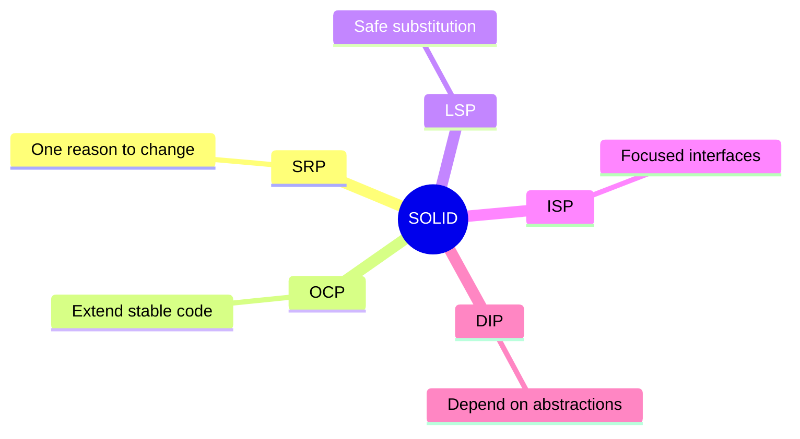

### 50. SRP — Single Responsibility Principle

In Flutter, SRP is violated when a Widget manages the interface, network, storage, and business rules. Separate the Controller from the Use Case and from the Data Source.
```dart
class RegisterPageState
    extends State<RegisterPage> {
  Future<void> register() async {
    if (!emailController.text.contains('@')) {
      setState(() => error = 'Invalid email');
      return;
    }

    final response = await Dio().post(
      '/users',
      data: {
        'email': emailController.text,
        'password': passwordController.text,
      },
    );

    final prefs =
        await SharedPreferences.getInstance();

    await prefs.setString(
      'token',
      response.data['token'] as String,
    );

    Navigator.of(context)
        .pushReplacementNamed('/home');
  }
}
```

- The Widget changes with the UI.
- It changes with the API.
- It changes with storage.
- It changes with validation.
- It is difficult to test without a Flutter binding.

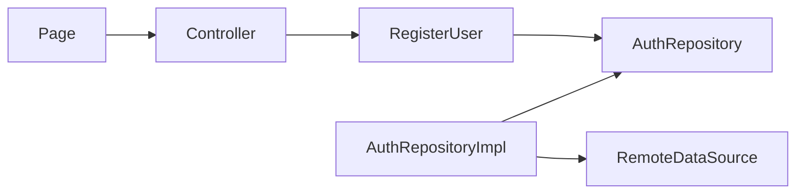

```dart
final class RegisterController
    extends StateNotifier<RegisterState> {
  RegisterController(this._registerUser)
      : super(const RegisterIdle());

  final RegisterUser _registerUser;

  Future<void> submit(
    RegisterUserInput input,
  ) async {
    state = const RegisterLoading();

    final result =
        await _registerUser(input);

    state = result.fold(
      onSuccess: RegisterSuccess.new,
      onFailure: (failure) =>
          RegisterError(failure.message),
    );
  }
}
```

### 51. OCP — Open/Closed Principle

```dart
abstract interface class NotificationSender {
  Future<void> send(
    Notification notification,
  );
}

final class EmailNotificationSender
    implements NotificationSender {
  const EmailNotificationSender(this._client);

  final EmailClient _client;

  @override
  Future<void> send(
    Notification notification,
  ) {
    return _client.send(
      to: notification.target,
      subject: notification.subject,
      body: notification.body,
    );
  }
}

final class PushNotificationSender
    implements NotificationSender {
  const PushNotificationSender(this._client);

  final PushClient _client;

  @override
  Future<void> send(
    Notification notification,
  ) {
    return _client.push(
      deviceToken: notification.target,
      message: notification.body,
    );
  }
}
```

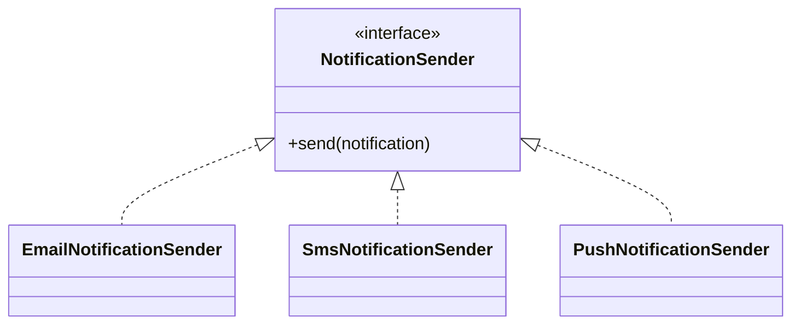

> **Dart 3:** Use `sealed` to deliberately close a type family, and `abstract interface class` to keep implementations open.

### 52. LSP — Liskov Substitution Principle

```dart
// LSP violation
final class ReadOnlyRepository
    implements AuthRepository {
  @override
  Future<void> save(User user) {
    throw UnsupportedError('read only');
  }

  // remaining methods...
}
```

```dart
abstract interface class UserReader {
  Future<User?> findByEmail(Email email);
}

abstract interface class UserWriter {
  Future<void> save(User user);
}

final class ReadOnlyRepository
    implements UserReader {
  @override
  Future<User?> findByEmail(
    Email email,
  ) async {
    return null;
  }
}
```

```dart
void userReaderContract(
  String name,
  Future<UserReader> Function()
      createReader,
) {
  group(name, () {
    test(
      'missing user returns null',
      () async {
        final reader =
            await createReader();

        final email = (
          Email.create('none@example.com')
              as Success<Email>
        ).value;

        expect(
          await reader.findByEmail(email),
          isNull,
        );
      },
    );
  });
}
```

- Preserve the Result and its meaning.
- Do not add undocumented exceptions.
- Do not strengthen input preconditions.
- Preserve side effects.
- Apply the same Contract Test to every implementation.

### 53. ISP — Interface Segregation Principle

```dart
abstract interface class UserReader {
  Future<User?> findById(String id);
  Future<User?> findByEmail(Email email);
}

abstract interface class UserWriter {
  Future<void> save(User user);
}

abstract interface class ProfileReader {
  Future<Profile> getProfile(
    String userId,
  );
}

abstract interface class ProfileUpdater {
  Future<void> updateProfile(
    Profile profile,
  );
}
```

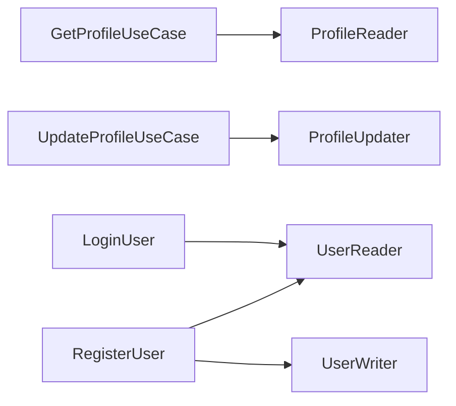

```dart
typedef UpdateProfileInput = ({
  String userId,
  String displayName,
  String? bio,
});

abstract interface class ProfileUpdater {
  Future<Result<Profile>> update(
    UpdateProfileInput input,
  );
}
```

### 54. DIP — Dependency Inversion Principle

```dart
// Wrong
final class LoginUser {
  LoginUser()
      : _repository =
          DioAuthRepository(Dio());

  final DioAuthRepository _repository;
}
```

```dart
// Better
final class LoginUser {
  const LoginUser(this._repository);

  final AuthRepository _repository;
}

final authRepositoryProvider =
    Provider<AuthRepository>((ref) {
  return AuthRepositoryImpl(
    remote: ref.watch(
      authRemoteDataSourceProvider,
    ),
    passwordHasher: ref.watch(
      passwordHasherProvider,
    ),
  );
});
```

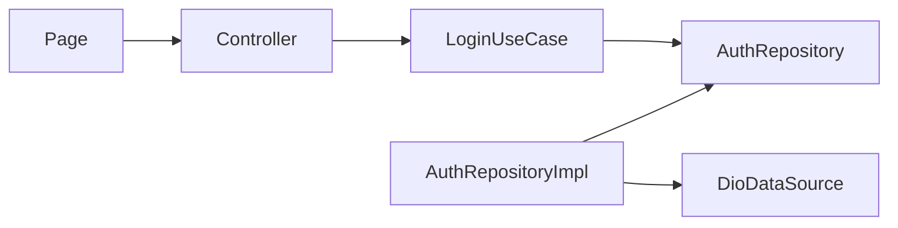

- Do not import Dio inside the Domain.
- Do not construct an implementation inside a Use Case.
- Use a Provider override in tests.
- Make lifecycle a Composition decision.
- Keep the Domain runnable without Flutter.

## Part Seven: Testing and Quality

### 55. The Testing Pyramid

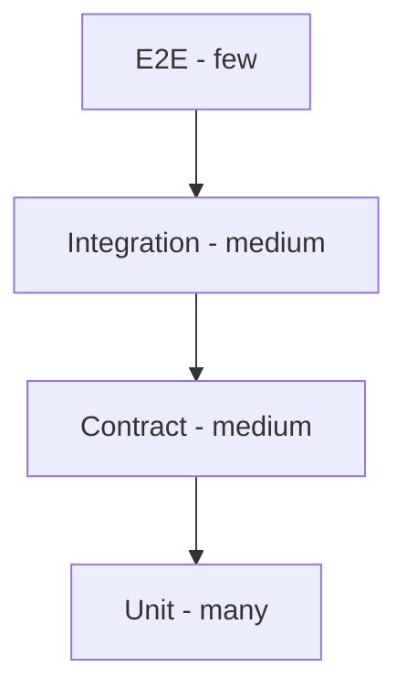

| Type | What It Tests | Speed | Example |
| --- | --- | --- | --- |
| Unit | Entity/UseCase | Fast | Calculation or registration |
| Contract | Behavior of every implementation | Fast/medium | Repository |
| Integration | Adapter with DB/API | Medium | Mapping and SQL |
| Presentation | UI/HTTP adapter | Medium | state/status |
| E2E | Complete flow | Slow | login then home |

### 56. Mocks and Fakes

- Use a simple Fake for internal Contracts.
- Use a Mock for an important interaction, not for every call.
- Do not mock an Entity.
- Test real Adapters with Integration tests.
- Use Contract Tests to prevent the Fake from diverging from production.

### 57. Characteristics of a Good Test

1. It describes behavior, not an implementation.
2. It fails for one reason.
3. It does not depend on execution order.
4. It controls time and IDs.
5. It tests both success and failure.
6. It does not duplicate production logic.

### 58. Architecture Review

- Does the Domain import a Framework?
- Does the Repository return a DTO?
- Does the Use Case construct a concrete dependency?
- Is there a deep cross-feature import?
- Is the Failure translated at the boundary?
- Is the Contract small and honest?
- Are Contract Tests present?
- Is the Composition Root clear?

### 59. Metrics

| Metric | What It Reveals | Caution |
| --- | --- | --- |
| Coupling | Boundary leakage | Do not interpret it in isolation |
| File size | Possible bloat | Length is not always a defect |
| Test duration | Excess Infrastructure | Integration may be necessary |
| Coverage | Untested areas | Does not measure assertion quality |
| Co-change | Poor boundaries | Requires Git history |

### 60. Fitness Functions

```text
Suggested automated rules:
- `domain/**` must not import `data/**`.
- `domain/**` must not import `presentation/**`.
- `domain/**` must not import Framework packages.
- `presentation/**` must not import `*RepositoryImpl`.
- Feature A must not import internals from Feature B.
```

### 61. Definition of Done

1. The Use Case is documented.
2. The Domain contains no Framework code.
3. Contracts live on the inside.
4. Mapping is explicit.
5. Unit tests.
6. Contract tests.
7. Integration tests cover boundaries.
8. Security review.
9. Observability.
10. An ADR records any long-lived decision.

## Part Eight: Security, Performance, and Observability

### 62. Security Boundaries

- Do not return `passwordHash`.
- Keep authorization inside a Use Case or Policy.
- Apply rate limiting in the Delivery Adapter.
- Do not log tokens.
- Translate authentication failures into a generic message.
- Treat external IDs as untrusted.
- Use trusted hashing libraries.
- Keep secrets out of source code.

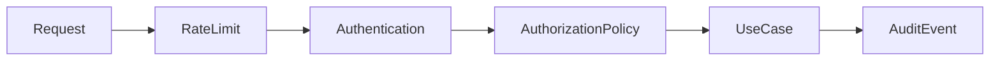

### 63. Secret Management

- Secrets never enter Git.
- Configuration is read in the Composition Root.
- The Domain does not read the environment.
- Rotate keys without modifying Use Cases.
- Separate test secrets from production secrets.
- Log the version name, not the secret.

### 64. Performance Without Breaking Boundaries

| Problem | Location | Solution |
| --- | --- | --- |
| N+1 | RepositoryImpl | Batch/Join |
| Large JSON payload | DTO/Presenter | Projection/Pagination |
| Expensive calculation | Domain Service | Memoization |
| Slow network | Data Source | Timeout/Retry |
| Repeated reads | Data Layer | Cache |
| UI rebuilds excessively | Presentation | State slicing |

### 65. Logging and Tracing

- Propagate `correlationId`.
- Adapters add technical details.
- Do not mix logging with the Result.
- Use consistent log levels.
- Redact PII.
- Link traces to the business event.

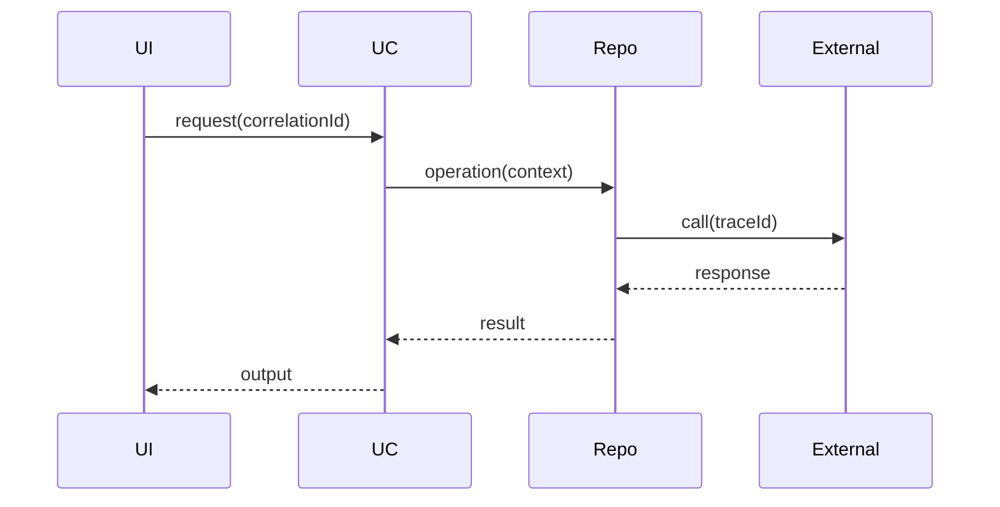

### 66. Resilience

- Set a Timeout for every connection.
- Use a Circuit Breaker for repeated failures.
- Retry with backoff and jitter.
- Use a Bulkhead to isolate resources.
- Use a Fallback only when it is valid for the business.
- Use an Outbox for important events.

## Part Nine: Migrating from a Traditional Project

### 67. Strangler Pattern

Do not rewrite the entire project at once. Put a Facade in front of the legacy implementation, then move one Feature or Use Case at a time behind a new Contract.
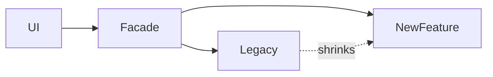

### 68. Migration Steps

1. Diagram the current flow.
2. Write characterization tests.
3. Extract a Use Case.
4. Create a Contract.
5. Wrap the legacy code in an Adapter.
6. Move Mapping out.
7. Create the Composition Root.
8. Add a new implementation.
9. Shift traffic gradually.
10. Delete the legacy path.

### 69. Characterization Tests

Characterization tests preserve current behavior during extraction. Once the migration is stable, convert them into behavioral tests; do not let them preserve bugs forever.
### 70. Signs of Incorrect Boundaries

- The Domain imports a Framework.
- Core is a dumping ground for helpers.
- Every test requires a database.
- One Feature imports another Feature's internals.
- A Repository returns raw Models.
- A Use Case passes request/response objects.
- Composition is scattered through the UI.
- One interface is enormous.

### 71. A 30-Day Plan

| Week | Goal | Deliverable |
| --- | --- | --- |
| 1 | Map the system and current coverage | Diagram + risks |
| 2 | Extract one Feature | Domain + Contract + Adapter |
| 3 | Tests + Composition | CI rules |
| 4 | Standardize and document | Playbook + ADRs |

### 72. Architecture Decision Records

#### ADR-001: Feature-First

**Status:** Accepted

**Context:** Generic folders have become huge.

**Decision:** Organize by Feature, with internal layers.

**Positive consequences:** Clearer boundaries and easier tests.

**Trade-offs:** Additional files and wiring require discipline.

#### ADR-002: Framework-Free Domain

**Status:** Accepted

**Context:** Tests are slow.

**Decision:** Disallow external imports in the Domain.

**Positive consequences:** Clearer boundaries and easier tests.

**Trade-offs:** Additional files and wiring require discipline.

#### ADR-003: Result

**Status:** Accepted

**Context:** Exceptions are undocumented.

**Decision:** Use Result for expected errors.

**Positive consequences:** Clearer boundaries and easier tests.

**Trade-offs:** Additional files and wiring require discipline.

#### ADR-004: Contract Tests

**Status:** Accepted

**Context:** Implementations behave differently.

**Decision:** Run a shared suite against every implementation.

**Positive consequences:** Clearer boundaries and easier tests.

**Trade-offs:** Additional files and wiring require discipline.

#### ADR-005: Composition Root

**Status:** Accepted

**Context:** `new` is scattered throughout the codebase.

**Decision:** Centralize wiring.

**Positive consequences:** Clearer boundaries and easier tests.

**Trade-offs:** Additional files and wiring require discipline.

#### ADR-006: Domain Events

**Status:** Accepted

**Context:** Secondary operations are tightly coupled.

**Decision:** Publish Events after a Use Case succeeds.

**Positive consequences:** Clearer boundaries and easier tests.

**Trade-offs:** Additional files and wiring require discipline.

#### ADR-007: DTOs Outside the Domain

**Status:** Accepted

**Context:** API changes break Entities.

**Decision:** Use explicit Mapping.

**Positive consequences:** Clearer boundaries and easier tests.

**Trade-offs:** Additional files and wiring require discipline.

#### ADR-008: Small Interfaces

**Status:** Accepted

**Context:** Mocks are complex.

**Decision:** Split interfaces by capability.

**Positive consequences:** Clearer boundaries and easier tests.

**Trade-offs:** Additional files and wiring require discipline.

#### ADR-009: Cache in the Data Layer

**Status:** Accepted

**Context:** Use Cases know about Redis.

**Decision:** Hide the Cache behind a Repository.

**Positive consequences:** Clearer boundaries and easier tests.

**Trade-offs:** Additional files and wiring require discipline.

#### ADR-010: Clock and IDs

**Status:** Accepted

**Context:** Tests are non-deterministic.

**Decision:** Inject Clock and IdGenerator.

**Positive consequences:** Clearer boundaries and easier tests.

**Trade-offs:** Additional files and wiring require discipline.

### 73. Anti-Pattern Catalog

#### 1. God Controller

- **Symptom:** HTTP, SQL, and business rules in one file.
- **Remedy:** Extract a Use Case and Repository.
- **Test:** Prove that replacing the detail does not change the policy.
- **Review:** Inspect import direction and Feature boundaries.

#### 2. Anemic Domain

- **Symptom:** Entities are just fields.
- **Remedy:** Move invariants into the Domain.
- **Test:** Prove that replacing the detail does not change the policy.
- **Review:** Inspect import direction and Feature boundaries.

#### 3. Framework Leakage

- **Symptom:** The Domain imports a Framework.
- **Remedy:** Use an Adapter.
- **Test:** Prove that replacing the detail does not change the policy.
- **Review:** Inspect import direction and Feature boundaries.

#### 4. Generic Repository

- **Symptom:** Generic CRUD for everything.
- **Remedy:** Define a Contract in business language.
- **Test:** Prove that replacing the detail does not change the policy.
- **Review:** Inspect import direction and Feature boundaries.

#### 5. Fat Interface

- **Symptom:** Many unnecessary methods.
- **Remedy:** Apply ISP.
- **Test:** Prove that replacing the detail does not change the policy.
- **Review:** Inspect import direction and Feature boundaries.

#### 6. Service Locator

- **Symptom:** Dependencies are obtained from globals.
- **Remedy:** Use constructor injection.
- **Test:** Prove that replacing the detail does not change the policy.
- **Review:** Inspect import direction and Feature boundaries.

#### 7. Hidden I/O

- **Symptom:** A getter performs network I/O.
- **Remedy:** Make I/O explicit.
- **Test:** Prove that replacing the detail does not change the policy.
- **Review:** Inspect import direction and Feature boundaries.

#### 8. DTO Everywhere

- **Symptom:** DTOs leak into Domain or UI.
- **Remedy:** Map at boundaries.
- **Test:** Prove that replacing the detail does not change the policy.
- **Review:** Inspect import direction and Feature boundaries.

#### 9. Shared Dump

- **Symptom:** Everything is placed in `shared`.
- **Remedy:** Apply strict criteria for Core.
- **Test:** Prove that replacing the detail does not change the policy.
- **Review:** Inspect import direction and Feature boundaries.

#### 10. Cross-Import

- **Symptom:** Features depend on each other's internals.
- **Remedy:** Expose a Public API.
- **Test:** Prove that replacing the detail does not change the policy.
- **Review:** Inspect import direction and Feature boundaries.

#### 11. Exception Soup

- **Symptom:** SDK errors propagate upward.
- **Remedy:** Translate them into Failures.
- **Test:** Prove that replacing the detail does not change the policy.
- **Review:** Inspect import direction and Feature boundaries.

#### 12. Boolean Blindness

- **Symptom:** Too many booleans.
- **Remedy:** Use an enum or Strategy.
- **Test:** Prove that replacing the detail does not change the policy.
- **Review:** Inspect import direction and Feature boundaries.

#### 13. Temporal Coupling

- **Symptom:** The order of calls is hidden.
- **Remedy:** Coordinate them in one Use Case.
- **Test:** Prove that replacing the detail does not change the policy.
- **Review:** Inspect import direction and Feature boundaries.

#### 14. Primitive Obsession

- **Symptom:** Email is just a String.
- **Remedy:** Use a Value Object.
- **Test:** Prove that replacing the detail does not change the policy.
- **Review:** Inspect import direction and Feature boundaries.

#### 15. Shotgun Surgery

- **Symptom:** One change modifies dozens of files.
- **Remedy:** Reconsider the Boundary.
- **Test:** Prove that replacing the detail does not change the policy.
- **Review:** Inspect import direction and Feature boundaries.

#### 16. Golden Hammer

- **Symptom:** A Repository is used for everything.
- **Remedy:** Introduce a Domain Service when appropriate.
- **Test:** Prove that replacing the detail does not change the policy.
- **Review:** Inspect import direction and Feature boundaries.

#### 17. Over-Abstraction

- **Symptom:** An Interface exists for every Class.
- **Remedy:** Remove abstractions that add no value.
- **Test:** Prove that replacing the detail does not change the policy.
- **Review:** Inspect import direction and Feature boundaries.

#### 18. Under-Abstraction

- **Symptom:** A Use Case depends on an SDK.
- **Remedy:** Introduce a Gateway Contract.
- **Test:** Prove that replacing the detail does not change the policy.
- **Review:** Inspect import direction and Feature boundaries.

#### 19. Mixed Validation

- **Symptom:** Rules are duplicated.
- **Remedy:** Place each rule at the appropriate level.
- **Test:** Prove that replacing the detail does not change the policy.
- **Review:** Inspect import direction and Feature boundaries.

#### 20. Leaky Cache

- **Symptom:** A Use Case knows Cache keys.
- **Remedy:** Keep Cache policy in the Data Layer.
- **Test:** Prove that replacing the detail does not change the policy.
- **Review:** Inspect import direction and Feature boundaries.

#### 21. Test-only Design

- **Symptom:** The API is distorted to make Mocks easier.
- **Remedy:** Design for the real Contract.
- **Test:** Prove that replacing the detail does not change the policy.
- **Review:** Inspect import direction and Feature boundaries.

#### 22. Massive Mapper

- **Symptom:** The Mapper contains business rules.
- **Remedy:** Move them to the Domain.
- **Test:** Prove that replacing the detail does not change the policy.
- **Review:** Inspect import direction and Feature boundaries.

#### 23. Circular Dependency

- **Symptom:** Features form a dependency cycle.
- **Remedy:** Use an Event or Facade.
- **Test:** Prove that replacing the detail does not change the policy.
- **Review:** Inspect import direction and Feature boundaries.

#### 24. Global Mutable State

- **Symptom:** Session state is global.
- **Remedy:** Define a clear scope.
- **Test:** Prove that replacing the detail does not change the policy.
- **Review:** Inspect import direction and Feature boundaries.

#### 25. Retry Everywhere

- **Symptom:** Retry logic exists in every layer.
- **Remedy:** Centralize it in one Policy.
- **Test:** Prove that replacing the detail does not change the policy.
- **Review:** Inspect import direction and Feature boundaries.

#### 26. Silent Failure

- **Symptom:** Every error becomes `null`.
- **Remedy:** Distinguish Failures.
- **Test:** Prove that replacing the detail does not change the policy.
- **Review:** Inspect import direction and Feature boundaries.

#### 27. Inconsistent Result

- **Symptom:** Result shapes are inconsistent.
- **Remedy:** Adopt one consistent convention.
- **Test:** Prove that replacing the detail does not change the policy.
- **Review:** Inspect import direction and Feature boundaries.

#### 28. Infrastructure Entity

- **Symptom:** The ORM model is treated as the Entity.
- **Remedy:** Separate Mapping.
- **Test:** Prove that replacing the detail does not change the policy.
- **Review:** Inspect import direction and Feature boundaries.

#### 29. Route-driven Domain

- **Symptom:** Use Cases are named after endpoints.
- **Remedy:** Use business language.
- **Test:** Prove that replacing the detail does not change the policy.
- **Review:** Inspect import direction and Feature boundaries.

#### 30. Premature Microservices

- **Symptom:** The system is split across the network before boundaries are understood.
- **Remedy:** Start with a Modular Monolith.
- **Test:** Prove that replacing the detail does not change the policy.
- **Review:** Inspect import direction and Feature boundaries.

## Part Ten: Checklists, Glossary, and Exercises

### 74. Feature Creation Checklist

- [ ] 01. A one-sentence business goal.
- [ ] 02. An Actor or trigger.
- [ ] 03. Use Case input independent of the protocol.
- [ ] 04. Entities and Value Objects.
- [ ] 05. Invariants.
- [ ] 06. Expected Failures.
- [ ] 07. A Contract where needed.
- [ ] 08. Implementation in the Data Layer.
- [ ] 09. Explicit Mapper.
- [ ] 10. Transaction boundary.
- [ ] 11. Authorization policy.
- [ ] 12. Idempotency.
- [ ] 13. Timeout.
- [ ] 14. Cache policy.
- [ ] 15. Unit tests.
- [ ] 16. Contract tests.
- [ ] 17. Integration tests.
- [ ] 18. Presentation test.
- [ ] 19. Logging.
- [ ] 20. Tracing.
- [ ] 21. Security review.
- [ ] 22. ADR.
- [ ] 23. Import review.
- [ ] 24. SOLID review.
- [ ] 25. Deletion path.

### 75. Checklist SOLID

#### SRP

- [ ] One reason to change?
- [ ] Does it mix protocol and business concerns?
- [ ] Does testing it require excessive setup?
- [ ] Does the name describe one role?
- [ ] Do imports come from many axes of change?

#### OCP

- [ ] Does adding a provider modify stable code?
- [ ] Are `if/else` branches growing?
- [ ] Is the extension axis known?
- [ ] Is a Strategy appropriate?
- [ ] Does the abstraction justify its cost?

#### LSP

- [ ] Does the implementation honor the Contract?
- [ ] Are errors consistent?
- [ ] Does `null` have the same meaning everywhere?
- [ ] Are preconditions and postconditions consistent?
- [ ] Are there Contract Tests?

#### ISP

- [ ] Are there unused methods?
- [ ] Do Fakes contain empty methods?
- [ ] Are unrelated operations grouped together?
- [ ] Should capabilities be split?
- [ ] Are the Contracts understandable?

#### DIP

- [ ] Is `new` used inside a Use Case?
- [ ] Does the Domain import an SDK?
- [ ] Does the inside own the Contract?
- [ ] Is Composition clear?
- [ ] Is creating a Fake easy?

### 76. Glossary

- **Abstraction:** Required behavior without a specific implementation.
- **Adapter:** A translator between the system and the outside world.
- **Boundary:** A limit that separates reasons to change.
- **Business Rule:** A domain rule.
- **Cache:** A temporary copy.
- **Command:** An intention to change state.
- **Composition Root:** The place where dependencies are wired.
- **Contract:** A behavioral agreement.
- **Controller:** An Adapter for an incoming request.
- **Coupling:** The degree of dependency.
- **CQRS:** Separation of reads and writes.
- **Data Source:** A direct connection to an external system.
- **Dependency Injection:** Supplying a dependency from the outside.
- **Domain:** The domain model and its rules.
- **Domain Event:** A fact that has occurred.
- **DTO:** A transport shape.
- **Entity:** An object with identity.
- **Facade:** A simplified interface.
- **Failure:** A translated expected error.
- **Feature:** A vertical business unit.
- **Gateway:** A Contract for an external system.
- **Idempotency:** Safe repetition.
- **Infrastructure:** Technical details.
- **Invariant:** A condition that must always hold.
- **Mapper:** Converts between shapes.
- **Model:** A layer-specific representation.
- **Policy:** A business decision.
- **Presenter:** Converts output for display.
- **Public API:** The permitted surface.
- **Query:** A read with no side effect.
- **Repository:** Access to Domain objects.
- **Result:** Success or Failure.
- **Strategy:** A replaceable algorithm.
- **Transaction:** Atomic changes.
- **Use Case:** A user goal.
- **Value Object:** A value with no identity.
- **ViewModel:** Presentation data.
- **Unit of Work:** Coordinates a transaction.
- **Outbox:** Guarantees events after commit.
- **Circuit Breaker:** Temporarily stops calls after repeated failure.
- **Bulkhead:** Resource isolation.
- **Correlation ID:** Connects logs for one request.
- **Contract Test:** A shared suite for all implementations.
- **Characterization Test:** Locks down current behavior.
- **Fitness Function:** An automated architecture rule.
- **Modular Monolith:** One application composed of modules.
- **Anti-Corruption Layer:** Isolates an external model.
- **Read Model:** A model optimized for reads.
- **Aggregate:** A Domain consistency boundary.
- **Port:** Another name for a boundary Contract.

### 77. Exercises

#### Exercise 1: Google Login

- **Task:** Add a Gateway without modifying the Use Case.
- **Deliverables:** Mermaid diagram + Contract + Use Case + tests.
- **Question:** Which detail is replaceable?
- **Review:** Which SOLID principles apply?

#### Exercise 2: Profile Cache

- **Task:** Hide the Cache behind a Repository.
- **Deliverables:** Mermaid diagram + Contract + Use Case + tests.
- **Question:** Which detail is replaceable?
- **Review:** Which SOLID principles apply?

#### Exercise 3: Read-Only Repository

- **Task:** Do not violate LSP.
- **Deliverables:** Mermaid diagram + Contract + Use Case + tests.
- **Question:** Which detail is replaceable?
- **Review:** Which SOLID principles apply?

#### Exercise 4: GraphQL

- **Task:** Replace the Delivery Adapter.
- **Deliverables:** Mermaid diagram + Contract + Use Case + tests.
- **Question:** Which detail is replaceable?
- **Review:** Which SOLID principles apply?

#### Exercise 5: Payment Provider

- **Task:** Apply OCP.
- **Deliverables:** Mermaid diagram + Contract + Use Case + tests.
- **Question:** Which detail is replaceable?
- **Review:** Which SOLID principles apply?

#### Exercise 6: Authorization

- **Task:** Create an independent Policy.
- **Deliverables:** Mermaid diagram + Contract + Use Case + tests.
- **Question:** Which detail is replaceable?
- **Review:** Which SOLID principles apply?

#### Exercise 7: Split Repository

- **Task:** Apply ISP.
- **Deliverables:** Mermaid diagram + Contract + Use Case + tests.
- **Question:** Which detail is replaceable?
- **Review:** Which SOLID principles apply?

#### Exercise 8: Offline-First

- **Task:** Coordinate Local and Remote sources.
- **Deliverables:** Mermaid diagram + Contract + Use Case + tests.
- **Question:** Which detail is replaceable?
- **Review:** Which SOLID principles apply?

#### Exercise 9: OrderPlaced

- **Task:** Introduce a Domain Event.
- **Deliverables:** Mermaid diagram + Contract + Use Case + tests.
- **Question:** Which detail is replaceable?
- **Review:** Which SOLID principles apply?

#### Exercise 10: Legacy Adapter

- **Task:** Perform a Strangler migration.
- **Deliverables:** Mermaid diagram + Contract + Use Case + tests.
- **Question:** Which detail is replaceable?
- **Review:** Which SOLID principles apply?

#### Exercise 11: Cancel Order

- **Task:** Model state transitions.
- **Deliverables:** Mermaid diagram + Contract + Use Case + tests.
- **Question:** Which detail is replaceable?
- **Review:** Which SOLID principles apply?

#### Exercise 12: Money

- **Task:** Create a Value Object.
- **Deliverables:** Mermaid diagram + Contract + Use Case + tests.
- **Question:** Which detail is replaceable?
- **Review:** Which SOLID principles apply?

#### Exercise 13: Pagination

- **Task:** Separate the HTTP query from the application input.
- **Deliverables:** Mermaid diagram + Contract + Use Case + tests.
- **Question:** Which detail is replaceable?
- **Review:** Which SOLID principles apply?

#### Exercise 14: Avatar

- **Task:** Define an `AvatarStore` Contract.
- **Deliverables:** Mermaid diagram + Contract + Use Case + tests.
- **Question:** Which detail is replaceable?
- **Review:** Which SOLID principles apply?

#### Exercise 15: Clock

- **Task:** Implement a `FakeClock`.
- **Deliverables:** Mermaid diagram + Contract + Use Case + tests.
- **Question:** Which detail is replaceable?
- **Review:** Which SOLID principles apply?

#### Exercise 16: Multi-Currency

- **Task:** Define an `ExchangeRateGateway`.
- **Deliverables:** Mermaid diagram + Contract + Use Case + tests.
- **Question:** Which detail is replaceable?
- **Review:** Which SOLID principles apply?

#### Exercise 17: Retry Payment

- **Task:** Apply Idempotency.
- **Deliverables:** Mermaid diagram + Contract + Use Case + tests.
- **Question:** Which detail is replaceable?
- **Review:** Which SOLID principles apply?

#### Exercise 18: Audit

- **Task:** Use an Event or Port.
- **Deliverables:** Mermaid diagram + Contract + Use Case + tests.
- **Question:** Which detail is replaceable?
- **Review:** Which SOLID principles apply?

#### Exercise 19: Product Search

- **Task:** Build a Query Service.
- **Deliverables:** Mermaid diagram + Contract + Use Case + tests.
- **Question:** Which detail is replaceable?
- **Review:** Which SOLID principles apply?

#### Exercise 20: Analytics

- **Task:** Create a separate Handler.
- **Deliverables:** Mermaid diagram + Contract + Use Case + tests.
- **Question:** Which detail is replaceable?
- **Review:** Which SOLID principles apply?

### 78. Review Questions

1. Explain the Dependency Rule.
2. When does a Repository become overkill?
3. What is the difference between a DTO and an Entity?
4. Where should validation live?
5. How do you test implementations?
6. What is the difference between DIP and DI?
7. How do you detect an LSP violation?
8. When should you use a Domain Event?
9. How do you prevent cross-feature coupling?
10. What is the role of the Composition Root?
11. How do you apply OCP without over-engineering?
12. Why can a Generic Repository be harmful?
13. How do you isolate a Cache?
14. Where should exceptions be translated?
15. What is a Feature's Public API?
16. How do you migrate legacy code?
17. When should you use a Query Service?
18. How do you isolate time?
19. How do you prevent Framework leakage?
20. What is the difference between a Unit test and a Contract Test?

### 79. Conclusion

Clean Architecture is not a fixed folder layout, the Feature-Based Pattern is not merely moving files, and SOLID is not a set of slogans. They work together when dependency direction is clear, Contracts are small and honest, details live in Adapters, and business rules are testable.

Start from the business flow, design the inside first, and then allow the outside to implement what the inside needs.
### 80. Additional Review Cards

#### Card 1: The Database Changed

- **Diagnosis:** The Adapter should change, not the Use Case.
- **Dependency direction:** Adapter toward an internal Contract.
- **Test:** Replace the detail and verify that the policy remains unchanged.
- **SOLID:** Review SRP, OCP, and DIP, then LSP and ISP.

#### Card 2: The API Added a Field

- **Diagnosis:** Update only the DTO/Mapper unless a new business rule is introduced.
- **Dependency direction:** Adapter toward an internal Contract.
- **Test:** Replace the detail and verify that the policy remains unchanged.
- **SOLID:** Review SRP, OCP, and DIP, then LSP and ISP.

#### Card 3: A Feature Needs the Current User

- **Diagnosis:** Depend on `CurrentUserProvider`.
- **Dependency direction:** Adapter toward an internal Contract.
- **Test:** Replace the detail and verify that the policy remains unchanged.
- **SOLID:** Review SRP, OCP, and DIP, then LSP and ISP.

#### Card 4: A Test Requires `sleep`

- **Diagnosis:** Inject a Clock or Scheduler.
- **Dependency direction:** Adapter toward an internal Contract.
- **Test:** Replace the detail and verify that the policy remains unchanged.
- **SOLID:** Review SRP, OCP, and DIP, then LSP and ISP.

#### Card 5: A Use Case Returns an HTTP Status

- **Diagnosis:** Return an Output or Failure instead.
- **Dependency direction:** Adapter toward an internal Contract.
- **Test:** Replace the detail and verify that the policy remains unchanged.
- **SOLID:** Review SRP, OCP, and DIP, then LSP and ISP.

#### Card 6: A Widget/Route Imports an HTTP Client

- **Diagnosis:** Move the call into a Data Source.
- **Dependency direction:** Adapter toward an internal Contract.
- **Test:** Replace the detail and verify that the policy remains unchanged.
- **SOLID:** Review SRP, OCP, and DIP, then LSP and ISP.

#### Card 7: A Repository Returns a Map

- **Diagnosis:** Convert it into an Entity or Read Model.
- **Dependency direction:** Adapter toward an internal Contract.
- **Test:** Replace the detail and verify that the policy remains unchanged.
- **SOLID:** Review SRP, OCP, and DIP, then LSP and ISP.

#### Card 8: Implementations Return Different Errors

- **Diagnosis:** Translate them into one consistent Failure model.
- **Dependency direction:** Adapter toward an internal Contract.
- **Test:** Replace the detail and verify that the policy remains unchanged.
- **SOLID:** Review SRP, OCP, and DIP, then LSP and ISP.

#### Card 9: Adding a Notification Channel

- **Diagnosis:** Add an Extension behind a Contract.
- **Dependency direction:** Adapter toward an internal Contract.
- **Test:** Replace the detail and verify that the policy remains unchanged.
- **SOLID:** Review SRP, OCP, and DIP, then LSP and ISP.

#### Card 10: An Interface Has 20 Methods

- **Diagnosis:** Split it by capabilities.
- **Dependency direction:** Adapter toward an internal Contract.
- **Test:** Replace the detail and verify that the policy remains unchanged.
- **SOLID:** Review SRP, OCP, and DIP, then LSP and ISP.

#### Card 11: A Fake Does Not Resemble Production

- **Diagnosis:** Add a Contract Test.
- **Dependency direction:** Adapter toward an internal Contract.
- **Test:** Replace the detail and verify that the policy remains unchanged.
- **SOLID:** Review SRP, OCP, and DIP, then LSP and ISP.

#### Card 12: A Feature Is Difficult to Delete

- **Diagnosis:** Review its Public API and imports.
- **Dependency direction:** Adapter toward an internal Contract.
- **Test:** Replace the detail and verify that the policy remains unchanged.
- **SOLID:** Review SRP, OCP, and DIP, then LSP and ISP.

#### Card 13: Core Keeps Growing

- **Diagnosis:** Move feature-specific elements back into their Features.
- **Dependency direction:** Adapter toward an internal Contract.
- **Test:** Replace the detail and verify that the policy remains unchanged.
- **SOLID:** Review SRP, OCP, and DIP, then LSP and ISP.

#### Card 14: A Mapper Calculates a Discount

- **Diagnosis:** Move the rule into the Domain.
- **Dependency direction:** Adapter toward an internal Contract.
- **Test:** Replace the detail and verify that the policy remains unchanged.
- **SOLID:** Review SRP, OCP, and DIP, then LSP and ISP.

#### Card 15: A Controller Decides Authorization

- **Diagnosis:** Put the Policy in the Use Case.
- **Dependency direction:** Adapter toward an internal Contract.
- **Test:** Replace the detail and verify that the policy remains unchanged.
- **SOLID:** Review SRP, OCP, and DIP, then LSP and ISP.

#### Card 16: A Use Case Creates a UUID

- **Diagnosis:** Introduce an `IdGenerator` Contract.
- **Dependency direction:** Adapter toward an internal Contract.
- **Test:** Replace the detail and verify that the policy remains unchanged.
- **SOLID:** Review SRP, OCP, and DIP, then LSP and ISP.

#### Card 17: A Business Rule Uses `now` Directly

- **Diagnosis:** Introduce a Clock Contract.
- **Dependency direction:** Adapter toward an internal Contract.
- **Test:** Replace the detail and verify that the policy remains unchanged.
- **SOLID:** Review SRP, OCP, and DIP, then LSP and ISP.

#### Card 18: Retry Exists in Three Layers

- **Diagnosis:** Define one Policy at the Boundary.
- **Dependency direction:** Adapter toward an internal Contract.
- **Test:** Replace the detail and verify that the policy remains unchanged.
- **SOLID:** Review SRP, OCP, and DIP, then LSP and ISP.

#### Card 19: Cache Miss Means Not Found

- **Diagnosis:** Distinguish the meanings or hide the distinction.
- **Dependency direction:** Adapter toward an internal Contract.
- **Test:** Replace the detail and verify that the policy remains unchanged.
- **SOLID:** Review SRP, OCP, and DIP, then LSP and ISP.

#### Card 20: A Different Read Model Is Needed

- **Diagnosis:** Introduce a specialized Query Service.
- **Dependency direction:** Adapter toward an internal Contract.
- **Test:** Replace the detail and verify that the policy remains unchanged.
- **SOLID:** Review SRP, OCP, and DIP, then LSP and ISP.

#### Card 21: The Database Changed

- **Diagnosis:** The Adapter should change, not the Use Case.
- **Dependency direction:** Adapter toward an internal Contract.
- **Test:** Replace the detail and verify that the policy remains unchanged.
- **SOLID:** Review SRP, OCP, and DIP, then LSP and ISP.

#### Card 22: The API Added a Field

- **Diagnosis:** Update only the DTO/Mapper unless a new business rule is introduced.
- **Dependency direction:** Adapter toward an internal Contract.
- **Test:** Replace the detail and verify that the policy remains unchanged.
- **SOLID:** Review SRP, OCP, and DIP, then LSP and ISP.

#### Card 23: A Feature Needs the Current User

- **Diagnosis:** Depend on `CurrentUserProvider`.
- **Dependency direction:** Adapter toward an internal Contract.
- **Test:** Replace the detail and verify that the policy remains unchanged.
- **SOLID:** Review SRP, OCP, and DIP, then LSP and ISP.

#### Card 24: A Test Requires `sleep`

- **Diagnosis:** Inject a Clock or Scheduler.
- **Dependency direction:** Adapter toward an internal Contract.
- **Test:** Replace the detail and verify that the policy remains unchanged.
- **SOLID:** Review SRP, OCP, and DIP, then LSP and ISP.

#### Card 25: A Use Case Returns an HTTP Status

- **Diagnosis:** Return an Output or Failure instead.
- **Dependency direction:** Adapter toward an internal Contract.
- **Test:** Replace the detail and verify that the policy remains unchanged.
- **SOLID:** Review SRP, OCP, and DIP, then LSP and ISP.

#### Card 26: A Widget/Route Imports an HTTP Client

- **Diagnosis:** Move the call into a Data Source.
- **Dependency direction:** Adapter toward an internal Contract.
- **Test:** Replace the detail and verify that the policy remains unchanged.
- **SOLID:** Review SRP, OCP, and DIP, then LSP and ISP.

