<div dir="rtl">

# الدليل العملي الشامل: Clean Architecture + Feature-Based Pattern + SOLID في Dart وFlutter

[English language](Readme.md)
[For JavaScript developers](../Javascript/Readme_ar.md)

> مرجع عربي طويل يجمع **الجزء الأول** الخاص بـClean Architecture وFeature-Based Pattern، و**الجزء الثاني** الخاص بتطبيق مبادئ SOLID داخل هذه البنية، مع مخططات Mermaid وأكواد واختبارات وقوائم فحص.

## نطاق الدليل

هذا الإصدار مختص بـDart مع تطبيق عملي في Flutter. تبقى Domain مكتوبة بـDart خالص، ويُستخدم Riverpod في Presentation كمثال يمكن استبداله بـBloc أوCubit.

## طريقة القراءة

1. اقرأ الأسس قبل نسخ أي كود.
2. نفّذ دراسة الحالة ملفًا بعد ملف.
3. استخدم فصول SOLID لمراجعة التصميم.
4. شغّل الاختبارات بعد كل خطوة.
5. راجع قوائم الفحص قبل Pull Request.

## اصطلاحات

- أسماء المفاهيم والرموز البرمجية تبقى بالإنجليزية.
- الشرح باللغة العربية.
- السهم المتجه للداخل يعني اعتماد التفاصيل على السياسات.
- Feature تعني وحدة أعمال رأسية مثل `auth` و`orders`.
- Contract يصف السلوك دون ربطه بتنفيذ.
- Adapter يترجم بين النظام وتفصيل خارجي.

## فهرس مختصر

- [القسم الأول: الأسس](#القسم-الأول-الأسس)
- [القسم الثاني: طبقات Clean Architecture](#القسم-الثاني-طبقات-clean-architecture)
- [القسم الثالث: Feature-Based Pattern](#القسم-الثالث-feature-based-pattern)
- [القسم الرابع: تدفق البيانات والاعتماديات](#القسم-الرابع-تدفق-البيانات-والاعتماديات)
- [القسم الخامس: دراسة حالة متكاملة](#القسم-الخامس-دراسة-حالة-متكاملة)
- [القسم السادس: مبادئ SOLID](#القسم-السادس-مبادئ-solid)
- [القسم السابع: الاختبارات والجودة](#القسم-السابع-الاختبارات-والجودة)
- [القسم الثامن: الأمن والأداء والمراقبة](#القسم-الثامن-الأمن-والأداء-والمراقبة)
- [القسم التاسع: الهجرة من مشروع تقليدي](#القسم-التاسع-الهجرة-من-مشروع-تقليدي)
- [القسم العاشر: القوائم والقاموس والتمارين](#القسم-العاشر-القوائم-والقاموس-والتمارين)

## القسم الأول: الأسس

### 1. لماذا نحتاج Architecture؟

في المشروع الصغير قد يبدو وضع UI وHTTP وSQL وقواعد الأعمال في ملف واحد أسرع. لكن هذه السرعة مؤقتة؛ لأن أي تغيير صغير يلمس أجزاء عديدة، ويصبح الاختبار بطيئًا، وتنتشر تفاصيل Framework داخل كل مكان.

الهدف الحقيقي من Architecture هو **تقليل تكلفة التغيير**. البنية الجيدة تجعل أثر القرار محليًا، وتمنع التفاصيل المتقلبة من السيطرة على السياسات المستقرة.

- تغيير قاعدة البيانات دون إعادة كتابة UseCases.
- تغيير UI أوFramework دون تغيير Domain.
- اختبار قواعد الأعمال دون شبكة أوتخزين.
- تقسيم العمل حسب Features مستقلة.
- قراءة مسار العملية من أسماء الملفات وحدودها.

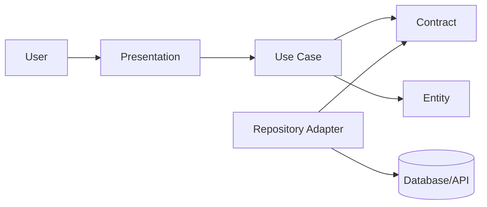

### 2. Clean Code مقابل Clean Architecture

| المحور | Clean Code | Clean Architecture |
| --- | --- | --- |
| النطاق | دالة أوClass | نظام وحدود واعتماديات |
| السؤال | هل الكود واضح؟ | هل اتجاه الاعتماد صحيح؟ |
| الأداة | أسماء ودوال صغيرة | طبقات وعقود وAdapters |
| الفشل | تعقيد محلي | تسرب Framework وتداخل المسؤوليات |
| الاختبار | Unit صغيرة | اختبار السياسات بمعزل عن التفاصيل |

> **قاعدة:** الشيفرة النظيفة لا تعوّض بنية سيئة، والبنية الجيدة لا تبرر شيفرة محلية رديئة.

### 3. Dependency Rule

الاعتماديات تتجه نحو الداخل. الطبقة الداخلية لا تعرف أسماء Frameworks أوSDKs أوSQL. الخارج يعرف الداخل وينفذ العقود التي يحددها الداخل.

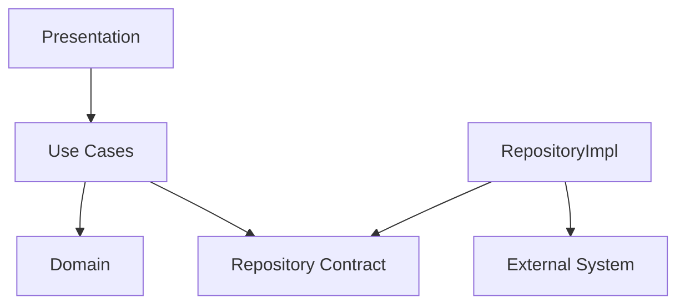

- Entity لا تستورد Controller.
- UseCase لا تستورد HTTP client.
- RepositoryImpl يستورد Contract لأنه ينفذه.
- Composition Root يعرف كل التفاصيل لأنه يربطها.
- Framework يبقى في الحافة الخارجية.

### 4. السياسات والتفاصيل

| سياسة | تفصيل |
| --- | --- |
| تسجيل مستخدم وفق قواعد النظام | POST إلى endpoint |
| حساب خصم | قراءة صف من قاعدة البيانات |
| تحديد صلاحية أمر | فحص JWT بمكتبة محددة |
| إصدار إشعار | مزود Email أوSMS |
| إدارة مخزون | Redis كCache |

### 5. Boundaries

Boundary يفصل سببين مختلفين للتغيير. إذا كان ملف يتغير بسبب متطلبات الأعمال وملف آخر بسبب SDK خارجي فهما يستحقان حدًا واضحًا. نجاح الحد يُقاس بقدرته على احتواء التغيير.

- حد بين UI وUseCase.
- حد بين UseCase وRepository.
- حد بين Entity وDTO.
- حد بين التطبيق ومزود خارجي.
- حد بين Feature وأخرى.

### 6. متى تكون البنية مبالغة؟

صفحة ثابتة أوأداة قصيرة لا تحتاج عشرات العقود. استخدم الحدود عندما توجد قواعد أعمال أوعمر طويل أومصادر بيانات متعددة أوحاجة قوية للاختبار. أضف طبقة عندما تعزل تقلبًا حقيقيًا، لا لمجرد تقليد مخطط.

## القسم الثاني: طبقات Clean Architecture

### 7. Domain

لغة النظام الداخلية: Entities وValue Objects وقواعد الأعمال والعقود.

- لا يعرف UI.
- لا يعرف JSON.
- لا يعرف قاعدة البيانات.
- يحمي invariants.

### 8. Entities

كائنات لها هوية وسلوك مستمر عبر الزمن.

- تحمي حالتها.
- تتحقق من الانتقالات.
- لا تعيد DTO.
- تستخدم Value Objects.

### 9. Value Objects

قيم تُعرف بخصائصها مثل Email وMoney.

- إنشاء صالح أوFailure.
- مساواة بالقيمة.
- غير قابلة للتعديل قدر الإمكان.
- تقلل تكرار validation.

### 10. Use Cases

هدف واحد للمستخدم أوالنظام.

- اسمها فعل واضح.
- تنظم العملية.
- لا تنشئ Infrastructure.
- تعيد Result واضحًا.

### 11. Repository Contracts

ما يحتاجه Domain من البيانات بلغة الأعمال.

- لا تكشف ORM.
- لا تعيد Data Model.
- أسماء مثل findByEmail.
- أخطاء مفهومة.

### 12. Data Layer

تنفذ Contracts وتدير Data Sources وMapping.

- إخفاء HTTP/DB.
- ترجمة الأخطاء.
- Cache policy.
- Mapping صريح.

### 13. Presentation

تستقبل input وتدير state أوprotocol ثم تستدعي UseCase.

- لا تحتوي Business Rules.
- لا تستدعي Impl مباشرة.
- تحول النتيجة للعرض.
- تدير loading/error.

### 14. Core / Shared

مشتركات مستقرة فعلًا، لا سلة مهملات.

- Result وFailure.
- Clock وIdGenerator.
- Logging contracts.
- Utilities قليلة.

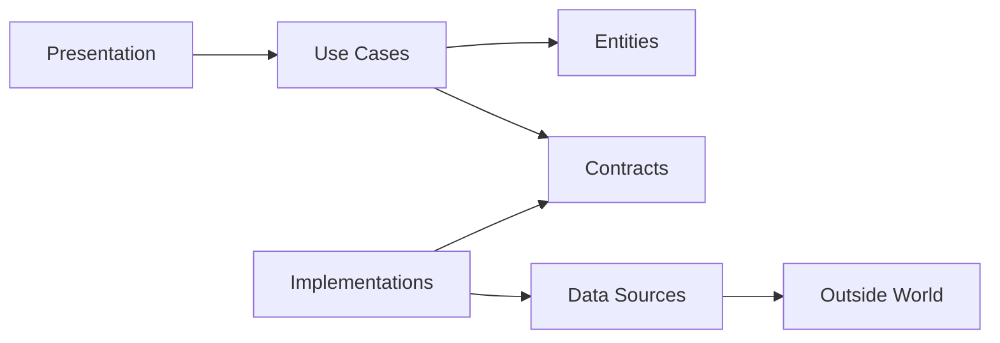

### 15. DTO وModel وEntity

| النوع | الدور | دورة التغيير |
| --- | --- | --- |
| DTO | شكل النقل الخارجي | يتغير مع API |
| Data Model | شكل التخزين | يتغير مع DB |
| Entity | قواعد الأعمال | يتغير مع المجال |

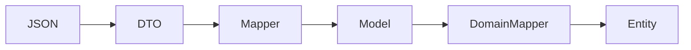

### 16. Result وFailure

| Failure | المعنى | المعالجة |
| --- | --- | --- |
| ValidationFailure | مدخل غير صالح | رسالة للحقل |
| UnauthorizedFailure | رفض مصادقة | رسالة عامة |
| ConflictFailure | تعارض حالة | 409 أوState مناسب |
| NetworkFailure | فشل مؤقت | Retry محسوب |
| UnexpectedFailure | خطأ غير متوقع | Log + رسالة عامة |

### 17. Composition Root

المكان الوحيد الذي ينشئ Adapters وRepositories وUseCases وControllers ويربطها. يمنع انتشار إنشاء التفاصيل داخل الطبقات.

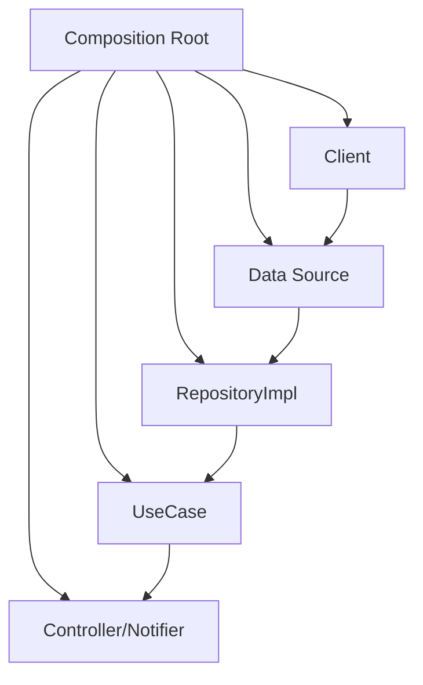

## القسم الثالث: Feature-Based Pattern

### 18. لماذا Feature-First؟

التنظيم حسب نوع الملف يجعل تعديل ميزة واحدة يتطلب التنقل بين مجلدات عامة كثيرة. التنظيم حسب Feature يجمع السياق المتغير معًا ويحافظ داخليًا على الطبقات.

| Layer-First | Feature-First |
| --- | --- |
| كل controllers معًا | Controller داخل Feature |
| توسع أفقي | توسع رأسي |
| ملكية غير واضحة | ملكية أوضح |
| حذف Feature صعب | حذفها أكثر أمانًا |

### 19. الهيكل الهجين

```text
src-or-lib/
  core/
  features/
    auth/
      domain/
      data/
      presentation/
    products/
      domain/
      data/
      presentation/
  composition/
  main
```

### 20. ملكية الملفات

| الملف | المكان | السبب |
| --- | --- | --- |
| AuthRepositoryImpl | auth/data | تفصيل خاص بالميزة |
| LoginUseCase | auth/domain | هدف أعمال |
| LoginPage/Route | auth/presentation | واجهة الميزة |
| Money | core/domain | مفهوم مشترك مستقر |
| HttpClient | core/network | بنية مشتركة |

### 21. التواصل بين Features

تجنب استيراد internals من Feature أخرى. استخدم Public API أوContract مشتركًا أوDomain Event. مثال: تعتمد orders على CurrentUserProvider بدل AuthRepositoryImpl.

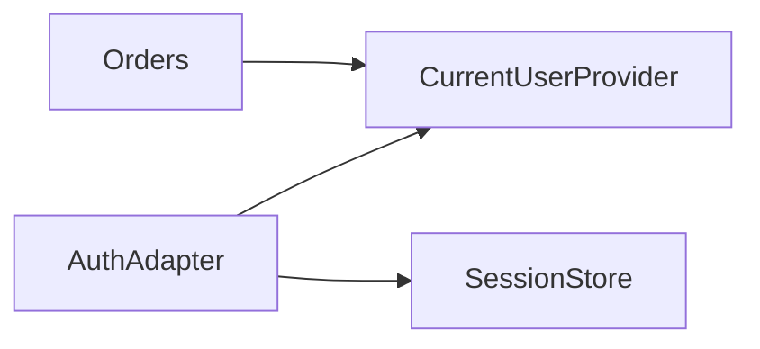

### 22. Public API للFeature

- صدّر UseCases أوFacades المطلوبة.
- لا تصدّر Models التخزين.
- لا تصدّر UI internals.
- وثق الأخطاء والتوقعات.
- استخدم Contract Tests.

### 23. متى ننقل إلى Core؟

1. هل الاسم مفهوم خارج Feature؟
2. هل السلوك واحد في كل Features؟
3. هل دورة تغييره أبطأ؟
4. هل نقله يقلل coupling؟
5. هل يمكن اختباره دون سياق خاص؟

## القسم الرابع: تدفق البيانات والاعتماديات

### 24. تدفق طلب

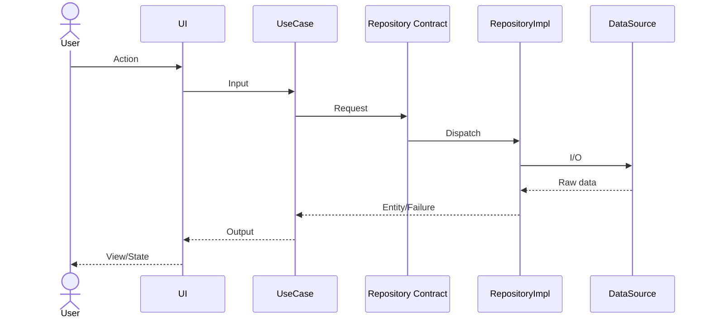

### 25. Command وQuery

| النوع | أمثلة | ملاحظة |
| --- | --- | --- |
| Command | RegisterUser, PlaceOrder | يغير الحالة |
| Query | GetProfile, ListProducts | قراءة دون أثر جانبي |
| Policy | CalculateDiscount | قانون نقي |
| Gateway | PaymentGateway | عقد خارجي |

### 26. Validation حسب المستوى

| المستوى | المسؤولية | مثال |
| --- | --- | --- |
| Presentation | صيغة الحقل | مطلوب |
| Value Object | صلاحية القيمة | Email صالح |
| UseCase | قاعدة السياق | Email غير مستخدم |
| Database | قيد نهائي | Unique index |
| External API | قيد المزود | عملة مدعومة |

### 27. Transaction Boundary

ضع المعاملة عند العملية التجارية التي يجب أن تنجح أوتفشل كوحدة. لا تجعل Controller يقرر transaction إذا كانت القاعدة تخص UseCase.

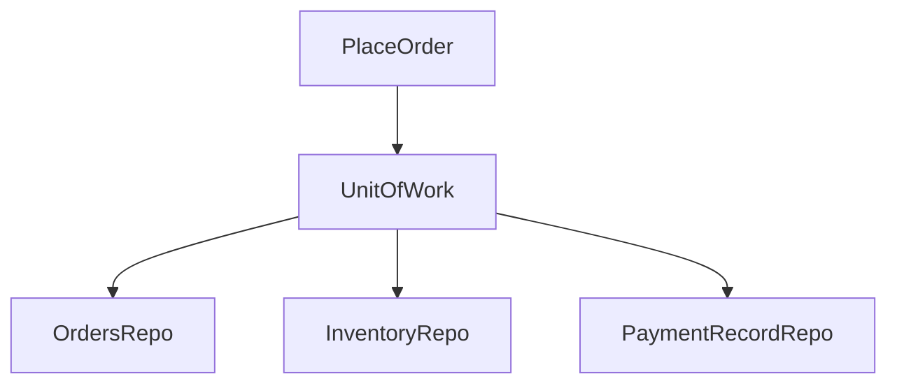

### 28. Domain Events

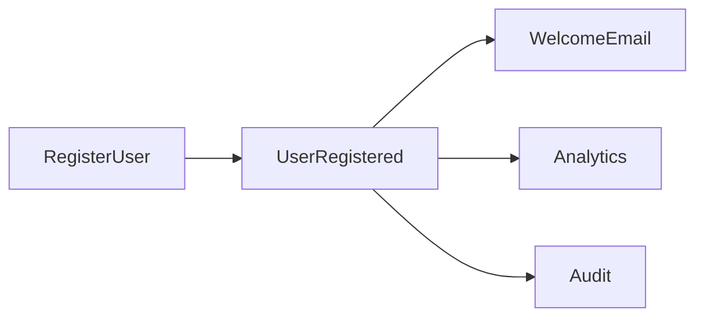

> **تحذير:** إذا كان المستهلك ضروريًا لنجاح العملية فلا تخفِه كحدث غير موثوق؛ استخدم اعتمادًا صريحًا أوOutbox.

### 29. Cache

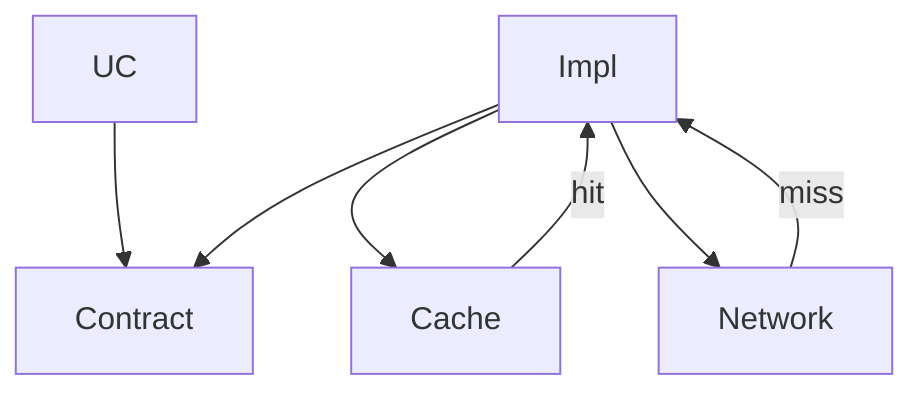

### 30. Retry وIdempotency

- Retry للعمليات الآمنة أوالمحمية بمفتاح idempotency.
- لا تعِد محاولة الدفع عشوائيًا.
- ضع backoff في Adapter.
- ميّز permanent عن transient failure.
- سجل correlation id.

## القسم الخامس: دراسة حالة متكاملة

### 31. افتراضات Dart

- Dart 3+.
- Flutter في Presentation فقط.
- Domain مكتوبة بـDart خالص.
- Riverpod مثال لإدارة الحالة.
- package:test وflutter_test.
- In-Memory storage قابل للاستبدال.

### 32. شجرة المشروع

```text
lib/
  core/
    failure.dart
    result.dart
  features/
    auth/
      domain/
        entities/user.dart
        value_objects/email.dart
        repositories/auth_repository.dart
        usecases/register_user.dart
        usecases/login_user.dart
      data/
        models/user_model.dart
        mappers/user_mapper.dart
        datasources/user_data_source.dart
        repositories/auth_repository_impl.dart
      presentation/
        providers/auth_providers.dart
        controllers/auth_controller.dart
        pages/login_page.dart
  composition/app_scope.dart
  main.dart
test/
  unit/
  contract/
  widget/
```

### 33. Failure وResult

```dart
sealed class Failure {
  const Failure(this.code, this.message, [this.details]);

  final String code;
  final String message;
  final Object? details;
}

final class ValidationFailure extends Failure {
  const ValidationFailure(String message, [Object? details])
      : super('VALIDATION', message, details);
}

final class ConflictFailure extends Failure {
  const ConflictFailure(String message, [Object? details])
      : super('CONFLICT', message, details);
}

final class UnauthorizedFailure extends Failure {
  const UnauthorizedFailure([String message = 'Invalid credentials'])
      : super('UNAUTHORIZED', message);
}

final class UnexpectedFailure extends Failure {
  const UnexpectedFailure(String message, [Object? details])
      : super('UNEXPECTED', message, details);
}
```

```dart
sealed class Result<T> {
  const Result();

  R fold<R>({
    required R Function(T value) onSuccess,
    required R Function(Failure failure) onFailure,
  }) {
    return switch (this) {
      Success<T>(:final value) => onSuccess(value),
      FailureResult<T>(:final failure) => onFailure(failure),
    };
  }
}

final class Success<T> extends Result<T> {
  const Success(this.value);
  final T value;
}

final class FailureResult<T> extends Result<T> {
  const FailureResult(this.failure);
  final Failure failure;
}
```

### 34. Email Value Object

```dart
final class Email {
  Email._(this.value);

  final String value;

  static final RegExp _pattern =
      RegExp(r'^[^\s@]+@[^\s@]+\.[^\s@]+$');

  static Result<Email> create(String? raw) {
    final value = (raw ?? '').trim().toLowerCase();

    if (!_pattern.hasMatch(value)) {
      return const FailureResult(
        ValidationFailure('Email is invalid'),
      );
    }

    return Success(Email._(value));
  }

  @override
  bool operator ==(Object other) =>
      other is Email && other.value == value;

  @override
  int get hashCode => value.hashCode;

  @override
  String toString() => value;
}
```

### 35. User Entity

```dart
final class User {
  User({
    required this.id,
    required this.email,
    required this.displayName,
    required this.passwordHash,
    required this.createdAt,
  });

  final String id;
  final Email email;
  String displayName;
  final String passwordHash;
  final DateTime createdAt;

  void rename(String nextName) {
    final value = nextName.trim();

    if (value.length < 2) {
      throw ArgumentError('Display name is too short');
    }

    displayName = value;
  }

  UserView snapshot() => (
    id: id,
    email: email.value,
    displayName: displayName,
    createdAt: createdAt,
  );
}

typedef UserView = ({
  String id,
  String email,
  String displayName,
  DateTime createdAt,
});
```

### 36. Contracts

```dart
abstract interface class AuthRepository {
  Future<User?> findByEmail(Email email);
  Future<void> save(User user);
  Future<bool> verifyPassword(
    User user,
    String plainPassword,
  );
}

abstract interface class PasswordHasher {
  Future<String> hash(String plainPassword);
  Future<bool> verify(String plainPassword, String hash);
}

abstract interface class TokenIssuer {
  Future<String> issue({
    required String subject,
    required String email,
  });
}
```

### 37. RegisterUser UseCase

```dart
final class RegisterUserInput {
  const RegisterUserInput({
    required this.email,
    required this.displayName,
    required this.password,
  });

  final String email;
  final String displayName;
  final String password;
}

final class RegisterUser {
  const RegisterUser({
    required AuthRepository authRepository,
    required PasswordHasher passwordHasher,
    required IdGenerator idGenerator,
    required Clock clock,
  })  : _authRepository = authRepository,
        _passwordHasher = passwordHasher,
        _idGenerator = idGenerator,
        _clock = clock;

  final AuthRepository _authRepository;
  final PasswordHasher _passwordHasher;
  final IdGenerator _idGenerator;
  final Clock _clock;

  Future<Result<UserView>> call(
    RegisterUserInput input,
  ) async {
    final emailResult = Email.create(input.email);

    if (emailResult case FailureResult<Email>(:final failure)) {
      return FailureResult(failure);
    }

    final email = (emailResult as Success<Email>).value;
    final displayName = input.displayName.trim();

    if (displayName.length < 2) {
      return const FailureResult(
        ValidationFailure('Display name is too short'),
      );
    }

    if (input.password.length < 10) {
      return const FailureResult(
        ValidationFailure('Password is too short'),
      );
    }

    if (await _authRepository.findByEmail(email) != null) {
      return const FailureResult(
        ConflictFailure('Email is already in use'),
      );
    }

    try {
      final user = User(
        id: _idGenerator.next(),
        email: email,
        displayName: displayName,
        passwordHash:
            await _passwordHasher.hash(input.password),
        createdAt: _clock.now(),
      );

      await _authRepository.save(user);
      return Success(user.snapshot());
    } catch (error, stackTrace) {
      return FailureResult(
        UnexpectedFailure(
          'Could not register user',
          (error: error, stackTrace: stackTrace),
        ),
      );
    }
  }
}
```

### 38. LoginUser UseCase

```dart
typedef LoginOutput = ({
  String accessToken,
  String userId,
  String email,
  String displayName,
});

final class LoginUser {
  const LoginUser({
    required AuthRepository authRepository,
    required TokenIssuer tokenIssuer,
  })  : _authRepository = authRepository,
        _tokenIssuer = tokenIssuer;

  final AuthRepository _authRepository;
  final TokenIssuer _tokenIssuer;

  Future<Result<LoginOutput>> call({
    required String email,
    required String password,
  }) async {
    final emailResult = Email.create(email);

    if (emailResult case FailureResult<Email>(:final failure)) {
      return FailureResult(failure);
    }

    final validEmail =
        (emailResult as Success<Email>).value;

    final user =
        await _authRepository.findByEmail(validEmail);

    if (user == null) {
      return const FailureResult(
        UnauthorizedFailure(),
      );
    }

    final matches =
        await _authRepository.verifyPassword(
          user,
          password,
        );

    if (!matches) {
      return const FailureResult(
        UnauthorizedFailure(),
      );
    }

    final token = await _tokenIssuer.issue(
      subject: user.id,
      email: user.email.value,
    );

    return Success((
      accessToken: token,
      userId: user.id,
      email: user.email.value,
      displayName: user.displayName,
    ));
  }
}
```

### 39. Model وMapper

```dart
final class UserModel {
  const UserModel({
    required this.id,
    required this.email,
    required this.displayName,
    required this.passwordHash,
    required this.createdAtIso,
  });

  final String id;
  final String email;
  final String displayName;
  final String passwordHash;
  final String createdAtIso;

  factory UserModel.fromJson(
    Map<String, Object?> json,
  ) {
    return UserModel(
      id: json['id']! as String,
      email: json['email']! as String,
      displayName:
          json['display_name']! as String,
      passwordHash:
          json['password_hash']! as String,
      createdAtIso:
          json['created_at']! as String,
    );
  }

  Map<String, Object?> toJson() => {
    'id': id,
    'email': email,
    'display_name': displayName,
    'password_hash': passwordHash,
    'created_at': createdAtIso,
  };
}
```

```dart
final class UserMapper {
  static User toDomain(UserModel model) {
    final result = Email.create(model.email);

    final email = switch (result) {
      Success<Email>(:final value) => value,
      _ => throw StateError('Stored email is invalid'),
    };

    return User(
      id: model.id,
      email: email,
      displayName: model.displayName,
      passwordHash: model.passwordHash,
      createdAt: DateTime.parse(model.createdAtIso),
    );
  }

  static UserModel toModel(User user) {
    return UserModel(
      id: user.id,
      email: user.email.value,
      displayName: user.displayName,
      passwordHash: user.passwordHash,
      createdAtIso:
          user.createdAt.toUtc().toIso8601String(),
    );
  }
}
```

### 40. Data Source

```dart
abstract interface class UserDataSource {
  Future<UserModel?> findByEmail(String email);
  Future<void> insert(UserModel model);
}

final class InMemoryUserDataSource
    implements UserDataSource {
  final Map<String, UserModel> _rows = {};

  @override
  Future<UserModel?> findByEmail(
    String email,
  ) async {
    for (final row in _rows.values) {
      if (row.email == email) return row;
    }
    return null;
  }

  @override
  Future<void> insert(UserModel model) async {
    if (await findByEmail(model.email) != null) {
      throw StateError('CONFLICT');
    }

    _rows[model.id] = model;
  }
}
```

### 41. AuthRepositoryImpl

```dart
final class AuthRepositoryImpl
    implements AuthRepository {
  const AuthRepositoryImpl({
    required UserDataSource userDataSource,
    required PasswordHasher passwordHasher,
  })  : _userDataSource = userDataSource,
        _passwordHasher = passwordHasher;

  final UserDataSource _userDataSource;
  final PasswordHasher _passwordHasher;

  @override
  Future<User?> findByEmail(Email email) async {
    final model =
        await _userDataSource.findByEmail(
          email.value,
        );

    return model == null
        ? null
        : UserMapper.toDomain(model);
  }

  @override
  Future<void> save(User user) {
    return _userDataSource.insert(
      UserMapper.toModel(user),
    );
  }

  @override
  Future<bool> verifyPassword(
    User user,
    String plainPassword,
  ) {
    return _passwordHasher.verify(
      plainPassword,
      user.passwordHash,
    );
  }
}
```

### 42. Riverpod Composition

```dart
final userDataSourceProvider =
    Provider<UserDataSource>(
  (ref) => InMemoryUserDataSource(),
);

final passwordHasherProvider =
    Provider<PasswordHasher>(
  (ref) => BcryptPasswordHasher(),
);

final authRepositoryProvider =
    Provider<AuthRepository>(
  (ref) => AuthRepositoryImpl(
    userDataSource:
        ref.watch(userDataSourceProvider),
    passwordHasher:
        ref.watch(passwordHasherProvider),
  ),
);

final loginUserProvider = Provider<LoginUser>(
  (ref) => LoginUser(
    authRepository:
        ref.watch(authRepositoryProvider),
    tokenIssuer:
        ref.watch(tokenIssuerProvider),
  ),
);
```

### 43. AuthController

```dart
sealed class AuthState {
  const AuthState();
}

final class AuthIdle extends AuthState {
  const AuthIdle();
}

final class AuthLoading extends AuthState {
  const AuthLoading();
}

final class Authenticated extends AuthState {
  const Authenticated(this.output);
  final LoginOutput output;
}

final class AuthError extends AuthState {
  const AuthError(this.message);
  final String message;
}

final class AuthController
    extends StateNotifier<AuthState> {
  AuthController(this._loginUser)
      : super(const AuthIdle());

  final LoginUser _loginUser;

  Future<void> login({
    required String email,
    required String password,
  }) async {
    state = const AuthLoading();

    final result = await _loginUser(
      email: email,
      password: password,
    );

    state = result.fold(
      onSuccess: Authenticated.new,
      onFailure: (failure) =>
          AuthError(failure.message),
    );
  }
}
```

### 44. LoginPage

```dart
final class LoginPage
    extends ConsumerStatefulWidget {
  const LoginPage({super.key});

  @override
  ConsumerState<LoginPage> createState() =>
      _LoginPageState();
}

final class _LoginPageState
    extends ConsumerState<LoginPage> {
  final _email = TextEditingController();
  final _password = TextEditingController();

  @override
  Widget build(BuildContext context) {
    final state =
        ref.watch(authControllerProvider);

    return Scaffold(
      appBar: AppBar(
        title: const Text('Login'),
      ),
      body: Padding(
        padding: const EdgeInsets.all(24),
        child: Column(
          children: [
            TextField(
              controller: _email,
              decoration: const InputDecoration(
                labelText: 'Email',
              ),
            ),
            TextField(
              controller: _password,
              obscureText: true,
              decoration: const InputDecoration(
                labelText: 'Password',
              ),
            ),
            FilledButton(
              onPressed: state is AuthLoading
                  ? null
                  : () => ref
                      .read(
                        authControllerProvider.notifier,
                      )
                      .login(
                        email: _email.text,
                        password: _password.text,
                      ),
              child: state is AuthLoading
                  ? const CircularProgressIndicator()
                  : const Text('Login'),
            ),
          ],
        ),
      ),
    );
  }
}
```

### 45. AppScope

```dart
final class AppScope {
  AppScope({
    required this.authRepository,
    required this.loginUser,
    required this.registerUser,
  });

  final AuthRepository authRepository;
  final LoginUser loginUser;
  final RegisterUser registerUser;

  factory AppScope.create() {
    final dataSource =
        InMemoryUserDataSource();
    final hasher =
        BcryptPasswordHasher();

    final repository =
        AuthRepositoryImpl(
      userDataSource: dataSource,
      passwordHasher: hasher,
    );

    return AppScope(
      authRepository: repository,
      loginUser: LoginUser(
        authRepository: repository,
        tokenIssuer: JwtTokenIssuer(),
      ),
      registerUser: RegisterUser(
        authRepository: repository,
        passwordHasher: hasher,
        idGenerator: UuidGenerator(),
        clock: SystemClock(),
      ),
    );
  }
}
```

### 46. Unit Test

```dart
final class FakeAuthRepository
    implements AuthRepository {
  final List<User> saved = [];

  @override
  Future<User?> findByEmail(
    Email email,
  ) async => null;

  @override
  Future<void> save(User user) async {
    saved.add(user);
  }

  @override
  Future<bool> verifyPassword(
    User user,
    String plainPassword,
  ) async => true;
}

void main() {
  test('registers a valid user', () async {
    final repository =
        FakeAuthRepository();

    final useCase = RegisterUser(
      authRepository: repository,
      passwordHasher: FakeHasher(),
      idGenerator:
          FakeIdGenerator('user-1'),
      clock: FakeClock(
        DateTime.utc(2026, 1, 1),
      ),
    );

    final result = await useCase(
      const RegisterUserInput(
        email: 'USER@example.com',
        displayName: 'Anwar',
        password: 'very-strong-password',
      ),
    );

    expect(
      result,
      isA<Success<UserView>>(),
    );
    expect(repository.saved, hasLength(1));
  });
}
```

### 47. Contract Test

```dart
void authRepositoryContract(
  String name,
  Future<AuthRepository> Function()
      createRepository,
) {
  group(name, () {
    test('missing user returns null', () async {
      final repository =
          await createRepository();

      final email = (
        Email.create('none@example.com')
            as Success<Email>
      ).value;

      expect(
        await repository.findByEmail(email),
        isNull,
      );
    });
  });
}
```

### 48. Widget Test

```dart
testWidgets(
  'disables login while loading',
  (tester) async {
    await tester.pumpWidget(
      ProviderScope(
        overrides: [
          authControllerProvider
              .overrideWith(
            (ref) => FakeAuthController(
              const AuthLoading(),
            ),
          ),
        ],
        child: const MaterialApp(
          home: LoginPage(),
        ),
      ),
    );

    final button =
        tester.widget<FilledButton>(
      find.byType(FilledButton),
    );

    expect(button.onPressed, isNull);
  },
);
```

## القسم السادس: مبادئ SOLID

### 49. نظرة عامة

| المبدأ | السؤال | الأثر |
| --- | --- | --- |
| SRP | كم سببًا لتغيير المكوّن؟ | مسؤوليات وحدود أوضح |
| OCP | هل أضيف سلوكًا دون تعديل المستقر؟ | Extensions خلف Contracts |
| LSP | هل التنفيذ قابل للاستبدال؟ | عقود صادقة |
| ISP | هل العميل يرى طرقًا لا يحتاجها؟ | واجهات صغيرة |
| DIP | هل السياسة تعتمد على التفاصيل؟ | اعتماد على Abstractions |

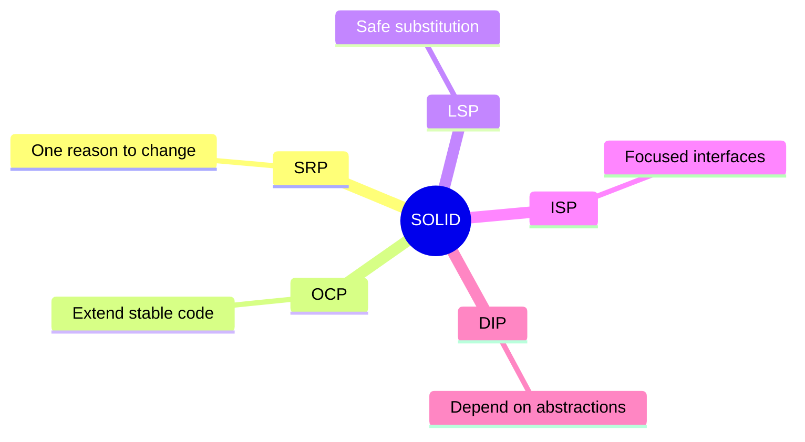

### 50. SRP — Single Responsibility Principle

في Flutter يظهر خرق SRP عندما تدير Widget الواجهة والشبكة والتخزين والقواعد. افصل Controller عن UseCase وعن Data Source.

```dart
class RegisterPageState
    extends State<RegisterPage> {
  Future<void> register() async {
    if (!emailController.text.contains('@')) {
      setState(() => error = 'Invalid email');
      return;
    }

    final response = await Dio().post(
      '/users',
      data: {
        'email': emailController.text,
        'password': passwordController.text,
      },
    );

    final prefs =
        await SharedPreferences.getInstance();

    await prefs.setString(
      'token',
      response.data['token'] as String,
    );

    Navigator.of(context)
        .pushReplacementNamed('/home');
  }
}
```

- Widget تتغير مع UI.
- تتغير مع API.
- تتغير مع storage.
- تتغير مع validation.
- يصعب اختبارها دون Flutter binding.

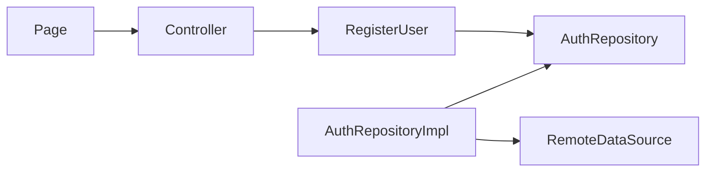

```dart
final class RegisterController
    extends StateNotifier<RegisterState> {
  RegisterController(this._registerUser)
      : super(const RegisterIdle());

  final RegisterUser _registerUser;

  Future<void> submit(
    RegisterUserInput input,
  ) async {
    state = const RegisterLoading();

    final result =
        await _registerUser(input);

    state = result.fold(
      onSuccess: RegisterSuccess.new,
      onFailure: (failure) =>
          RegisterError(failure.message),
    );
  }
}
```

### 51. OCP — Open/Closed Principle

```dart
abstract interface class NotificationSender {
  Future<void> send(
    Notification notification,
  );
}

final class EmailNotificationSender
    implements NotificationSender {
  const EmailNotificationSender(this._client);

  final EmailClient _client;

  @override
  Future<void> send(
    Notification notification,
  ) {
    return _client.send(
      to: notification.target,
      subject: notification.subject,
      body: notification.body,
    );
  }
}

final class PushNotificationSender
    implements NotificationSender {
  const PushNotificationSender(this._client);

  final PushClient _client;

  @override
  Future<void> send(
    Notification notification,
  ) {
    return _client.push(
      deviceToken: notification.target,
      message: notification.body,
    );
  }
}
```

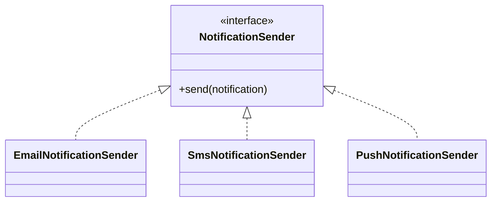

> **Dart 3:** استخدم sealed لإغلاق مجموعة الأنواع عمدًا، وabstract interface class لفتح التنفيذ.

### 52. LSP — Liskov Substitution Principle

```dart
// خرق LSP
final class ReadOnlyRepository
    implements AuthRepository {
  @override
  Future<void> save(User user) {
    throw UnsupportedError('read only');
  }

  // بقية methods...
}
```

```dart
abstract interface class UserReader {
  Future<User?> findByEmail(Email email);
}

abstract interface class UserWriter {
  Future<void> save(User user);
}

final class ReadOnlyRepository
    implements UserReader {
  @override
  Future<User?> findByEmail(
    Email email,
  ) async {
    return null;
  }
}
```

```dart
void userReaderContract(
  String name,
  Future<UserReader> Function()
      createReader,
) {
  group(name, () {
    test(
      'missing user returns null',
      () async {
        final reader =
            await createReader();

        final email = (
          Email.create('none@example.com')
              as Success<Email>
        ).value;

        expect(
          await reader.findByEmail(email),
          isNull,
        );
      },
    );
  });
}
```

- حافظ على النتيجة ومعناها.
- لا تضف استثناءات غير موثقة.
- لا تشدد شروط الإدخال.
- حافظ على الآثار الجانبية.
- طبق Contract Test على كل implementation.

### 53. ISP — Interface Segregation Principle

```dart
abstract interface class UserReader {
  Future<User?> findById(String id);
  Future<User?> findByEmail(Email email);
}

abstract interface class UserWriter {
  Future<void> save(User user);
}

abstract interface class ProfileReader {
  Future<Profile> getProfile(
    String userId,
  );
}

abstract interface class ProfileUpdater {
  Future<void> updateProfile(
    Profile profile,
  );
}
```

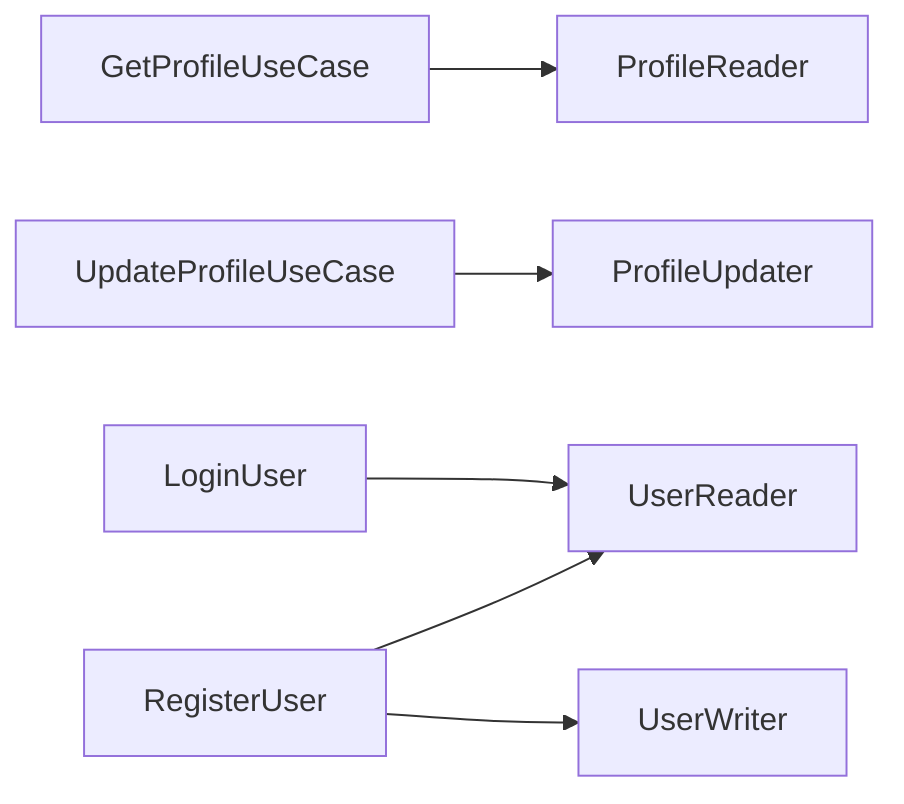

```dart
typedef UpdateProfileInput = ({
  String userId,
  String displayName,
  String? bio,
});

abstract interface class ProfileUpdater {
  Future<Result<Profile>> update(
    UpdateProfileInput input,
  );
}
```

### 54. DIP — Dependency Inversion Principle

```dart
// خطأ
final class LoginUser {
  LoginUser()
      : _repository =
          DioAuthRepository(Dio());

  final DioAuthRepository _repository;
}
```

```dart
// أفضل
final class LoginUser {
  const LoginUser(this._repository);

  final AuthRepository _repository;
}

final authRepositoryProvider =
    Provider<AuthRepository>((ref) {
  return AuthRepositoryImpl(
    remote: ref.watch(
      authRemoteDataSourceProvider,
    ),
    passwordHasher: ref.watch(
      passwordHasherProvider,
    ),
  );
});
```

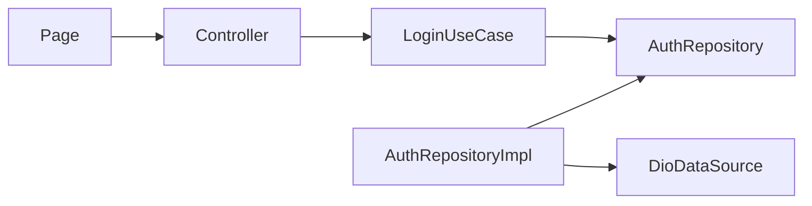

- لا تستورد Dio داخل Domain.
- لا تنشئ Impl داخل UseCase.
- استخدم Provider override للاختبار.
- اجعل lifecycle قرار composition.
- أبقِ Domain قابلة للتشغيل دون Flutter.

## القسم السابع: الاختبارات والجودة

### 55. هرم الاختبارات

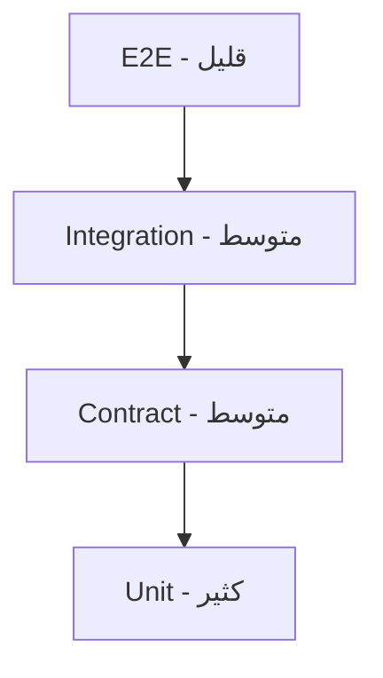

| النوع | ما يختبره | السرعة | مثال |
| --- | --- | --- | --- |
| Unit | Entity/UseCase | سريع | حساب أوتسجيل |
| Contract | سلوك كل implementation | سريع/متوسط | Repository |
| Integration | Adapter مع DB/API | متوسط | Mapping وSQL |
| Presentation | UI/HTTP adapter | متوسط | state/status |
| E2E | تدفق كامل | بطيء | login ثم home |

### 56. Mocks وFakes

- استخدم Fake بسيطًا للعقود الداخلية.
- استخدم Mock لتفاعل مهم لا لكل call.
- لا تعمل Mock لـEntity.
- اختبر Adapters الحقيقية بـIntegration.
- استخدم Contract Tests لمنع اختلاف Fake عن الإنتاج.

### 57. خصائص الاختبار الجيد

1. يصف سلوكًا لا implementation.
2. يفشل لسبب واحد.
3. لا يعتمد على ترتيب.
4. يضبط الوقت والـIDs.
5. يختبر النجاح والفشل.
6. لا يكرر منطق الإنتاج.

### 58. Architecture Review

- هل Domain تستورد Framework؟
- هل Repository يعيد DTO؟
- هل UseCase تنشئ concrete dependency؟
- هل يوجد cross-feature import عميق؟
- هل failure مترجمة عند الحد؟
- هل العقد صغير وصادق؟
- هل Contract Tests موجودة؟
- هل Composition Root واضح؟

### 59. Metrics

| القياس | يكشف | التحذير |
| --- | --- | --- |
| Coupling | تسرب الحدود | لا تفسره منفردًا |
| حجم الملفات | تضخم محتمل | الطول ليس خطأ دائمًا |
| زمن الاختبار | Infrastructure زائد | Integration قد تكون ضرورية |
| Coverage | مساحات بلا اختبار | لا تقيس جودة assertions |
| Co-change | حدود غير مناسبة | يحتاج تاريخ Git |

### 60. Fitness Functions

```text
قواعد آلية مقترحة:
- domain/** لا يستورد data/**
- domain/** لا يستورد presentation/**
- domain/** لا يستورد framework packages
- presentation/** لا يستورد *RepositoryImpl
- feature A لا يستورد internals من feature B
```

### 61. Definition of Done

1. UseCase موثقة.
2. Domain بلا Framework.
3. Contracts في الداخل.
4. Mapping صريح.
5. Unit tests.
6. Contract tests.
7. Integration tests للحدود.
8. Security review.
9. Observability.
10. ADR للقرار طويل الأثر.

## القسم الثامن: الأمن والأداء والمراقبة

### 62. Security Boundaries

- لا تعيد passwordHash.
- authorization داخل UseCase أوPolicy.
- rate limiting في Delivery Adapter.
- لا تسجل tokens.
- ترجم auth failures إلى رسالة عامة.
- اعتبر external IDs غير موثوقة.
- استخدم مكتبات hashing موثوقة.
- افصل secrets عن source code.

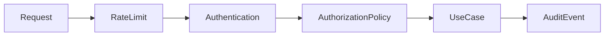

### 63. إدارة الأسرار

- الأسرار لا تدخل Git.
- Configuration تقرأ في Composition Root.
- Domain لا تقرأ environment.
- دوّر المفاتيح دون تعديل UseCases.
- افصل test secrets عن production.
- سجّل اسم النسخة لا السر.

### 64. الأداء دون كسر الحدود

| المشكلة | المكان | الحل |
| --- | --- | --- |
| N+1 | RepositoryImpl | Batch/Join |
| JSON ضخم | DTO/Presenter | Projection/Pagination |
| حساب مكلف | Domain Service | Memoization |
| شبكة بطيئة | Data Source | Timeout/Retry |
| قراءة متكررة | Data Layer | Cache |
| UI يعاد بناؤها | Presentation | State slicing |

### 65. Logging وTracing

- مرر correlationId.
- Adapters تضيف التفاصيل التقنية.
- لا تخلط logging مع result.
- استخدم مستويات ثابتة.
- أخفِ PII.
- اربط trace بالحدث التجاري.

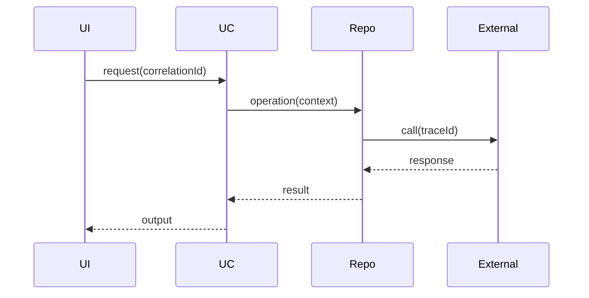

### 66. Resilience

- Timeout لكل اتصال.
- Circuit Breaker للفشل المتكرر.
- Retry مع backoff وjitter.
- Bulkhead لعزل الموارد.
- Fallback صحيح تجاريًا فقط.
- Outbox للأحداث المهمة.

## القسم التاسع: الهجرة من مشروع تقليدي

### 67. Strangler Pattern

لا تعِد كتابة المشروع دفعة واحدة. ضع Facade أمام التنفيذ القديم، ثم انقل Feature أوUseCase تدريجيًا خلف Contract جديد.

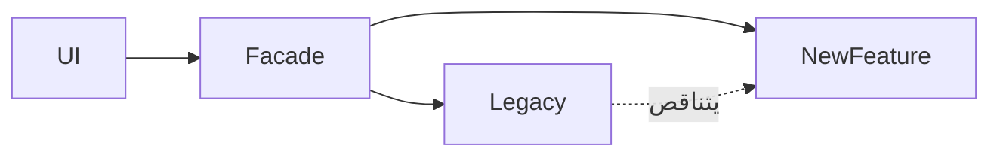

### 68. خطوات الهجرة

1. ارسم التدفق الحالي.
2. اكتب characterization tests.
3. استخرج UseCase.
4. أنشئ Contract.
5. غلّف القديم في Adapter.
6. انقل Mapping.
7. أنشئ Composition Root.
8. أضف implementation جديدًا.
9. حوّل traffic تدريجيًا.
10. احذف المسار القديم.

### 69. Characterization Tests

تثبت السلوك الحالي أثناء الاستخراج. بعد الاستقرار حوّلها إلى اختبارات سلوكية، ولا تجعلها تحفظ bugs إلى الأبد.

### 70. إشارات حدود خاطئة

- Domain تستورد Framework.
- Core سلة helpers.
- كل اختبار يحتاج DB.
- Feature تستورد internals لأخرى.
- Repository تعيد Models خام.
- UseCase تمرر request/response.
- Composition موزعة في UI.
- واجهة واحدة ضخمة.

### 71. خطة 30 يومًا

| الأسبوع | الهدف | المخرج |
| --- | --- | --- |
| 1 | خريطة وتغطية حالية | Diagram + risks |
| 2 | استخراج Feature | Domain + Contract + Adapter |
| 3 | Tests + Composition | CI rules |
| 4 | تعميم وتوثيق | Playbook + ADRs |

### 72. Architecture Decision Records

#### ADR-001: Feature-First

**الحالة:** مقبول

**السياق:** المجلدات العامة ضخمة.

**القرار:** التنظيم حسب Feature مع طبقات داخلية.

**الإيجابيات:** حدود أوضح واختبارات أسهل.

**المقايضات:** ملفات وربط إضافي يحتاجان انضباطًا.

#### ADR-002: Domain بلا Framework

**الحالة:** مقبول

**السياق:** الاختبارات بطيئة.

**القرار:** منع imports خارجية في Domain.

**الإيجابيات:** حدود أوضح واختبارات أسهل.

**المقايضات:** ملفات وربط إضافي يحتاجان انضباطًا.

#### ADR-003: Result

**الحالة:** مقبول

**السياق:** الاستثناءات غير موثقة.

**القرار:** Result للأخطاء المتوقعة.

**الإيجابيات:** حدود أوضح واختبارات أسهل.

**المقايضات:** ملفات وربط إضافي يحتاجان انضباطًا.

#### ADR-004: Contract Tests

**الحالة:** مقبول

**السياق:** التنفيذات مختلفة.

**القرار:** Suite مشتركة لكل implementation.

**الإيجابيات:** حدود أوضح واختبارات أسهل.

**المقايضات:** ملفات وربط إضافي يحتاجان انضباطًا.

#### ADR-005: Composition Root

**الحالة:** مقبول

**السياق:** new موزعة.

**القرار:** ربط مركزي.

**الإيجابيات:** حدود أوضح واختبارات أسهل.

**المقايضات:** ملفات وربط إضافي يحتاجان انضباطًا.

#### ADR-006: Domain Events

**الحالة:** مقبول

**السياق:** عمليات ثانوية مترابطة.

**القرار:** Events بعد نجاح UseCase.

**الإيجابيات:** حدود أوضح واختبارات أسهل.

**المقايضات:** ملفات وربط إضافي يحتاجان انضباطًا.

#### ADR-007: DTO خارج Domain

**الحالة:** مقبول

**السياق:** API تكسر Entities.

**القرار:** Mapping صريح.

**الإيجابيات:** حدود أوضح واختبارات أسهل.

**المقايضات:** ملفات وربط إضافي يحتاجان انضباطًا.

#### ADR-008: Interfaces صغيرة

**الحالة:** مقبول

**السياق:** Mocks معقدة.

**القرار:** تقسيم حسب القدرات.

**الإيجابيات:** حدود أوضح واختبارات أسهل.

**المقايضات:** ملفات وربط إضافي يحتاجان انضباطًا.

#### ADR-009: Cache في Data

**الحالة:** مقبول

**السياق:** UseCases تعرف Redis.

**القرار:** إخفاء cache خلف Repository.

**الإيجابيات:** حدود أوضح واختبارات أسهل.

**المقايضات:** ملفات وربط إضافي يحتاجان انضباطًا.

#### ADR-010: Clock وIDs

**الحالة:** مقبول

**السياق:** اختبارات غير حتمية.

**القرار:** حقن Clock وIdGenerator.

**الإيجابيات:** حدود أوضح واختبارات أسهل.

**المقايضات:** ملفات وربط إضافي يحتاجان انضباطًا.

### 73. كتالوج Anti-Patterns

#### 1. God Controller

- **العرض:** HTTP وSQL وقواعد في ملف واحد.
- **المعالجة:** استخرج UseCase وRepository.
- **اختبار:** أثبت أن تبديل التفصيل لا يغير السياسة.
- **مراجعة:** افحص اتجاه import وحدود Feature.

#### 2. Anemic Domain

- **العرض:** Entities مجرد حقول.
- **المعالجة:** انقل invariants إلى Domain.
- **اختبار:** أثبت أن تبديل التفصيل لا يغير السياسة.
- **مراجعة:** افحص اتجاه import وحدود Feature.

#### 3. Framework Leakage

- **العرض:** Domain تستورد Framework.
- **المعالجة:** استخدم Adapter.
- **اختبار:** أثبت أن تبديل التفصيل لا يغير السياسة.
- **مراجعة:** افحص اتجاه import وحدود Feature.

#### 4. Generic Repository

- **العرض:** CRUD عام لكل شيء.
- **المعالجة:** عقد بلغة الأعمال.
- **اختبار:** أثبت أن تبديل التفصيل لا يغير السياسة.
- **مراجعة:** افحص اتجاه import وحدود Feature.

#### 5. Fat Interface

- **العرض:** طرق كثيرة غير لازمة.
- **المعالجة:** طبّق ISP.
- **اختبار:** أثبت أن تبديل التفصيل لا يغير السياسة.
- **مراجعة:** افحص اتجاه import وحدود Feature.

#### 6. Service Locator

- **العرض:** dependencies من global.
- **المعالجة:** constructor injection.
- **اختبار:** أثبت أن تبديل التفصيل لا يغير السياسة.
- **مراجعة:** افحص اتجاه import وحدود Feature.

#### 7. Hidden I/O

- **العرض:** getter ينفذ شبكة.
- **المعالجة:** اجعل I/O صريحًا.
- **اختبار:** أثبت أن تبديل التفصيل لا يغير السياسة.
- **مراجعة:** افحص اتجاه import وحدود Feature.

#### 8. DTO Everywhere

- **العرض:** DTO تصل إلى Domain/UI.
- **المعالجة:** Mapping عند الحدود.
- **اختبار:** أثبت أن تبديل التفصيل لا يغير السياسة.
- **مراجعة:** افحص اتجاه import وحدود Feature.

#### 9. Shared Dump

- **العرض:** كل شيء في shared.
- **المعالجة:** معيار صارم لـCore.
- **اختبار:** أثبت أن تبديل التفصيل لا يغير السياسة.
- **مراجعة:** افحص اتجاه import وحدود Feature.

#### 10. Cross-Import

- **العرض:** Features تعتمد على internals.
- **المعالجة:** Public API.
- **اختبار:** أثبت أن تبديل التفصيل لا يغير السياسة.
- **مراجعة:** افحص اتجاه import وحدود Feature.

#### 11. Exception Soup

- **العرض:** أخطاء SDK تصعد.
- **المعالجة:** ترجمة Failure.
- **اختبار:** أثبت أن تبديل التفصيل لا يغير السياسة.
- **مراجعة:** افحص اتجاه import وحدود Feature.

#### 12. Boolean Blindness

- **العرض:** booleans كثيرة.
- **المعالجة:** enum/strategy.
- **اختبار:** أثبت أن تبديل التفصيل لا يغير السياسة.
- **مراجعة:** افحص اتجاه import وحدود Feature.

#### 13. Temporal Coupling

- **العرض:** ترتيب calls مخفي.
- **المعالجة:** UseCase واحدة.
- **اختبار:** أثبت أن تبديل التفصيل لا يغير السياسة.
- **مراجعة:** افحص اتجاه import وحدود Feature.

#### 14. Primitive Obsession

- **العرض:** Email مجرد String.
- **المعالجة:** Value Object.
- **اختبار:** أثبت أن تبديل التفصيل لا يغير السياسة.
- **مراجعة:** افحص اتجاه import وحدود Feature.

#### 15. Shotgun Surgery

- **العرض:** تعديل عشرات الملفات.
- **المعالجة:** راجع Boundary.
- **اختبار:** أثبت أن تبديل التفصيل لا يغير السياسة.
- **مراجعة:** افحص اتجاه import وحدود Feature.

#### 16. Golden Hammer

- **العرض:** Repository لكل شيء.
- **المعالجة:** Domain Service عند الحاجة.
- **اختبار:** أثبت أن تبديل التفصيل لا يغير السياسة.
- **مراجعة:** افحص اتجاه import وحدود Feature.

#### 17. Over-Abstraction

- **العرض:** Interface لكل class.
- **المعالجة:** احذف غير المفيد.
- **اختبار:** أثبت أن تبديل التفصيل لا يغير السياسة.
- **مراجعة:** افحص اتجاه import وحدود Feature.

#### 18. Under-Abstraction

- **العرض:** UseCase تعتمد على SDK.
- **المعالجة:** Gateway Contract.
- **اختبار:** أثبت أن تبديل التفصيل لا يغير السياسة.
- **مراجعة:** افحص اتجاه import وحدود Feature.

#### 19. Mixed Validation

- **العرض:** قواعد مكررة.
- **المعالجة:** وزع حسب المستوى.
- **اختبار:** أثبت أن تبديل التفصيل لا يغير السياسة.
- **مراجعة:** افحص اتجاه import وحدود Feature.

#### 20. Leaky Cache

- **العرض:** UseCase تعرف cache keys.
- **المعالجة:** Data policy.
- **اختبار:** أثبت أن تبديل التفصيل لا يغير السياسة.
- **مراجعة:** افحص اتجاه import وحدود Feature.

#### 21. Test-only Design

- **العرض:** API غريبة للمocks.
- **المعالجة:** صمم للعقد الحقيقي.
- **اختبار:** أثبت أن تبديل التفصيل لا يغير السياسة.
- **مراجعة:** افحص اتجاه import وحدود Feature.

#### 22. Massive Mapper

- **العرض:** Mapper فيه business rules.
- **المعالجة:** انقلها للDomain.
- **اختبار:** أثبت أن تبديل التفصيل لا يغير السياسة.
- **مراجعة:** افحص اتجاه import وحدود Feature.

#### 23. Circular Dependency

- **العرض:** Features دائرية.
- **المعالجة:** Event/Facade.
- **اختبار:** أثبت أن تبديل التفصيل لا يغير السياسة.
- **مراجعة:** افحص اتجاه import وحدود Feature.

#### 24. Global Mutable State

- **العرض:** session عالمية.
- **المعالجة:** Scope واضح.
- **اختبار:** أثبت أن تبديل التفصيل لا يغير السياسة.
- **مراجعة:** افحص اتجاه import وحدود Feature.

#### 25. Retry Everywhere

- **العرض:** retry في كل طبقة.
- **المعالجة:** Policy واحدة.
- **اختبار:** أثبت أن تبديل التفصيل لا يغير السياسة.
- **مراجعة:** افحص اتجاه import وحدود Feature.

#### 26. Silent Failure

- **العرض:** كل خطأ يصبح null.
- **المعالجة:** ميّز failures.
- **اختبار:** أثبت أن تبديل التفصيل لا يغير السياسة.
- **مراجعة:** افحص اتجاه import وحدود Feature.

#### 27. Inconsistent Result

- **العرض:** أشكال نتائج عشوائية.
- **المعالجة:** Convention موحدة.
- **اختبار:** أثبت أن تبديل التفصيل لا يغير السياسة.
- **مراجعة:** افحص اتجاه import وحدود Feature.

#### 28. Infrastructure Entity

- **العرض:** ORM model هي Entity.
- **المعالجة:** افصل mapping.
- **اختبار:** أثبت أن تبديل التفصيل لا يغير السياسة.
- **مراجعة:** افحص اتجاه import وحدود Feature.

#### 29. Route-driven Domain

- **العرض:** UseCases باسم endpoint.
- **المعالجة:** لغة الأعمال.
- **اختبار:** أثبت أن تبديل التفصيل لا يغير السياسة.
- **مراجعة:** افحص اتجاه import وحدود Feature.

#### 30. Premature Microservices

- **العرض:** شبكة قبل الحدود.
- **المعالجة:** Modular monolith.
- **اختبار:** أثبت أن تبديل التفصيل لا يغير السياسة.
- **مراجعة:** افحص اتجاه import وحدود Feature.

## القسم العاشر: القوائم والقاموس والتمارين

### 74. Checklist إنشاء Feature

- [ ] 01. هدف تجاري بجملة.
- [ ] 02. Actor أوtrigger.
- [ ] 03. UseCase input مستقل عن protocol.
- [ ] 04. Entities وValue Objects.
- [ ] 05. Invariants.
- [ ] 06. Failures المتوقعة.
- [ ] 07. Contract حسب الحاجة.
- [ ] 08. Implementation في Data.
- [ ] 09. Mapper صريح.
- [ ] 10. Transaction boundary.
- [ ] 11. Authorization policy.
- [ ] 12. Idempotency.
- [ ] 13. Timeout.
- [ ] 14. Cache policy.
- [ ] 15. Unit tests.
- [ ] 16. Contract tests.
- [ ] 17. Integration tests.
- [ ] 18. Presentation test.
- [ ] 19. Logging.
- [ ] 20. Tracing.
- [ ] 21. Security review.
- [ ] 22. ADR.
- [ ] 23. Import review.
- [ ] 24. SOLID review.
- [ ] 25. Deletion path.

### 75. Checklist SOLID

#### SRP

- [ ] سبب واحد للتغيير؟
- [ ] يخلط protocol وbusiness؟
- [ ] اختباره يحتاج إعدادًا زائدًا؟
- [ ] الاسم يصف دورًا واحدًا؟
- [ ] imports من محاور كثيرة؟

#### OCP

- [ ] إضافة مزود تعدل المستقر؟
- [ ] if/else تنمو؟
- [ ] محور التوسع معروف؟
- [ ] Strategy مناسبة؟
- [ ] abstraction تبرر كلفتها؟

#### LSP

- [ ] التنفيذ يفي بالعقد؟
- [ ] الأخطاء متسقة؟
- [ ] null بنفس المعنى؟
- [ ] الشروط متسقة؟
- [ ] Contract tests؟

#### ISP

- [ ] طرق غير مستخدمة؟
- [ ] Fake methods فارغة؟
- [ ] عمليات غير مترابطة؟
- [ ] تقسيم capabilities؟
- [ ] العقود مفهومة؟

#### DIP

- [ ] new داخل UseCase؟
- [ ] Domain تستورد SDK؟
- [ ] العقد يملكه الداخل؟
- [ ] Composition واضح؟
- [ ] Fake سهل؟

### 76. قاموس المصطلحات

- **Abstraction:** سلوك مطلوب دون تنفيذ محدد.
- **Adapter:** مترجم بين النظام والخارج.
- **Boundary:** حد يفصل أسباب تغيير.
- **Business Rule:** قاعدة مجال.
- **Cache:** نسخة مؤقتة.
- **Command:** نية تغيير حالة.
- **Composition Root:** مكان الربط.
- **Contract:** اتفاق سلوكي.
- **Controller:** Adapter للطلب.
- **Coupling:** درجة اعتماد.
- **CQRS:** فصل القراءة والكتابة.
- **Data Source:** اتصال مباشر بالخارج.
- **Dependency Injection:** تزويد الاعتماد من الخارج.
- **Domain:** قواعد ونموذج المجال.
- **Domain Event:** حقيقة حدثت.
- **DTO:** شكل نقل.
- **Entity:** كائن له هوية.
- **Facade:** واجهة مبسطة.
- **Failure:** خطأ متوقع مترجم.
- **Feature:** وحدة أعمال رأسية.
- **Gateway:** عقد لنظام خارجي.
- **Idempotency:** إعادة آمنة.
- **Infrastructure:** تفاصيل تقنية.
- **Invariant:** شرط دائم.
- **Mapper:** تحويل أشكال.
- **Model:** تمثيل طبقة.
- **Policy:** قرار أعمال.
- **Presenter:** تحويل output للعرض.
- **Public API:** سطح مسموح.
- **Query:** قراءة دون أثر.
- **Repository:** وصول إلى Domain objects.
- **Result:** نجاح أوFailure.
- **Strategy:** خوارزمية قابلة للتبديل.
- **Transaction:** تغييرات ذرية.
- **UseCase:** هدف مستخدم.
- **Value Object:** قيمة بلا هوية.
- **ViewModel:** بيانات عرض.
- **Unit of Work:** تنسيق transaction.
- **Outbox:** ضمان أحداث بعد commit.
- **Circuit Breaker:** إيقاف مؤقت عند الفشل.
- **Bulkhead:** عزل الموارد.
- **Correlation ID:** ربط سجلات الطلب.
- **Contract Test:** Suite لكل implementations.
- **Characterization Test:** تثبيت السلوك الحالي.
- **Fitness Function:** قاعدة معمارية آلية.
- **Modular Monolith:** تطبيق واحد بوحدات.
- **Anti-Corruption Layer:** عزل نموذج خارجي.
- **Read Model:** نموذج مخصص للقراءة.
- **Aggregate:** حد اتساق Domain.
- **Port:** اسم آخر للعقد الحدّي.

### 77. تمارين

#### تمرين 1: Google Login

- **المطلوب:** أضف Gateway دون تعديل UseCase.
- **المخرجات:** Mermaid + Contract + UseCase + tests.
- **السؤال:** ما التفصيل القابل للتبديل؟
- **المراجعة:** ما مبادئ SOLID ذات الصلة؟

#### تمرين 2: Profile Cache

- **المطلوب:** أخفِ cache خلف Repository.
- **المخرجات:** Mermaid + Contract + UseCase + tests.
- **السؤال:** ما التفصيل القابل للتبديل؟
- **المراجعة:** ما مبادئ SOLID ذات الصلة؟

#### تمرين 3: Read-only Repository

- **المطلوب:** لا تخرق LSP.
- **المخرجات:** Mermaid + Contract + UseCase + tests.
- **السؤال:** ما التفصيل القابل للتبديل؟
- **المراجعة:** ما مبادئ SOLID ذات الصلة؟

#### تمرين 4: GraphQL

- **المطلوب:** بدّل Delivery Adapter.
- **المخرجات:** Mermaid + Contract + UseCase + tests.
- **السؤال:** ما التفصيل القابل للتبديل؟
- **المراجعة:** ما مبادئ SOLID ذات الصلة؟

#### تمرين 5: Payment Provider

- **المطلوب:** طبّق OCP.
- **المخرجات:** Mermaid + Contract + UseCase + tests.
- **السؤال:** ما التفصيل القابل للتبديل؟
- **المراجعة:** ما مبادئ SOLID ذات الصلة؟

#### تمرين 6: Authorization

- **المطلوب:** Policy مستقلة.
- **المخرجات:** Mermaid + Contract + UseCase + tests.
- **السؤال:** ما التفصيل القابل للتبديل؟
- **المراجعة:** ما مبادئ SOLID ذات الصلة؟

#### تمرين 7: Split Repository

- **المطلوب:** طبّق ISP.
- **المخرجات:** Mermaid + Contract + UseCase + tests.
- **السؤال:** ما التفصيل القابل للتبديل؟
- **المراجعة:** ما مبادئ SOLID ذات الصلة؟

#### تمرين 8: Offline-first

- **المطلوب:** نسق Local/Remote.
- **المخرجات:** Mermaid + Contract + UseCase + tests.
- **السؤال:** ما التفصيل القابل للتبديل؟
- **المراجعة:** ما مبادئ SOLID ذات الصلة؟

#### تمرين 9: OrderPlaced

- **المطلوب:** Domain Event.
- **المخرجات:** Mermaid + Contract + UseCase + tests.
- **السؤال:** ما التفصيل القابل للتبديل؟
- **المراجعة:** ما مبادئ SOLID ذات الصلة؟

#### تمرين 10: Legacy Adapter

- **المطلوب:** Strangler migration.
- **المخرجات:** Mermaid + Contract + UseCase + tests.
- **السؤال:** ما التفصيل القابل للتبديل؟
- **المراجعة:** ما مبادئ SOLID ذات الصلة؟

#### تمرين 11: Cancel Order

- **المطلوب:** State transitions.
- **المخرجات:** Mermaid + Contract + UseCase + tests.
- **السؤال:** ما التفصيل القابل للتبديل؟
- **المراجعة:** ما مبادئ SOLID ذات الصلة؟

#### تمرين 12: Money

- **المطلوب:** Value Object.
- **المخرجات:** Mermaid + Contract + UseCase + tests.
- **السؤال:** ما التفصيل القابل للتبديل؟
- **المراجعة:** ما مبادئ SOLID ذات الصلة؟

#### تمرين 13: Pagination

- **المطلوب:** افصل HTTP query.
- **المخرجات:** Mermaid + Contract + UseCase + tests.
- **السؤال:** ما التفصيل القابل للتبديل؟
- **المراجعة:** ما مبادئ SOLID ذات الصلة؟

#### تمرين 14: Avatar

- **المطلوب:** AvatarStore contract.
- **المخرجات:** Mermaid + Contract + UseCase + tests.
- **السؤال:** ما التفصيل القابل للتبديل؟
- **المراجعة:** ما مبادئ SOLID ذات الصلة؟

#### تمرين 15: Clock

- **المطلوب:** FakeClock.
- **المخرجات:** Mermaid + Contract + UseCase + tests.
- **السؤال:** ما التفصيل القابل للتبديل؟
- **المراجعة:** ما مبادئ SOLID ذات الصلة؟

#### تمرين 16: Multi-currency

- **المطلوب:** ExchangeRateGateway.
- **المخرجات:** Mermaid + Contract + UseCase + tests.
- **السؤال:** ما التفصيل القابل للتبديل؟
- **المراجعة:** ما مبادئ SOLID ذات الصلة؟

#### تمرين 17: Retry Payment

- **المطلوب:** Idempotency.
- **المخرجات:** Mermaid + Contract + UseCase + tests.
- **السؤال:** ما التفصيل القابل للتبديل؟
- **المراجعة:** ما مبادئ SOLID ذات الصلة؟

#### تمرين 18: Audit

- **المطلوب:** Event أوPort.
- **المخرجات:** Mermaid + Contract + UseCase + tests.
- **السؤال:** ما التفصيل القابل للتبديل؟
- **المراجعة:** ما مبادئ SOLID ذات الصلة؟

#### تمرين 19: Product Search

- **المطلوب:** Query Service.
- **المخرجات:** Mermaid + Contract + UseCase + tests.
- **السؤال:** ما التفصيل القابل للتبديل؟
- **المراجعة:** ما مبادئ SOLID ذات الصلة؟

#### تمرين 20: Analytics

- **المطلوب:** Handler منفصل.
- **المخرجات:** Mermaid + Contract + UseCase + tests.
- **السؤال:** ما التفصيل القابل للتبديل؟
- **المراجعة:** ما مبادئ SOLID ذات الصلة؟

### 78. أسئلة مراجعة

1. اشرح Dependency Rule.
2. متى يصبح Repository مبالغة؟
3. الفرق بين DTO وEntity؟
4. أين تضع validation؟
5. كيف تختبر implementations؟
6. الفرق بين DIP وDI؟
7. كيف تكتشف LSP violation؟
8. متى تستخدم Domain Event؟
9. كيف تمنع cross-feature coupling؟
10. ما دور Composition Root؟
11. كيف تطبق OCP دون over-engineering؟
12. لماذا Generic Repository قد يكون سيئًا؟
13. كيف تعزل cache؟
14. أين تترجم exceptions؟
15. ما Public API للFeature؟
16. كيف تهاجر legacy؟
17. متى تستخدم Query Service؟
18. كيف تعزل الوقت؟
19. كيف تمنع Framework leakage؟
20. الفرق بين unit وcontract test؟

### 79. خاتمة

Clean Architecture ليست شكل مجلدات ثابتًا، وFeature-Based Pattern ليست نقل ملفات فقط، وSOLID ليست شعارات. تعمل معًا عندما يكون اتجاه الاعتماد واضحًا، والعقود صغيرة وصادقة، والتفاصيل في Adapters، وقواعد الأعمال قابلة للاختبار.

ابدأ من التدفق التجاري، صمم الداخل أولًا، ثم اسمح للخارج بتنفيذ ما يحتاجه الداخل.

### 80. بطاقات مراجعة إضافية

#### بطاقة 1: تغيرت قاعدة البيانات

- **التشخيص:** يجب أن يتغير Adapter لا UseCase.
- **اتجاه الاعتماد:** Adapter إلى Contract داخلي.
- **اختبار:** بدّل التفصيل وتحقق من ثبات السياسة.
- **SOLID:** راجع SRP وOCP وDIP ثم LSP وISP.

#### بطاقة 2: API أضاف حقلًا

- **التشخيص:** حدّث DTO/Mapper فقط إن لم توجد قاعدة جديدة.
- **اتجاه الاعتماد:** Adapter إلى Contract داخلي.
- **اختبار:** بدّل التفصيل وتحقق من ثبات السياسة.
- **SOLID:** راجع SRP وOCP وDIP ثم LSP وISP.

#### بطاقة 3: Feature تحتاج current user

- **التشخيص:** اعتمد على CurrentUserProvider.
- **اتجاه الاعتماد:** Adapter إلى Contract داخلي.
- **اختبار:** بدّل التفصيل وتحقق من ثبات السياسة.
- **SOLID:** راجع SRP وOCP وDIP ثم LSP وISP.

#### بطاقة 4: اختبار يحتاج sleep

- **التشخيص:** احقن Clock أوScheduler.
- **اتجاه الاعتماد:** Adapter إلى Contract داخلي.
- **اختبار:** بدّل التفصيل وتحقق من ثبات السياسة.
- **SOLID:** راجع SRP وOCP وDIP ثم LSP وISP.

#### بطاقة 5: UseCase تعيد HTTP status

- **التشخيص:** أعد Output/Failure.
- **اتجاه الاعتماد:** Adapter إلى Contract داخلي.
- **اختبار:** بدّل التفصيل وتحقق من ثبات السياسة.
- **SOLID:** راجع SRP وOCP وDIP ثم LSP وISP.

#### بطاقة 6: Widget/Route تستورد HTTP client

- **التشخيص:** انقل الاتصال إلى Data Source.
- **اتجاه الاعتماد:** Adapter إلى Contract داخلي.
- **اختبار:** بدّل التفصيل وتحقق من ثبات السياسة.
- **SOLID:** راجع SRP وOCP وDIP ثم LSP وISP.

#### بطاقة 7: Repository تعيد Map

- **التشخيص:** حوّل إلى Entity أوRead Model.
- **اتجاه الاعتماد:** Adapter إلى Contract داخلي.
- **اختبار:** بدّل التفصيل وتحقق من ثبات السياسة.
- **SOLID:** راجع SRP وOCP وDIP ثم LSP وISP.

#### بطاقة 8: أخطاء implementations مختلفة

- **التشخيص:** ترجمها إلى Failure موحدة.
- **اتجاه الاعتماد:** Adapter إلى Contract داخلي.
- **اختبار:** بدّل التفصيل وتحقق من ثبات السياسة.
- **SOLID:** راجع SRP وOCP وDIP ثم LSP وISP.

#### بطاقة 9: إضافة notification channel

- **التشخيص:** Extension خلف Contract.
- **اتجاه الاعتماد:** Adapter إلى Contract داخلي.
- **اختبار:** بدّل التفصيل وتحقق من ثبات السياسة.
- **SOLID:** راجع SRP وOCP وDIP ثم LSP وISP.

#### بطاقة 10: واجهة 20 method

- **التشخيص:** قسّم capabilities.
- **اتجاه الاعتماد:** Adapter إلى Contract داخلي.
- **اختبار:** بدّل التفصيل وتحقق من ثبات السياسة.
- **SOLID:** راجع SRP وOCP وDIP ثم LSP وISP.

#### بطاقة 11: Fake لا يشبه الإنتاج

- **التشخيص:** Contract Test.
- **اتجاه الاعتماد:** Adapter إلى Contract داخلي.
- **اختبار:** بدّل التفصيل وتحقق من ثبات السياسة.
- **SOLID:** راجع SRP وOCP وDIP ثم LSP وISP.

#### بطاقة 12: Feature صعبة الحذف

- **التشخيص:** راجع Public API وimports.
- **اتجاه الاعتماد:** Adapter إلى Contract داخلي.
- **اختبار:** بدّل التفصيل وتحقق من ثبات السياسة.
- **SOLID:** راجع SRP وOCP وDIP ثم LSP وISP.

#### بطاقة 13: Core يتضخم

- **التشخيص:** أعد العناصر إلى Features.
- **اتجاه الاعتماد:** Adapter إلى Contract داخلي.
- **اختبار:** بدّل التفصيل وتحقق من ثبات السياسة.
- **SOLID:** راجع SRP وOCP وDIP ثم LSP وISP.

#### بطاقة 14: Mapper يحسب خصمًا

- **التشخيص:** انقل القاعدة إلى Domain.
- **اتجاه الاعتماد:** Adapter إلى Contract داخلي.
- **اختبار:** بدّل التفصيل وتحقق من ثبات السياسة.
- **SOLID:** راجع SRP وOCP وDIP ثم LSP وISP.

#### بطاقة 15: Controller يقرر authorization

- **التشخيص:** Policy في UseCase.
- **اتجاه الاعتماد:** Adapter إلى Contract داخلي.
- **اختبار:** بدّل التفصيل وتحقق من ثبات السياسة.
- **SOLID:** راجع SRP وOCP وDIP ثم LSP وISP.

#### بطاقة 16: UseCase تنشئ UUID

- **التشخيص:** IdGenerator contract.
- **اتجاه الاعتماد:** Adapter إلى Contract داخلي.
- **اختبار:** بدّل التفصيل وتحقق من ثبات السياسة.
- **SOLID:** راجع SRP وOCP وDIP ثم LSP وISP.

#### بطاقة 17: Business rule تستخدم now مباشرة

- **التشخيص:** Clock contract.
- **اتجاه الاعتماد:** Adapter إلى Contract داخلي.
- **اختبار:** بدّل التفصيل وتحقق من ثبات السياسة.
- **SOLID:** راجع SRP وOCP وDIP ثم LSP وISP.

#### بطاقة 18: Retry في ثلاث طبقات

- **التشخيص:** Policy واحدة عند Boundary.
- **اتجاه الاعتماد:** Adapter إلى Contract داخلي.
- **اختبار:** بدّل التفصيل وتحقق من ثبات السياسة.
- **SOLID:** راجع SRP وOCP وDIP ثم LSP وISP.

#### بطاقة 19: Cache miss يساوي not found

- **التشخيص:** ميّز المعنى أوأخفِه.
- **اتجاه الاعتماد:** Adapter إلى Contract داخلي.
- **اختبار:** بدّل التفصيل وتحقق من ثبات السياسة.
- **SOLID:** راجع SRP وOCP وDIP ثم LSP وISP.

#### بطاقة 20: Read model مختلف

- **التشخيص:** Query Service متخصص.
- **اتجاه الاعتماد:** Adapter إلى Contract داخلي.
- **اختبار:** بدّل التفصيل وتحقق من ثبات السياسة.
- **SOLID:** راجع SRP وOCP وDIP ثم LSP وISP.

#### بطاقة 21: تغيرت قاعدة البيانات

- **التشخيص:** يجب أن يتغير Adapter لا UseCase.
- **اتجاه الاعتماد:** Adapter إلى Contract داخلي.
- **اختبار:** بدّل التفصيل وتحقق من ثبات السياسة.
- **SOLID:** راجع SRP وOCP وDIP ثم LSP وISP.

#### بطاقة 22: API أضاف حقلًا

- **التشخيص:** حدّث DTO/Mapper فقط إن لم توجد قاعدة جديدة.
- **اتجاه الاعتماد:** Adapter إلى Contract داخلي.
- **اختبار:** بدّل التفصيل وتحقق من ثبات السياسة.
- **SOLID:** راجع SRP وOCP وDIP ثم LSP وISP.

#### بطاقة 23: Feature تحتاج current user

- **التشخيص:** اعتمد على CurrentUserProvider.
- **اتجاه الاعتماد:** Adapter إلى Contract داخلي.
- **اختبار:** بدّل التفصيل وتحقق من ثبات السياسة.
- **SOLID:** راجع SRP وOCP وDIP ثم LSP وISP.

#### بطاقة 24: اختبار يحتاج sleep

- **التشخيص:** احقن Clock أوScheduler.
- **اتجاه الاعتماد:** Adapter إلى Contract داخلي.
- **اختبار:** بدّل التفصيل وتحقق من ثبات السياسة.
- **SOLID:** راجع SRP وOCP وDIP ثم LSP وISP.

#### بطاقة 25: UseCase تعيد HTTP status

- **التشخيص:** أعد Output/Failure.
- **اتجاه الاعتماد:** Adapter إلى Contract داخلي.
- **اختبار:** بدّل التفصيل وتحقق من ثبات السياسة.
- **SOLID:** راجع SRP وOCP وDIP ثم LSP وISP.

#### بطاقة 26: Widget/Route تستورد HTTP client

- **التشخيص:** انقل الاتصال إلى Data Source.
- **اتجاه الاعتماد:** Adapter إلى Contract داخلي.
- **اختبار:** بدّل التفصيل وتحقق من ثبات السياسة.
- **SOLID:** راجع SRP وOCP وDIP ثم LSP وISP.
