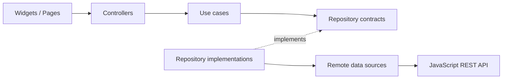

# Flutter Example Project

A Flutter client demonstrating:

- Clean Architecture
- Feature-Based Pattern
- SOLID principles
- Manual dependency injection
- `ChangeNotifier` presentation controllers
- Repository contracts in the domain layer
- REST communication with the companion JavaScript API

## Architecture



## Structure

```text
lib/
├── app/
├── core/
└── features/
    ├── auth/
    │   ├── domain/
    │   ├── data/
    │   └── presentation/
    └── notifications/
        ├── domain/
        ├── data/
        └── presentation/
```

## Requirements

- Flutter 3.19+ (Dart 3.3+)
- The companion JavaScript API running on port 3000

## Prepare platform folders

This ZIP focuses on the application architecture and source code. From the project root, generate platform folders once:

```bash
flutter create . --platforms=android,ios,web,linux,macos,windows
```

The command preserves the existing `lib/`, `test/`, and `pubspec.yaml` files.

## Run

Start the JavaScript API first, then:

```bash
flutter pub get
flutter run --dart-define=API_BASE_URL=http://10.0.2.2:3000
```

Common base URLs:

- Android emulator: `http://10.0.2.2:3000`
- iOS simulator / desktop: `http://localhost:3000`
- Physical device: `http://YOUR_COMPUTER_LAN_IP:3000`

## Demo credentials

```text
email: anwar@example.com
password: password123
```

## Tests

```bash
flutter test
flutter analyze
```

## SOLID mapping

| Principle | Example |
|---|---|
| SRP | Page, controller, use case, repository, and data source have separate responsibilities. |
| OCP | Notification behavior can be extended at the API/infrastructure boundary. |
| LSP | Fake repositories in tests replace production repositories. |
| ISP | Small `AuthRepository` and `NotificationRepository` contracts. |
| DIP | Use cases depend on abstractions; `AppDependencies` supplies implementations. |
