# The Complete Guide to Clean Architecture with a Layered-Based Pattern and SOLID

[اللغة العربية](Readme_ar.md)

[For Dart developers](../dart/Readme.md)

> A practical English reference that combines architecture theory, dependency diagrams, design rules, code examples, tests, refactoring guidance, and a complete runnable project.

## Guide profile

- Architectural style: `Clean Architecture – Layered-Based Pattern`.
- Part One: layers, boundaries, contracts, dependency direction, and runtime flow.
- Part Two: applying `SOLID` principles across the layers.
- Reference scenarios: login, order creation, and order retrieval.
- Intended level: intermediate to advanced.
- Primary goal: move from cosmetic folder organization to an architecture that is testable, replaceable, and explicit about business rules.

## How to use this guide

Do not treat architecture as a folder template that must be copied unchanged. Start with responsibilities and use cases, then design contracts, and only then select implementation details. The included project is a reference implementation, not a universal prescription.

Recommended study sequence:

1. Read the layer responsibilities.
2. Study the compile-time dependency diagrams.
3. Compare dependency flow with runtime interaction.
4. Apply one SOLID principle to a small example.
5. Run the reference project and its tests.
6. Replace one infrastructure implementation without changing Domain or Application code.
7. Add a new external provider behind an existing abstraction.
8. Run architecture-boundary checks.
9. Review the code with the checklists at the end of this guide.

---

# Part One — Clean Architecture with a Layered-Based Pattern

## 1. The problem this architecture addresses

Small systems often begin with a direct path from a route or screen to a database client. That is fast initially, but the design tends to accumulate structural problems:

- UI code knows database details.
- Business rules become coupled to a framework.
- Tests require network, file-system, or database access.
- Replacing storage affects many unrelated files.
- Error handling is duplicated across controllers and services.
- Validation rules are scattered and inconsistent.
- Circular dependencies appear between modules.
- It becomes difficult to locate the canonical implementation of a business rule.
- Infrastructure models leak into domain code.
- Changes become risky because responsibility boundaries are unclear.

Clean Architecture does not remove the essential complexity of the business. It prevents technical complexity from spreading through the entire codebase.

## 2. The central idea

The application is divided into layers with explicit responsibilities. Compile-time dependencies are controlled so stable business policy does not depend on volatile implementation details.

The layers used in this guide are:

1. `Presentation`
2. `Application`
3. `Domain`
4. `Infrastructure / Data`
5. `Composition Root` as the assembly point, not as a business layer

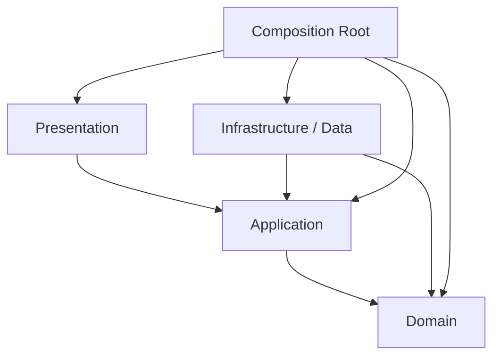

The diagram describes source-code dependency and import direction. It does not describe the full runtime path of a request.

## 3. Dependency flow versus runtime flow

At runtime, a request may start at the user, travel down to an external data source, and return upward. Compile-time dependencies should still respect the architectural boundaries.

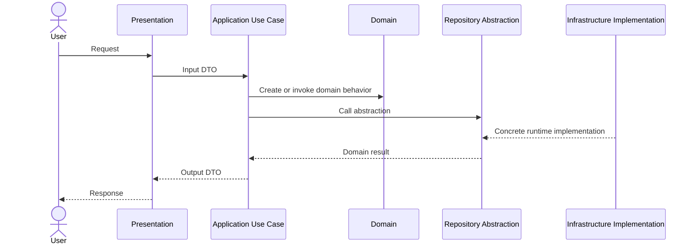

A common misunderstanding is to conclude that because Infrastructure executes at the bottom of the runtime call chain, Domain must import Infrastructure. The opposite is preferred: Infrastructure implements abstractions owned by the inner policy layers.

## 4. The limited-knowledge rule

Each layer should know as little as possible about the others:

- `Presentation` knows use cases and presentation-oriented contracts.
- `Application` knows domain rules and the abstractions needed to fulfill use cases.
- `Domain` knows neither UI nor database nor framework.
- `Infrastructure` knows the contracts it implements and the technology it integrates.
- `Composition Root` knows all concrete classes because it creates and wires them.

This rule does not ban all imports. It bans imports that reverse the desired dependency direction or expose unnecessary details.

## 5. Architectural boundaries as policy boundaries

A boundary is useful only when it protects a policy difference. Typical policy categories are:

- Interaction policy: how a user or external caller communicates with the system.
- Application policy: how a use case is orchestrated.
- Domain policy: rules that must always remain true.
- Infrastructure policy: how data is stored, transmitted, hashed, logged, or observed.

If two modules change for unrelated reasons, they likely belong on different sides of a boundary.

## 6. Presentation layer

### 6.1 Responsibilities

Presentation is the system boundary facing users or external clients. It commonly contains:

- HTTP controllers and routes.
- CLI commands.
- UI screens and widgets.
- State management.
- Parsing raw transport input.
- Transport-level validation.
- Mapping application output to HTTP responses or view states.
- Selecting a status code or presentation error message.
- Authentication token extraction from the transport.

### 6.2 What should not live here

- Pricing rules.
- SQL or database transactions.
- Complex entity construction.
- Storage-provider selection.
- Domain calculations.
- Cryptographic implementation details.
- Business authorization rules that must be consistent across transports.

### 6.3 Presentation flow

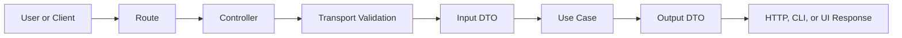

### 6.4 Transport validation

Presentation validation focuses on the shape of the request:

- Is the field present?
- Is the JSON valid?
- Is the expected type a string, number, or list?
- Is the request within size limits?
- Is the `Content-Type` supported?
- Can the route parameter be parsed?

A rule such as “a cancelled order cannot be confirmed” is a domain rule, not transport validation.

## 7. Application layer

### 7.1 Role

The Application layer implements use cases and coordinates operations. It is not the canonical home of core business invariants, but it knows the sequence of steps required to fulfill a user goal.

Typical use cases include:

- `LoginUseCase`
- `CreateOrderUseCase`
- `GetOrderUseCase`
- `CancelSubscriptionUseCase`
- `GenerateInvoiceUseCase`

### 7.2 Contents

- Use cases.
- Commands and queries.
- Input DTOs.
- Output DTOs.
- Input and output ports.
- Application-specific errors.
- Transaction orchestration.
- Use-case authorization checks.
- Coordination across repositories or services.

### 7.3 What should not live here

- HTTP status codes.
- Widgets or screens.
- SQL or vendor SDK calls.
- Framework-specific decorators as core policy.
- Domain invariants that must be protected by the entity itself.

### 7.4 Use-case lifecycle

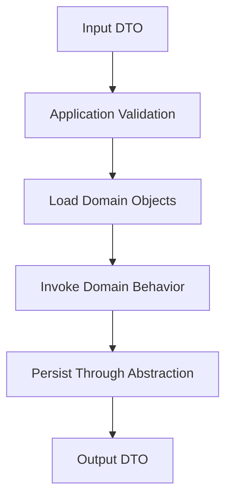

### 7.5 Rules that belong in Application

A rule belongs here when it coordinates a specific workflow, for example:

- The caller must be authenticated before invoking the use case.
- Two repositories must be called in a defined sequence.
- A transaction must begin and end around several operations.
- A policy is selected based on an application permission.
- An event is published after successful completion.

A rule that must always be true for an entity should remain in Domain.

## 8. Domain layer

### 8.1 The heart of the system

Domain models the business language and protects business invariants. It should remain useful even if the UI, database, framework, or transport is replaced.

Common elements:

- Entities.
- Value Objects.
- Aggregates.
- Domain Services.
- Domain Events.
- Business rules and policies.
- Repository abstractions when they are needed by domain-facing use cases.
- Domain-specific exceptions or result types.

### 8.2 Entities

An entity has identity and a lifecycle. It should protect its own invariants instead of allowing arbitrary external mutation.

Good entity design favors behavior-oriented methods:

- `order.addItem(...)`
- `order.cancel(...)`
- `user.changePassword(...)`
- `subscription.renew(...)`

Avoid exposing mutable fields that permit invalid states.

### 8.3 Value Objects

A Value Object has no persistent identity. Equality is based on value. Typical examples:

- `Email`
- `Money`
- `Address`
- `DateRange`
- `Percentage`

A Value Object should validate itself at construction and remain immutable.

### 8.4 Domain Services

Use a Domain Service when an important domain operation does not naturally belong to one entity or Value Object. It should still express domain policy and remain infrastructure-independent.

### 8.5 Repository abstractions

A repository contract describes the collection-like operations required by the application. It should not expose database-specific query objects, ORM entities, or transport models.

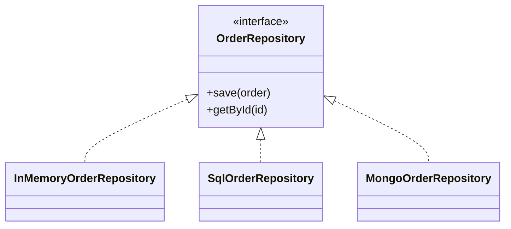

## 9. Infrastructure / Data layer

### 9.1 Responsibilities

Infrastructure handles concrete technical details:

- Repository implementations.
- Database access.
- API clients.
- Local storage.
- File access.
- Message brokers.
- Email, payments, and notification providers.
- Cryptographic services.
- Logging adapters.
- Cache implementations.
- Mappers between external models and domain objects.

### 9.2 The leakage rule

Infrastructure-specific objects should not escape into the inner layers. Avoid returning:

- ORM entities.
- Raw JSON objects.
- Vendor SDK responses.
- Database cursors.
- Framework request or response objects.

Map them to domain entities, Value Objects, or explicit DTOs.

### 9.3 Mapper responsibilities

A mapper translates between representations. It should not silently invent business decisions. Mapping and validation are separate concerns:

- Mapping changes shape.
- Validation determines whether input is acceptable.
- Domain construction protects invariants.

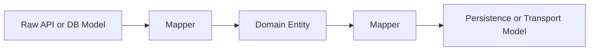

## 10. Composition Root

The Composition Root is the only place that should freely know concrete implementations. It creates the object graph, selects adapters, and injects dependencies.

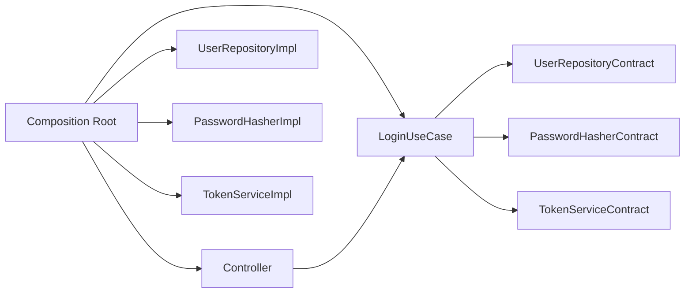

Do not spread object construction throughout use cases. Hidden construction creates hidden coupling and makes replacement difficult.

## 11. Layered pattern versus feature-based organization

These are different dimensions:

- Layered architecture describes responsibility and dependency boundaries.
- Feature-based organization describes how files are grouped for navigation and ownership.

They can be combined. A large system may use feature folders, with each feature containing `presentation`, `application`, `domain`, and `infrastructure` subfolders.

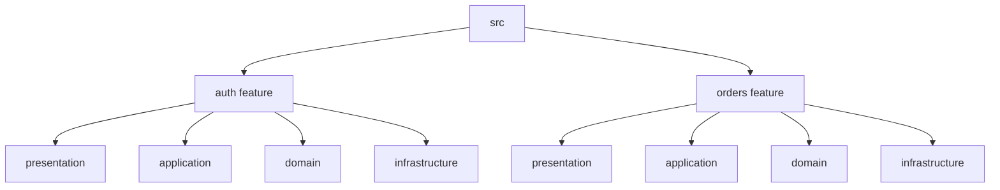

Choose the file organization that best supports ownership and discovery, while keeping dependency boundaries explicit.

## 12. Boundary rules

A practical rule set:

1. Domain imports no framework or infrastructure package.
2. Application imports Domain and contract modules, not concrete adapters.
3. Presentation imports Application-facing APIs, not persistence clients.
4. Infrastructure may import Domain and Application contracts to implement them.
5. Composition Root may import all layers.
6. Shared utilities must not become a hidden dependency dumping ground.
7. Cross-layer models must be explicit and intentional.
8. Tests may cross boundaries only when the test type requires it.

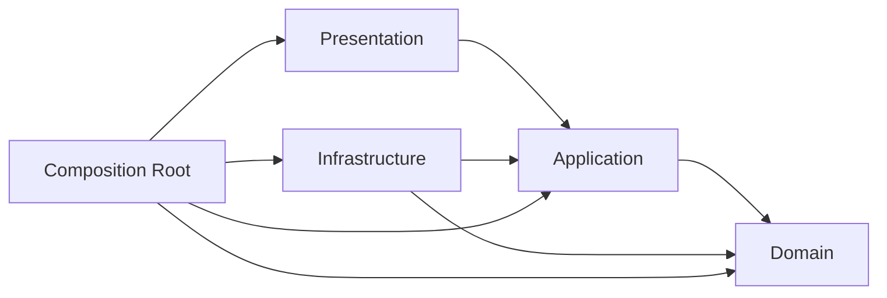

## 13. Contracts between layers

### 13.1 Repository contract

Represents data access required by a use case or domain policy.

### 13.2 Service port

Represents a technical capability required by Application, such as hashing, token generation, clock access, or email delivery.

### 13.3 Input port

Represents how a caller invokes a use case. In many languages, the use-case class itself is the input port.

### 13.4 Output port

Represents how a use case reports results to a specific boundary. It is optional; explicit return values are often simpler.

### 13.5 Contract quality checklist

A good contract should be:

- Small.
- Named in business language.
- Free from vendor-specific types.
- Stable relative to its implementations.
- Easy to fake in tests.
- Explicit about errors and nullability.
- Focused on caller needs.

## 14. DTOs

DTOs carry data across boundaries. They are not automatically domain models.

Use DTOs when:

- The transport shape differs from the domain model.
- You want to hide internal state.
- A use case returns a purpose-built response.
- Versioning is required.
- Serialization concerns must remain outside Domain.

Avoid creating DTOs mechanically for every method when no boundary or representation difference exists.

## 15. Mapping

Mapping should occur at the boundary where representations differ.

Typical mapping points:

- HTTP request to input DTO.
- Persistence row to domain entity.
- Domain entity to output DTO.
- External provider response to internal result.


## 16. Error handling

Errors should retain meaning as they move outward.

A useful classification:

- `DomainError`: invariant or business-rule violation.
- `ApplicationError`: use-case failure, missing resource, or policy rejection.
- `InfrastructureError`: provider, database, network, or serialization failure.
- `PresentationError`: malformed request or unsupported transport behavior.

Presentation maps internal errors to an external representation. Domain should not know HTTP status codes.

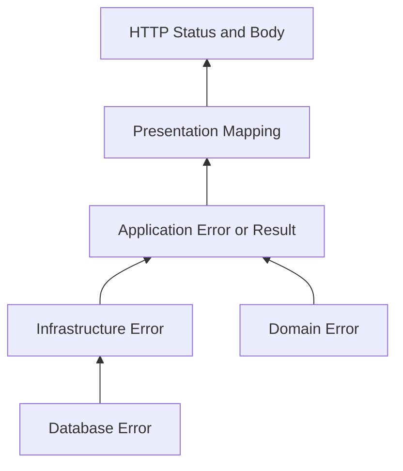

## 17. Validation strategy

Validation exists at multiple levels:

| Level | Concern | Example |
| --- | --- | --- |
| Presentation | Transport shape | Required JSON field |
| Application | Use-case precondition | Caller has permission |
| Domain | Invariant | Quantity must be positive |
| Infrastructure | Provider constraint | Column length or API format |

Do not duplicate the same rule without a reason. Some defensive repetition is acceptable at trust boundaries, but the canonical rule should have one owner.

## 18. Transactions

Transaction boundaries usually belong to Application because a use case knows which operations must succeed atomically. The technical transaction mechanism is supplied by Infrastructure.

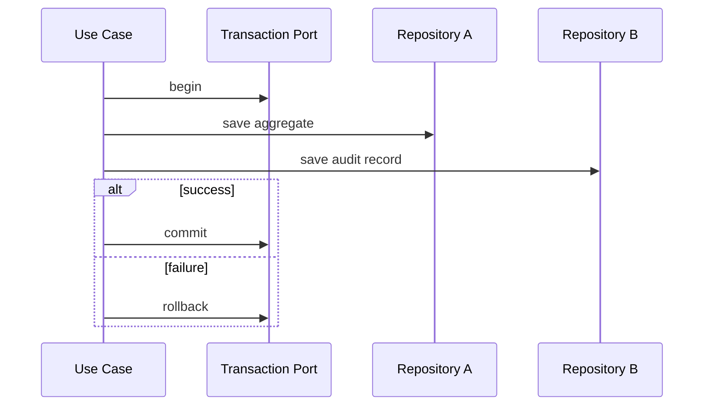

Avoid making entities aware of database transactions.

## 19. Caching

Caching is normally an infrastructure concern, but cache policy may be application-specific.

Common patterns:

- Cache-aside.
- Read-through repository decorator.
- Write-through.
- Time-based invalidation.
- Event-based invalidation.

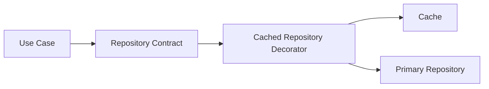

A decorator allows caching to be added without changing the use case, demonstrating OCP and DIP.

## 20. Authentication and authorization

Separate these concerns:

- Authentication establishes identity.
- Authorization determines whether an identity may perform an action.
- Credential parsing belongs to Presentation.
- Token verification is a technical service behind a port.
- Business permission rules may belong to Application or Domain depending on scope.

Do not spread role strings and permission checks across controllers.

## 21. Logging and monitoring

Logging is a cross-cutting technical concern. Prefer structured logging through an abstraction or middleware. Domain entities should not emit framework logs directly.

Useful observability fields:

- Correlation ID.
- Use-case name.
- Duration.
- Result category.
- External provider name.
- Retry count.
- Error code.

Never log secrets, plaintext passwords, full tokens, or sensitive personal data.

## 22. Testing pyramid

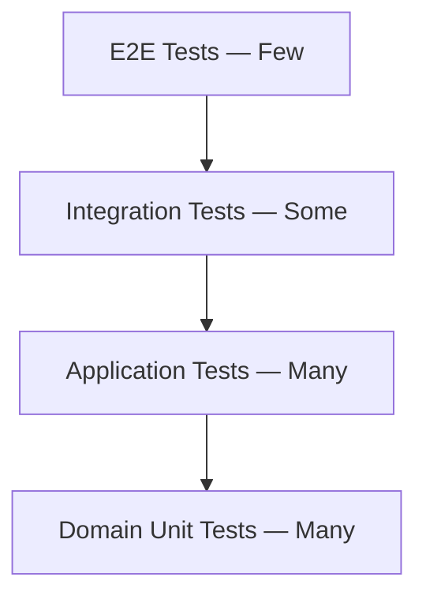

### 22.1 Domain tests

- Fast.
- No framework.
- No database.
- Cover invariants and value semantics.

### 22.2 Application tests

- Use fakes or mocks for ports.
- Verify orchestration and result mapping.
- Avoid testing framework internals.

### 22.3 Infrastructure tests

- Verify concrete adapters against real or disposable dependencies.
- Use contract tests so multiple implementations behave consistently.

### 22.4 Presentation tests

- Verify routing, parsing, status mapping, and response shape.
- Keep business assertions in lower-level tests.

## 23. Architecture tests

Architecture tests enforce import rules automatically.

Typical checks:

- Domain does not import Infrastructure.
- Application does not import Presentation.
- Presentation does not import database packages.
- Concrete repository classes are used only in Composition Root and tests.
- Cycles are rejected.

A lightweight script can scan import statements, while larger systems may use dependency-graph tools.

---

# Part Two — Applying SOLID Inside the Layered Architecture

## 24. SRP — Single Responsibility Principle

### 24.1 Meaning

A module should have one reason to change. “One responsibility” does not mean one method; it means one coherent axis of change.

### 24.2 Across the layers

- Presentation changes because interaction or transport changes.
- Application changes because a workflow changes.
- Domain changes because business policy changes.
- Infrastructure changes because technology or providers change.

### 24.3 Violation indicators

- A controller validates business rules, runs SQL, and formats email.
- A repository calculates discounts.
- A use case parses HTTP headers.
- An entity sends network requests.
- A service has dozens of unrelated dependencies.

### 24.4 Refactoring path

1. Identify independent reasons to change.
2. Name each responsibility in business or technical language.
3. Move each responsibility behind a focused interface or class.
4. Keep orchestration in Application.
5. Add tests before and after the move.

## 25. OCP — Open/Closed Principle

### 25.1 Meaning

Software elements should be open for extension and closed for modification. New behavior should often be introduced by adding a new implementation, decorator, strategy, or policy rather than rewriting stable code.

### 25.2 Examples

- Add `PostgresOrderRepository` without changing `CreateOrderUseCase`.
- Add `CachedOrderRepository` as a decorator.
- Add a new `TokenService` implementation.
- Add a new pricing strategy behind a policy contract.

### 25.3 Avoid giant conditionals

A large `if/else` or `switch` based on provider type often signals a missing abstraction. Do not remove every conditional; remove conditionals that select volatile implementation behavior throughout stable policy code.

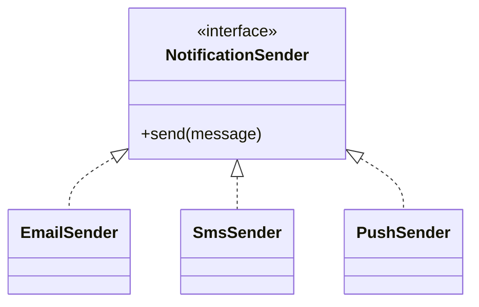

## 26. LSP — Liskov Substitution Principle

### 26.1 Meaning

Any implementation of a contract must be usable wherever the contract is expected without breaking the caller's valid assumptions.

An implementation violates LSP when it:

- Throws unsupported-operation errors for required operations.
- Returns a different semantic meaning.
- Strengthens preconditions unexpectedly.
- Weakens postconditions.
- Changes error categories incompatibly.
- Mutates state that the contract promises not to mutate.

### 26.2 Repository example

If `OrderRepository.getById(id)` promises either an `Order` or a not-found result, every implementation must preserve that behavior. A cache implementation cannot silently return stale data beyond the documented policy, and a mock should not bypass important contract rules.

### 26.3 Contract tests

Run the same test suite against every implementation to verify substitutability.

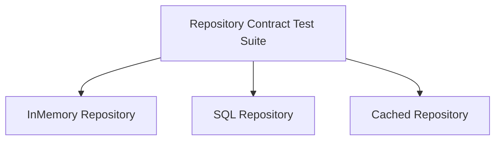

## 27. ISP — Interface Segregation Principle

### 27.1 Meaning

Clients should not depend on methods they do not use. Prefer focused interfaces shaped around use-case needs.

A broad interface such as `GenericRepository<T>` can force unrelated capabilities onto all models. Instead, use focused contracts:

- `OrderReader`
- `OrderWriter`
- `UserByEmailFinder`
- `TokenIssuer`

### 27.2 Benefits

- Smaller mocks and fakes.
- Fewer accidental dependencies.
- Clearer ownership.
- Easier implementation by external adapters.
- Less pressure to return generic, weakly typed results.

## 28. DIP — Dependency Inversion Principle

### 28.1 Meaning

High-level policy should not depend on low-level details. Both depend on abstractions. Details implement abstractions owned near the policy that needs them.

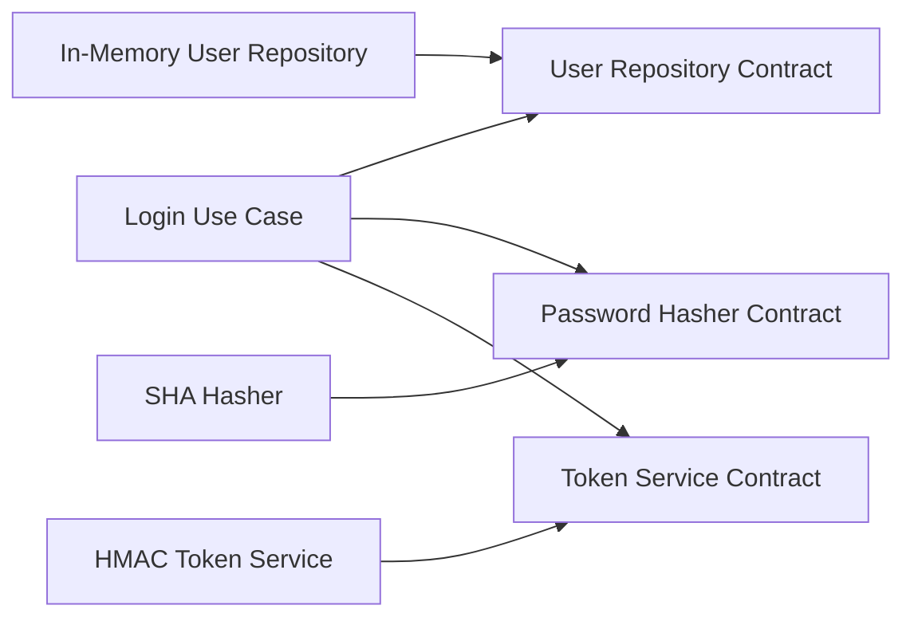

### 28.2 Who owns the abstraction?

The abstraction should be owned by the layer whose policy it serves. If Application needs to load a user, the contract should be defined in or near Application/Domain, not buried in the database adapter package.

### 28.3 DIP is not only dependency injection

Dependency injection is a wiring technique. DIP is the design rule that stable policy depends on abstractions. A container can inject concrete classes while still violating DIP if the use case imports those concrete types.

## 29. SOLID mapping by layer

| Principle | Presentation | Application | Domain | Infrastructure |
| --- | --- | --- | --- | --- |
| SRP | Separate parsing, controller, and response mapping | One use case per workflow | Focused entities and services | Separate clients, mappers, repositories |
| OCP | Add presenters or transports | Add use cases or policies | Add strategies and domain policies | Add adapters and decorators |
| LSP | Replace presenters consistently | Replace ports/fakes | Preserve domain contracts | Implement contracts faithfully |
| ISP | Small view contracts | Focused input/output ports | Focused repository contracts | Focused provider adapters |
| DIP | Depend on use-case APIs | Depend on ports and Domain | Depend on pure abstractions | Implement inner abstractions |

## 30. How the principles reinforce one another

- SRP exposes natural boundaries.
- ISP keeps contracts aligned with those boundaries.
- DIP turns contracts into stable dependency points.
- OCP allows new implementations to be added behind the contracts.
- LSP ensures those implementations are genuinely interchangeable.

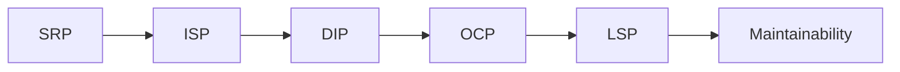

## 31. Common anti-patterns

### 31.1 Fat Controller

A controller parses input, enforces business policy, executes SQL, and formats output. Split transport concerns from use-case orchestration and domain logic.

### 31.2 Anemic Domain with scattered rules

Entities are passive data bags while rules live in random services. Move invariant-protecting behavior into entities and Value Objects.

### 31.3 Over-generalized Generic Repository

A generic CRUD abstraction exposes operations that are not meaningful for every aggregate. Prefer use-case-oriented contracts.

### 31.4 Hidden Service Locator

A global registry hides dependencies and makes tests order-dependent. Use explicit constructor injection from Composition Root.

### 31.5 Framework Leakage

Domain or Application imports framework request objects, decorators, ORM entities, or SDK exceptions. Map at the boundary.

### 31.6 DTO Leakage

One data structure is reused across HTTP, Application, Domain, and persistence. Each boundary loses independence.

### 31.7 Circular Dependencies

Two modules import each other because responsibilities are entangled. Extract a stable abstraction or move the shared policy to the correct owner.

### 31.8 God Service

A service contains dozens of unrelated methods and dependencies. Split by cohesive use case or domain capability.

## 32. Refactoring strategy

A safe migration path from a tangled system:

1. Add characterization tests around current behavior.
2. Identify one high-value use case.
3. Extract a use-case class from the controller.
4. Move business invariants into entities or Value Objects.
5. Introduce repository/service abstractions at the policy boundary.
6. Move concrete data access behind adapters.
7. Create a Composition Root.
8. Add import-boundary checks.
9. Repeat feature by feature.
10. Remove obsolete paths only after tests prove equivalence.

Avoid a full rewrite when incremental extraction is possible.

## 33. Choosing the right complexity level

Not every project needs four physical packages, dozens of interfaces, and a container. Use architectural elements where they protect real change boundaries.

Questions to ask:

- Is the business logic non-trivial?
- Are there multiple transports?
- Are external providers likely to change?
- Is test isolation valuable?
- Will several developers work in parallel?
- Does the system have long expected lifetime?
- Is regulatory traceability required?

For a tiny script, a few functions may be enough. For a long-lived product, explicit boundaries usually repay the initial cost.

## 34. Design checklist

### Domain

- Business invariants are protected inside Domain.
- Domain has no framework imports.
- Value Objects validate their own state.
- Entities expose behavior, not arbitrary mutation.
- Repository contracts use domain language.
- Domain errors are meaningful and transport-independent.

### Application

- Each use case has one clear goal.
- Dependencies are explicit in the constructor.
- Input and output models are intentional.
- Transactions are orchestrated here when needed.
- No SQL or HTTP details are present.
- Authorization policy is placed deliberately.

### Infrastructure

- Adapters implement contracts faithfully.
- Raw provider models do not leak inward.
- Mapping is explicit.
- Retry, timeout, and observability policies are visible.
- Secrets are injected, not hard-coded.
- Contract tests cover substitutability.

### Presentation

- Controllers are thin.
- Transport validation is separated from business validation.
- Error mapping is centralized.
- HTTP status codes remain here.
- Presentation imports no persistence package.
- Response shapes are stable and versionable.

## 35. Code-review questions

1. What is the single responsibility of this module?
2. What business rule does this code protect?
3. Which layer owns the abstraction?
4. Can the dependency be replaced in a unit test?
5. Does this change introduce a framework type into Domain?
6. Is a DTO being reused across unrelated boundaries?
7. Does this implementation honor the full contract?
8. Could a decorator or strategy add this behavior without modifying stable code?
9. Is the transaction boundary explicit?
10. Are logs free from sensitive information?
11. Does the error retain business meaning?
12. Is there an import cycle?
13. Can a new provider be added without changing the use case?
14. Are we solving a real problem or adding ceremonial abstraction?
15. Does the test assert behavior rather than implementation detail?

## 36. Practical exercises

### Exercise 1 — Cancel order

Add `CancelOrderUseCase`. The Domain entity must reject cancellation after shipment. Keep the controller transport-focused.

### Exercise 2 — Cached repository

Create a repository decorator that caches reads. The use case must remain unchanged.

### Exercise 3 — Alternative token provider

Add a second token implementation and select it only in Composition Root.

### Exercise 4 — Database adapter

Replace the in-memory repository with a SQL or document-store adapter without modifying Domain.

### Exercise 5 — Domain event

Publish `OrderCreated` after successful creation. Decide whether event publication belongs in the use case or a transaction/outbox abstraction.

### Exercise 6 — Authorization policy

Introduce a focused `OrderAuthorizationPolicy` and test it independently.

### Exercise 7 — Pagination

Add order listing with an explicit page request and page result. Do not leak database cursor objects.

### Exercise 8 — Structured logging

Add correlation IDs and use-case duration without logging secrets.

### Exercise 9 — Retry policy

Wrap an external adapter with a retry decorator. Do not retry domain validation failures.

### Exercise 10 — Contract tests

Write one reusable suite and run it against all repository implementations.

## 37. Reference project architecture

```mermaid
flowchart TB
    Router --> AuthController
    Router --> OrderController
    AuthController --> LoginUseCase
    OrderController --> CreateOrderUseCase
    OrderController --> GetOrderUseCase
    LoginUseCase --> UserRepository
    LoginUseCase --> PasswordHasher
    LoginUseCase --> TokenService
    CreateOrderUseCase --> OrderRepository
    GetOrderUseCase --> OrderRepository
    UserRepository <|.. InMemoryUserRepository
    OrderRepository <|.. InMemoryOrderRepository
```

## 38. Login scenario

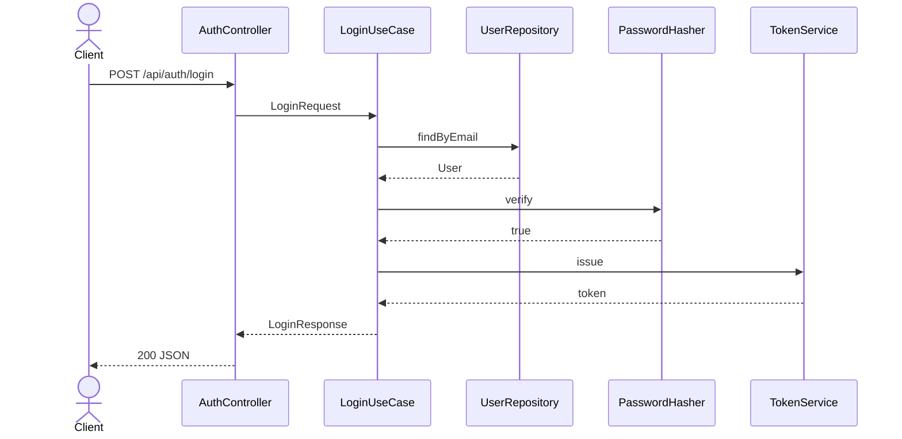

## 39. Create-order scenario

```mermaid
sequenceDiagram
    actor Client
    participant Controller as OrderController
    participant UseCase as CreateOrderUseCase
    participant Order as Domain Order
    participant Repo as OrderRepository

    Client->>Controller: POST /api/orders
    Controller->>UseCase: CreateOrderRequest
    UseCase->>Order: construct and validate items
    UseCase->>Repo: save(order)
    Repo-->>UseCase: persisted order
    UseCase-->>Controller: output DTO
    Controller-->>Client: 201 JSON
```

## 40. Acceptance criteria for the reference project

- Login succeeds with the demo credentials.
- Invalid credentials produce a stable application error.
- An order rejects empty items or non-positive quantities.
- Money rejects negative amounts and currency mismatch.
- Use cases are testable with in-memory implementations.
- Presentation does not import repository implementations.
- Domain imports no framework package.
- Concrete implementations are selected in Composition Root.
- Boundary checks fail when an illegal import is introduced.
- All example tests pass in the documented runtime.

## 41. Production hardening checklist

- Replace demo token logic with a reviewed implementation.
- Store password hashes using a password-specific KDF.
- Use secure secret management.
- Add request size limits.
- Add timeouts to external calls.
- Use idempotency where required.
- Add transactional persistence.
- Add an outbox for reliable events.
- Add rate limiting and abuse controls.
- Add structured logs, metrics, and traces.
- Redact sensitive values.
- Add health and readiness checks.
- Add database migrations.
- Add dependency vulnerability scanning.
- Add contract and integration tests in CI.

## 42. Advanced questions and answers

### Does every project need four layers?

No. Use the minimum structure that preserves important boundaries. A small tool may combine Presentation and Application, while a complex product benefits from explicit separation.

### Must repository interfaces always live in Domain?

No universal rule applies. Put the contract near the policy that owns the required operation. Domain ownership is common when the contract is expressed in domain language; Application ownership is reasonable when it is purely use-case-specific.

### Is a DTO required for every function?

No. DTOs are boundary tools, not ceremony. Use them when representation, versioning, or coupling concerns justify them.

### May Infrastructure depend on Domain?

Yes. Infrastructure often imports domain entities and contracts in order to implement persistence or external-service adapters.

### May Presentation depend on Domain?

Prefer Presentation to depend on Application outputs. Direct Domain use can be acceptable for simple read-only display values, but it increases coupling and should be deliberate.

### Where should authorization live?

Transport-level identity extraction belongs to Presentation. Use-case authorization usually belongs to Application. Invariants that depend on business ownership may belong to Domain.

### Where do events live?

Domain events belong to Domain; publication infrastructure belongs to Infrastructure; orchestration and transaction coordination usually belong to Application.

### What about CQRS?

CQRS can be introduced when read and write models have meaningfully different needs. Do not add it only to imitate a pattern.

### What about microservices?

Clean internal boundaries are valuable inside a modular monolith and inside each service. Microservices do not replace architecture; they add distributed-system complexity.

### How do I know the architecture is over-engineered?

Symptoms include interfaces with only one trivial implementation and no testing benefit, DTOs that duplicate fields without boundary value, use cases that only forward calls, and excessive navigation for simple behavior.

## 43. Glossary

| Term | Meaning |
| --- | --- |
| Entity | Domain object with identity and lifecycle |
| Value Object | Immutable value-defined domain concept |
| Aggregate | Consistency boundary around related domain objects |
| Use Case | Application workflow that fulfills a user goal |
| Port | Abstraction required by a policy layer |
| Adapter | Concrete implementation connecting a port to technology |
| Repository | Collection-like abstraction for aggregate persistence |
| DTO | Data Transfer Object used across a boundary |
| Mapper | Translator between representations |
| Composition Root | Central object-graph assembly point |
| Dependency Rule | Stable policy does not depend on volatile details |
| Contract Test | Reusable test suite applied to multiple implementations |
| Decorator | Wrapper adding behavior while preserving a contract |
| Strategy | Interchangeable policy implementation |
| Domain Event | Record that a domain-relevant fact occurred |
| Outbox | Reliable event-publication pattern coupled with persistence |
| Idempotency | Repeating an operation has no unintended additional effect |

## 44. Pre-release architecture checklist

- [ ] Domain has no framework imports.
- [ ] Application has no database client imports.
- [ ] Presentation has no concrete repository imports.
- [ ] Infrastructure models are mapped before crossing inward.
- [ ] Every use case has focused tests.
- [ ] Important invariants have Domain tests.
- [ ] Errors are mapped in one place.
- [ ] Secrets are not committed or logged.
- [ ] Timeouts and retries are bounded.
- [ ] Transactions are explicit.
- [ ] Architecture checks run in CI.
- [ ] Dependency cycles are rejected.
- [ ] Public DTOs are versioned deliberately.
- [ ] Observability fields are structured.
- [ ] Contract tests cover replaceable adapters.

---
# JavaScript-Specific Implementation Guide

## 45. Why JavaScript needs especially explicit boundaries

JavaScript is flexible and productive, but the language does not prevent accidental cross-layer imports. A module can import any file unless the project enforces rules through conventions, tests, linting, or build tooling.

Important practices:

- Use constructor injection for explicit dependencies.
- Keep modules small and cohesive.
- Freeze or encapsulate domain state where practical.
- Validate all external input.
- Use JSDoc or TypeScript when stronger contracts are needed.
- Add automated import-boundary checks.
- Avoid module-level mutable singletons.
- Prefer explicit result/error semantics.

## 46. JavaScript SRP example

### Poor design

```javascript
class OrderController {
  async create(req, res) {
    // Parses HTTP, validates business rules, calculates totals,
    // writes to a database, and formats a response.
  }
}
```

### Improved design

```javascript
class OrderController {
  constructor(createOrderUseCase) {
    this.createOrderUseCase = createOrderUseCase;
  }

  async create(req, res) {
    const output = await this.createOrderUseCase.execute(req.body);
    res.statusCode = 201;
    res.end(JSON.stringify(output));
  }
}
```

The controller owns transport behavior. The use case owns orchestration. The Domain owns invariants. The repository adapter owns persistence.

## 47. JavaScript DIP example

```javascript
export class LoginUseCase {
  constructor({ userRepository, passwordHasher, tokenService }) {
    this.userRepository = userRepository;
    this.passwordHasher = passwordHasher;
    this.tokenService = tokenService;
  }

  async execute(request) {
    const user = await this.userRepository.findByEmail(request.email);
    // The use case depends on capabilities, not concrete packages.
    return user;
  }
}
```

The object graph is assembled in one Composition Root:

```javascript
const userRepository = new InMemoryUserRepository(seedUsers);
const passwordHasher = new Sha256PasswordHasher();
const tokenService = new HmacTokenService(secret);
const loginUseCase = new LoginUseCase({
  userRepository,
  passwordHasher,
  tokenService,
});
```

## 48. Testing a JavaScript use case

```javascript
import test from 'node:test';
import assert from 'node:assert/strict';

class FakeUserRepository {
  async findByEmail(email) {
    return email === 'user@example.com'
      ? { id: 'u-1', email, passwordHash: 'hash' }
      : null;
  }
}

test('login returns a token for valid credentials', async () => {
  const useCase = new LoginUseCase({
    userRepository: new FakeUserRepository(),
    passwordHasher: { verify: async () => true },
    tokenService: { issue: async () => 'token' },
  });

  const result = await useCase.execute({
    email: 'user@example.com',
    password: 'secret',
  });

  assert.equal(result.token, 'token');
});
```

## 49. JavaScript module-boundary rules

A practical import matrix:

| From | May import |
| --- | --- |
| `domain` | `domain`, small shared primitives |
| `application` | `application`, `domain`, contracts |
| `presentation` | `presentation`, `application` |
| `infrastructure` | `infrastructure`, `application`, `domain` |
| `composition` | all layers |

Use a script, ESLint rule, or dependency graph tool to enforce this matrix.

## 50. Running the JavaScript project

```bash
npm install
npm test
npm run check:boundaries
npm start
```

Login request:

```bash
curl -X POST http://localhost:3000/api/auth/login \
  -H 'content-type: application/json' \
  -d '{"email":"anwar@example.com","password":"secret123"}'
```

Create-order request:

```bash
curl -X POST http://localhost:3000/api/orders \
  -H 'content-type: application/json' \
  -d '{"userId":"u-1","currency":"USD","items":[{"productId":"p-1","name":"Keyboard","unitPrice":80,"quantity":2}]}'
```

## 51. JavaScript production notes

- Prefer a password-specific hashing algorithm such as Argon2, scrypt, or bcrypt.
- Use a reviewed token library or opaque session tokens.
- Freeze dependency versions and audit them.
- Avoid catching errors only to discard stack/context.
- Use `AbortSignal` or equivalent cancellation/timeouts for network calls.
- Keep request-local context out of module globals.
- Add process-level shutdown handling.
- Add structured log redaction.
- Validate environment configuration at startup.
- Run architecture checks in CI.

---
# Project Extension Labs

## Lab 1 — Add `CancelOrderUseCase`

Goal: add cancellation without changing existing use cases.

Acceptance criteria:

- A pending order can be cancelled.
- A shipped order cannot be cancelled.
- The invariant lives in Domain.
- The controller maps the domain/application error.
- Unit tests cover both outcomes.

## Lab 2 — Add `CachedOrderRepository`

Goal: demonstrate OCP and decorator composition.

Steps:

1. Implement the same repository contract.
2. Read from cache first.
3. Fall back to the wrapped repository.
4. Cache successful reads.
5. Invalidate on writes.
6. Wire the decorator in Composition Root.
7. Keep use cases unchanged.

## Lab 3 — Add an alternative token provider

- Define behavior through the existing port.
- Implement a new provider.
- Run the same contract tests.
- Select it through configuration in Composition Root.
- Do not add provider checks to `LoginUseCase`.

## Lab 4 — Add a database adapter

- Choose SQL or a document database.
- Create persistence models outside Domain.
- Map rows/documents to domain entities.
- Preserve not-found and save semantics.
- Add integration tests.
- Run repository contract tests.

## Lab 5 — Add a domain event

Introduce `OrderCreated` with:

- Order ID.
- User ID.
- Total amount.
- Timestamp from an injected clock.

Decide whether publication is immediate, transactional, or outbox-based. Document the decision.

## Lab 6 — Add authorization

Create a policy that answers whether an actor may read or cancel an order. Keep token parsing out of the policy.

## Lab 7 — Add pagination

Use explicit models such as:

- `PageRequest`
- `PageResult<T>`
- `OrderSort`

Do not expose database cursors unless the public contract intentionally uses cursor pagination.

## Lab 8 — Add structured logging

Record:

- Correlation ID.
- Use-case name.
- Duration.
- Result category.
- Error code.

Do not record secrets or raw passwords.

## Lab 9 — Add retry and timeout policies

Apply them only to retryable infrastructure failures. Use bounded attempts and backoff. Do not retry validation or invariant failures.

## Lab 10 — Add contract tests

Build a reusable repository test suite and run it against:

- In-memory implementation.
- Database implementation.
- Cached decorator.

## Lab 11 — Add idempotent order creation

- Accept an idempotency key.
- Store the result by key.
- Return the previous result for duplicate requests.
- Keep transport parsing separate from application policy.

## Lab 12 — Add an outbox

- Persist the aggregate and outbox record atomically.
- Publish asynchronously.
- Mark successful publication.
- Retry safely.
- Monitor backlog size.

## Lab 13 — Add a second transport

Expose the same use cases through CLI, HTTP, or a message consumer. Do not duplicate business rules.

## Lab 14 — Add a second currency policy

Introduce a pricing or exchange policy behind a focused abstraction. Keep `Money` invariant-safe.

## Lab 15 — Add architecture fitness functions

Fail CI when:

- Domain imports framework code.
- Application imports concrete adapters.
- Presentation imports persistence.
- Dependency cycles appear.
- A forbidden package is introduced.

---

# Architecture Decision Record Template

```markdown
# ADR-001: Adopt Clean Layered Architecture

## Status
Accepted

## Context
Describe the business complexity, expected lifetime, team size, testing requirements, and external integrations.

## Decision
Use Presentation, Application, Domain, Infrastructure/Data, and a Composition Root with explicit dependency rules.

## Alternatives
- Transaction-script architecture
- Framework-centric MVC
- Feature-only folder organization
- Full hexagonal architecture
- Modular monolith with package boundaries

## Consequences
Positive:
- Testable policy layers
- Replaceable infrastructure
- Explicit responsibilities
- Better long-term maintainability

Negative:
- More files and contracts
- Higher initial learning cost
- Risk of ceremonial abstractions
- Need for automated boundary checks
```

# Interview and Review Questions

1. Explain the difference between runtime call direction and compile-time dependency direction.
2. Why should Domain avoid framework imports?
3. When should a rule live in Application instead of Domain?
4. Who should own a repository abstraction?
5. How does DIP differ from dependency injection?
6. Give an example of an LSP violation in a repository.
7. When is a DTO valuable, and when is it ceremony?
8. How would you add caching without changing a use case?
9. Where should a transaction boundary live?
10. How do contract tests support LSP?
11. Why can a generic repository violate ISP?
12. What belongs in Composition Root?
13. How do you prevent infrastructure model leakage?
14. How would you migrate a legacy controller incrementally?
15. Which architecture rules should be enforced automatically?
16. How do Domain Events relate to Application orchestration?
17. When is CQRS justified?
18. Why does a modular monolith still need internal boundaries?
19. How do you test a use case without a database?
20. What evidence would tell you the architecture is over-engineered?

# Executive Summary

Clean layered architecture is not a folder convention. It is a policy for assigning responsibility and controlling dependency direction. Presentation handles interaction. Application orchestrates use cases. Domain protects business meaning and invariants. Infrastructure implements replaceable technical details. Composition Root assembles the object graph.

SOLID strengthens these boundaries: SRP clarifies why modules change, ISP keeps contracts focused, DIP points dependencies toward abstractions, OCP enables extension behind those abstractions, and LSP guarantees that replacements preserve behavior.

The architecture is successful when business rules are easy to locate, tests are fast and isolated, infrastructure can be replaced without rewriting use cases, and new developers can explain why each dependency exists.

---
# Complete Reference Project Appendix

The following appendix contains the full source tree and every project file so the guide remains self-contained.

## Project tree

```text
.gitignore
README.md
package.json
scripts/check-boundaries.js
src/application/dto/CreateOrderRequest.js
src/application/dto/LoginRequest.js
src/application/dto/LoginResponse.js
src/application/errors/ApplicationError.js
src/application/ports/PasswordHasher.js
src/application/ports/TokenService.js
src/application/usecases/CreateOrderUseCase.js
src/application/usecases/GetOrderUseCase.js
src/application/usecases/LoginUseCase.js
src/composition/createContainer.js
src/composition/createHttpHandler.js
src/domain/entities/Order.js
src/domain/entities/User.js
src/domain/errors/DomainError.js
src/domain/repositories/OrderRepository.js
src/domain/repositories/UserRepository.js
src/domain/value-objects/Email.js
src/domain/value-objects/Money.js
src/infrastructure/repositories/InMemoryOrderRepository.js
src/infrastructure/repositories/InMemoryUserRepository.js
src/infrastructure/security/HmacTokenService.js
src/infrastructure/security/Sha256PasswordHasher.js
src/presentation/controllers/AuthController.js
src/presentation/controllers/OrderController.js
src/presentation/http/Router.js
src/presentation/http/readJsonBody.js
src/presentation/http/sendJson.js
src/presentation/middleware/errorHandler.js
src/server.js
src/shared/Result.js
test/application/CreateOrderUseCase.test.js
test/application/LoginUseCase.test.js
test/domain/Money.test.js
```

## Source files

### `.gitignore`

```gitignore
node_modules/
.env
coverage/
```
### `README.md`

```markdown
# JavaScript Layered Clean Architecture Example

A runnable Node.js example that demonstrates:

- Presentation, Application, Domain, and Infrastructure/Data layers.
- SOLID principles applied across layer boundaries.
- Login, order creation, and order retrieval use cases.
- Dependency injection through a composition root.
- Unit tests with the built-in `node:test` runner.
- A simple dependency-boundary checker.

## Requirements

- Node.js 20 or newer.

## Run

```bash
npm test
npm run check:boundaries
npm start
```

The server listens on `http://localhost:3000`.

## Demo credentials

- Email: `anwar@example.com`
- Password: `secret123`

## Example requests

```bash
curl -X POST http://localhost:3000/api/auth/login \
  -H 'content-type: application/json' \
  -d '{"email":"anwar@example.com","password":"secret123"}'
```

```bash
curl -X POST http://localhost:3000/api/orders \
  -H 'content-type: application/json' \
  -d '{"userId":"u-1","currency":"USD","items":[{"productId":"p-1","name":"Keyboard","unitPrice":80,"quantity":2}]}'
```
```
### `package.json`

```json
{
  "name": "javascript-layered-clean-architecture-example",
  "version": "1.0.0",
  "description": "Layered Clean Architecture + SOLID example using only Node.js built-ins",
  "type": "module",
  "scripts": {
    "start": "node src/server.js",
    "test": "node --test",
    "check:boundaries": "node scripts/check-boundaries.js"
  },
  "engines": {
    "node": ">=20"
  }
}
```
### `scripts/check-boundaries.js`

```javascript
import { readdir, readFile } from "node:fs/promises";
import { join, relative } from "node:path";

const root = new URL("../src/", import.meta.url);
const forbidden = {
  domain: ["/application/", "/presentation/", "/infrastructure/", "/composition/"],
  application: ["/presentation/", "/infrastructure/", "/composition/"],
  infrastructure: ["/presentation/"],
  presentation: ["/infrastructure/"]
};

async function files(directoryUrl) {
  const entries = await readdir(directoryUrl, { withFileTypes: true });
  const result = [];
  for (const entry of entries) {
    const child = new URL(`${entry.name}${entry.isDirectory() ? "/" : ""}`, directoryUrl);
    if (entry.isDirectory()) result.push(...(await files(child)));
    if (entry.isFile() && entry.name.endsWith(".js")) result.push(child);
  }
  return result;
}

let violations = 0;
for (const fileUrl of await files(root)) {
  const path = fileUrl.pathname;
  const layer = Object.keys(forbidden).find((name) => path.includes(`/src/${name}/`));
  if (!layer) continue;
  const content = await readFile(fileUrl, "utf8");
  for (const marker of forbidden[layer]) {
    if (content.includes(marker)) {
      violations += 1;
      console.error(`Boundary violation in ${fileUrl.pathname}: imports ${marker}`);
    }
  }
}

if (violations > 0) {
  process.exitCode = 1;
} else {
  console.log("No dependency-boundary violations found.");
}
```
### `src/application/dto/CreateOrderRequest.js`

```javascript
import { ApplicationError } from "../errors/ApplicationError.js";

export class CreateOrderRequest {
  constructor({ userId, currency, items }) {
    if (!userId || !currency || !Array.isArray(items) || items.length === 0) {
      throw new ApplicationError(
        "INVALID_ORDER_REQUEST",
        "userId, currency, and at least one item are required.",
        422
      );
    }
    this.userId = String(userId);
    this.currency = String(currency).toUpperCase();
    this.items = items.map((item) => ({ ...item }));
    Object.freeze(this);
  }
}
```
### `src/application/dto/LoginRequest.js`

```javascript
import { ApplicationError } from "../errors/ApplicationError.js";

export class LoginRequest {
  constructor({ email, password }) {
    if (!email || !password) {
      throw new ApplicationError(
        "INVALID_LOGIN_REQUEST",
        "Email and password are required.",
        422
      );
    }
    this.email = String(email).trim().toLowerCase();
    this.password = String(password);
    Object.freeze(this);
  }
}
```
### `src/application/dto/LoginResponse.js`

```javascript
export class LoginResponse {
  constructor({ token, user }) {
    this.token = token;
    this.user = user;
    Object.freeze(this);
  }

  toJSON() {
    return { token: this.token, user: this.user };
  }
}
```
### `src/application/errors/ApplicationError.js`

```javascript
export class ApplicationError extends Error {
  constructor(code, message, status = 400, details = undefined) {
    super(message);
    this.name = "ApplicationError";
    this.code = code;
    this.status = status;
    this.details = details;
  }
}
```
### `src/application/ports/PasswordHasher.js`

```javascript
export class PasswordHasher {
  async hash(_plainText) {
    throw new Error("PasswordHasher.hash must be implemented.");
  }

  async verify(_plainText, _hash) {
    throw new Error("PasswordHasher.verify must be implemented.");
  }
}
```
### `src/application/ports/TokenService.js`

```javascript
export class TokenService {
  async issue(_claims) {
    throw new Error("TokenService.issue must be implemented.");
  }
}
```
### `src/application/usecases/CreateOrderUseCase.js`

```javascript
import { Order, OrderItem } from "../../domain/entities/Order.js";
import { ApplicationError } from "../errors/ApplicationError.js";

export class CreateOrderUseCase {
  constructor({ userRepository, orderRepository, clock = () => new Date() }) {
    this.userRepository = userRepository;
    this.orderRepository = orderRepository;
    this.clock = clock;
  }

  async execute(request) {
    const user = await this.userRepository.findById(request.userId);
    if (!user) {
      throw new ApplicationError("USER_NOT_FOUND", "User was not found.", 404);
    }
    user.assertCanLogin();

    const items = request.items.map(
      (item) =>
        new OrderItem({
          productId: item.productId,
          name: item.name,
          unitPrice: item.unitPrice,
          quantity: item.quantity,
          currency: request.currency
        })
    );

    const order = new Order({
      id: await this.orderRepository.nextIdentity(),
      userId: user.id,
      items,
      createdAt: this.clock()
    });

    await this.orderRepository.save(order);
    return order.toJSON();
  }
}
```
### `src/application/usecases/GetOrderUseCase.js`

```javascript
import { ApplicationError } from "../errors/ApplicationError.js";

export class GetOrderUseCase {
  constructor({ orderRepository }) {
    this.orderRepository = orderRepository;
  }

  async execute({ id }) {
    const order = await this.orderRepository.findById(String(id));
    if (!order) {
      throw new ApplicationError("ORDER_NOT_FOUND", "Order was not found.", 404);
    }
    return order.toJSON();
  }
}
```
### `src/application/usecases/LoginUseCase.js`

```javascript
import { Email } from "../../domain/value-objects/Email.js";
import { ApplicationError } from "../errors/ApplicationError.js";
import { LoginResponse } from "../dto/LoginResponse.js";

export class LoginUseCase {
  constructor({ userRepository, passwordHasher, tokenService }) {
    this.userRepository = userRepository;
    this.passwordHasher = passwordHasher;
    this.tokenService = tokenService;
  }

  async execute(request) {
    const email = new Email(request.email);
    const user = await this.userRepository.findByEmail(email);

    if (!user) {
      throw new ApplicationError("INVALID_CREDENTIALS", "Invalid credentials.", 401);
    }

    user.assertCanLogin();

    const passwordMatches = await this.passwordHasher.verify(
      request.password,
      user.passwordHash
    );

    if (!passwordMatches) {
      throw new ApplicationError("INVALID_CREDENTIALS", "Invalid credentials.", 401);
    }

    const token = await this.tokenService.issue({
      sub: user.id,
      email: user.email.toString()
    });

    return new LoginResponse({
      token,
      user: user.toPublicObject()
    });
  }
}
```
### `src/composition/createContainer.js`

```javascript
import { User } from "../domain/entities/User.js";
import { InMemoryUserRepository } from "../infrastructure/repositories/InMemoryUserRepository.js";
import { InMemoryOrderRepository } from "../infrastructure/repositories/InMemoryOrderRepository.js";
import { Sha256PasswordHasher } from "../infrastructure/security/Sha256PasswordHasher.js";
import { HmacTokenService } from "../infrastructure/security/HmacTokenService.js";
import { LoginUseCase } from "../application/usecases/LoginUseCase.js";
import { CreateOrderUseCase } from "../application/usecases/CreateOrderUseCase.js";
import { GetOrderUseCase } from "../application/usecases/GetOrderUseCase.js";
import { AuthController } from "../presentation/controllers/AuthController.js";
import { OrderController } from "../presentation/controllers/OrderController.js";

export async function createContainer() {
  const passwordHasher = new Sha256PasswordHasher();
  const userRepository = new InMemoryUserRepository([
    new User({
      id: "u-1",
      email: "anwar@example.com",
      name: "Anwar",
      passwordHash: await passwordHasher.hash("secret123")
    })
  ]);
  const orderRepository = new InMemoryOrderRepository();
  const tokenService = new HmacTokenService({
    secret: process.env.TOKEN_SECRET ?? "development-secret"
  });

  const loginUseCase = new LoginUseCase({
    userRepository,
    passwordHasher,
    tokenService
  });
  const createOrderUseCase = new CreateOrderUseCase({
    userRepository,
    orderRepository
  });
  const getOrderUseCase = new GetOrderUseCase({ orderRepository });

  return {
    repositories: { userRepository, orderRepository },
    services: { passwordHasher, tokenService },
    useCases: { loginUseCase, createOrderUseCase, getOrderUseCase },
    controllers: {
      authController: new AuthController({ loginUseCase }),
      orderController: new OrderController({
        createOrderUseCase,
        getOrderUseCase
      })
    }
  };
}
```
### `src/composition/createHttpHandler.js`

```javascript
import { Router } from "../presentation/http/Router.js";
import { sendJson } from "../presentation/http/sendJson.js";
import { handleError } from "../presentation/middleware/errorHandler.js";

export function createHttpHandler(container) {
  const router = new Router();
  router.register("POST", "/api/auth/login", container.controllers.authController.login);
  router.register("POST", "/api/orders", container.controllers.orderController.create);
  router.register("GET", "/api/orders/:id", container.controllers.orderController.getById);

  return async function httpHandler(request, response) {
    try {
      const url = new URL(request.url, "http://localhost");
      const match = router.match(request.method, url.pathname);
      if (!match) {
        sendJson(response, 404, {
          error: { code: "ROUTE_NOT_FOUND", message: "Route was not found." }
        });
        return;
      }
      await match.handler(request, response, match.params);
    } catch (error) {
      handleError(error, response);
    }
  };
}
```
### `src/domain/entities/Order.js`

```javascript
import { DomainError } from "../errors/DomainError.js";
import { Money } from "../value-objects/Money.js";

export class OrderItem {
  constructor({ productId, name, unitPrice, quantity, currency }) {
    if (!productId || !name) {
      throw new DomainError("INVALID_ORDER_ITEM", "Product id and name are required.");
    }
    if (!Number.isInteger(quantity) || quantity <= 0) {
      throw new DomainError("INVALID_QUANTITY", "Quantity must be a positive integer.");
    }
    this.productId = String(productId);
    this.name = String(name).trim();
    this.unitPrice = unitPrice instanceof Money ? unitPrice : new Money(unitPrice, currency);
    this.quantity = quantity;
    Object.freeze(this);
  }

  subtotal() {
    return this.unitPrice.multiply(this.quantity);
  }

  toJSON() {
    return {
      productId: this.productId,
      name: this.name,
      unitPrice: this.unitPrice.toJSON(),
      quantity: this.quantity,
      subtotal: this.subtotal().toJSON()
    };
  }
}

export class Order {
  constructor({ id, userId, items, status = "CREATED", createdAt = new Date() }) {
    if (!id || !userId) {
      throw new DomainError("INVALID_ORDER", "Order id and user id are required.");
    }
    if (!Array.isArray(items) || items.length === 0) {
      throw new DomainError("EMPTY_ORDER", "An order must contain at least one item.");
    }
    this.id = String(id);
    this.userId = String(userId);
    this.items = [...items];
    this.status = status;
    this.createdAt = new Date(createdAt);
  }

  total() {
    const [first, ...rest] = this.items;
    return rest.reduce((sum, item) => sum.add(item.subtotal()), first.subtotal());
  }

  confirm() {
    if (this.status !== "CREATED") {
      throw new DomainError("INVALID_ORDER_STATE", "Only created orders can be confirmed.");
    }
    this.status = "CONFIRMED";
  }

  toJSON() {
    return {
      id: this.id,
      userId: this.userId,
      items: this.items.map((item) => item.toJSON()),
      total: this.total().toJSON(),
      status: this.status,
      createdAt: this.createdAt.toISOString()
    };
  }
}
```
### `src/domain/entities/User.js`

```javascript
import { DomainError } from "../errors/DomainError.js";
import { Email } from "../value-objects/Email.js";

export class User {
  constructor({ id, email, name, passwordHash, active = true }) {
    if (!id || !name || !passwordHash) {
      throw new DomainError("INVALID_USER", "User id, name, and password hash are required.");
    }
    this.id = String(id);
    this.email = email instanceof Email ? email : new Email(email);
    this.name = String(name).trim();
    this.passwordHash = String(passwordHash);
    this.active = Boolean(active);
  }

  deactivate() {
    this.active = false;
  }

  assertCanLogin() {
    if (!this.active) {
      throw new DomainError("USER_INACTIVE", "Inactive users cannot sign in.");
    }
  }

  toPublicObject() {
    return {
      id: this.id,
      email: this.email.toString(),
      name: this.name,
      active: this.active
    };
  }
}
```
### `src/domain/errors/DomainError.js`

```javascript
export class DomainError extends Error {
  constructor(code, message, details = undefined) {
    super(message);
    this.name = "DomainError";
    this.code = code;
    this.details = details;
  }
}
```
### `src/domain/repositories/OrderRepository.js`

```javascript
export class OrderRepository {
  async nextIdentity() {
    throw new Error("OrderRepository.nextIdentity must be implemented.");
  }

  async save(_order) {
    throw new Error("OrderRepository.save must be implemented.");
  }

  async findById(_id) {
    throw new Error("OrderRepository.findById must be implemented.");
  }
}
```
### `src/domain/repositories/UserRepository.js`

```javascript
export class UserRepository {
  async findByEmail(_email) {
    throw new Error("UserRepository.findByEmail must be implemented.");
  }

  async findById(_id) {
    throw new Error("UserRepository.findById must be implemented.");
  }
}
```
### `src/domain/value-objects/Email.js`

```javascript
import { DomainError } from "../errors/DomainError.js";

const EMAIL_PATTERN = /^[^\s@]+@[^\s@]+\.[^\s@]+$/;

export class Email {
  constructor(value) {
    const normalized = String(value ?? "").trim().toLowerCase();
    if (!EMAIL_PATTERN.test(normalized)) {
      throw new DomainError("INVALID_EMAIL", "A valid email address is required.");
    }
    this.value = normalized;
    Object.freeze(this);
  }

  equals(other) {
    return other instanceof Email && other.value === this.value;
  }

  toString() {
    return this.value;
  }
}
```
### `src/domain/value-objects/Money.js`

```javascript
import { DomainError } from "../errors/DomainError.js";

export class Money {
  constructor(amount, currency) {
    if (!Number.isFinite(amount) || amount < 0) {
      throw new DomainError("INVALID_MONEY", "Money amount must be a non-negative number.");
    }
    const normalizedCurrency = String(currency ?? "").trim().toUpperCase();
    if (!/^[A-Z]{3}$/.test(normalizedCurrency)) {
      throw new DomainError("INVALID_CURRENCY", "Currency must be a three-letter ISO-like code.");
    }
    this.amount = Number(amount.toFixed(2));
    this.currency = normalizedCurrency;
    Object.freeze(this);
  }

  add(other) {
    this.#assertSameCurrency(other);
    return new Money(this.amount + other.amount, this.currency);
  }

  multiply(multiplier) {
    if (!Number.isInteger(multiplier) || multiplier < 0) {
      throw new DomainError("INVALID_MULTIPLIER", "Multiplier must be a non-negative integer.");
    }
    return new Money(this.amount * multiplier, this.currency);
  }

  #assertSameCurrency(other) {
    if (!(other instanceof Money) || other.currency !== this.currency) {
      throw new DomainError("CURRENCY_MISMATCH", "Money values must use the same currency.");
    }
  }

  toJSON() {
    return { amount: this.amount, currency: this.currency };
  }
}
```
### `src/infrastructure/repositories/InMemoryOrderRepository.js`

```javascript
import { OrderRepository } from "../../domain/repositories/OrderRepository.js";

export class InMemoryOrderRepository extends OrderRepository {
  constructor(initialOrders = []) {
    super();
    this.orders = new Map(initialOrders.map((order) => [order.id, order]));
    this.sequence = initialOrders.length;
  }

  async nextIdentity() {
    this.sequence += 1;
    return `o-${this.sequence}`;
  }

  async save(order) {
    this.orders.set(order.id, order);
  }

  async findById(id) {
    return this.orders.get(String(id)) ?? null;
  }
}
```
### `src/infrastructure/repositories/InMemoryUserRepository.js`

```javascript
import { UserRepository } from "../../domain/repositories/UserRepository.js";

export class InMemoryUserRepository extends UserRepository {
  constructor(initialUsers = []) {
    super();
    this.users = new Map(initialUsers.map((user) => [user.id, user]));
  }

  async findByEmail(email) {
    for (const user of this.users.values()) {
      if (user.email.equals(email)) {
        return user;
      }
    }
    return null;
  }

  async findById(id) {
    return this.users.get(String(id)) ?? null;
  }
}
```
### `src/infrastructure/security/HmacTokenService.js`

```javascript
import { createHmac } from "node:crypto";
import { TokenService } from "../../application/ports/TokenService.js";

function base64Url(value) {
  return Buffer.from(JSON.stringify(value)).toString("base64url");
}

export class HmacTokenService extends TokenService {
  constructor({ secret, clock = () => Math.floor(Date.now() / 1000) }) {
    super();
    this.secret = secret;
    this.clock = clock;
  }

  async issue(claims) {
    const header = base64Url({ alg: "HS256", typ: "JWT" });
    const payload = base64Url({
      ...claims,
      iat: this.clock(),
      exp: this.clock() + 3600
    });
    const signature = createHmac("sha256", this.secret)
      .update(`${header}.${payload}`)
      .digest("base64url");
    return `${header}.${payload}.${signature}`;
  }
}
```
### `src/infrastructure/security/Sha256PasswordHasher.js`

```javascript
import { createHash, timingSafeEqual } from "node:crypto";
import { PasswordHasher } from "../../application/ports/PasswordHasher.js";

export class Sha256PasswordHasher extends PasswordHasher {
  async hash(plainText) {
    return createHash("sha256").update(String(plainText)).digest("hex");
  }

  async verify(plainText, expectedHash) {
    const actualHash = await this.hash(plainText);
    const actual = Buffer.from(actualHash, "utf8");
    const expected = Buffer.from(String(expectedHash), "utf8");
    return actual.length === expected.length && timingSafeEqual(actual, expected);
  }
}
```
### `src/presentation/controllers/AuthController.js`

```javascript
import { LoginRequest } from "../../application/dto/LoginRequest.js";
import { readJsonBody } from "../http/readJsonBody.js";
import { sendJson } from "../http/sendJson.js";

export class AuthController {
  constructor({ loginUseCase }) {
    this.loginUseCase = loginUseCase;
  }

  login = async (request, response) => {
    const body = await readJsonBody(request);
    const result = await this.loginUseCase.execute(new LoginRequest(body));
    sendJson(response, 200, result.toJSON());
  };
}
```
### `src/presentation/controllers/OrderController.js`

```javascript
import { CreateOrderRequest } from "../../application/dto/CreateOrderRequest.js";
import { readJsonBody } from "../http/readJsonBody.js";
import { sendJson } from "../http/sendJson.js";

export class OrderController {
  constructor({ createOrderUseCase, getOrderUseCase }) {
    this.createOrderUseCase = createOrderUseCase;
    this.getOrderUseCase = getOrderUseCase;
  }

  create = async (request, response) => {
    const body = await readJsonBody(request);
    const result = await this.createOrderUseCase.execute(new CreateOrderRequest(body));
    sendJson(response, 201, result);
  };

  getById = async (_request, response, params) => {
    const result = await this.getOrderUseCase.execute({ id: params.id });
    sendJson(response, 200, result);
  };
}
```
### `src/presentation/http/Router.js`

```javascript
export class Router {
  constructor() {
    this.routes = [];
  }

  register(method, pattern, handler) {
    const keys = [];
    const expression = pattern.replace(/:([A-Za-z0-9_]+)/g, (_match, key) => {
      keys.push(key);
      return "([^/]+)";
    });
    this.routes.push({
      method: method.toUpperCase(),
      regex: new RegExp(`^${expression}$`),
      keys,
      handler
    });
  }

  match(method, path) {
    for (const route of this.routes) {
      if (route.method !== method.toUpperCase()) continue;
      const match = path.match(route.regex);
      if (!match) continue;
      const params = Object.fromEntries(
        route.keys.map((key, index) => [key, decodeURIComponent(match[index + 1])])
      );
      return { handler: route.handler, params };
    }
    return null;
  }
}
```
### `src/presentation/http/readJsonBody.js`

```javascript
import { ApplicationError } from "../../application/errors/ApplicationError.js";

export async function readJsonBody(request, { maxBytes = 1_000_000 } = {}) {
  const chunks = [];
  let size = 0;

  for await (const chunk of request) {
    size += chunk.length;
    if (size > maxBytes) {
      throw new ApplicationError("PAYLOAD_TOO_LARGE", "Request body is too large.", 413);
    }
    chunks.push(chunk);
  }

  if (chunks.length === 0) {
    return {};
  }

  try {
    return JSON.parse(Buffer.concat(chunks).toString("utf8"));
  } catch {
    throw new ApplicationError("INVALID_JSON", "Request body must contain valid JSON.", 400);
  }
}
```
### `src/presentation/http/sendJson.js`

```javascript
export function sendJson(response, status, body) {
  const payload = JSON.stringify(body);
  response.writeHead(status, {
    "content-type": "application/json; charset=utf-8",
    "content-length": Buffer.byteLength(payload)
  });
  response.end(payload);
}
```
### `src/presentation/middleware/errorHandler.js`

```javascript
import { ApplicationError } from "../../application/errors/ApplicationError.js";
import { DomainError } from "../../domain/errors/DomainError.js";
import { sendJson } from "../http/sendJson.js";

export function handleError(error, response) {
  if (error instanceof ApplicationError) {
    sendJson(response, error.status, {
      error: { code: error.code, message: error.message, details: error.details }
    });
    return;
  }

  if (error instanceof DomainError) {
    sendJson(response, 422, {
      error: { code: error.code, message: error.message, details: error.details }
    });
    return;
  }

  console.error(error);
  sendJson(response, 500, {
    error: { code: "INTERNAL_ERROR", message: "An unexpected error occurred." }
  });
}
```
### `src/server.js`

```javascript
import { createServer } from "node:http";
import { createContainer } from "./composition/createContainer.js";
import { createHttpHandler } from "./composition/createHttpHandler.js";

const port = Number(process.env.PORT ?? 3000);
const container = await createContainer();
const server = createServer(createHttpHandler(container));

server.listen(port, () => {
  console.log(`Layered Clean Architecture example listening on http://localhost:${port}`);
});
```
### `src/shared/Result.js`

```javascript
export class Result {
  constructor(ok, value, error) {
    this.ok = ok;
    this.value = value;
    this.error = error;
    Object.freeze(this);
  }

  static success(value) {
    return new Result(true, value, null);
  }

  static failure(error) {
    return new Result(false, null, error);
  }

  map(mapper) {
    return this.ok ? Result.success(mapper(this.value)) : this;
  }
}
```
### `test/application/CreateOrderUseCase.test.js`

```javascript
import test from "node:test";
import assert from "node:assert/strict";
import { User } from "../../src/domain/entities/User.js";
import { InMemoryUserRepository } from "../../src/infrastructure/repositories/InMemoryUserRepository.js";
import { InMemoryOrderRepository } from "../../src/infrastructure/repositories/InMemoryOrderRepository.js";
import { CreateOrderUseCase } from "../../src/application/usecases/CreateOrderUseCase.js";
import { CreateOrderRequest } from "../../src/application/dto/CreateOrderRequest.js";

test("CreateOrderUseCase creates and persists an order", async () => {
  const userRepository = new InMemoryUserRepository([
    new User({
      id: "u-1",
      email: "anwar@example.com",
      name: "Anwar",
      passwordHash: "hash"
    })
  ]);
  const orderRepository = new InMemoryOrderRepository();
  const useCase = new CreateOrderUseCase({
    userRepository,
    orderRepository,
    clock: () => new Date("2026-01-01T00:00:00.000Z")
  });

  const order = await useCase.execute(
    new CreateOrderRequest({
      userId: "u-1",
      currency: "USD",
      items: [
        { productId: "p-1", name: "Keyboard", unitPrice: 80, quantity: 2 }
      ]
    })
  );

  assert.equal(order.total.amount, 160);
  assert.equal(order.status, "CREATED");
  assert.deepEqual(await orderRepository.findById(order.id).then((x) => x.toJSON()), order);
});
```
### `test/application/LoginUseCase.test.js`

```javascript
import test from "node:test";
import assert from "node:assert/strict";
import { User } from "../../src/domain/entities/User.js";
import { InMemoryUserRepository } from "../../src/infrastructure/repositories/InMemoryUserRepository.js";
import { Sha256PasswordHasher } from "../../src/infrastructure/security/Sha256PasswordHasher.js";
import { LoginUseCase } from "../../src/application/usecases/LoginUseCase.js";
import { LoginRequest } from "../../src/application/dto/LoginRequest.js";

test("LoginUseCase returns a token and public user data", async () => {
  const passwordHasher = new Sha256PasswordHasher();
  const user = new User({
    id: "u-1",
    email: "anwar@example.com",
    name: "Anwar",
    passwordHash: await passwordHasher.hash("secret123")
  });
  const userRepository = new InMemoryUserRepository([user]);
  const tokenService = { issue: async () => "token-1" };
  const useCase = new LoginUseCase({ userRepository, passwordHasher, tokenService });

  const result = await useCase.execute(
    new LoginRequest({ email: "anwar@example.com", password: "secret123" })
  );

  assert.equal(result.token, "token-1");
  assert.equal(result.user.email, "anwar@example.com");
  assert.equal(result.user.passwordHash, undefined);
});

test("LoginUseCase rejects an invalid password", async () => {
  const passwordHasher = new Sha256PasswordHasher();
  const user = new User({
    id: "u-1",
    email: "anwar@example.com",
    name: "Anwar",
    passwordHash: await passwordHasher.hash("secret123")
  });
  const useCase = new LoginUseCase({
    userRepository: new InMemoryUserRepository([user]),
    passwordHasher,
    tokenService: { issue: async () => "unused" }
  });

  await assert.rejects(
    () =>
      useCase.execute(
        new LoginRequest({ email: "anwar@example.com", password: "wrong" })
      ),
    (error) => error.code === "INVALID_CREDENTIALS"
  );
});
```
### `test/domain/Money.test.js`

```javascript
import test from "node:test";
import assert from "node:assert/strict";
import { Money } from "../../src/domain/value-objects/Money.js";

test("Money adds values with the same currency", () => {
  const total = new Money(10, "USD").add(new Money(5.5, "USD"));
  assert.deepEqual(total.toJSON(), { amount: 15.5, currency: "USD" });
});

test("Money rejects mismatched currencies", () => {
  assert.throws(
    () => new Money(10, "USD").add(new Money(10, "EUR")),
    /same currency/
  );
});
```

# Final Notes for JavaScript / Node.js

Use the project as a laboratory. Replace one detail at a time, run the tests, and verify that policy layers remain unchanged. The strongest evidence of a useful architecture is not the number of folders; it is the ability to change volatile details while preserving stable business behavior.

**Author credit:** Eng. Anwar Al-Sayari
