<div dir="rtl">

# الدليل الشامل للمعمارية النظيفة بالنمط الطبقي وتطبيق مبادئ SOLID

[English language](Readme.md)

[For Dart developers](../dart/Readme_ar.md)

> إصدار عربي عملي يجمع بين النظرية والتطبيق والمخططات والأكواد ومشروع مرجعي كامل.

## بيانات الدليل

- النمط المعماري: `Clean Architecture – Layered-Based Pattern`.
- الجزء الأول: تصميم الطبقات وحدود المسؤوليات واتجاه الاعتمادية.
- الجزء الثاني: تطبيق مبادئ `SOLID` داخل الطبقات.
- دراسة الحالة: تسجيل الدخول وإنشاء الطلبات واسترجاعها.
- مستوى الدليل: من المتوسط إلى المتقدم.
- الهدف: الانتقال من تنظيم شكلي للمجلدات إلى نظام معماري قابل للاختبار والتغيير.

## كيف تستخدم هذا الدليل؟

لا تتعامل مع المعمارية على أنها قائمة مجلدات يجب نسخها. ابدأ بفهم حدود المسؤولية، ثم صمّم العقود، وبعد ذلك اختر تفاصيل التنفيذ. استخدم المشروع المرفق كمرجع للتجربة، ثم أعد بناءه تدريجيًا بدل نسخه مرة واحدة.

الترتيب المقترح للدراسة:

1. اقرأ الجزء النظري المتعلق بالطبقات.
2. راجع مخططات الاعتمادية.
3. طبّق كل مبدأ من مبادئ `SOLID` على مثال صغير.
4. شغّل المشروع المرجعي والاختبارات.
5. غيّر أحد التفاصيل التنفيذية دون تعديل طبقة المجال.
6. أضف مزود تخزين أو خدمة خارجية جديدة.
7. افحص حدود الاستيراد بين الطبقات.

---

# الجزء الأول: Clean Architecture بالنمط الطبقي

## 1. المشكلة التي تحاول المعمارية حلها

تبدأ المشاريع الصغيرة غالبًا بملفات قليلة، وتكون العلاقة بين الواجهة وقاعدة البيانات مباشرة. هذا الأسلوب قد يعمل في البداية، لكنه يخلق لاحقًا مجموعة من المشكلات:

- الشاشة تعرف تفاصيل قاعدة البيانات.
- منطق الأعمال مرتبط بإطار العمل.
- الاختبارات تحتاج إلى تشغيل خدمات خارجية.
- تغيير مزود التخزين يفرض تعديلات واسعة.
- الكود يصبح شبكة من الاعتمادات الدائرية.
- يصبح من الصعب تحديد مكان كل قاعدة عمل.
- تتكرر التحويلات والتحققات في أكثر من موضع.

المعمارية النظيفة لا تمنع التعقيد الحقيقي للنظام، لكنها تمنع انتشار التعقيد التقني عبر جميع أجزائه.

## 2. الفكرة المركزية

الفكرة الأساسية هي فصل النظام إلى طبقات ذات مسؤوليات واضحة، مع ضبط اتجاه الاعتمادية. الطبقات في هذا الدليل هي:

1. `Presentation`
2. `Application`
3. `Domain`
4. `Infrastructure / Data`
5. `Composition Root` بوصفه نقطة تجميع، وليس طبقة أعمال.

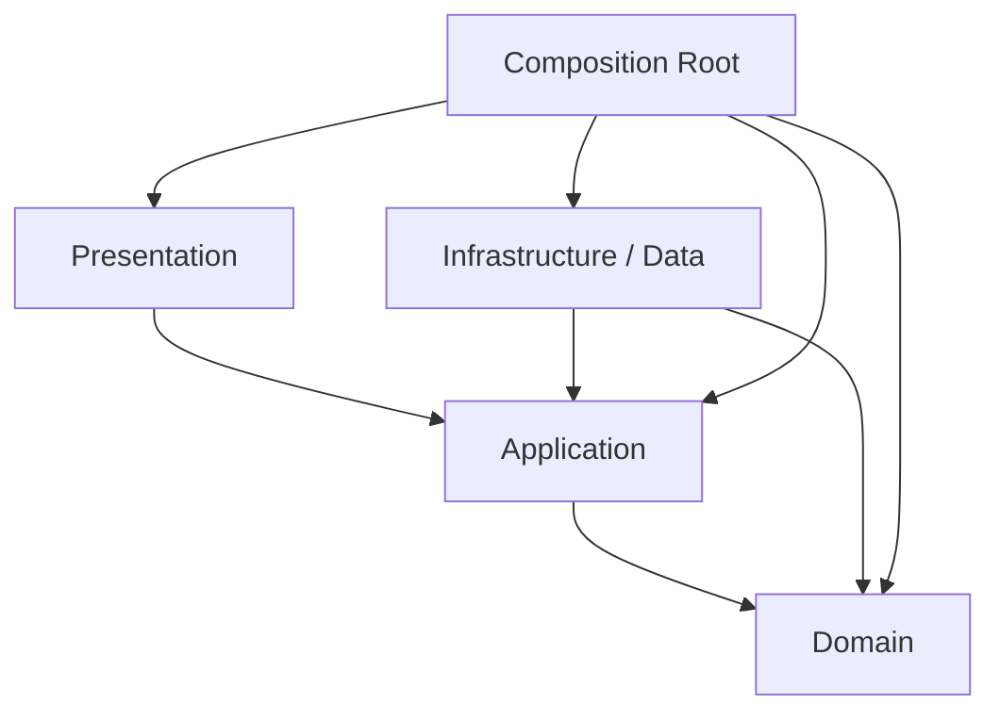

المخطط السابق يوضح اتجاه الاستيراد أو الاعتماد البنيوي، لا اتجاه انتقال البيانات وقت التشغيل.

## 3. الفرق بين Dependency Flow وRuntime Flow

اتجاه الطلب وقت التشغيل قد يبدأ من المستخدم وينزل إلى مصدر البيانات، ثم تعود النتيجة إلى الأعلى. أما اتجاه الاعتمادية فيجب أن يبقى متوافقًا مع قواعد الحدود المعمارية.

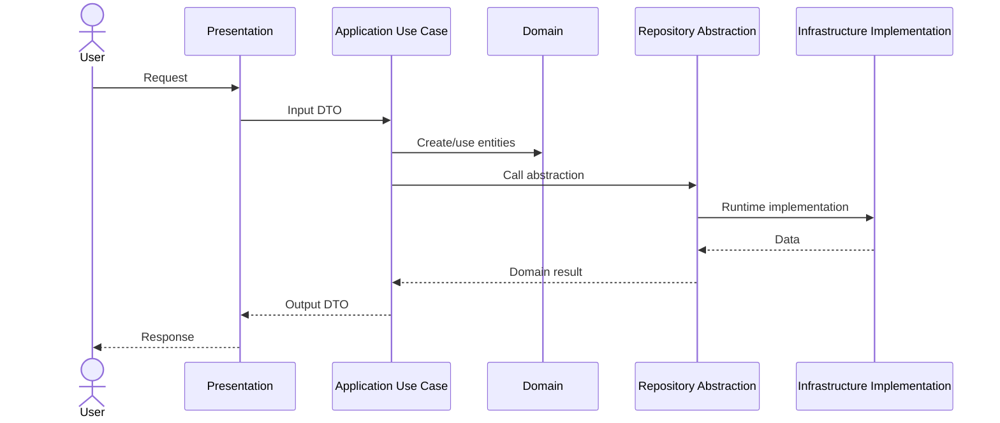

## 4. قاعدة المعرفة المحدودة

كل طبقة يجب أن تعرف أقل قدر ممكن من التفاصيل:

- `Presentation` تعرف حالات الاستخدام والعقود اللازمة للعرض.
- `Application` تعرف قواعد المجال وتجريدات الوصول المطلوبة.
- `Domain` لا تعرف الواجهة ولا قاعدة البيانات ولا إطار العمل.
- `Infrastructure` تعرف العقود التي تنفذها والتقنيات التي تتكامل معها.
- `Composition Root` يعرف الجميع لأنه مسؤول عن إنشاء الكائنات وربطها.

هذه القاعدة تقلل الاقتران، لكنها لا تعني منع جميع الاستيرادات. المطلوب هو منع الاستيرادات التي تعكس اتجاه الاعتماد الصحيح.

## 5. طبقة Presentation

### 5.1 مسؤوليتها

طبقة العرض مسؤولة عن حدود النظام مع المستخدم أو العميل الخارجي:

- HTTP Controllers.
- Routes.
- CLI commands.
- UI Screens.
- State Management.
- تحويل الطلب الخام إلى DTO.
- تحويل النتيجة إلى استجابة مناسبة.
- اختيار Status Code أو View State.
- التعامل مع أخطاء العرض العامة.

### 5.2 ما لا يجب أن يوجد فيها

- قواعد تسعير.
- SQL.
- منطق إنشاء الكيانات المعقد.
- اختيار مزود التخزين.
- حسابات المجال.
- مفاتيح الخدمات الخارجية.
- تفاصيل التوقيع والتشفير.
- منطق المعاملات.

### 5.3 مخطط التدفق

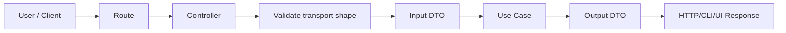

### 5.4 التحقق في Presentation

التحقق هنا يركز على شكل النقل:

- هل الحقل موجود؟
- هل JSON صالح؟
- هل النوع المتوقع رقم أو نص؟
- هل حجم الطلب ضمن الحد؟
- هل Content-Type صحيح؟

أما قواعد مثل «لا يمكن تأكيد طلب ملغى» فهي قواعد مجال وليست تحققًا شكليًا.

## 6. طبقة Application

### 6.1 دورها

طبقة التطبيق تنفذ حالات الاستخدام وتنسق العمليات. هي ليست مكانًا لقواعد المجال الجوهرية، لكنها تعرف ترتيب الخطوات المطلوبة لتحقيق هدف المستخدم.

أمثلة:

- `LoginUseCase`
- `CreateOrderUseCase`
- `GetOrderUseCase`
- `CancelSubscriptionUseCase`
- `GenerateInvoiceUseCase`

### 6.2 ما تحتويه

- Use Cases.
- Commands and Queries.
- Input DTOs.
- Output DTOs.
- Ports.
- Application-specific errors.
- Transaction orchestration.
- Authorization checks المرتبطة بحالة الاستخدام.
- التنسيق بين أكثر من Repository أو Service.

### 6.3 ما لا تحتويه

- تفاصيل HTTP.
- Widgets أو Screens.
- SQL أو SDKs.
- منطق خاص بإطار العمل.
- قواعد مجال يجب أن تحمي الكيان نفسه.

### 6.4 دورة حياة حالة الاستخدام

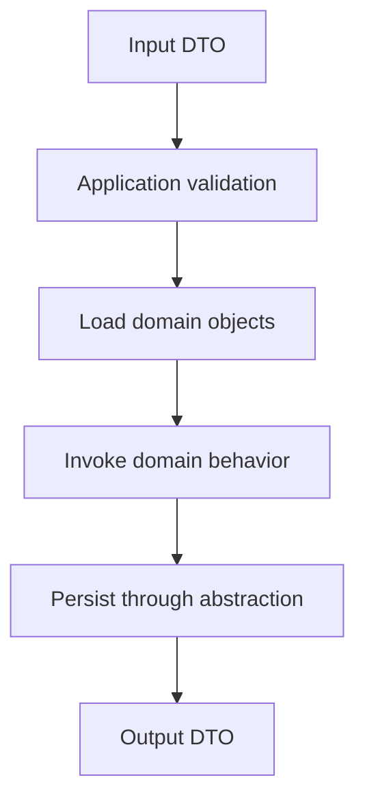

### 6.5 متى تضع القاعدة في Application؟

ضع القاعدة في Application عندما تكون مرتبطة بتنسيق حالة استخدام محددة، مثل:

- المستخدم يجب أن يكون مصادقًا لتنفيذ الحالة.
- استدعاء مستودعين بترتيب معين.
- فتح معاملة ثم إغلاقها.
- اختيار سياسة تطبيقية بناءً على صلاحية.
- إرسال حدث بعد نجاح العملية.

ولا تضع فيها قاعدة يجب أن تكون صحيحة دائمًا داخل الكيان، مثل عدم السماح بكمية سالبة.

## 7. طبقة Domain

### 7.1 قلب النظام

طبقة المجال تمثل مفاهيم العمل وقواعده، ويجب أن تبقى قابلة للاستخدام والاختبار دون تشغيل شبكة أو قاعدة بيانات.

تشمل عادةً:

- Entities.
- Value Objects.
- Domain Services.
- Policies.
- Specifications.
- Domain Events.
- Repository Contracts.
- Domain Exceptions.

### 7.2 Entities

الكيان يمتلك هوية وسلوكًا يحافظ على اتساقه. الكيان ليس مجرد حاوية بيانات.

مثال مفاهيمي:

```text
Order
- id
- userId
- items
- status
+ addItem()
+ removeItem()
+ confirm()
+ cancel()
+ total()
```

### 7.3 Value Objects

كائن القيمة:

- لا يحتاج هوية مستقلة.
- يقارن بالقيمة.
- يفضّل أن يكون غير قابل للتغيير.
- يحمي قيودًا صغيرة ومركزة.

أمثلة:

- Email.
- Money.
- DateRange.
- Quantity.
- Address.
- PhoneNumber.

### 7.4 Domain Services

استخدم Domain Service عندما تكون القاعدة مجالًا خالصًا، لكنها لا تنتمي بوضوح إلى كيان واحد.

مثال: حساب عمولة تعتمد على عدة عقود وسياسات.

### 7.5 Repository Interfaces

المستودع في المجال يمثل عقدًا للوصول إلى مجموعة من الكيانات. لا يجب أن يعرض تفاصيل SQL أو أسماء الجداول.

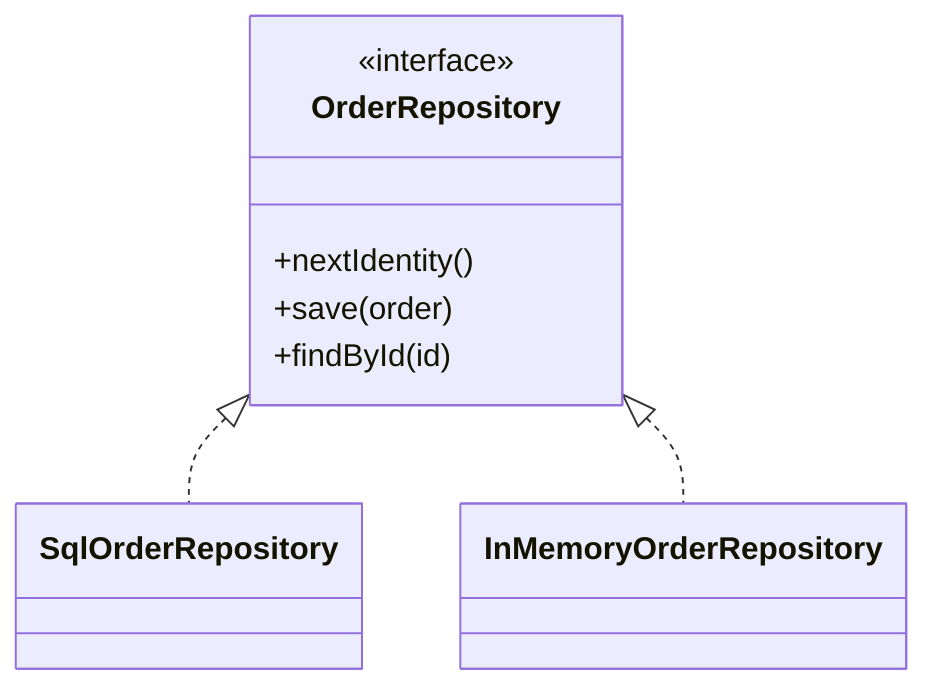

## 8. طبقة Infrastructure / Data

### 8.1 مسؤوليتها

هي مكان التفاصيل التقنية القابلة للاستبدال:

- قواعد البيانات.
- HTTP Clients.
- Files.
- Cache.
- Message Brokers.
- Email providers.
- Payment providers.
- Logging adapters.
- Cryptography implementations.
- Repository implementations.
- Mappers.

### 8.2 قاعدة التسريب

لا تسمح لنماذج ORM أو SDK بالخروج إلى الطبقات الأعلى. حوّلها إلى Domain Entities أو DTOs مناسبة.

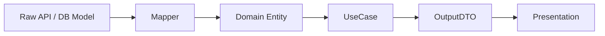

### 8.3 Mappers

المحوّل يجب أن يكون واضح المسؤولية:

- `fromPersistence`
- `toPersistence`
- `fromApi`
- `toDomain`
- `toDto`

لا تخلط التحويل مع قواعد الأعمال أو الاتصال الخارجي.

## 9. Composition Root

`Composition Root` هو المكان الذي تُنشأ فيه الكائنات الفعلية ويتم حقنها في بعضها.

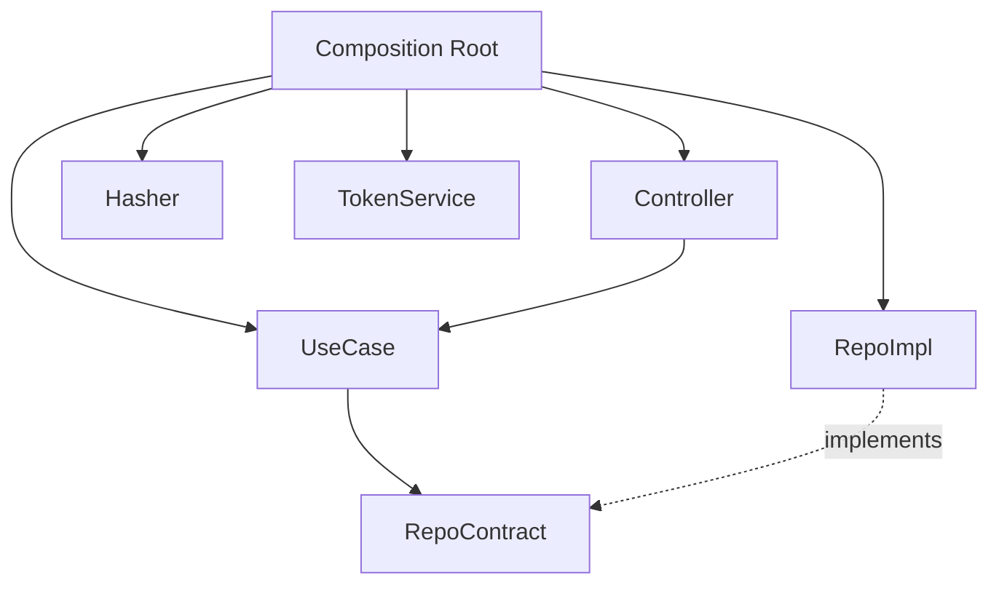

مزاياه:

- يجمع قرارات البنية في مكان واحد.
- يمنع استخدام `new` داخل حالات الاستخدام.
- يسهل تبديل التنفيذات.
- يجعل الاختبارات تستخدم Fakes.
- يوضح دورة حياة الكائنات.

## 10. النمط الطبقي مقابل النمط القائم على الميزات

النمط الطبقي ينظم المشروع حسب نوع المسؤولية:

```text
presentation/
application/
domain/
infrastructure/
```

أما النمط القائم على الميزات فينظم المستوى الأعلى حسب الميزة:

```text
features/
  auth/
  orders/
  profile/
```

يمكن الجمع بينهما:

```text
features/
  auth/
    presentation/
    application/
    domain/
    infrastructure/
```

المشروع الصغير قد يستفيد من الطبقات على المستوى الأعلى. المشروع الكبير غالبًا يحتاج إلى حدود ميزات أو Modules حتى لا تتحول كل طبقة إلى مجلد ضخم.

## 11. قواعد حدود الطبقات

قواعد عملية:

1. Domain لا تستورد من Application.
2. Domain لا تستورد من Infrastructure.
3. Domain لا تستورد من Presentation.
4. Application لا تستورد من Presentation.
5. Application لا تعتمد على implementations في Infrastructure.
6. Presentation لا تنشئ Repository implementation.
7. Infrastructure تنفذ العقود.
8. Composition Root مسموح له بمعرفة الجميع.
9. الاختبارات قد تعبر الحدود لإنشاء Fixtures، لكن يجب ألا تجعل الإنتاج يعتمد عليها.
10. كل استثناء على القاعدة يجب توثيقه.

## 12. أنواع العقود بين الطبقات

### 12.1 Repository Contract

يمثل الوصول إلى Aggregates أو Entities.

### 12.2 Service Port

يمثل قدرة خارجية، مثل:

- إرسال بريد.
- إصدار Token.
- تشفير كلمة مرور.
- الحصول على وقت.
- تحميل ملف.

### 12.3 Input Port

واجهة حالة الاستخدام عندما تحتاج إلى فصل إضافي عن التنفيذ.

### 12.4 Output Port

يستخدم عندما يكون إخراج حالة الاستخدام متعدد الأشكال أو يحتاج Presenter.

## 13. DTOs

DTO ليس كيان مجال. مهمته نقل بيانات عبر حد معماري.

قواعد عملية:

- لا تضف سلوك مجال إلى DTO.
- لا تمرر ORM model مباشرة.
- لا تجعل كل DTO نسخة مطابقة للكيان.
- صمّم DTO حسب حاجة الحالة.
- افصل Input DTO عن Output DTO عندما تختلف المسؤولية.

## 14. Mapping

هناك ثلاثة أنواع شائعة:

1. Transport DTO ↔ Application DTO.
2. Persistence Model ↔ Domain Entity.
3. Domain Result ↔ Output DTO.

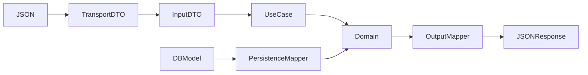

## 15. Error Handling

قسّم الأخطاء حسب مصدرها:

- Domain errors: انتهاك قاعدة عمل.
- Application errors: فشل حالة استخدام أو عدم وجود مورد.
- Infrastructure errors: انقطاع شبكة أو قاعدة بيانات.
- Presentation errors: JSON غير صالح أو Route غير موجود.

لا تعرض Stack Trace للمستخدم النهائي.

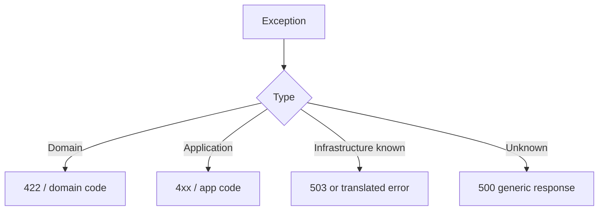

## 16. Validation Strategy

قسّم التحقق إلى مستويات:

| المستوى | أمثلة |
|---|---|
| Presentation | JSON صالح، نوع الحقل، الحجم |
| Application | حقول الحالة المطلوبة، الصلاحية |
| Domain | القواعد التي يجب أن تكون صحيحة دائمًا |
| Infrastructure | قيود المزود، صيغة الاستجابة الخارجية |

التكرار البسيط المقبول أحيانًا أفضل من تسريب مسؤولية طبقة إلى طبقة أخرى.

## 17. Transactions

المعاملة غالبًا مسؤولية Application/Infrastructure:

- Application تحدد حدود العملية.
- Infrastructure تنفذ Unit of Work أو Transaction Manager.
- Domain لا يعرف BEGIN وCOMMIT.

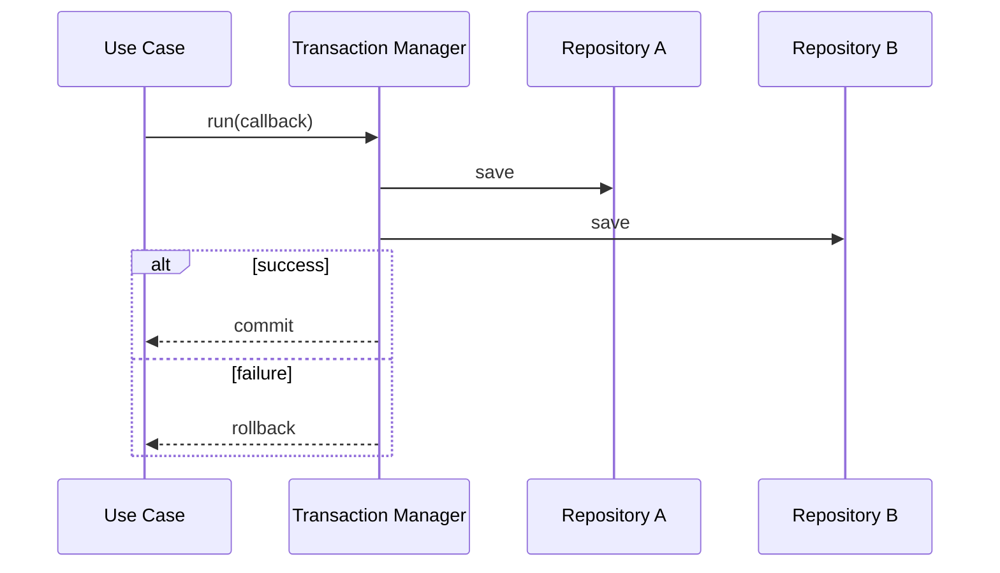

## 18. Caching

لا تجعل Cache يغير معنى العقد.

استراتيجيات:

- Cache-aside.
- Read-through.
- Write-through.
- Stale-while-revalidate.

يمكن تنفيذ Decorator حول Repository دون تعديل Use Case.

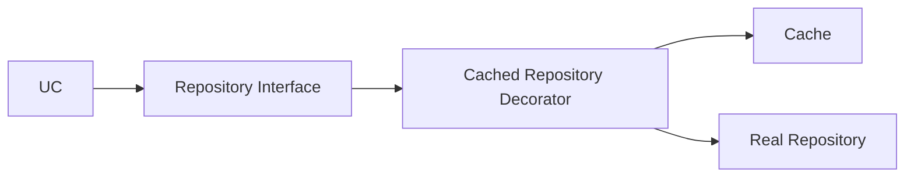

## 19. Authentication وAuthorization

- Authentication تتحقق من الهوية.
- Authorization تتحقق من السماح بالفعل.
- إصدار Token تفصيل خارجي عبر Port.
- قواعد مثل «لا يستطيع المستخدم تعطيل نفسه» قد تكون Application أو Domain حسب السياق.
- لا تجعل Controller يقرر صلاحيات معقدة.

## 20. Logging وMonitoring

السجل الجيد يصف الحدث ولا يسرّب أسرارًا.

سجّل:

- correlation id.
- use case name.
- elapsed time.
- error code.
- external provider.
- retry count.

لا تسجّل:

- كلمات المرور.
- tokens كاملة.
- بيانات حساسة غير لازمة.
- stack traces للمستخدم.

## 21. Testing Pyramid

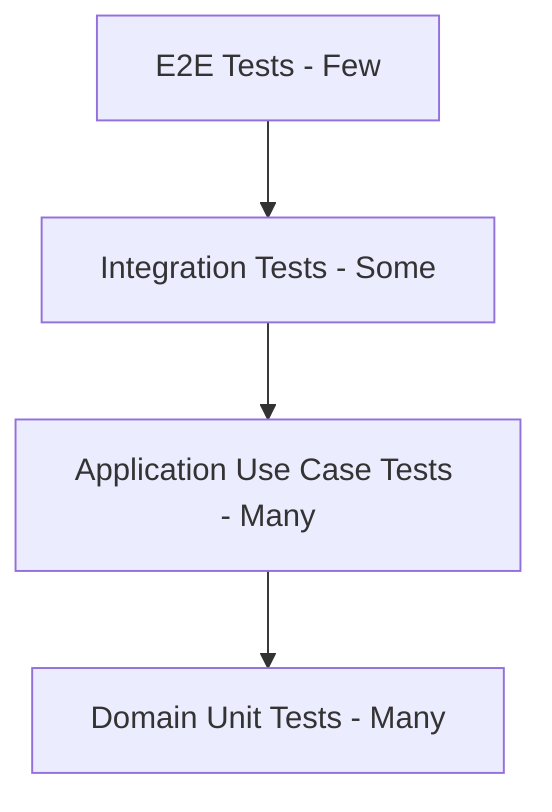

### 21.1 Domain Tests

- سريعة.
- بلا شبكة.
- بلا قاعدة بيانات.
- تركز على invariants.

### 21.2 Application Tests

- تستخدم Fakes للعقود.
- تختبر ترتيب التنسيق.
- تتحقق من الأخطاء.
- لا تحتاج HTTP.

### 21.3 Infrastructure Tests

- تركز على صحة Adapter.
- قد تستخدم قاعدة بيانات اختبارية.
- تتحقق من Mapping.

### 21.4 Presentation Tests

- Status codes.
- Request parsing.
- Response shape.
- Error mapping.

## 22. Architecture Tests

يمكن إضافة فحص آلي يمنع استيرادات غير مسموحة.

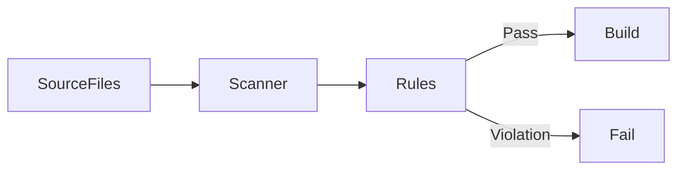

الفحص المعماري لا يغني عن مراجعة التصميم، لكنه يمنع أخطاء واضحة.

---

# الجزء الثاني: تطبيق مبادئ SOLID داخل المعمارية الطبقية

## 23. SRP — Single Responsibility Principle

### 23.1 المعنى

كل وحدة برمجية يجب أن تمتلك سببًا واحدًا متماسكًا للتغيير. المقصود ليس أن تحتوي دالة واحدة فقط، بل أن تكون مسؤوليتها موجهة لفاعل أو سياسة واحدة.

### 23.2 تطبيقه عبر الطبقات

- Controller: تحويل HTTP إلى طلب تطبيق.
- Use Case: تنفيذ هدف واحد.
- Entity: حماية قواعد كيان واحد.
- Mapper: تحويل تمثيل إلى تمثيل.
- Repository Implementation: الوصول إلى مصدر محدد.
- Token Service: إصدار أو التحقق من الرموز.

### 23.3 علامة الانتهاك

إذا تغير الملف عند تغيير واجهة المستخدم، وقاعدة البيانات، وقاعدة العمل في الوقت نفسه، فهو يحمل أكثر من مسؤولية.

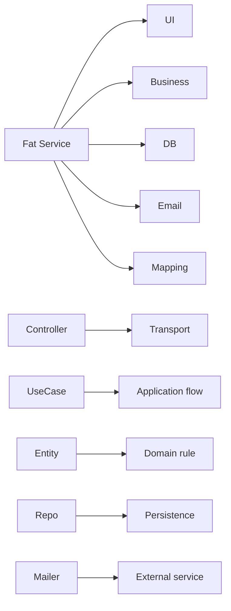

## 24. OCP — Open/Closed Principle

### 24.1 المعنى

المكونات المستقرة يجب أن تكون قابلة للتوسعة دون تعديل متكرر.

### 24.2 تطبيقه

- إضافة Repository implementation جديد.
- إضافة Strategy جديدة.
- إضافة Payment Adapter.
- إضافة Notification Channel.
- استخدام Decorator للتخزين المؤقت.
- إضافة Presenter جديد.

### 24.3 تجنب if/else العملاقة

بدلًا من اختيار المزود داخل Use Case، استخدم عقدًا وتنفيذات متعددة.

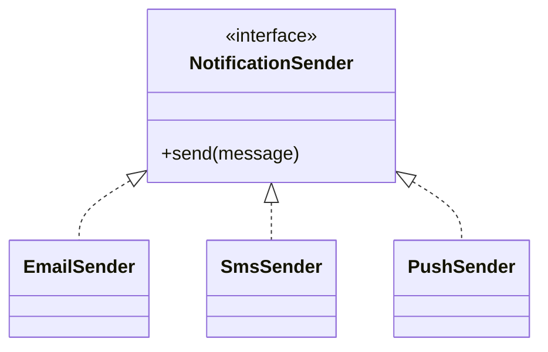

## 25. LSP — Liskov Substitution Principle

### 25.1 المعنى

كل تنفيذ لعقد يجب أن يحافظ على التوقعات السلوكية للعقد.

لا يكفي أن يطابق أسماء الدوال. يجب أن يحافظ على:

- شروط الإدخال.
- شكل الإخراج.
- الأخطاء المتوقعة.
- دلالات null.
- الاتساق.
- الترتيب إذا كان جزءًا من العقد.

### 25.2 مثال Repository

إذا كان `findById` يعيد `null` عند عدم الوجود، فلا يجب أن يرمي تنفيذ آخر خطأً عشوائيًا لنفس الحالة دون توثيق.

## 26. ISP — Interface Segregation Principle

### 26.1 المعنى

العميل لا يجب أن يعتمد على عمليات لا يحتاجها.

بدل واجهة ضخمة:

```text
GenericRepository
- findAll
- findById
- save
- delete
- search
- count
- export
```

استخدم عقودًا موجهة:

```text
OrderReader
OrderWriter
OrderIdentitySource
```

### 26.2 فائدة ISP

- Fakes أبسط.
- اختبارات أسهل.
- اعتماد أقل.
- تغييرات محدودة.
- عقود أوضح.

## 27. DIP — Dependency Inversion Principle

### 27.1 المعنى

الوحدات عالية المستوى لا تعتمد على التفاصيل منخفضة المستوى. كلاهما يعتمد على تجريدات.

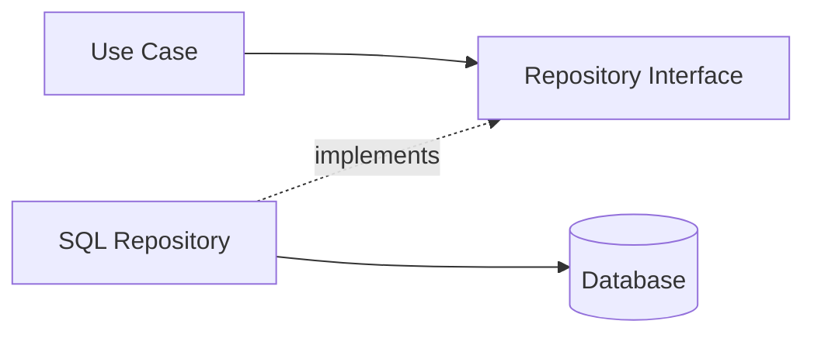

### 27.2 من يملك التجريد؟

يفضّل أن يملك التجريد الطرف الذي يحتاج القدرة، لا الطرف الذي يقدمها. لذلك Repository interface غالبًا في Domain أو Application، بينما التنفيذ في Infrastructure.

## 28. خريطة SOLID على الطبقات

| المبدأ | Presentation | Application | Domain | Infrastructure |
|---|---:|---:|---:|---:|
| SRP | قوي | قوي | قوي | قوي |
| OCP | متوسط | قوي | قوي | قوي |
| LSP | محدود | قوي | قوي | قوي |
| ISP | قوي | قوي | قوي | قوي |
| DIP | متوسط | قوي جدًا | قوي جدًا | تنفيذ |

## 29. تفاعل المبادئ

المبادئ ليست مستقلة بالكامل:

- SRP يجعل العقود أكثر تركيزًا، فيدعم ISP.
- ISP يقلل الاعتماد، فيدعم DIP.
- DIP يسمح بتوسعة التنفيذات، فيدعم OCP.
- LSP يحافظ على صحة الاستبدال الذي يتيحه DIP.
- OCP ينجح عندما تكون المسؤوليات مستقرة ومحددة.

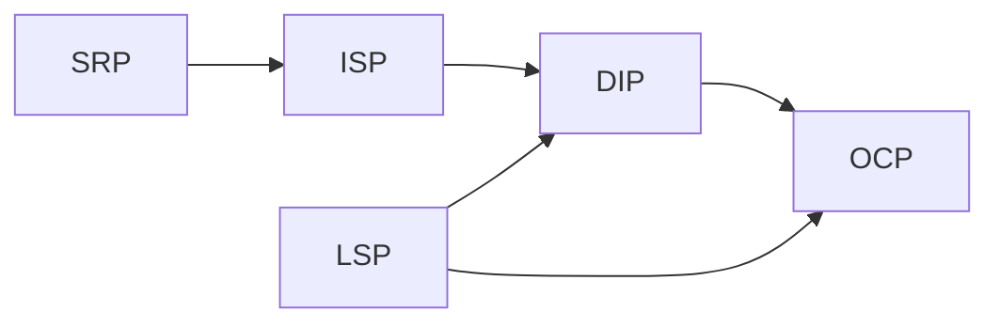

## 30. Anti-Patterns شائعة

### 30.1 Fat Controller

يعالج الطلب ويطبق القواعد وينفذ SQL ويرسل البريد.

### 30.2 Anemic Domain مع منطق مبعثر

الكيانات مجرد بيانات وجميع القواعد في Services عامة.

### 30.3 Generic Repository مبالغ فيه

عقد ضخم لا يعبّر عن لغة المجال.

### 30.4 Service Locator مخفي

الحصول على الاعتمادات من Global container داخل الدوال.

### 30.5 Framework Leakage

أنواع إطار العمل تظهر في Domain.

### 30.6 DTO Leakage

تمرير DTO النقل كأنه كيان مجال.

### 30.7 Circular Dependencies

طبقتان تستوردان بعضهما.

## 31. استراتيجية Refactoring

1. اختر حالة استخدام واحدة.
2. اكتب اختبارًا لسلوكها الحالي.
3. استخرج قواعد المجال.
4. أنشئ عقد Repository.
5. انقل الوصول الخارجي إلى Infrastructure.
6. اجعل Controller رقيقًا.
7. أنشئ Composition Root.
8. أضف فحص حدود.
9. كرر على الحالة التالية.

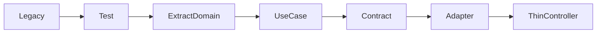

## 32. قرار مستوى التعقيد

لا تستخدم كل نمط في كل مشروع.

استخدم تقسيمًا أبسط عندما:

- المشروع تجربة قصيرة.
- لا توجد قواعد مجال.
- لا يوجد أكثر من مزود.
- عمر المشروع قصير.

استخدم معمارية أوضح عندما:

- الفريق متعدد.
- قواعد العمل تتغير.
- الاختبارات مهمة.
- توجد مصادر بيانات متعددة.
- النظام طويل العمر.
- هناك متطلبات امتثال.

## 33. قائمة مراجعة التصميم

### Domain

- [ ] لا يستورد إطار عمل.
- [ ] الكيانات تحمي invariants.
- [ ] Value Objects غير قابلة للتغيير قدر الإمكان.
- [ ] العقود تعبر عن لغة المجال.
- [ ] الأخطاء ذات معنى.

### Application

- [ ] كل Use Case له هدف واحد.
- [ ] يعتمد على Abstractions.
- [ ] لا يعرف HTTP أو SQL.
- [ ] DTOs صغيرة.
- [ ] الأخطاء مترجمة بوضوح.

### Infrastructure

- [ ] لا يسرّب نماذج خام.
- [ ] ينفذ العقود بدقة.
- [ ] الاتصال الخارجي معزول.
- [ ] retries وtimeouts واضحة.
- [ ] التحويل منفصل.

### Presentation

- [ ] Controller رقيق.
- [ ] التحقق الشكلي هنا.
- [ ] لا توجد قواعد أعمال.
- [ ] الأخطاء تتحول إلى استجابة آمنة.
- [ ] الاستجابة مستقرة.

## 34. أسئلة مراجعة الكود

1. ما سبب تغيير هذا الملف؟
2. هل يعرف تفاصيل لا يحتاجها؟
3. هل يمكن اختباره دون شبكة؟
4. هل يمكن تبديل التنفيذ؟
5. هل العقد أصغر من حاجة العميل أم أكبر؟
6. هل التنفيذ يحافظ على LSP؟
7. هل يوجد تسريب لإطار العمل؟
8. هل توجد قاعدة مجال خارج Domain؟
9. هل Composition Root واضح؟
10. هل الأخطاء مترجمة عبر الحدود؟

## 35. تمارين عملية

### تمرين 1

أضف `EmailNotificationSender` و`SmsNotificationSender` خلف عقد واحد.

### تمرين 2

أضف `CachedOrderRepository` باستخدام Decorator.

### تمرين 3

أنشئ `CancelOrderUseCase` يحمي حالة الطلب.

### تمرين 4

أضف Infrastructure adapter يقرأ من ملف JSON.

### تمرين 5

اكتب Architecture Test يمنع Domain من استيراد Infrastructure.

### تمرين 6

قسّم واجهة كبيرة إلى Reader وWriter.

### تمرين 7

استبدل Token service بتطبيق مختلف دون تعديل LoginUseCase.

## 36. مخطط المشروع المرجعي

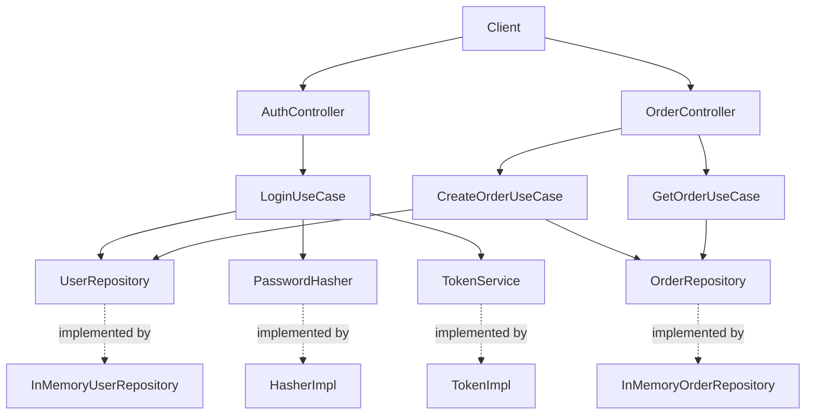

## 37. سيناريو Login

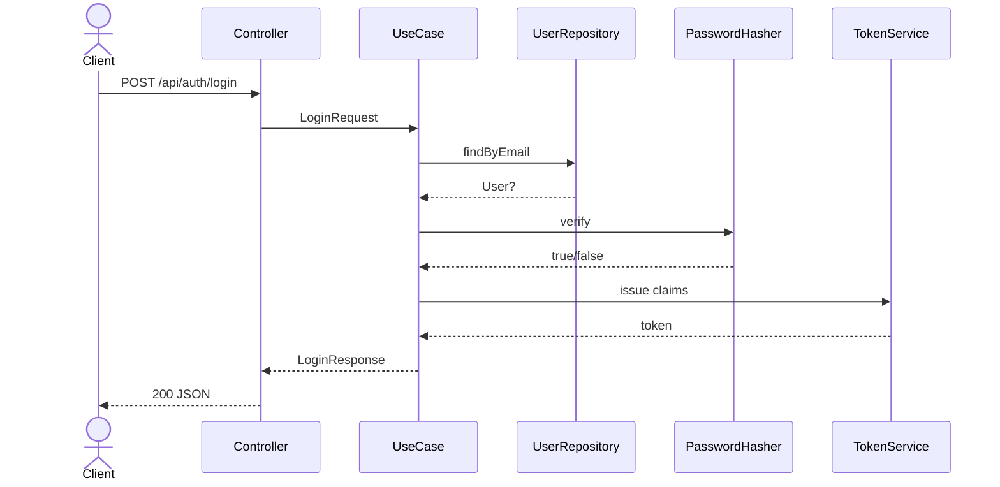

## 38. سيناريو Create Order

```mermaid
sequenceDiagram
    actor Client
    participant Controller
    participant UseCase
    participant Users as UserRepository
    participant Orders as OrderRepository
    participant Domain as Order Entity

    Client->>Controller: POST /api/orders
    Controller->>UseCase: CreateOrderRequest
    UseCase->>Users: findById
    Users-->>UseCase: User
    UseCase->>Orders: nextIdentity
    Orders-->>UseCase: id
    UseCase->>Domain: create Order + Items
    Domain-->>UseCase: valid aggregate
    UseCase->>Orders: save(order)
    UseCase-->>Controller: Order DTO
    Controller-->>Client: 201 JSON
```

## 39. معايير قبول المشروع

- يمكن تشغيله محليًا.
- ينجح Login الصحيح.
- يفشل Login الخاطئ.
- يمكن إنشاء طلب.
- يمكن استرجاع الطلب.
- Domain لا يعتمد على Infrastructure.
- الاختبارات لا تحتاج خادمًا حقيقيًا.
- استبدال Repository لا يتطلب تعديل Use Case.
- الأخطاء ذات codes مستقرة.
- لا تُعرض كلمة المرور في الاستجابة.

## 40. الخلاصة

المعمارية الطبقية النظيفة لا تقاس بعدد المجلدات، بل بجودة الحدود. عندما تكون المسؤوليات واضحة، والعقود مملوكة للطرف الصحيح، والاعتمادات تتجه نحو التجريدات، يصبح التغيير أقل تكلفة والاختبار أكثر واقعية.

# القسم التطبيقي بلغة JavaScript

## 41. اختيارات المشروع

المشروع يستخدم:

- Node.js 20+.
- ECMAScript Modules.
- `node:http` بدل إطار خارجي لتوضيح الحدود.
- `node:test` للاختبارات.
- In-memory repositories لتسهيل التشغيل.
- Composition Root يدوي.
- SHA-256 للتجربة التعليمية فقط، وليس لتخزين كلمات المرور في الإنتاج.
- HMAC-like token example للتعليم، وليس بديلًا عن مكتبة JWT مدققة.

## 42. لماذا JavaScript تحتاج حدودًا أوضح؟

JavaScript لغة ديناميكية، لذلك لا توفر واجهات اسمية مثل بعض اللغات. يمكن تمثيل العقود بأصناف مجردة سلوكيًا أو عبر TypeScript أو اختبارات العقد.

في هذا المشروع تُستخدم أصناف Contract ترمي خطأً في التنفيذ الافتراضي:

```javascript
export class UserRepository {
  async findByEmail(_email) {
    throw new Error("UserRepository.findByEmail must be implemented.");
  }
}
```

التنفيذ يرث العقد:

```javascript
export class InMemoryUserRepository extends UserRepository {
  async findByEmail(email) {
    // implementation
  }
}
```

## 43. مثال SRP في JavaScript

### سيئ

```javascript
class AuthController {
  async login(req, res) {
    const user = await db.query("SELECT ...");
    const ok = await bcrypt.compare(req.body.password, user.hash);
    const token = jwt.sign({ sub: user.id }, secret);
    res.end(JSON.stringify({ token }));
  }
}
```

### أفضل

```javascript
class AuthController {
  constructor({ loginUseCase }) {
    this.loginUseCase = loginUseCase;
  }

  login = async (req, res) => {
    const body = await readJsonBody(req);
    const result = await this.loginUseCase.execute(new LoginRequest(body));
    sendJson(res, 200, result.toJSON());
  };
}
```

## 44. مثال DIP في JavaScript

```javascript
export class LoginUseCase {
  constructor({ userRepository, passwordHasher, tokenService }) {
    this.userRepository = userRepository;
    this.passwordHasher = passwordHasher;
    this.tokenService = tokenService;
  }
}
```

لا ينشئ Use Case التنفيذات بنفسه. يتم الحقن في Composition Root.

## 45. اختبار Use Case

```javascript
test("LoginUseCase returns a token", async () => {
  const userRepository = new InMemoryUserRepository([user]);
  const tokenService = { issue: async () => "token-1" };

  const useCase = new LoginUseCase({
    userRepository,
    passwordHasher,
    tokenService
  });

  const result = await useCase.execute(request);
  assert.equal(result.token, "token-1");
});
```

## 46. تشغيل مشروع JavaScript

```bash
npm test
npm run check:boundaries
npm start
```

## 47. طلب Login

```bash
curl -X POST http://localhost:3000/api/auth/login \
  -H 'content-type: application/json' \
  -d '{"email":"anwar@example.com","password":"secret123"}'
```

## 48. إنشاء طلب

```bash
curl -X POST http://localhost:3000/api/orders \
  -H 'content-type: application/json' \
  -d '{
    "userId":"u-1",
    "currency":"USD",
    "items":[
      {
        "productId":"p-1",
        "name":"Keyboard",
        "unitPrice":80,
        "quantity":2
      }
    ]
  }'
```

## 49. ملاحظات الإنتاج

استبدل الأمثلة التعليمية بما يلي:

- Password hashing: Argon2id أو bcrypt من مكتبة موثوقة.
- Tokens: مكتبة JWT مدققة أو جلسات آمنة.
- Secrets: Secret manager.
- Database: Adapter حقيقي مع migrations.
- Validation: schema validator في Presentation.
- Observability: structured logging وmetrics.
- Rate limiting.
- TLS.
- Security headers.

# أسئلة وأجوبة متقدمة — JavaScript

## هل كل مشروع يحتاج أربع طبقات؟

لا. الطبقات أداة لضبط المسؤولية. قد تدمج Application وDomain في مشروع CRUD صغير، لكن يجب أن يكون القرار واعيًا.

## هل Repository دائمًا في Domain؟

ليس دائمًا. ضع العقد قرب الطرف الذي يحتاجه. إذا كان العقد يعبر عن مجموعة كيانات مجال، فـDomain مناسبة. إذا كان Port خاصًا بتنسيق حالة استخدام، فقد يكون في Application.

## هل DTO ضروري لكل دالة؟

لا. استخدمه عند عبور حد معماري أو عندما تحتاج عقدًا مستقرًا. لا تنشئ DTOs شكلية دون قيمة.

## هل يجوز للـInfrastructure الاعتماد على Domain؟

نعم، لأنها تنفذ عقودًا وتحوّل إلى كيانات. الاتجاه العكسي هو المشكلة.

## هل يجوز لـPresentation الاعتماد على Domain؟

يفضل أن تمر عبر Application. قد تستخدم أنواعًا بسيطة للعرض، لكن الاعتماد المباشر الواسع يجعل الواجهة تتجاوز حالات الاستخدام.

## أين توضع الصلاحيات؟

صلاحيات النقل البسيطة في Presentation middleware. صلاحيات حالة الاستخدام في Application. قواعد لا يمكن انتهاكها في Domain.

## أين توضع الأحداث؟

Domain Events في Domain. نشرها الفعلي عبر Event Bus في Infrastructure، والتنسيق في Application.

## ماذا عن CQRS؟

يمكن استخدام Commands وQueries داخل Application دون تبني CQRS كامل. لا تضف التعقيد إلا عند وجود حاجة.

## ماذا عن Microservices؟

المعمارية الداخلية للخدمة لا تتحدد بكون النظام Microservices. يمكن لكل خدمة تطبيق طبقات نظيفة.

## كيف أعرف أن الطبقات أصبحت مبالغًا فيها؟

عندما يكون كل تغيير بسيط يتطلب عشرات الملفات دون فائدة في الاختبار أو الاستبدال، راجع مستوى التجريد.

# قاموس المصطلحات

| المصطلح | المعنى |
|---|---|
| Entity | كيان ذو هوية وسلوك |
| Value Object | كائن يقارن بالقيمة |
| Use Case | عملية تطبيقية تحقق هدفًا |
| Repository | عقد للوصول إلى مجموعة كيانات |
| Adapter | تنفيذ يربط عقدًا بتقنية |
| Port | واجهة لقدرة يحتاجها النظام |
| DTO | كائن نقل بيانات |
| Mapper | محول بين تمثيلات |
| Composition Root | نقطة إنشاء وربط الاعتمادات |
| Invariant | قاعدة يجب أن تبقى صحيحة |
| Coupling | مقدار الارتباط بين المكونات |
| Cohesion | تماسك المسؤوليات داخل الوحدة |
| Boundary | حد يفصل مسؤوليات أو سياسات |
| Dependency | معرفة بنيوية أو استيراد |
| Interaction | تفاعل وقت التشغيل |
| Policy | قاعدة أو قرار |
| Strategy | تنفيذ قابل للتبديل |
| Decorator | غلاف يضيف سلوكًا |
| Fake | تنفيذ اختبار بسيط |
| Stub | إجابة اختبار ثابتة |
| Mock | كائن يتحقق من التفاعل |

# قائمة تحقق قبل النشر

- [ ] جميع الاختبارات ناجحة.
- [ ] فحص الحدود ناجح.
- [ ] لا توجد أسرار داخل المستودع.
- [ ] كلمات المرور لا تُسجل.
- [ ] timeouts مضبوطة.
- [ ] الأخطاء الخارجية مترجمة.
- [ ] DTOs لا تسرب بيانات حساسة.
- [ ] Status codes أو UI states متسقة.
- [ ] Database migrations معروفة.
- [ ] Observability مفعلة.
- [ ] النسخ الاحتياطي مجرّب.
- [ ] الاسترجاع مجرّب.
- [ ] المعدلات محدودة.
- [ ] الاعتمادات محدثة.
- [ ] الترخيص واضح.

# نهاية الدليل النظري

الأقسام التالية تحتوي قائمة ملفات المشروع المرجعي وكود كل ملف حتى يكون الدليل مكتفيًا ذاتيًا.

# ملحق المشروع المرجعي الكامل

## شجرة الملفات

```text
.gitignore
README.md
package.json
scripts/check-boundaries.js
src/application/dto/CreateOrderRequest.js
src/application/dto/LoginRequest.js
src/application/dto/LoginResponse.js
src/application/errors/ApplicationError.js
src/application/ports/PasswordHasher.js
src/application/ports/TokenService.js
src/application/usecases/CreateOrderUseCase.js
src/application/usecases/GetOrderUseCase.js
src/application/usecases/LoginUseCase.js
src/composition/createContainer.js
src/composition/createHttpHandler.js
src/domain/entities/Order.js
src/domain/entities/User.js
src/domain/errors/DomainError.js
src/domain/repositories/OrderRepository.js
src/domain/repositories/UserRepository.js
src/domain/value-objects/Email.js
src/domain/value-objects/Money.js
src/infrastructure/repositories/InMemoryOrderRepository.js
src/infrastructure/repositories/InMemoryUserRepository.js
src/infrastructure/security/HmacTokenService.js
src/infrastructure/security/Sha256PasswordHasher.js
src/presentation/controllers/AuthController.js
src/presentation/controllers/OrderController.js
src/presentation/http/Router.js
src/presentation/http/readJsonBody.js
src/presentation/http/sendJson.js
src/presentation/middleware/errorHandler.js
src/server.js
src/shared/Result.js
test/application/CreateOrderUseCase.test.js
test/application/LoginUseCase.test.js
test/domain/Money.test.js
```

## ملفات المشروع

### `.gitignore`

```javascript
node_modules/
.env
coverage/
```

### `README.md`

```markdown
# JavaScript Layered Clean Architecture Example

A runnable Node.js example that demonstrates:

- Presentation, Application, Domain, and Infrastructure/Data layers.
- SOLID principles applied across layer boundaries.
- Login, order creation, and order retrieval use cases.
- Dependency injection through a composition root.
- Unit tests with the built-in `node:test` runner.
- A simple dependency-boundary checker.

## Requirements

- Node.js 20 or newer.

## Run

```bash
npm test
npm run check:boundaries
npm start
```

The server listens on `http://localhost:3000`.

## Demo credentials

- Email: `anwar@example.com`
- Password: `secret123`

## Example requests

```bash
curl -X POST http://localhost:3000/api/auth/login \
  -H 'content-type: application/json' \
  -d '{"email":"anwar@example.com","password":"secret123"}'
```

```bash
curl -X POST http://localhost:3000/api/orders \
  -H 'content-type: application/json' \
  -d '{"userId":"u-1","currency":"USD","items":[{"productId":"p-1","name":"Keyboard","unitPrice":80,"quantity":2}]}'
```
```

### `package.json`

```json
{
  "name": "javascript-layered-clean-architecture-example",
  "version": "1.0.0",
  "description": "Layered Clean Architecture + SOLID example using only Node.js built-ins",
  "type": "module",
  "scripts": {
    "start": "node src/server.js",
    "test": "node --test",
    "check:boundaries": "node scripts/check-boundaries.js"
  },
  "engines": {
    "node": ">=20"
  }
}
```

### `scripts/check-boundaries.js`

```javascript
import { readdir, readFile } from "node:fs/promises";
import { join, relative } from "node:path";

const root = new URL("../src/", import.meta.url);
const forbidden = {
  domain: ["/application/", "/presentation/", "/infrastructure/", "/composition/"],
  application: ["/presentation/", "/infrastructure/", "/composition/"],
  infrastructure: ["/presentation/"],
  presentation: ["/infrastructure/"]
};

async function files(directoryUrl) {
  const entries = await readdir(directoryUrl, { withFileTypes: true });
  const result = [];
  for (const entry of entries) {
    const child = new URL(`${entry.name}${entry.isDirectory() ? "/" : ""}`, directoryUrl);
    if (entry.isDirectory()) result.push(...(await files(child)));
    if (entry.isFile() && entry.name.endsWith(".js")) result.push(child);
  }
  return result;
}

let violations = 0;
for (const fileUrl of await files(root)) {
  const path = fileUrl.pathname;
  const layer = Object.keys(forbidden).find((name) => path.includes(`/src/${name}/`));
  if (!layer) continue;
  const content = await readFile(fileUrl, "utf8");
  for (const marker of forbidden[layer]) {
    if (content.includes(marker)) {
      violations += 1;
      console.error(`Boundary violation in ${fileUrl.pathname}: imports ${marker}`);
    }
  }
}

if (violations > 0) {
  process.exitCode = 1;
} else {
  console.log("No dependency-boundary violations found.");
}
```

### `src/application/dto/CreateOrderRequest.js`

```javascript
import { ApplicationError } from "../errors/ApplicationError.js";

export class CreateOrderRequest {
  constructor({ userId, currency, items }) {
    if (!userId || !currency || !Array.isArray(items) || items.length === 0) {
      throw new ApplicationError(
        "INVALID_ORDER_REQUEST",
        "userId, currency, and at least one item are required.",
        422
      );
    }
    this.userId = String(userId);
    this.currency = String(currency).toUpperCase();
    this.items = items.map((item) => ({ ...item }));
    Object.freeze(this);
  }
}
```

### `src/application/dto/LoginRequest.js`

```javascript
import { ApplicationError } from "../errors/ApplicationError.js";

export class LoginRequest {
  constructor({ email, password }) {
    if (!email || !password) {
      throw new ApplicationError(
        "INVALID_LOGIN_REQUEST",
        "Email and password are required.",
        422
      );
    }
    this.email = String(email).trim().toLowerCase();
    this.password = String(password);
    Object.freeze(this);
  }
}
```

### `src/application/dto/LoginResponse.js`

```javascript
export class LoginResponse {
  constructor({ token, user }) {
    this.token = token;
    this.user = user;
    Object.freeze(this);
  }

  toJSON() {
    return { token: this.token, user: this.user };
  }
}
```

### `src/application/errors/ApplicationError.js`

```javascript
export class ApplicationError extends Error {
  constructor(code, message, status = 400, details = undefined) {
    super(message);
    this.name = "ApplicationError";
    this.code = code;
    this.status = status;
    this.details = details;
  }
}
```

### `src/application/ports/PasswordHasher.js`

```javascript
export class PasswordHasher {
  async hash(_plainText) {
    throw new Error("PasswordHasher.hash must be implemented.");
  }

  async verify(_plainText, _hash) {
    throw new Error("PasswordHasher.verify must be implemented.");
  }
}
```

### `src/application/ports/TokenService.js`

```javascript
export class TokenService {
  async issue(_claims) {
    throw new Error("TokenService.issue must be implemented.");
  }
}
```

### `src/application/usecases/CreateOrderUseCase.js`

```javascript
import { Order, OrderItem } from "../../domain/entities/Order.js";
import { ApplicationError } from "../errors/ApplicationError.js";

export class CreateOrderUseCase {
  constructor({ userRepository, orderRepository, clock = () => new Date() }) {
    this.userRepository = userRepository;
    this.orderRepository = orderRepository;
    this.clock = clock;
  }

  async execute(request) {
    const user = await this.userRepository.findById(request.userId);
    if (!user) {
      throw new ApplicationError("USER_NOT_FOUND", "User was not found.", 404);
    }
    user.assertCanLogin();

    const items = request.items.map(
      (item) =>
        new OrderItem({
          productId: item.productId,
          name: item.name,
          unitPrice: item.unitPrice,
          quantity: item.quantity,
          currency: request.currency
        })
    );

    const order = new Order({
      id: await this.orderRepository.nextIdentity(),
      userId: user.id,
      items,
      createdAt: this.clock()
    });

    await this.orderRepository.save(order);
    return order.toJSON();
  }
}
```

### `src/application/usecases/GetOrderUseCase.js`

```javascript
import { ApplicationError } from "../errors/ApplicationError.js";

export class GetOrderUseCase {
  constructor({ orderRepository }) {
    this.orderRepository = orderRepository;
  }

  async execute({ id }) {
    const order = await this.orderRepository.findById(String(id));
    if (!order) {
      throw new ApplicationError("ORDER_NOT_FOUND", "Order was not found.", 404);
    }
    return order.toJSON();
  }
}
```

### `src/application/usecases/LoginUseCase.js`

```javascript
import { Email } from "../../domain/value-objects/Email.js";
import { ApplicationError } from "../errors/ApplicationError.js";
import { LoginResponse } from "../dto/LoginResponse.js";

export class LoginUseCase {
  constructor({ userRepository, passwordHasher, tokenService }) {
    this.userRepository = userRepository;
    this.passwordHasher = passwordHasher;
    this.tokenService = tokenService;
  }

  async execute(request) {
    const email = new Email(request.email);
    const user = await this.userRepository.findByEmail(email);

    if (!user) {
      throw new ApplicationError("INVALID_CREDENTIALS", "Invalid credentials.", 401);
    }

    user.assertCanLogin();

    const passwordMatches = await this.passwordHasher.verify(
      request.password,
      user.passwordHash
    );

    if (!passwordMatches) {
      throw new ApplicationError("INVALID_CREDENTIALS", "Invalid credentials.", 401);
    }

    const token = await this.tokenService.issue({
      sub: user.id,
      email: user.email.toString()
    });

    return new LoginResponse({
      token,
      user: user.toPublicObject()
    });
  }
}
```

### `src/composition/createContainer.js`

```javascript
import { User } from "../domain/entities/User.js";
import { InMemoryUserRepository } from "../infrastructure/repositories/InMemoryUserRepository.js";
import { InMemoryOrderRepository } from "../infrastructure/repositories/InMemoryOrderRepository.js";
import { Sha256PasswordHasher } from "../infrastructure/security/Sha256PasswordHasher.js";
import { HmacTokenService } from "../infrastructure/security/HmacTokenService.js";
import { LoginUseCase } from "../application/usecases/LoginUseCase.js";
import { CreateOrderUseCase } from "../application/usecases/CreateOrderUseCase.js";
import { GetOrderUseCase } from "../application/usecases/GetOrderUseCase.js";
import { AuthController } from "../presentation/controllers/AuthController.js";
import { OrderController } from "../presentation/controllers/OrderController.js";

export async function createContainer() {
  const passwordHasher = new Sha256PasswordHasher();
  const userRepository = new InMemoryUserRepository([
    new User({
      id: "u-1",
      email: "anwar@example.com",
      name: "Anwar",
      passwordHash: await passwordHasher.hash("secret123")
    })
  ]);
  const orderRepository = new InMemoryOrderRepository();
  const tokenService = new HmacTokenService({
    secret: process.env.TOKEN_SECRET ?? "development-secret"
  });

  const loginUseCase = new LoginUseCase({
    userRepository,
    passwordHasher,
    tokenService
  });
  const createOrderUseCase = new CreateOrderUseCase({
    userRepository,
    orderRepository
  });
  const getOrderUseCase = new GetOrderUseCase({ orderRepository });

  return {
    repositories: { userRepository, orderRepository },
    services: { passwordHasher, tokenService },
    useCases: { loginUseCase, createOrderUseCase, getOrderUseCase },
    controllers: {
      authController: new AuthController({ loginUseCase }),
      orderController: new OrderController({
        createOrderUseCase,
        getOrderUseCase
      })
    }
  };
}
```

### `src/composition/createHttpHandler.js`

```javascript
import { Router } from "../presentation/http/Router.js";
import { sendJson } from "../presentation/http/sendJson.js";
import { handleError } from "../presentation/middleware/errorHandler.js";

export function createHttpHandler(container) {
  const router = new Router();
  router.register("POST", "/api/auth/login", container.controllers.authController.login);
  router.register("POST", "/api/orders", container.controllers.orderController.create);
  router.register("GET", "/api/orders/:id", container.controllers.orderController.getById);

  return async function httpHandler(request, response) {
    try {
      const url = new URL(request.url, "http://localhost");
      const match = router.match(request.method, url.pathname);
      if (!match) {
        sendJson(response, 404, {
          error: { code: "ROUTE_NOT_FOUND", message: "Route was not found." }
        });
        return;
      }
      await match.handler(request, response, match.params);
    } catch (error) {
      handleError(error, response);
    }
  };
}
```

### `src/domain/entities/Order.js`

```javascript
import { DomainError } from "../errors/DomainError.js";
import { Money } from "../value-objects/Money.js";

export class OrderItem {
  constructor({ productId, name, unitPrice, quantity, currency }) {
    if (!productId || !name) {
      throw new DomainError("INVALID_ORDER_ITEM", "Product id and name are required.");
    }
    if (!Number.isInteger(quantity) || quantity <= 0) {
      throw new DomainError("INVALID_QUANTITY", "Quantity must be a positive integer.");
    }
    this.productId = String(productId);
    this.name = String(name).trim();
    this.unitPrice = unitPrice instanceof Money ? unitPrice : new Money(unitPrice, currency);
    this.quantity = quantity;
    Object.freeze(this);
  }

  subtotal() {
    return this.unitPrice.multiply(this.quantity);
  }

  toJSON() {
    return {
      productId: this.productId,
      name: this.name,
      unitPrice: this.unitPrice.toJSON(),
      quantity: this.quantity,
      subtotal: this.subtotal().toJSON()
    };
  }
}

export class Order {
  constructor({ id, userId, items, status = "CREATED", createdAt = new Date() }) {
    if (!id || !userId) {
      throw new DomainError("INVALID_ORDER", "Order id and user id are required.");
    }
    if (!Array.isArray(items) || items.length === 0) {
      throw new DomainError("EMPTY_ORDER", "An order must contain at least one item.");
    }
    this.id = String(id);
    this.userId = String(userId);
    this.items = [...items];
    this.status = status;
    this.createdAt = new Date(createdAt);
  }

  total() {
    const [first, ...rest] = this.items;
    return rest.reduce((sum, item) => sum.add(item.subtotal()), first.subtotal());
  }

  confirm() {
    if (this.status !== "CREATED") {
      throw new DomainError("INVALID_ORDER_STATE", "Only created orders can be confirmed.");
    }
    this.status = "CONFIRMED";
  }

  toJSON() {
    return {
      id: this.id,
      userId: this.userId,
      items: this.items.map((item) => item.toJSON()),
      total: this.total().toJSON(),
      status: this.status,
      createdAt: this.createdAt.toISOString()
    };
  }
}
```

### `src/domain/entities/User.js`

```javascript
import { DomainError } from "../errors/DomainError.js";
import { Email } from "../value-objects/Email.js";

export class User {
  constructor({ id, email, name, passwordHash, active = true }) {
    if (!id || !name || !passwordHash) {
      throw new DomainError("INVALID_USER", "User id, name, and password hash are required.");
    }
    this.id = String(id);
    this.email = email instanceof Email ? email : new Email(email);
    this.name = String(name).trim();
    this.passwordHash = String(passwordHash);
    this.active = Boolean(active);
  }

  deactivate() {
    this.active = false;
  }

  assertCanLogin() {
    if (!this.active) {
      throw new DomainError("USER_INACTIVE", "Inactive users cannot sign in.");
    }
  }

  toPublicObject() {
    return {
      id: this.id,
      email: this.email.toString(),
      name: this.name,
      active: this.active
    };
  }
}
```

### `src/domain/errors/DomainError.js`

```javascript
export class DomainError extends Error {
  constructor(code, message, details = undefined) {
    super(message);
    this.name = "DomainError";
    this.code = code;
    this.details = details;
  }
}
```

### `src/domain/repositories/OrderRepository.js`

```javascript
export class OrderRepository {
  async nextIdentity() {
    throw new Error("OrderRepository.nextIdentity must be implemented.");
  }

  async save(_order) {
    throw new Error("OrderRepository.save must be implemented.");
  }

  async findById(_id) {
    throw new Error("OrderRepository.findById must be implemented.");
  }
}
```

### `src/domain/repositories/UserRepository.js`

```javascript
export class UserRepository {
  async findByEmail(_email) {
    throw new Error("UserRepository.findByEmail must be implemented.");
  }

  async findById(_id) {
    throw new Error("UserRepository.findById must be implemented.");
  }
}
```

### `src/domain/value-objects/Email.js`

```javascript
import { DomainError } from "../errors/DomainError.js";

const EMAIL_PATTERN = /^[^\s@]+@[^\s@]+\.[^\s@]+$/;

export class Email {
  constructor(value) {
    const normalized = String(value ?? "").trim().toLowerCase();
    if (!EMAIL_PATTERN.test(normalized)) {
      throw new DomainError("INVALID_EMAIL", "A valid email address is required.");
    }
    this.value = normalized;
    Object.freeze(this);
  }

  equals(other) {
    return other instanceof Email && other.value === this.value;
  }

  toString() {
    return this.value;
  }
}
```

### `src/domain/value-objects/Money.js`

```javascript
import { DomainError } from "../errors/DomainError.js";

export class Money {
  constructor(amount, currency) {
    if (!Number.isFinite(amount) || amount < 0) {
      throw new DomainError("INVALID_MONEY", "Money amount must be a non-negative number.");
    }
    const normalizedCurrency = String(currency ?? "").trim().toUpperCase();
    if (!/^[A-Z]{3}$/.test(normalizedCurrency)) {
      throw new DomainError("INVALID_CURRENCY", "Currency must be a three-letter ISO-like code.");
    }
    this.amount = Number(amount.toFixed(2));
    this.currency = normalizedCurrency;
    Object.freeze(this);
  }

  add(other) {
    this.#assertSameCurrency(other);
    return new Money(this.amount + other.amount, this.currency);
  }

  multiply(multiplier) {
    if (!Number.isInteger(multiplier) || multiplier < 0) {
      throw new DomainError("INVALID_MULTIPLIER", "Multiplier must be a non-negative integer.");
    }
    return new Money(this.amount * multiplier, this.currency);
  }

  #assertSameCurrency(other) {
    if (!(other instanceof Money) || other.currency !== this.currency) {
      throw new DomainError("CURRENCY_MISMATCH", "Money values must use the same currency.");
    }
  }

  toJSON() {
    return { amount: this.amount, currency: this.currency };
  }
}
```

### `src/infrastructure/repositories/InMemoryOrderRepository.js`

```javascript
import { OrderRepository } from "../../domain/repositories/OrderRepository.js";

export class InMemoryOrderRepository extends OrderRepository {
  constructor(initialOrders = []) {
    super();
    this.orders = new Map(initialOrders.map((order) => [order.id, order]));
    this.sequence = initialOrders.length;
  }

  async nextIdentity() {
    this.sequence += 1;
    return `o-${this.sequence}`;
  }

  async save(order) {
    this.orders.set(order.id, order);
  }

  async findById(id) {
    return this.orders.get(String(id)) ?? null;
  }
}
```

### `src/infrastructure/repositories/InMemoryUserRepository.js`

```javascript
import { UserRepository } from "../../domain/repositories/UserRepository.js";

export class InMemoryUserRepository extends UserRepository {
  constructor(initialUsers = []) {
    super();
    this.users = new Map(initialUsers.map((user) => [user.id, user]));
  }

  async findByEmail(email) {
    for (const user of this.users.values()) {
      if (user.email.equals(email)) {
        return user;
      }
    }
    return null;
  }

  async findById(id) {
    return this.users.get(String(id)) ?? null;
  }
}
```

### `src/infrastructure/security/HmacTokenService.js`

```javascript
import { createHmac } from "node:crypto";
import { TokenService } from "../../application/ports/TokenService.js";

function base64Url(value) {
  return Buffer.from(JSON.stringify(value)).toString("base64url");
}

export class HmacTokenService extends TokenService {
  constructor({ secret, clock = () => Math.floor(Date.now() / 1000) }) {
    super();
    this.secret = secret;
    this.clock = clock;
  }

  async issue(claims) {
    const header = base64Url({ alg: "HS256", typ: "JWT" });
    const payload = base64Url({
      ...claims,
      iat: this.clock(),
      exp: this.clock() + 3600
    });
    const signature = createHmac("sha256", this.secret)
      .update(`${header}.${payload}`)
      .digest("base64url");
    return `${header}.${payload}.${signature}`;
  }
}
```

### `src/infrastructure/security/Sha256PasswordHasher.js`

```javascript
import { createHash, timingSafeEqual } from "node:crypto";
import { PasswordHasher } from "../../application/ports/PasswordHasher.js";

export class Sha256PasswordHasher extends PasswordHasher {
  async hash(plainText) {
    return createHash("sha256").update(String(plainText)).digest("hex");
  }

  async verify(plainText, expectedHash) {
    const actualHash = await this.hash(plainText);
    const actual = Buffer.from(actualHash, "utf8");
    const expected = Buffer.from(String(expectedHash), "utf8");
    return actual.length === expected.length && timingSafeEqual(actual, expected);
  }
}
```

### `src/presentation/controllers/AuthController.js`

```javascript
import { LoginRequest } from "../../application/dto/LoginRequest.js";
import { readJsonBody } from "../http/readJsonBody.js";
import { sendJson } from "../http/sendJson.js";

export class AuthController {
  constructor({ loginUseCase }) {
    this.loginUseCase = loginUseCase;
  }

  login = async (request, response) => {
    const body = await readJsonBody(request);
    const result = await this.loginUseCase.execute(new LoginRequest(body));
    sendJson(response, 200, result.toJSON());
  };
}
```

### `src/presentation/controllers/OrderController.js`

```javascript
import { CreateOrderRequest } from "../../application/dto/CreateOrderRequest.js";
import { readJsonBody } from "../http/readJsonBody.js";
import { sendJson } from "../http/sendJson.js";

export class OrderController {
  constructor({ createOrderUseCase, getOrderUseCase }) {
    this.createOrderUseCase = createOrderUseCase;
    this.getOrderUseCase = getOrderUseCase;
  }

  create = async (request, response) => {
    const body = await readJsonBody(request);
    const result = await this.createOrderUseCase.execute(new CreateOrderRequest(body));
    sendJson(response, 201, result);
  };

  getById = async (_request, response, params) => {
    const result = await this.getOrderUseCase.execute({ id: params.id });
    sendJson(response, 200, result);
  };
}
```

### `src/presentation/http/Router.js`

```javascript
export class Router {
  constructor() {
    this.routes = [];
  }

  register(method, pattern, handler) {
    const keys = [];
    const expression = pattern.replace(/:([A-Za-z0-9_]+)/g, (_match, key) => {
      keys.push(key);
      return "([^/]+)";
    });
    this.routes.push({
      method: method.toUpperCase(),
      regex: new RegExp(`^${expression}$`),
      keys,
      handler
    });
  }

  match(method, path) {
    for (const route of this.routes) {
      if (route.method !== method.toUpperCase()) continue;
      const match = path.match(route.regex);
      if (!match) continue;
      const params = Object.fromEntries(
        route.keys.map((key, index) => [key, decodeURIComponent(match[index + 1])])
      );
      return { handler: route.handler, params };
    }
    return null;
  }
}
```

### `src/presentation/http/readJsonBody.js`

```javascript
import { ApplicationError } from "../../application/errors/ApplicationError.js";

export async function readJsonBody(request, { maxBytes = 1_000_000 } = {}) {
  const chunks = [];
  let size = 0;

  for await (const chunk of request) {
    size += chunk.length;
    if (size > maxBytes) {
      throw new ApplicationError("PAYLOAD_TOO_LARGE", "Request body is too large.", 413);
    }
    chunks.push(chunk);
  }

  if (chunks.length === 0) {
    return {};
  }

  try {
    return JSON.parse(Buffer.concat(chunks).toString("utf8"));
  } catch {
    throw new ApplicationError("INVALID_JSON", "Request body must contain valid JSON.", 400);
  }
}
```

### `src/presentation/http/sendJson.js`

```javascript
export function sendJson(response, status, body) {
  const payload = JSON.stringify(body);
  response.writeHead(status, {
    "content-type": "application/json; charset=utf-8",
    "content-length": Buffer.byteLength(payload)
  });
  response.end(payload);
}
```

### `src/presentation/middleware/errorHandler.js`

```javascript
import { ApplicationError } from "../../application/errors/ApplicationError.js";
import { DomainError } from "../../domain/errors/DomainError.js";
import { sendJson } from "../http/sendJson.js";

export function handleError(error, response) {
  if (error instanceof ApplicationError) {
    sendJson(response, error.status, {
      error: { code: error.code, message: error.message, details: error.details }
    });
    return;
  }

  if (error instanceof DomainError) {
    sendJson(response, 422, {
      error: { code: error.code, message: error.message, details: error.details }
    });
    return;
  }

  console.error(error);
  sendJson(response, 500, {
    error: { code: "INTERNAL_ERROR", message: "An unexpected error occurred." }
  });
}
```

### `src/server.js`

```javascript
import { createServer } from "node:http";
import { createContainer } from "./composition/createContainer.js";
import { createHttpHandler } from "./composition/createHttpHandler.js";

const port = Number(process.env.PORT ?? 3000);
const container = await createContainer();
const server = createServer(createHttpHandler(container));

server.listen(port, () => {
  console.log(`Layered Clean Architecture example listening on http://localhost:${port}`);
});
```

### `src/shared/Result.js`

```javascript
export class Result {
  constructor(ok, value, error) {
    this.ok = ok;
    this.value = value;
    this.error = error;
    Object.freeze(this);
  }

  static success(value) {
    return new Result(true, value, null);
  }

  static failure(error) {
    return new Result(false, null, error);
  }

  map(mapper) {
    return this.ok ? Result.success(mapper(this.value)) : this;
  }
}
```

### `test/application/CreateOrderUseCase.test.js`

```javascript
import test from "node:test";
import assert from "node:assert/strict";
import { User } from "../../src/domain/entities/User.js";
import { InMemoryUserRepository } from "../../src/infrastructure/repositories/InMemoryUserRepository.js";
import { InMemoryOrderRepository } from "../../src/infrastructure/repositories/InMemoryOrderRepository.js";
import { CreateOrderUseCase } from "../../src/application/usecases/CreateOrderUseCase.js";
import { CreateOrderRequest } from "../../src/application/dto/CreateOrderRequest.js";

test("CreateOrderUseCase creates and persists an order", async () => {
  const userRepository = new InMemoryUserRepository([
    new User({
      id: "u-1",
      email: "anwar@example.com",
      name: "Anwar",
      passwordHash: "hash"
    })
  ]);
  const orderRepository = new InMemoryOrderRepository();
  const useCase = new CreateOrderUseCase({
    userRepository,
    orderRepository,
    clock: () => new Date("2026-01-01T00:00:00.000Z")
  });

  const order = await useCase.execute(
    new CreateOrderRequest({
      userId: "u-1",
      currency: "USD",
      items: [
        { productId: "p-1", name: "Keyboard", unitPrice: 80, quantity: 2 }
      ]
    })
  );

  assert.equal(order.total.amount, 160);
  assert.equal(order.status, "CREATED");
  assert.deepEqual(await orderRepository.findById(order.id).then((x) => x.toJSON()), order);
});
```

### `test/application/LoginUseCase.test.js`

```javascript
import test from "node:test";
import assert from "node:assert/strict";
import { User } from "../../src/domain/entities/User.js";
import { InMemoryUserRepository } from "../../src/infrastructure/repositories/InMemoryUserRepository.js";
import { Sha256PasswordHasher } from "../../src/infrastructure/security/Sha256PasswordHasher.js";
import { LoginUseCase } from "../../src/application/usecases/LoginUseCase.js";
import { LoginRequest } from "../../src/application/dto/LoginRequest.js";

test("LoginUseCase returns a token and public user data", async () => {
  const passwordHasher = new Sha256PasswordHasher();
  const user = new User({
    id: "u-1",
    email: "anwar@example.com",
    name: "Anwar",
    passwordHash: await passwordHasher.hash("secret123")
  });
  const userRepository = new InMemoryUserRepository([user]);
  const tokenService = { issue: async () => "token-1" };
  const useCase = new LoginUseCase({ userRepository, passwordHasher, tokenService });

  const result = await useCase.execute(
    new LoginRequest({ email: "anwar@example.com", password: "secret123" })
  );

  assert.equal(result.token, "token-1");
  assert.equal(result.user.email, "anwar@example.com");
  assert.equal(result.user.passwordHash, undefined);
});

test("LoginUseCase rejects an invalid password", async () => {
  const passwordHasher = new Sha256PasswordHasher();
  const user = new User({
    id: "u-1",
    email: "anwar@example.com",
    name: "Anwar",
    passwordHash: await passwordHasher.hash("secret123")
  });
  const useCase = new LoginUseCase({
    userRepository: new InMemoryUserRepository([user]),
    passwordHasher,
    tokenService: { issue: async () => "unused" }
  });

  await assert.rejects(
    () =>
      useCase.execute(
        new LoginRequest({ email: "anwar@example.com", password: "wrong" })
      ),
    (error) => error.code === "INVALID_CREDENTIALS"
  );
});
```

### `test/domain/Money.test.js`

```javascript
import test from "node:test";
import assert from "node:assert/strict";
import { Money } from "../../src/domain/value-objects/Money.js";

test("Money adds values with the same currency", () => {
  const total = new Money(10, "USD").add(new Money(5.5, "USD"));
  assert.deepEqual(total.toJSON(), { amount: 15.5, currency: "USD" });
});

test("Money rejects mismatched currencies", () => {
  assert.throws(
    () => new Money(10, "USD").add(new Money(10, "EUR")),
    /same currency/
  );
});
```

# مختبرات توسعة المشروع

## المختبر 1: إضافة CancelOrderUseCase

المطلوب:

1. أضف سلوك `cancel()` إلى Order.
2. امنع إلغاء الطلب المؤكد إذا كانت السياسة لا تسمح.
3. أضف Use Case مستقل.
4. أضف Route أو أمر واجهة.
5. اختبر النجاح والفشل.
6. لا تعدل Repository contract إلا إذا كانت الحاجة حقيقية.

```mermaid
flowchart LR
    Request --> Controller
    Controller --> CancelOrderUseCase
    CancelOrderUseCase --> OrderRepository
    OrderRepository --> Order
    Order --> CancelRule
    CancelRule --> Save
```

## المختبر 2: CachedOrderRepository

أنشئ Decorator يقرأ من Cache أولًا ثم من Repository الحقيقي.

معايير القبول:

- Cache miss يستدعي المستودع الحقيقي.
- Cache hit لا يستدعيه.
- save يحدث المصدر ويفرغ أو يحدث cache.
- العقد لا يتغير.
- GetOrderUseCase لا يتغير.

## المختبر 3: مزود Token بديل

أضف تنفيذًا ثانيًا لـTokenService.

- لا تعدل LoginUseCase.
- غيّر Composition Root فقط.
- أضف contract test للتنفيذين.
- تحقق من LSP.

## المختبر 4: Database Adapter

استبدل InMemoryOrderRepository بتنفيذ قاعدة بيانات.

افصل:

- Persistence model.
- Mapper.
- Query execution.
- Transaction handling.
- Repository implementation.

## المختبر 5: Domain Event

أضف حدث `OrderCreated`.

```mermaid
sequenceDiagram
    participant UC as CreateOrderUseCase
    participant Order
    participant Repo
    participant Bus as EventBus
    UC->>Order: create
    Order-->>UC: OrderCreated event
    UC->>Repo: save
    UC->>Bus: publish after commit
```

## المختبر 6: Authorization Policy

أضف Policy تتحقق من أن المستخدم يملك الطلب قبل استرجاعه.

لا تضع القرار في Controller.

## المختبر 7: Pagination

أضف Query DTO للصفحات دون جعل Domain يعرف HTTP query strings.

## المختبر 8: Structured Logging

أضف Decorator حول Use Case يسجل:

- name.
- duration.
- result.
- error code.
- correlation id.

## المختبر 9: Retry Policy

أضف Retry فقط للأخطاء المؤقتة. لا تعِد المحاولة في Domain errors.

## المختبر 10: Contract Tests

اكتب مجموعة اختبارات مشتركة لأي تنفيذ Repository:

- save ثم findById.
- missing returns null.
- identity unique.
- behavior consistent.

# نموذج ADR

```markdown
# ADR-001: اعتماد المعمارية الطبقية النظيفة

## الحالة
مقبول

## السياق
النظام يحتوي قواعد أعمال ومصادر بيانات متعددة.

## القرار
استخدام Presentation, Application, Domain, Infrastructure مع Composition Root.

## البدائل
- MVC مباشر.
- Feature folders دون حدود داخلية.
- Service layer واحدة.

## النتائج
- زيادة عدد الملفات.
- اختبار أسهل.
- استبدال تقنيات أفضل.
- حاجة إلى فحص حدود.
```

# أسئلة مقابلات ومراجعة

1. ما الفرق بين Dependency Inversion وDependency Injection؟
2. لماذا لا يعني LSP مجرد تطابق التوقيع؟
3. متى يكون Repository contract في Application بدل Domain؟
4. ما الفرق بين DTO وEntity؟
5. كيف تمنع Framework Leakage؟
6. أين تضع Transaction boundary؟
7. كيف تطبق OCP دون إفراط في التجريد؟
8. ما أثر ISP على الاختبارات؟
9. لماذا Composition Root ليس Service Locator؟
10. كيف تفرق بين Runtime flow وCompile-time dependency؟
11. ما الذي يجعل Value Object مفيدًا؟
12. متى تحتاج Domain Service؟
13. كيف تترجم Infrastructure error؟
14. لماذا لا يجب تسريب ORM model؟
15. كيف تختبر Architecture boundaries؟
16. ما علامات Fat Controller؟
17. كيف تطبق Cache دون تغيير Use Case؟
18. ما المقصود بـHigh Cohesion؟
19. كيف تختار عدد الطبقات؟
20. كيف توازن بين البساطة والاستدامة؟

# خلاصة تنفيذية

المشروع المرجعي يوضح مسارًا عمليًا:

- تبدأ الطلبات من Presentation.
- تنفذ Application حالات الاستخدام.
- يحمي Domain القواعد.
- تنفذ Infrastructure التفاصيل.
- يربط Composition Root الجميع.
- تدعم SOLID استقرار الحدود.
- تثبت الاختبارات السلوك.
- يمنع فحص الحدود الانحراف البنيوي.

انتهى.
