<div dir="rtl">

# الدليل الشامل للمعمارية النظيفة بالنمط الطبقي وتطبيق مبادئ SOLID

[English language](Readme.md)

[For JavaScript developers](../Javascript/Readme_ar.md)

> إصدار عربي عملي يجمع بين النظرية والتطبيق والمخططات والأكواد ومشروع مرجعي كامل.

## بيانات الدليل

- النمط المعماري: `Clean Architecture – Layered-Based Pattern`.
- الجزء الأول: تصميم الطبقات وحدود المسؤوليات واتجاه الاعتمادية.
- الجزء الثاني: تطبيق مبادئ `SOLID` داخل الطبقات.
- دراسة الحالة: تسجيل الدخول وإنشاء الطلبات واسترجاعها.
- مستوى الدليل: من المتوسط إلى المتقدم.
- الهدف: الانتقال من تنظيم شكلي للمجلدات إلى نظام معماري قابل للاختبار والتغيير.

## كيف تستخدم هذا الدليل؟

لا تتعامل مع المعمارية على أنها قائمة مجلدات يجب نسخها. ابدأ بفهم حدود المسؤولية، ثم صمّم العقود، وبعد ذلك اختر تفاصيل التنفيذ. استخدم المشروع المرفق كمرجع للتجربة، ثم أعد بناءه تدريجيًا بدل نسخه مرة واحدة.

الترتيب المقترح للدراسة:

1. اقرأ الجزء النظري المتعلق بالطبقات.
2. راجع مخططات الاعتمادية.
3. طبّق كل مبدأ من مبادئ `SOLID` على مثال صغير.
4. شغّل المشروع المرجعي والاختبارات.
5. غيّر أحد التفاصيل التنفيذية دون تعديل طبقة المجال.
6. أضف مزود تخزين أو خدمة خارجية جديدة.
7. افحص حدود الاستيراد بين الطبقات.

---

# الجزء الأول: Clean Architecture بالنمط الطبقي

## 1. المشكلة التي تحاول المعمارية حلها

تبدأ المشاريع الصغيرة غالبًا بملفات قليلة، وتكون العلاقة بين الواجهة وقاعدة البيانات مباشرة. هذا الأسلوب قد يعمل في البداية، لكنه يخلق لاحقًا مجموعة من المشكلات:

- الشاشة تعرف تفاصيل قاعدة البيانات.
- منطق الأعمال مرتبط بإطار العمل.
- الاختبارات تحتاج إلى تشغيل خدمات خارجية.
- تغيير مزود التخزين يفرض تعديلات واسعة.
- الكود يصبح شبكة من الاعتمادات الدائرية.
- يصبح من الصعب تحديد مكان كل قاعدة عمل.
- تتكرر التحويلات والتحققات في أكثر من موضع.

المعمارية النظيفة لا تمنع التعقيد الحقيقي للنظام، لكنها تمنع انتشار التعقيد التقني عبر جميع أجزائه.

## 2. الفكرة المركزية

الفكرة الأساسية هي فصل النظام إلى طبقات ذات مسؤوليات واضحة، مع ضبط اتجاه الاعتمادية. الطبقات في هذا الدليل هي:

1. `Presentation`
2. `Application`
3. `Domain`
4. `Infrastructure / Data`
5. `Composition Root` بوصفه نقطة تجميع، وليس طبقة أعمال.

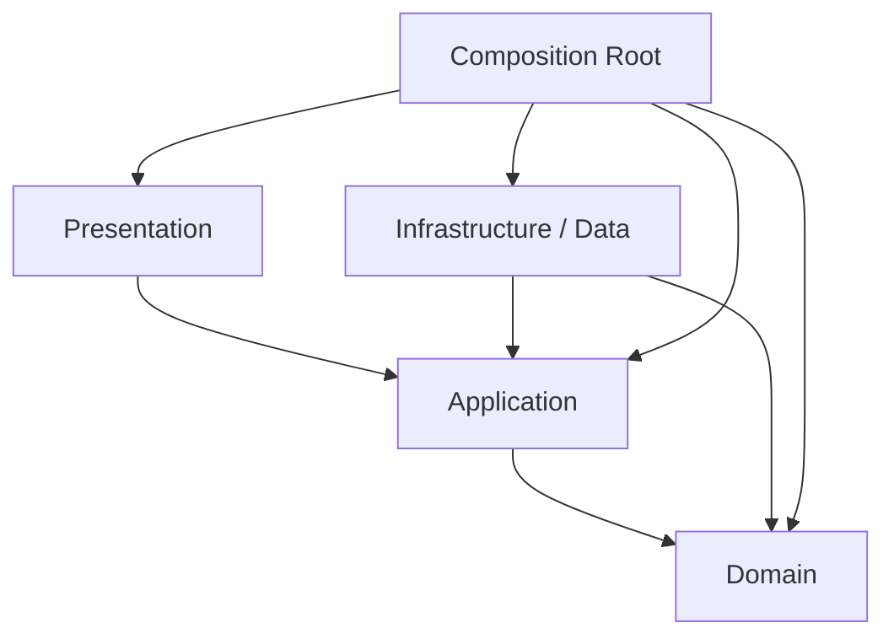

المخطط السابق يوضح اتجاه الاستيراد أو الاعتماد البنيوي، لا اتجاه انتقال البيانات وقت التشغيل.

## 3. الفرق بين Dependency Flow وRuntime Flow

اتجاه الطلب وقت التشغيل قد يبدأ من المستخدم وينزل إلى مصدر البيانات، ثم تعود النتيجة إلى الأعلى. أما اتجاه الاعتمادية فيجب أن يبقى متوافقًا مع قواعد الحدود المعمارية.

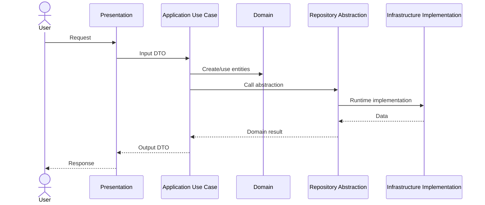

## 4. قاعدة المعرفة المحدودة

كل طبقة يجب أن تعرف أقل قدر ممكن من التفاصيل:

- `Presentation` تعرف حالات الاستخدام والعقود اللازمة للعرض.
- `Application` تعرف قواعد المجال وتجريدات الوصول المطلوبة.
- `Domain` لا تعرف الواجهة ولا قاعدة البيانات ولا إطار العمل.
- `Infrastructure` تعرف العقود التي تنفذها والتقنيات التي تتكامل معها.
- `Composition Root` يعرف الجميع لأنه مسؤول عن إنشاء الكائنات وربطها.

هذه القاعدة تقلل الاقتران، لكنها لا تعني منع جميع الاستيرادات. المطلوب هو منع الاستيرادات التي تعكس اتجاه الاعتماد الصحيح.

## 5. طبقة Presentation

### 5.1 مسؤوليتها

طبقة العرض مسؤولة عن حدود النظام مع المستخدم أو العميل الخارجي:

- HTTP Controllers.
- Routes.
- CLI commands.
- UI Screens.
- State Management.
- تحويل الطلب الخام إلى DTO.
- تحويل النتيجة إلى استجابة مناسبة.
- اختيار Status Code أو View State.
- التعامل مع أخطاء العرض العامة.

### 5.2 ما لا يجب أن يوجد فيها

- قواعد تسعير.
- SQL.
- منطق إنشاء الكيانات المعقد.
- اختيار مزود التخزين.
- حسابات المجال.
- مفاتيح الخدمات الخارجية.
- تفاصيل التوقيع والتشفير.
- منطق المعاملات.

### 5.3 مخطط التدفق

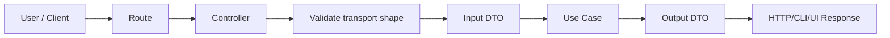

### 5.4 التحقق في Presentation

التحقق هنا يركز على شكل النقل:

- هل الحقل موجود؟
- هل JSON صالح؟
- هل النوع المتوقع رقم أو نص؟
- هل حجم الطلب ضمن الحد؟
- هل Content-Type صحيح؟

أما قواعد مثل «لا يمكن تأكيد طلب ملغى» فهي قواعد مجال وليست تحققًا شكليًا.

## 6. طبقة Application

### 6.1 دورها

طبقة التطبيق تنفذ حالات الاستخدام وتنسق العمليات. هي ليست مكانًا لقواعد المجال الجوهرية، لكنها تعرف ترتيب الخطوات المطلوبة لتحقيق هدف المستخدم.

أمثلة:

- `LoginUseCase`
- `CreateOrderUseCase`
- `GetOrderUseCase`
- `CancelSubscriptionUseCase`
- `GenerateInvoiceUseCase`

### 6.2 ما تحتويه

- Use Cases.
- Commands and Queries.
- Input DTOs.
- Output DTOs.
- Ports.
- Application-specific errors.
- Transaction orchestration.
- Authorization checks المرتبطة بحالة الاستخدام.
- التنسيق بين أكثر من Repository أو Service.

### 6.3 ما لا تحتويه

- تفاصيل HTTP.
- Widgets أو Screens.
- SQL أو SDKs.
- منطق خاص بإطار العمل.
- قواعد مجال يجب أن تحمي الكيان نفسه.

### 6.4 دورة حياة حالة الاستخدام

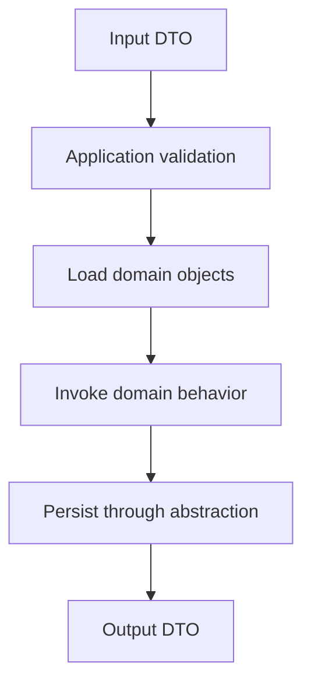

### 6.5 متى تضع القاعدة في Application؟

ضع القاعدة في Application عندما تكون مرتبطة بتنسيق حالة استخدام محددة، مثل:

- المستخدم يجب أن يكون مصادقًا لتنفيذ الحالة.
- استدعاء مستودعين بترتيب معين.
- فتح معاملة ثم إغلاقها.
- اختيار سياسة تطبيقية بناءً على صلاحية.
- إرسال حدث بعد نجاح العملية.

ولا تضع فيها قاعدة يجب أن تكون صحيحة دائمًا داخل الكيان، مثل عدم السماح بكمية سالبة.

## 7. طبقة Domain

### 7.1 قلب النظام

طبقة المجال تمثل مفاهيم العمل وقواعده، ويجب أن تبقى قابلة للاستخدام والاختبار دون تشغيل شبكة أو قاعدة بيانات.

تشمل عادةً:

- Entities.
- Value Objects.
- Domain Services.
- Policies.
- Specifications.
- Domain Events.
- Repository Contracts.
- Domain Exceptions.

### 7.2 Entities

الكيان يمتلك هوية وسلوكًا يحافظ على اتساقه. الكيان ليس مجرد حاوية بيانات.

مثال مفاهيمي:

```text
Order
- id
- userId
- items
- status
+ addItem()
+ removeItem()
+ confirm()
+ cancel()
+ total()
```

### 7.3 Value Objects

كائن القيمة:

- لا يحتاج هوية مستقلة.
- يقارن بالقيمة.
- يفضّل أن يكون غير قابل للتغيير.
- يحمي قيودًا صغيرة ومركزة.

أمثلة:

- Email.
- Money.
- DateRange.
- Quantity.
- Address.
- PhoneNumber.

### 7.4 Domain Services

استخدم Domain Service عندما تكون القاعدة مجالًا خالصًا، لكنها لا تنتمي بوضوح إلى كيان واحد.

مثال: حساب عمولة تعتمد على عدة عقود وسياسات.

### 7.5 Repository Interfaces

المستودع في المجال يمثل عقدًا للوصول إلى مجموعة من الكيانات. لا يجب أن يعرض تفاصيل SQL أو أسماء الجداول.

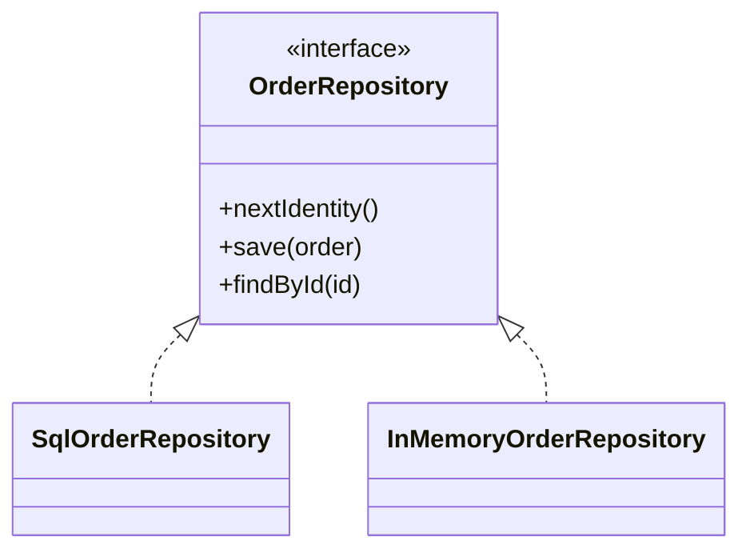

## 8. طبقة Infrastructure / Data

### 8.1 مسؤوليتها

هي مكان التفاصيل التقنية القابلة للاستبدال:

- قواعد البيانات.
- HTTP Clients.
- Files.
- Cache.
- Message Brokers.
- Email providers.
- Payment providers.
- Logging adapters.
- Cryptography implementations.
- Repository implementations.
- Mappers.

### 8.2 قاعدة التسريب

لا تسمح لنماذج ORM أو SDK بالخروج إلى الطبقات الأعلى. حوّلها إلى Domain Entities أو DTOs مناسبة.

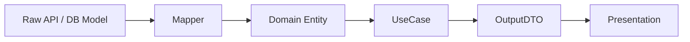

### 8.3 Mappers

المحوّل يجب أن يكون واضح المسؤولية:

- `fromPersistence`
- `toPersistence`
- `fromApi`
- `toDomain`
- `toDto`

لا تخلط التحويل مع قواعد الأعمال أو الاتصال الخارجي.

## 9. Composition Root

`Composition Root` هو المكان الذي تُنشأ فيه الكائنات الفعلية ويتم حقنها في بعضها.

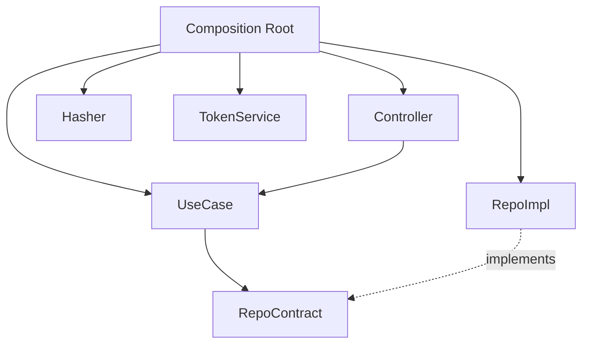

مزاياه:

- يجمع قرارات البنية في مكان واحد.
- يمنع استخدام `new` داخل حالات الاستخدام.
- يسهل تبديل التنفيذات.
- يجعل الاختبارات تستخدم Fakes.
- يوضح دورة حياة الكائنات.

## 10. النمط الطبقي مقابل النمط القائم على الميزات

النمط الطبقي ينظم المشروع حسب نوع المسؤولية:

```text
presentation/
application/
domain/
infrastructure/
```

أما النمط القائم على الميزات فينظم المستوى الأعلى حسب الميزة:

```text
features/
  auth/
  orders/
  profile/
```

يمكن الجمع بينهما:

```text
features/
  auth/
    presentation/
    application/
    domain/
    infrastructure/
```

المشروع الصغير قد يستفيد من الطبقات على المستوى الأعلى. المشروع الكبير غالبًا يحتاج إلى حدود ميزات أو Modules حتى لا تتحول كل طبقة إلى مجلد ضخم.

## 11. قواعد حدود الطبقات

قواعد عملية:

1. Domain لا تستورد من Application.
2. Domain لا تستورد من Infrastructure.
3. Domain لا تستورد من Presentation.
4. Application لا تستورد من Presentation.
5. Application لا تعتمد على implementations في Infrastructure.
6. Presentation لا تنشئ Repository implementation.
7. Infrastructure تنفذ العقود.
8. Composition Root مسموح له بمعرفة الجميع.
9. الاختبارات قد تعبر الحدود لإنشاء Fixtures، لكن يجب ألا تجعل الإنتاج يعتمد عليها.
10. كل استثناء على القاعدة يجب توثيقه.

## 12. أنواع العقود بين الطبقات

### 12.1 Repository Contract

يمثل الوصول إلى Aggregates أو Entities.

### 12.2 Service Port

يمثل قدرة خارجية، مثل:

- إرسال بريد.
- إصدار Token.
- تشفير كلمة مرور.
- الحصول على وقت.
- تحميل ملف.

### 12.3 Input Port

واجهة حالة الاستخدام عندما تحتاج إلى فصل إضافي عن التنفيذ.

### 12.4 Output Port

يستخدم عندما يكون إخراج حالة الاستخدام متعدد الأشكال أو يحتاج Presenter.

## 13. DTOs

DTO ليس كيان مجال. مهمته نقل بيانات عبر حد معماري.

قواعد عملية:

- لا تضف سلوك مجال إلى DTO.
- لا تمرر ORM model مباشرة.
- لا تجعل كل DTO نسخة مطابقة للكيان.
- صمّم DTO حسب حاجة الحالة.
- افصل Input DTO عن Output DTO عندما تختلف المسؤولية.

## 14. Mapping

هناك ثلاثة أنواع شائعة:

1. Transport DTO ↔ Application DTO.
2. Persistence Model ↔ Domain Entity.
3. Domain Result ↔ Output DTO.

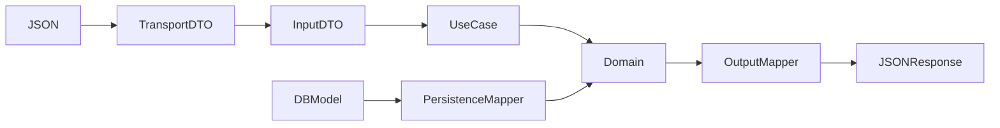

## 15. Error Handling

قسّم الأخطاء حسب مصدرها:

- Domain errors: انتهاك قاعدة عمل.
- Application errors: فشل حالة استخدام أو عدم وجود مورد.
- Infrastructure errors: انقطاع شبكة أو قاعدة بيانات.
- Presentation errors: JSON غير صالح أو Route غير موجود.

لا تعرض Stack Trace للمستخدم النهائي.

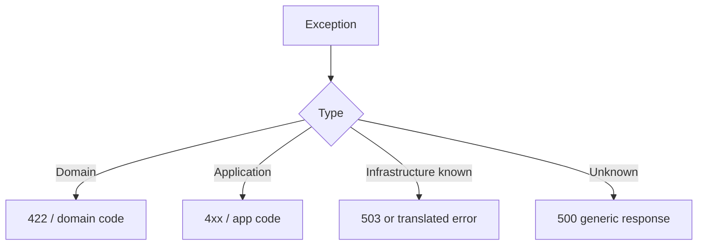

## 16. Validation Strategy

قسّم التحقق إلى مستويات:

| المستوى | أمثلة |
|---|---|
| Presentation | JSON صالح، نوع الحقل، الحجم |
| Application | حقول الحالة المطلوبة، الصلاحية |
| Domain | القواعد التي يجب أن تكون صحيحة دائمًا |
| Infrastructure | قيود المزود، صيغة الاستجابة الخارجية |

التكرار البسيط المقبول أحيانًا أفضل من تسريب مسؤولية طبقة إلى طبقة أخرى.

## 17. Transactions

المعاملة غالبًا مسؤولية Application/Infrastructure:

- Application تحدد حدود العملية.
- Infrastructure تنفذ Unit of Work أو Transaction Manager.
- Domain لا يعرف BEGIN وCOMMIT.

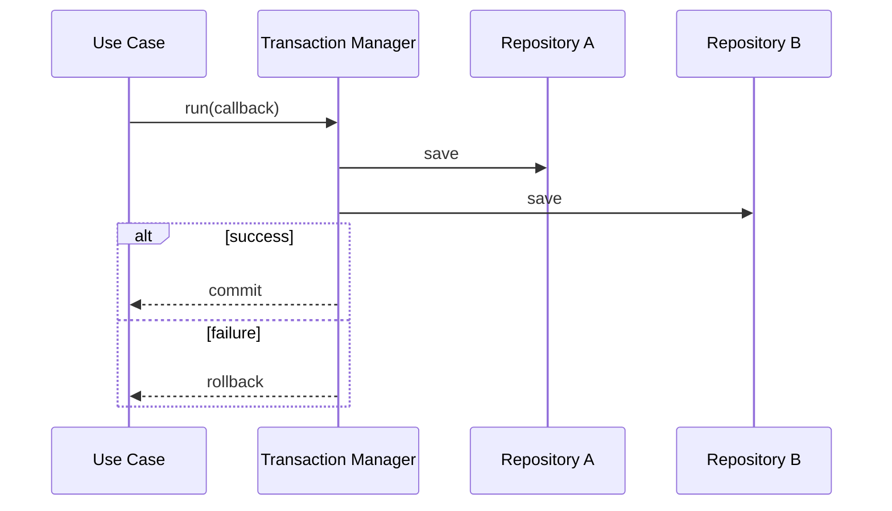

## 18. Caching

لا تجعل Cache يغير معنى العقد.

استراتيجيات:

- Cache-aside.
- Read-through.
- Write-through.
- Stale-while-revalidate.

يمكن تنفيذ Decorator حول Repository دون تعديل Use Case.

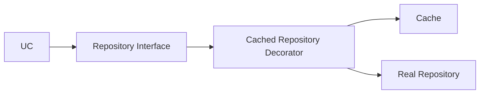

## 19. Authentication وAuthorization

- Authentication تتحقق من الهوية.
- Authorization تتحقق من السماح بالفعل.
- إصدار Token تفصيل خارجي عبر Port.
- قواعد مثل «لا يستطيع المستخدم تعطيل نفسه» قد تكون Application أو Domain حسب السياق.
- لا تجعل Controller يقرر صلاحيات معقدة.

## 20. Logging وMonitoring

السجل الجيد يصف الحدث ولا يسرّب أسرارًا.

سجّل:

- correlation id.
- use case name.
- elapsed time.
- error code.
- external provider.
- retry count.

لا تسجّل:

- كلمات المرور.
- tokens كاملة.
- بيانات حساسة غير لازمة.
- stack traces للمستخدم.

## 21. Testing Pyramid

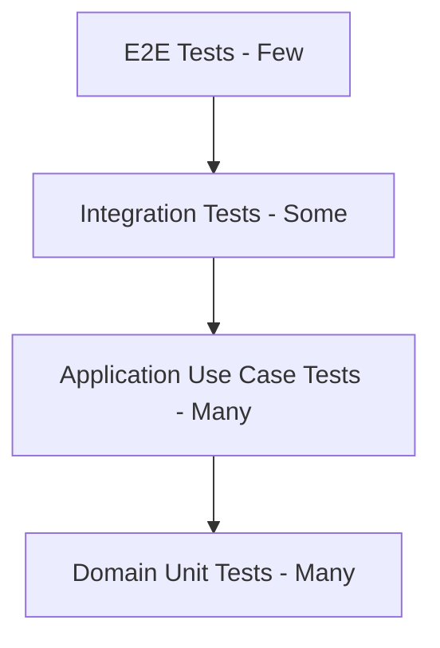

### 21.1 Domain Tests

- سريعة.
- بلا شبكة.
- بلا قاعدة بيانات.
- تركز على invariants.

### 21.2 Application Tests

- تستخدم Fakes للعقود.
- تختبر ترتيب التنسيق.
- تتحقق من الأخطاء.
- لا تحتاج HTTP.

### 21.3 Infrastructure Tests

- تركز على صحة Adapter.
- قد تستخدم قاعدة بيانات اختبارية.
- تتحقق من Mapping.

### 21.4 Presentation Tests

- Status codes.
- Request parsing.
- Response shape.
- Error mapping.

## 22. Architecture Tests

يمكن إضافة فحص آلي يمنع استيرادات غير مسموحة.

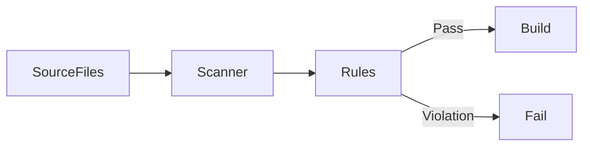

الفحص المعماري لا يغني عن مراجعة التصميم، لكنه يمنع أخطاء واضحة.

---

# الجزء الثاني: تطبيق مبادئ SOLID داخل المعمارية الطبقية

## 23. SRP — Single Responsibility Principle

### 23.1 المعنى

كل وحدة برمجية يجب أن تمتلك سببًا واحدًا متماسكًا للتغيير. المقصود ليس أن تحتوي دالة واحدة فقط، بل أن تكون مسؤوليتها موجهة لفاعل أو سياسة واحدة.

### 23.2 تطبيقه عبر الطبقات

- Controller: تحويل HTTP إلى طلب تطبيق.
- Use Case: تنفيذ هدف واحد.
- Entity: حماية قواعد كيان واحد.
- Mapper: تحويل تمثيل إلى تمثيل.
- Repository Implementation: الوصول إلى مصدر محدد.
- Token Service: إصدار أو التحقق من الرموز.

### 23.3 علامة الانتهاك

إذا تغير الملف عند تغيير واجهة المستخدم، وقاعدة البيانات، وقاعدة العمل في الوقت نفسه، فهو يحمل أكثر من مسؤولية.

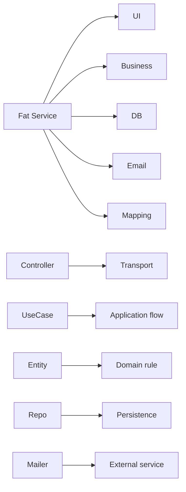

## 24. OCP — Open/Closed Principle

### 24.1 المعنى

المكونات المستقرة يجب أن تكون قابلة للتوسعة دون تعديل متكرر.

### 24.2 تطبيقه

- إضافة Repository implementation جديد.
- إضافة Strategy جديدة.
- إضافة Payment Adapter.
- إضافة Notification Channel.
- استخدام Decorator للتخزين المؤقت.
- إضافة Presenter جديد.

### 24.3 تجنب if/else العملاقة

بدلًا من اختيار المزود داخل Use Case، استخدم عقدًا وتنفيذات متعددة.

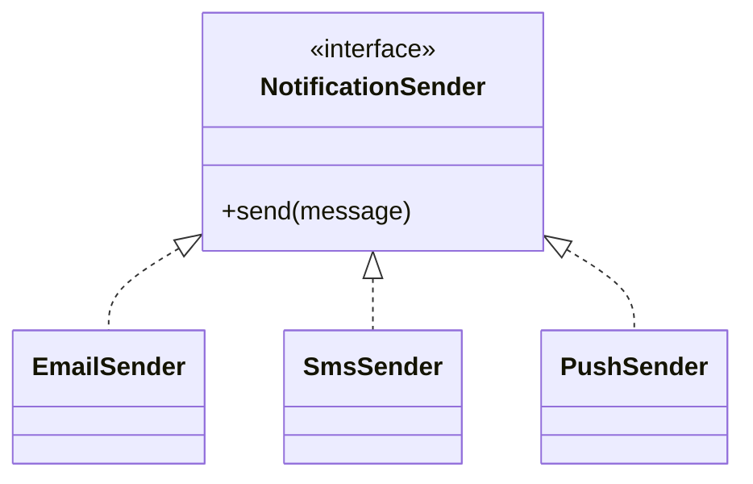

## 25. LSP — Liskov Substitution Principle

### 25.1 المعنى

كل تنفيذ لعقد يجب أن يحافظ على التوقعات السلوكية للعقد.

لا يكفي أن يطابق أسماء الدوال. يجب أن يحافظ على:

- شروط الإدخال.
- شكل الإخراج.
- الأخطاء المتوقعة.
- دلالات null.
- الاتساق.
- الترتيب إذا كان جزءًا من العقد.

### 25.2 مثال Repository

إذا كان `findById` يعيد `null` عند عدم الوجود، فلا يجب أن يرمي تنفيذ آخر خطأً عشوائيًا لنفس الحالة دون توثيق.

## 26. ISP — Interface Segregation Principle

### 26.1 المعنى

العميل لا يجب أن يعتمد على عمليات لا يحتاجها.

بدل واجهة ضخمة:

```text
GenericRepository
- findAll
- findById
- save
- delete
- search
- count
- export
```

استخدم عقودًا موجهة:

```text
OrderReader
OrderWriter
OrderIdentitySource
```

### 26.2 فائدة ISP

- Fakes أبسط.
- اختبارات أسهل.
- اعتماد أقل.
- تغييرات محدودة.
- عقود أوضح.

## 27. DIP — Dependency Inversion Principle

### 27.1 المعنى

الوحدات عالية المستوى لا تعتمد على التفاصيل منخفضة المستوى. كلاهما يعتمد على تجريدات.

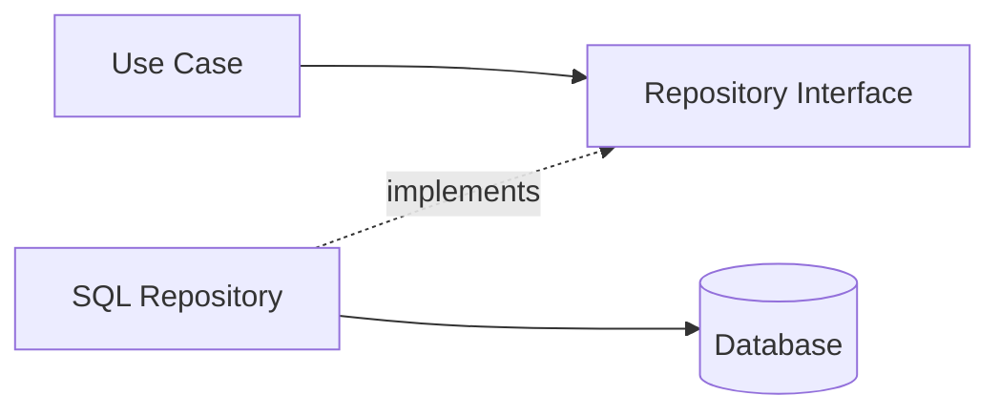

### 27.2 من يملك التجريد؟

يفضّل أن يملك التجريد الطرف الذي يحتاج القدرة، لا الطرف الذي يقدمها. لذلك Repository interface غالبًا في Domain أو Application، بينما التنفيذ في Infrastructure.

## 28. خريطة SOLID على الطبقات

| المبدأ | Presentation | Application | Domain | Infrastructure |
|---|---:|---:|---:|---:|
| SRP | قوي | قوي | قوي | قوي |
| OCP | متوسط | قوي | قوي | قوي |
| LSP | محدود | قوي | قوي | قوي |
| ISP | قوي | قوي | قوي | قوي |
| DIP | متوسط | قوي جدًا | قوي جدًا | تنفيذ |

## 29. تفاعل المبادئ

المبادئ ليست مستقلة بالكامل:

- SRP يجعل العقود أكثر تركيزًا، فيدعم ISP.
- ISP يقلل الاعتماد، فيدعم DIP.
- DIP يسمح بتوسعة التنفيذات، فيدعم OCP.
- LSP يحافظ على صحة الاستبدال الذي يتيحه DIP.
- OCP ينجح عندما تكون المسؤوليات مستقرة ومحددة.

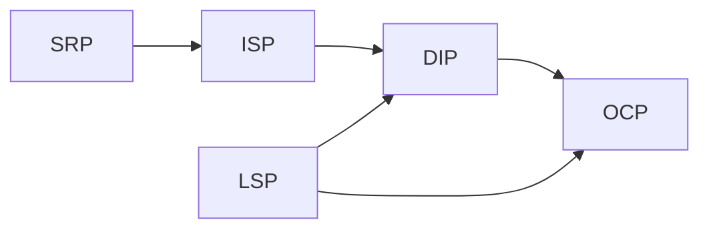

## 30. Anti-Patterns شائعة

### 30.1 Fat Controller

يعالج الطلب ويطبق القواعد وينفذ SQL ويرسل البريد.

### 30.2 Anemic Domain مع منطق مبعثر

الكيانات مجرد بيانات وجميع القواعد في Services عامة.

### 30.3 Generic Repository مبالغ فيه

عقد ضخم لا يعبّر عن لغة المجال.

### 30.4 Service Locator مخفي

الحصول على الاعتمادات من Global container داخل الدوال.

### 30.5 Framework Leakage

أنواع إطار العمل تظهر في Domain.

### 30.6 DTO Leakage

تمرير DTO النقل كأنه كيان مجال.

### 30.7 Circular Dependencies

طبقتان تستوردان بعضهما.

## 31. استراتيجية Refactoring

1. اختر حالة استخدام واحدة.
2. اكتب اختبارًا لسلوكها الحالي.
3. استخرج قواعد المجال.
4. أنشئ عقد Repository.
5. انقل الوصول الخارجي إلى Infrastructure.
6. اجعل Controller رقيقًا.
7. أنشئ Composition Root.
8. أضف فحص حدود.
9. كرر على الحالة التالية.

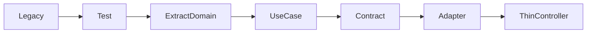

## 32. قرار مستوى التعقيد

لا تستخدم كل نمط في كل مشروع.

استخدم تقسيمًا أبسط عندما:

- المشروع تجربة قصيرة.
- لا توجد قواعد مجال.
- لا يوجد أكثر من مزود.
- عمر المشروع قصير.

استخدم معمارية أوضح عندما:

- الفريق متعدد.
- قواعد العمل تتغير.
- الاختبارات مهمة.
- توجد مصادر بيانات متعددة.
- النظام طويل العمر.
- هناك متطلبات امتثال.

## 33. قائمة مراجعة التصميم

### Domain

- [ ] لا يستورد إطار عمل.
- [ ] الكيانات تحمي invariants.
- [ ] Value Objects غير قابلة للتغيير قدر الإمكان.
- [ ] العقود تعبر عن لغة المجال.
- [ ] الأخطاء ذات معنى.

### Application

- [ ] كل Use Case له هدف واحد.
- [ ] يعتمد على Abstractions.
- [ ] لا يعرف HTTP أو SQL.
- [ ] DTOs صغيرة.
- [ ] الأخطاء مترجمة بوضوح.

### Infrastructure

- [ ] لا يسرّب نماذج خام.
- [ ] ينفذ العقود بدقة.
- [ ] الاتصال الخارجي معزول.
- [ ] retries وtimeouts واضحة.
- [ ] التحويل منفصل.

### Presentation

- [ ] Controller رقيق.
- [ ] التحقق الشكلي هنا.
- [ ] لا توجد قواعد أعمال.
- [ ] الأخطاء تتحول إلى استجابة آمنة.
- [ ] الاستجابة مستقرة.

## 34. أسئلة مراجعة الكود

1. ما سبب تغيير هذا الملف؟
2. هل يعرف تفاصيل لا يحتاجها؟
3. هل يمكن اختباره دون شبكة؟
4. هل يمكن تبديل التنفيذ؟
5. هل العقد أصغر من حاجة العميل أم أكبر؟
6. هل التنفيذ يحافظ على LSP؟
7. هل يوجد تسريب لإطار العمل؟
8. هل توجد قاعدة مجال خارج Domain؟
9. هل Composition Root واضح؟
10. هل الأخطاء مترجمة عبر الحدود؟

## 35. تمارين عملية

### تمرين 1

أضف `EmailNotificationSender` و`SmsNotificationSender` خلف عقد واحد.

### تمرين 2

أضف `CachedOrderRepository` باستخدام Decorator.

### تمرين 3

أنشئ `CancelOrderUseCase` يحمي حالة الطلب.

### تمرين 4

أضف Infrastructure adapter يقرأ من ملف JSON.

### تمرين 5

اكتب Architecture Test يمنع Domain من استيراد Infrastructure.

### تمرين 6

قسّم واجهة كبيرة إلى Reader وWriter.

### تمرين 7

استبدل Token service بتطبيق مختلف دون تعديل LoginUseCase.

## 36. مخطط المشروع المرجعي

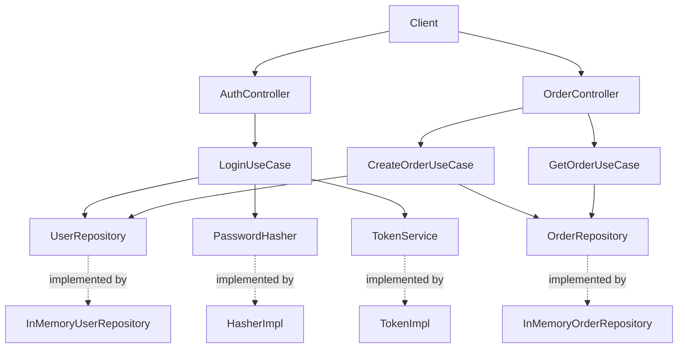

## 37. سيناريو Login

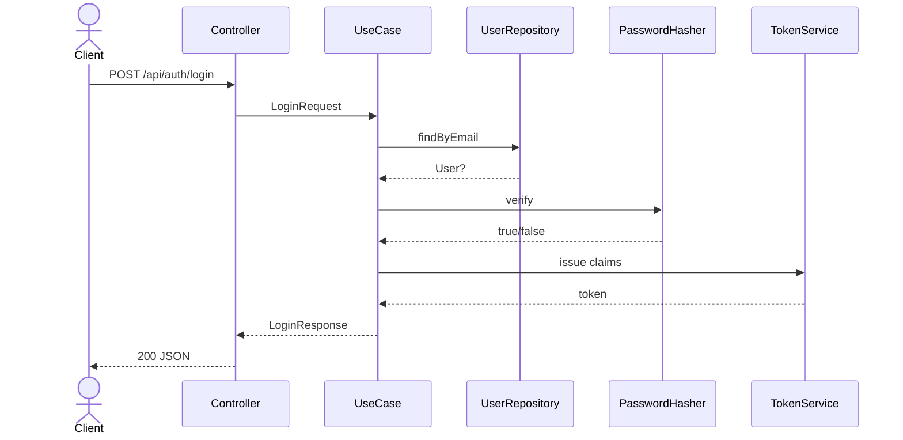

## 38. سيناريو Create Order

```mermaid
sequenceDiagram
    actor Client
    participant Controller
    participant UseCase
    participant Users as UserRepository
    participant Orders as OrderRepository
    participant Domain as Order Entity

    Client->>Controller: POST /api/orders
    Controller->>UseCase: CreateOrderRequest
    UseCase->>Users: findById
    Users-->>UseCase: User
    UseCase->>Orders: nextIdentity
    Orders-->>UseCase: id
    UseCase->>Domain: create Order + Items
    Domain-->>UseCase: valid aggregate
    UseCase->>Orders: save(order)
    UseCase-->>Controller: Order DTO
    Controller-->>Client: 201 JSON
```

## 39. معايير قبول المشروع

- يمكن تشغيله محليًا.
- ينجح Login الصحيح.
- يفشل Login الخاطئ.
- يمكن إنشاء طلب.
- يمكن استرجاع الطلب.
- Domain لا يعتمد على Infrastructure.
- الاختبارات لا تحتاج خادمًا حقيقيًا.
- استبدال Repository لا يتطلب تعديل Use Case.
- الأخطاء ذات codes مستقرة.
- لا تُعرض كلمة المرور في الاستجابة.

## 40. الخلاصة

المعمارية الطبقية النظيفة لا تقاس بعدد المجلدات، بل بجودة الحدود. عندما تكون المسؤوليات واضحة، والعقود مملوكة للطرف الصحيح، والاعتمادات تتجه نحو التجريدات، يصبح التغيير أقل تكلفة والاختبار أكثر واقعية.

# القسم التطبيقي بلغة Dart

## 41. اختيارات المشروع

المشروع يستخدم:

- Dart 3.3+.
- `dart:io` لإنشاء HTTP API بسيط.
- Abstract interface classes للعقود.
- In-memory repositories.
- Composition Root يدوي.
- `package:test` للاختبارات.
- Simple token/password implementations للتعليم فقط.

## 42. قوة العقود في Dart

Dart توفر `abstract interface class`، وهي مناسبة لتمثيل Ports وRepositories.

```dart
abstract interface class UserRepository {
  Future<User?> findByEmail(Email email);
  Future<User?> findById(String id);
}
```

التنفيذ:

```dart
final class InMemoryUserRepository implements UserRepository {
  @override
  Future<User?> findById(String id) async => _users[id];
}
```

## 43. مثال SRP في Dart

### سيئ

```dart
final class AuthController {
  Future<void> login(HttpRequest request) async {
    // parse JSON
    // query database
    // verify password
    // issue token
    // format response
  }
}
```

### أفضل

```dart
final class AuthController {
  const AuthController({required this.loginUseCase});

  final LoginUseCase loginUseCase;

  Future<void> login(
    HttpRequest request,
    Map<String, String> params,
  ) async {
    final body = await readJsonBody(request);
    final result = await loginUseCase.execute(LoginRequest.fromJson(body));
    await sendJson(request.response, HttpStatus.ok, result.toJson());
  }
}
```

## 44. مثال DIP في Dart

```dart
final class LoginUseCase {
  const LoginUseCase({
    required this.userRepository,
    required this.passwordHasher,
    required this.tokenService,
  });

  final UserRepository userRepository;
  final PasswordHasher passwordHasher;
  final TokenService tokenService;
}
```

## 45. اختبار Use Case

```dart
test('LoginUseCase returns a token', () async {
  final useCase = LoginUseCase(
    userRepository: fakeUsers,
    passwordHasher: fakeHasher,
    tokenService: FakeTokenService(),
  );

  final result = await useCase.execute(
    LoginRequest(
      email: 'anwar@example.com',
      password: 'secret123',
    ),
  );

  expect(result.token, 'token-1');
});
```

## 46. تشغيل مشروع Dart

```bash
dart pub get
dart analyze
dart test
dart run bin/server.dart
```

## 47. طلب Login

```bash
curl -X POST http://localhost:8080/api/auth/login \
  -H 'content-type: application/json' \
  -d '{"email":"anwar@example.com","password":"secret123"}'
```

## 48. إنشاء طلب

```bash
curl -X POST http://localhost:8080/api/orders \
  -H 'content-type: application/json' \
  -d '{
    "userId":"u-1",
    "currency":"USD",
    "items":[
      {
        "productId":"p-1",
        "name":"Keyboard",
        "unitPrice":80,
        "quantity":2
      }
    ]
  }'
```

## 49. ملاحظات Flutter

عند نقل الفكرة إلى Flutter:

- Presentation تصبح Widgets + State Management.
- Controller قد يكون Bloc/Cubit/Riverpod Notifier.
- Use Cases تبقى مستقلة عن Flutter.
- Domain لا يستورد `package:flutter`.
- Infrastructure تحتوي Dio/HTTP/SQLite/Hive adapters.
- Composition Root يمكن تنفيذه يدويًا أو عبر get_it.
- لا تمرر BuildContext إلى Application أو Domain.

## 50. ملاحظات الإنتاج

- استخدم مكتبة تشفير موثوقة.
- استخدم JWT أو جلسات مع مكتبة مدققة.
- أضف timeouts وcancellation.
- أضف typed failures.
- استخدم lints أشد.
- أضف integration tests.
- أضف database adapter حقيقي.
- راقب الأداء والذاكرة.

# أسئلة وأجوبة متقدمة — Dart

## هل كل مشروع يحتاج أربع طبقات؟

لا. الطبقات أداة لضبط المسؤولية. قد تدمج Application وDomain في مشروع CRUD صغير، لكن يجب أن يكون القرار واعيًا.

## هل Repository دائمًا في Domain؟

ليس دائمًا. ضع العقد قرب الطرف الذي يحتاجه. إذا كان العقد يعبر عن مجموعة كيانات مجال، فـDomain مناسبة. إذا كان Port خاصًا بتنسيق حالة استخدام، فقد يكون في Application.

## هل DTO ضروري لكل دالة؟

لا. استخدمه عند عبور حد معماري أو عندما تحتاج عقدًا مستقرًا. لا تنشئ DTOs شكلية دون قيمة.

## هل يجوز للـInfrastructure الاعتماد على Domain؟

نعم، لأنها تنفذ عقودًا وتحوّل إلى كيانات. الاتجاه العكسي هو المشكلة.

## هل يجوز لـPresentation الاعتماد على Domain؟

يفضل أن تمر عبر Application. قد تستخدم أنواعًا بسيطة للعرض، لكن الاعتماد المباشر الواسع يجعل الواجهة تتجاوز حالات الاستخدام.

## أين توضع الصلاحيات؟

صلاحيات النقل البسيطة في Presentation middleware. صلاحيات حالة الاستخدام في Application. قواعد لا يمكن انتهاكها في Domain.

## أين توضع الأحداث؟

Domain Events في Domain. نشرها الفعلي عبر Event Bus في Infrastructure، والتنسيق في Application.

## ماذا عن CQRS؟

يمكن استخدام Commands وQueries داخل Application دون تبني CQRS كامل. لا تضف التعقيد إلا عند وجود حاجة.

## ماذا عن Microservices؟

المعمارية الداخلية للخدمة لا تتحدد بكون النظام Microservices. يمكن لكل خدمة تطبيق طبقات نظيفة.

## كيف أعرف أن الطبقات أصبحت مبالغًا فيها؟

عندما يكون كل تغيير بسيط يتطلب عشرات الملفات دون فائدة في الاختبار أو الاستبدال، راجع مستوى التجريد.

# قاموس المصطلحات

| المصطلح | المعنى |
|---|---|
| Entity | كيان ذو هوية وسلوك |
| Value Object | كائن يقارن بالقيمة |
| Use Case | عملية تطبيقية تحقق هدفًا |
| Repository | عقد للوصول إلى مجموعة كيانات |
| Adapter | تنفيذ يربط عقدًا بتقنية |
| Port | واجهة لقدرة يحتاجها النظام |
| DTO | كائن نقل بيانات |
| Mapper | محول بين تمثيلات |
| Composition Root | نقطة إنشاء وربط الاعتمادات |
| Invariant | قاعدة يجب أن تبقى صحيحة |
| Coupling | مقدار الارتباط بين المكونات |
| Cohesion | تماسك المسؤوليات داخل الوحدة |
| Boundary | حد يفصل مسؤوليات أو سياسات |
| Dependency | معرفة بنيوية أو استيراد |
| Interaction | تفاعل وقت التشغيل |
| Policy | قاعدة أو قرار |
| Strategy | تنفيذ قابل للتبديل |
| Decorator | غلاف يضيف سلوكًا |
| Fake | تنفيذ اختبار بسيط |
| Stub | إجابة اختبار ثابتة |
| Mock | كائن يتحقق من التفاعل |

# قائمة تحقق قبل النشر

- [ ] جميع الاختبارات ناجحة.
- [ ] فحص الحدود ناجح.
- [ ] لا توجد أسرار داخل المستودع.
- [ ] كلمات المرور لا تُسجل.
- [ ] timeouts مضبوطة.
- [ ] الأخطاء الخارجية مترجمة.
- [ ] DTOs لا تسرب بيانات حساسة.
- [ ] Status codes أو UI states متسقة.
- [ ] Database migrations معروفة.
- [ ] Observability مفعلة.
- [ ] النسخ الاحتياطي مجرّب.
- [ ] الاسترجاع مجرّب.
- [ ] المعدلات محدودة.
- [ ] الاعتمادات محدثة.
- [ ] الترخيص واضح.

# نهاية الدليل النظري

الأقسام التالية تحتوي قائمة ملفات المشروع المرجعي وكود كل ملف حتى يكون الدليل مكتفيًا ذاتيًا.

# ملحق المشروع المرجعي الكامل

## شجرة الملفات

```text
.gitignore
README.md
analysis_options.yaml
bin/server.dart
lib/src/application/dto/create_order_request.dart
lib/src/application/dto/login_request.dart
lib/src/application/dto/login_response.dart
lib/src/application/errors/application_exception.dart
lib/src/application/ports/password_hasher.dart
lib/src/application/ports/token_service.dart
lib/src/application/usecases/create_order_use_case.dart
lib/src/application/usecases/get_order_use_case.dart
lib/src/application/usecases/login_use_case.dart
lib/src/composition/app_container.dart
lib/src/composition/create_http_handler.dart
lib/src/domain/entities/order.dart
lib/src/domain/entities/user.dart
lib/src/domain/errors/domain_exception.dart
lib/src/domain/repositories/order_repository.dart
lib/src/domain/repositories/user_repository.dart
lib/src/domain/value_objects/email.dart
lib/src/domain/value_objects/money.dart
lib/src/infrastructure/repositories/in_memory_order_repository.dart
lib/src/infrastructure/repositories/in_memory_user_repository.dart
lib/src/infrastructure/security/simple_password_hasher.dart
lib/src/infrastructure/security/simple_token_service.dart
lib/src/presentation/controllers/auth_controller.dart
lib/src/presentation/controllers/order_controller.dart
lib/src/presentation/http/json_io.dart
lib/src/presentation/http/router.dart
lib/src/presentation/middleware/error_handler.dart
lib/src/shared/result.dart
pubspec.yaml
test/application/create_order_use_case_test.dart
test/application/login_use_case_test.dart
test/domain/money_test.dart
```

## ملفات المشروع

### `.gitignore`

```dart
.dart_tool/
build/
coverage/
```

### `README.md`

```markdown
# Dart Layered Clean Architecture Example

A small Dart HTTP API demonstrating:

- Presentation, Application, Domain, and Infrastructure/Data layers.
- SOLID principles and dependency inversion.
- Login, order creation, and order retrieval use cases.
- Dependency injection through a composition root.
- Unit tests.

## Requirements

- Dart SDK 3.3 or newer.

## Run

```bash
dart pub get
dart test
dart analyze
dart run bin/server.dart
```

The API listens on `http://localhost:8080`.

## Demo credentials

- Email: `anwar@example.com`
- Password: `secret123`
```

### `analysis_options.yaml`

```yaml
include: package:lints/recommended.yaml
```

### `bin/server.dart`

```dart
import 'dart:io';

import 'package:dart_layered_clean_architecture_example/src/composition/app_container.dart';
import 'package:dart_layered_clean_architecture_example/src/composition/create_http_handler.dart';

Future<void> main() async {
  final container = await AppContainer.create();
  final handler = createHttpHandler(container);
  final server = await HttpServer.bind(InternetAddress.loopbackIPv4, 8080);

  stdout.writeln(
    'Dart Layered Clean Architecture example listening on '
    'http://${server.address.host}:${server.port}',
  );

  await for (final request in server) {
    await handler(request);
  }
}
```

### `lib/src/application/dto/create_order_request.dart`

```dart
import '../errors/application_exception.dart';

final class CreateOrderItemRequest {
  const CreateOrderItemRequest({
    required this.productId,
    required this.name,
    required this.unitPrice,
    required this.quantity,
  });

  factory CreateOrderItemRequest.fromJson(Map<String, Object?> json) {
    return CreateOrderItemRequest(
      productId: json['productId']?.toString() ?? '',
      name: json['name']?.toString() ?? '',
      unitPrice: (json['unitPrice'] as num?) ?? -1,
      quantity: (json['quantity'] as num?)?.toInt() ?? 0,
    );
  }

  final String productId;
  final String name;
  final num unitPrice;
  final int quantity;
}

final class CreateOrderRequest {
  CreateOrderRequest({
    required this.userId,
    required this.currency,
    required List<CreateOrderItemRequest> items,
  }) : items = List.unmodifiable(items) {
    if (userId.trim().isEmpty || currency.trim().isEmpty || items.isEmpty) {
      throw const ApplicationException(
        'INVALID_ORDER_REQUEST',
        'userId, currency, and at least one item are required.',
        status: 422,
      );
    }
  }

  factory CreateOrderRequest.fromJson(Map<String, Object?> json) {
    final rawItems = json['items'];
    final items = rawItems is List
        ? rawItems
            .whereType<Map>()
            .map((item) => CreateOrderItemRequest.fromJson(
                  item.map((key, value) => MapEntry(key.toString(), value)),
                ))
            .toList()
        : <CreateOrderItemRequest>[];

    return CreateOrderRequest(
      userId: json['userId']?.toString() ?? '',
      currency: json['currency']?.toString().toUpperCase() ?? '',
      items: items,
    );
  }

  final String userId;
  final String currency;
  final List<CreateOrderItemRequest> items;
}
```

### `lib/src/application/dto/login_request.dart`

```dart
import '../errors/application_exception.dart';

final class LoginRequest {
  LoginRequest({required String email, required String password})
      : email = email.trim().toLowerCase(),
        password = password {
    if (this.email.isEmpty || this.password.isEmpty) {
      throw const ApplicationException(
        'INVALID_LOGIN_REQUEST',
        'Email and password are required.',
        status: 422,
      );
    }
  }

  factory LoginRequest.fromJson(Map<String, Object?> json) {
    return LoginRequest(
      email: json['email']?.toString() ?? '',
      password: json['password']?.toString() ?? '',
    );
  }

  final String email;
  final String password;
}
```

### `lib/src/application/dto/login_response.dart`

```dart
final class LoginResponse {
  const LoginResponse({required this.token, required this.user});

  final String token;
  final Map<String, Object> user;

  Map<String, Object> toJson() => {
        'token': token,
        'user': user,
      };
}
```

### `lib/src/application/errors/application_exception.dart`

```dart
final class ApplicationException implements Exception {
  const ApplicationException(
    this.code,
    this.message, {
    this.status = 400,
    this.details,
  });

  final String code;
  final String message;
  final int status;
  final Object? details;

  @override
  String toString() => 'ApplicationException($code): $message';
}
```

### `lib/src/application/ports/password_hasher.dart`

```dart
abstract interface class PasswordHasher {
  Future<String> hash(String plainText);
  Future<bool> verify(String plainText, String hash);
}
```

### `lib/src/application/ports/token_service.dart`

```dart
abstract interface class TokenService {
  Future<String> issue(Map<String, Object> claims);
}
```

### `lib/src/application/usecases/create_order_use_case.dart`

```dart
import '../../domain/entities/order.dart';
import '../../domain/repositories/order_repository.dart';
import '../../domain/repositories/user_repository.dart';
import '../../domain/value_objects/money.dart';
import '../dto/create_order_request.dart';
import '../errors/application_exception.dart';

typedef Clock = DateTime Function();

final class CreateOrderUseCase {
  CreateOrderUseCase({
    required this.userRepository,
    required this.orderRepository,
    Clock? clock,
  }) : clock = clock ?? (() => DateTime.now().toUtc());

  final UserRepository userRepository;
  final OrderRepository orderRepository;
  final Clock clock;

  Future<Map<String, Object>> execute(CreateOrderRequest request) async {
    final user = await userRepository.findById(request.userId);
    if (user == null) {
      throw const ApplicationException(
        'USER_NOT_FOUND',
        'User was not found.',
        status: 404,
      );
    }
    user.assertCanLogin();

    final items = request.items
        .map(
          (item) => OrderItem(
            productId: item.productId,
            name: item.name,
            unitPrice: Money(item.unitPrice, request.currency),
            quantity: item.quantity,
          ),
        )
        .toList();

    final order = Order(
      id: await orderRepository.nextIdentity(),
      userId: user.id,
      items: items,
      createdAt: clock(),
    );

    await orderRepository.save(order);
    return order.toJson();
  }
}
```

### `lib/src/application/usecases/get_order_use_case.dart`

```dart
import '../../domain/repositories/order_repository.dart';
import '../errors/application_exception.dart';

final class GetOrderUseCase {
  const GetOrderUseCase({required this.orderRepository});

  final OrderRepository orderRepository;

  Future<Map<String, Object>> execute(String id) async {
    final order = await orderRepository.findById(id);
    if (order == null) {
      throw const ApplicationException(
        'ORDER_NOT_FOUND',
        'Order was not found.',
        status: 404,
      );
    }
    return order.toJson();
  }
}
```

### `lib/src/application/usecases/login_use_case.dart`

```dart
import '../../domain/repositories/user_repository.dart';
import '../../domain/value_objects/email.dart';
import '../dto/login_request.dart';
import '../dto/login_response.dart';
import '../errors/application_exception.dart';
import '../ports/password_hasher.dart';
import '../ports/token_service.dart';

final class LoginUseCase {
  const LoginUseCase({
    required this.userRepository,
    required this.passwordHasher,
    required this.tokenService,
  });

  final UserRepository userRepository;
  final PasswordHasher passwordHasher;
  final TokenService tokenService;

  Future<LoginResponse> execute(LoginRequest request) async {
    final email = Email(request.email);
    final user = await userRepository.findByEmail(email);

    if (user == null) {
      throw const ApplicationException(
        'INVALID_CREDENTIALS',
        'Invalid credentials.',
        status: 401,
      );
    }

    user.assertCanLogin();
    final matches = await passwordHasher.verify(
      request.password,
      user.passwordHash,
    );

    if (!matches) {
      throw const ApplicationException(
        'INVALID_CREDENTIALS',
        'Invalid credentials.',
        status: 401,
      );
    }

    final token = await tokenService.issue({
      'sub': user.id,
      'email': user.email.value,
    });

    return LoginResponse(
      token: token,
      user: user.toPublicJson(),
    );
  }
}
```

### `lib/src/composition/app_container.dart`

```dart
import '../application/usecases/create_order_use_case.dart';
import '../application/usecases/get_order_use_case.dart';
import '../application/usecases/login_use_case.dart';
import '../domain/entities/user.dart';
import '../domain/value_objects/email.dart';
import '../infrastructure/repositories/in_memory_order_repository.dart';
import '../infrastructure/repositories/in_memory_user_repository.dart';
import '../infrastructure/security/simple_password_hasher.dart';
import '../infrastructure/security/simple_token_service.dart';
import '../presentation/controllers/auth_controller.dart';
import '../presentation/controllers/order_controller.dart';

final class AppContainer {
  AppContainer._({
    required this.authController,
    required this.orderController,
  });

  final AuthController authController;
  final OrderController orderController;

  static Future<AppContainer> create() async {
    const passwordHasher = SimplePasswordHasher();
    final userRepository = InMemoryUserRepository([
      User(
        id: 'u-1',
        email: Email('anwar@example.com'),
        name: 'Anwar',
        passwordHash: await passwordHasher.hash('secret123'),
      ),
    ]);
    final orderRepository = InMemoryOrderRepository();
    final tokenService = SimpleTokenService(secret: 'development-secret');

    final loginUseCase = LoginUseCase(
      userRepository: userRepository,
      passwordHasher: passwordHasher,
      tokenService: tokenService,
    );
    final createOrderUseCase = CreateOrderUseCase(
      userRepository: userRepository,
      orderRepository: orderRepository,
    );
    final getOrderUseCase = GetOrderUseCase(
      orderRepository: orderRepository,
    );

    return AppContainer._(
      authController: AuthController(loginUseCase: loginUseCase),
      orderController: OrderController(
        createOrderUseCase: createOrderUseCase,
        getOrderUseCase: getOrderUseCase,
      ),
    );
  }
}
```

### `lib/src/composition/create_http_handler.dart`

```dart
import 'dart:io';

import '../presentation/http/json_io.dart';
import '../presentation/http/router.dart';
import '../presentation/middleware/error_handler.dart';
import 'app_container.dart';

Future<void> Function(HttpRequest) createHttpHandler(AppContainer container) {
  final router = Router()
    ..register('POST', '/api/auth/login', container.authController.login)
    ..register('POST', '/api/orders', container.orderController.create)
    ..register('GET', '/api/orders/:id', container.orderController.getById);

  return (HttpRequest request) async {
    try {
      final match = router.match(request.method, request.uri.path);
      if (match == null) {
        await sendJson(request.response, HttpStatus.notFound, {
          'error': {
            'code': 'ROUTE_NOT_FOUND',
            'message': 'Route was not found.',
          },
        });
        return;
      }
      await match.handler(request, match.params);
    } catch (error, stackTrace) {
      stderr.writeln(stackTrace);
      await handleError(request.response, error);
    }
  };
}
```

### `lib/src/domain/entities/order.dart`

```dart
import '../errors/domain_exception.dart';
import '../value_objects/money.dart';

final class OrderItem {
  OrderItem({
    required this.productId,
    required this.name,
    required Money unitPrice,
    required this.quantity,
  }) : unitPrice = unitPrice {
    if (productId.trim().isEmpty || name.trim().isEmpty) {
      throw const DomainException(
        'INVALID_ORDER_ITEM',
        'Product id and name are required.',
      );
    }
    if (quantity <= 0) {
      throw const DomainException(
        'INVALID_QUANTITY',
        'Quantity must be a positive integer.',
      );
    }
  }

  final String productId;
  final String name;
  final Money unitPrice;
  final int quantity;

  Money subtotal() => unitPrice.multiply(quantity);

  Map<String, Object> toJson() => {
        'productId': productId,
        'name': name,
        'unitPrice': unitPrice.toJson(),
        'quantity': quantity,
        'subtotal': subtotal().toJson(),
      };
}

final class Order {
  Order({
    required this.id,
    required this.userId,
    required List<OrderItem> items,
    this.status = 'CREATED',
    DateTime? createdAt,
  })  : items = List.unmodifiable(items),
        createdAt = createdAt ?? DateTime.now().toUtc() {
    if (id.trim().isEmpty || userId.trim().isEmpty) {
      throw const DomainException(
        'INVALID_ORDER',
        'Order id and user id are required.',
      );
    }
    if (items.isEmpty) {
      throw const DomainException(
        'EMPTY_ORDER',
        'An order must contain at least one item.',
      );
    }
  }

  final String id;
  final String userId;
  final List<OrderItem> items;
  String status;
  final DateTime createdAt;

  Money total() {
    final first = items.first.subtotal();
    return items.skip(1).fold(first, (sum, item) => sum.add(item.subtotal()));
  }

  void confirm() {
    if (status != 'CREATED') {
      throw const DomainException(
        'INVALID_ORDER_STATE',
        'Only created orders can be confirmed.',
      );
    }
    status = 'CONFIRMED';
  }

  Map<String, Object> toJson() => {
        'id': id,
        'userId': userId,
        'items': items.map((item) => item.toJson()).toList(),
        'total': total().toJson(),
        'status': status,
        'createdAt': createdAt.toIso8601String(),
      };
}
```

### `lib/src/domain/entities/user.dart`

```dart
import '../errors/domain_exception.dart';
import '../value_objects/email.dart';

final class User {
  User({
    required this.id,
    required Email email,
    required this.name,
    required this.passwordHash,
    this.active = true,
  }) : email = email {
    if (id.trim().isEmpty || name.trim().isEmpty || passwordHash.isEmpty) {
      throw const DomainException(
        'INVALID_USER',
        'User id, name, and password hash are required.',
      );
    }
  }

  final String id;
  final Email email;
  final String name;
  final String passwordHash;
  bool active;

  void deactivate() {
    active = false;
  }

  void assertCanLogin() {
    if (!active) {
      throw const DomainException(
        'USER_INACTIVE',
        'Inactive users cannot sign in.',
      );
    }
  }

  Map<String, Object> toPublicJson() => {
        'id': id,
        'email': email.value,
        'name': name,
        'active': active,
      };
}
```

### `lib/src/domain/errors/domain_exception.dart`

```dart
final class DomainException implements Exception {
  const DomainException(this.code, this.message, {this.details});

  final String code;
  final String message;
  final Object? details;

  @override
  String toString() => 'DomainException($code): $message';
}
```

### `lib/src/domain/repositories/order_repository.dart`

```dart
import '../entities/order.dart';

abstract interface class OrderRepository {
  Future<String> nextIdentity();
  Future<void> save(Order order);
  Future<Order?> findById(String id);
}
```

### `lib/src/domain/repositories/user_repository.dart`

```dart
import '../entities/user.dart';
import '../value_objects/email.dart';

abstract interface class UserRepository {
  Future<User?> findByEmail(Email email);
  Future<User?> findById(String id);
}
```

### `lib/src/domain/value_objects/email.dart`

```dart
import '../errors/domain_exception.dart';

final class Email {
  Email(String value) : value = _validate(value);

  final String value;

  static String _validate(String raw) {
    final normalized = raw.trim().toLowerCase();
    final pattern = RegExp(r'^[^\s@]+@[^\s@]+\.[^\s@]+$');
    if (!pattern.hasMatch(normalized)) {
      throw const DomainException(
        'INVALID_EMAIL',
        'A valid email address is required.',
      );
    }
    return normalized;
  }

  @override
  bool operator ==(Object other) => other is Email && other.value == value;

  @override
  int get hashCode => value.hashCode;

  @override
  String toString() => value;
}
```

### `lib/src/domain/value_objects/money.dart`

```dart
import '../errors/domain_exception.dart';

final class Money {
  Money(num amount, String currency)
      : amount = _validateAmount(amount),
        currency = _validateCurrency(currency);

  final double amount;
  final String currency;

  static double _validateAmount(num amount) {
    if (amount.isNaN || amount.isInfinite || amount < 0) {
      throw const DomainException(
        'INVALID_MONEY',
        'Money amount must be a non-negative finite number.',
      );
    }
    return double.parse(amount.toStringAsFixed(2));
  }

  static String _validateCurrency(String value) {
    final normalized = value.trim().toUpperCase();
    if (!RegExp(r'^[A-Z]{3}$').hasMatch(normalized)) {
      throw const DomainException(
        'INVALID_CURRENCY',
        'Currency must be a three-letter code.',
      );
    }
    return normalized;
  }

  Money add(Money other) {
    _assertSameCurrency(other);
    return Money(amount + other.amount, currency);
  }

  Money multiply(int multiplier) {
    if (multiplier < 0) {
      throw const DomainException(
        'INVALID_MULTIPLIER',
        'Multiplier must be non-negative.',
      );
    }
    return Money(amount * multiplier, currency);
  }

  void _assertSameCurrency(Money other) {
    if (other.currency != currency) {
      throw const DomainException(
        'CURRENCY_MISMATCH',
        'Money values must use the same currency.',
      );
    }
  }

  Map<String, Object> toJson() => {
        'amount': amount,
        'currency': currency,
      };
}
```

### `lib/src/infrastructure/repositories/in_memory_order_repository.dart`

```dart
import '../../domain/entities/order.dart';
import '../../domain/repositories/order_repository.dart';

final class InMemoryOrderRepository implements OrderRepository {
  InMemoryOrderRepository([Iterable<Order> initialOrders = const []])
      : _orders = {for (final order in initialOrders) order.id: order},
        _sequence = initialOrders.length;

  final Map<String, Order> _orders;
  int _sequence;

  @override
  Future<String> nextIdentity() async {
    _sequence += 1;
    return 'o-$_sequence';
  }

  @override
  Future<void> save(Order order) async {
    _orders[order.id] = order;
  }

  @override
  Future<Order?> findById(String id) async => _orders[id];
}
```

### `lib/src/infrastructure/repositories/in_memory_user_repository.dart`

```dart
import '../../domain/entities/user.dart';
import '../../domain/repositories/user_repository.dart';
import '../../domain/value_objects/email.dart';

final class InMemoryUserRepository implements UserRepository {
  InMemoryUserRepository([Iterable<User> initialUsers = const []])
      : _users = {for (final user in initialUsers) user.id: user};

  final Map<String, User> _users;

  @override
  Future<User?> findByEmail(Email email) async {
    for (final user in _users.values) {
      if (user.email == email) return user;
    }
    return null;
  }

  @override
  Future<User?> findById(String id) async => _users[id];
}
```

### `lib/src/infrastructure/security/simple_password_hasher.dart`

```dart
import 'dart:convert';

import '../../application/ports/password_hasher.dart';

final class SimplePasswordHasher implements PasswordHasher {
  const SimplePasswordHasher();

  @override
  Future<String> hash(String plainText) async {
    final bytes = utf8.encode(plainText);
    var value = 2166136261;
    for (final byte in bytes) {
      value ^= byte;
      value = (value * 16777619) & 0xffffffff;
    }
    return value.toRadixString(16).padLeft(8, '0');
  }

  @override
  Future<bool> verify(String plainText, String hash) async {
    return await this.hash(plainText) == hash;
  }
}
```

### `lib/src/infrastructure/security/simple_token_service.dart`

```dart
import 'dart:convert';

import '../../application/ports/token_service.dart';

final class SimpleTokenService implements TokenService {
  SimpleTokenService({required this.secret, DateTime Function()? clock})
      : clock = clock ?? (() => DateTime.now().toUtc());

  final String secret;
  final DateTime Function() clock;

  @override
  Future<String> issue(Map<String, Object> claims) async {
    final payload = {
      ...claims,
      'iat': clock().millisecondsSinceEpoch ~/ 1000,
      'secretHint': secret.length,
    };
    return base64Url.encode(utf8.encode(jsonEncode(payload))).replaceAll('=', '');
  }
}
```

### `lib/src/presentation/controllers/auth_controller.dart`

```dart
import 'dart:io';

import '../../application/dto/login_request.dart';
import '../../application/usecases/login_use_case.dart';
import '../http/json_io.dart';

final class AuthController {
  const AuthController({required this.loginUseCase});

  final LoginUseCase loginUseCase;

  Future<void> login(
    HttpRequest request,
    Map<String, String> _params,
  ) async {
    final body = await readJsonBody(request);
    final result = await loginUseCase.execute(LoginRequest.fromJson(body));
    await sendJson(request.response, HttpStatus.ok, result.toJson());
  }
}
```

### `lib/src/presentation/controllers/order_controller.dart`

```dart
import 'dart:io';

import '../../application/dto/create_order_request.dart';
import '../../application/usecases/create_order_use_case.dart';
import '../../application/usecases/get_order_use_case.dart';
import '../http/json_io.dart';

final class OrderController {
  const OrderController({
    required this.createOrderUseCase,
    required this.getOrderUseCase,
  });

  final CreateOrderUseCase createOrderUseCase;
  final GetOrderUseCase getOrderUseCase;

  Future<void> create(
    HttpRequest request,
    Map<String, String> _params,
  ) async {
    final body = await readJsonBody(request);
    final result = await createOrderUseCase.execute(
      CreateOrderRequest.fromJson(body),
    );
    await sendJson(request.response, HttpStatus.created, result);
  }

  Future<void> getById(
    HttpRequest request,
    Map<String, String> params,
  ) async {
    final result = await getOrderUseCase.execute(params['id'] ?? '');
    await sendJson(request.response, HttpStatus.ok, result);
  }
}
```

### `lib/src/presentation/http/json_io.dart`

```dart
import 'dart:convert';
import 'dart:io';

import '../../application/errors/application_exception.dart';

Future<Map<String, Object?>> readJsonBody(HttpRequest request) async {
  try {
    final content = await utf8.decoder.bind(request).join();
    if (content.trim().isEmpty) return <String, Object?>{};
    final decoded = jsonDecode(content);
    if (decoded is! Map) {
      throw const ApplicationException(
        'INVALID_JSON',
        'JSON body must be an object.',
        status: 400,
      );
    }
    return decoded.map((key, value) => MapEntry(key.toString(), value));
  } on FormatException {
    throw const ApplicationException(
      'INVALID_JSON',
      'Request body must contain valid JSON.',
      status: 400,
    );
  }
}

Future<void> sendJson(
  HttpResponse response,
  int status,
  Object body,
) async {
  response.statusCode = status;
  response.headers.contentType = ContentType.json;
  response.write(jsonEncode(body));
  await response.close();
}
```

### `lib/src/presentation/http/router.dart`

```dart
import 'dart:io';

typedef RouteHandler = Future<void> Function(
  HttpRequest request,
  Map<String, String> params,
);

final class _Route {
  const _Route({
    required this.method,
    required this.pattern,
    required this.handler,
  });

  final String method;
  final String pattern;
  final RouteHandler handler;
}

final class Router {
  final List<_Route> _routes = [];

  void register(String method, String pattern, RouteHandler handler) {
    _routes.add(_Route(
      method: method.toUpperCase(),
      pattern: pattern,
      handler: handler,
    ));
  }

  ({RouteHandler handler, Map<String, String> params})? match(
    String method,
    String path,
  ) {
    final requestSegments = Uri(path: path).pathSegments;

    for (final route in _routes) {
      if (route.method != method.toUpperCase()) continue;
      final patternSegments = Uri(path: route.pattern).pathSegments;
      if (patternSegments.length != requestSegments.length) continue;

      final params = <String, String>{};
      var matches = true;
      for (var index = 0; index < patternSegments.length; index++) {
        final expected = patternSegments[index];
        final actual = requestSegments[index];
        if (expected.startsWith(':')) {
          params[expected.substring(1)] = actual;
        } else if (expected != actual) {
          matches = false;
          break;
        }
      }
      if (matches) return (handler: route.handler, params: params);
    }
    return null;
  }
}
```

### `lib/src/presentation/middleware/error_handler.dart`

```dart
import 'dart:io';

import '../../application/errors/application_exception.dart';
import '../../domain/errors/domain_exception.dart';
import '../http/json_io.dart';

Future<void> handleError(HttpResponse response, Object error) async {
  if (error is ApplicationException) {
    await sendJson(response, error.status, {
      'error': {
        'code': error.code,
        'message': error.message,
        'details': error.details,
      },
    });
    return;
  }

  if (error is DomainException) {
    await sendJson(response, HttpStatus.unprocessableEntity, {
      'error': {
        'code': error.code,
        'message': error.message,
        'details': error.details,
      },
    });
    return;
  }

  stderr.writeln(error);
  await sendJson(response, HttpStatus.internalServerError, {
    'error': {
      'code': 'INTERNAL_ERROR',
      'message': 'An unexpected error occurred.',
    },
  });
}
```

### `lib/src/shared/result.dart`

```dart
sealed class Result<T> {
  const Result();

  R fold<R>({
    required R Function(T value) onSuccess,
    required R Function(Object error) onFailure,
  });
}

final class Success<T> extends Result<T> {
  const Success(this.value);
  final T value;

  @override
  R fold<R>({
    required R Function(T value) onSuccess,
    required R Function(Object error) onFailure,
  }) {
    return onSuccess(value);
  }
}

final class Failure<T> extends Result<T> {
  const Failure(this.error);
  final Object error;

  @override
  R fold<R>({
    required R Function(T value) onSuccess,
    required R Function(Object error) onFailure,
  }) {
    return onFailure(error);
  }
}
```

### `pubspec.yaml`

```yaml
name: dart_layered_clean_architecture_example
description: Layered Clean Architecture and SOLID example using Dart.
version: 1.0.0
environment:
  sdk: ">=3.3.0 <4.0.0"

dev_dependencies:
  lints: ^5.0.0
  test: ^1.25.0
```

### `test/application/create_order_use_case_test.dart`

```dart
import 'package:dart_layered_clean_architecture_example/src/application/dto/create_order_request.dart';
import 'package:dart_layered_clean_architecture_example/src/application/usecases/create_order_use_case.dart';
import 'package:dart_layered_clean_architecture_example/src/domain/entities/user.dart';
import 'package:dart_layered_clean_architecture_example/src/domain/value_objects/email.dart';
import 'package:dart_layered_clean_architecture_example/src/infrastructure/repositories/in_memory_order_repository.dart';
import 'package:dart_layered_clean_architecture_example/src/infrastructure/repositories/in_memory_user_repository.dart';
import 'package:test/test.dart';

void main() {
  test('CreateOrderUseCase creates and persists an order', () async {
    final userRepository = InMemoryUserRepository([
      User(
        id: 'u-1',
        email: Email('anwar@example.com'),
        name: 'Anwar',
        passwordHash: 'hash',
      ),
    ]);
    final orderRepository = InMemoryOrderRepository();
    final useCase = CreateOrderUseCase(
      userRepository: userRepository,
      orderRepository: orderRepository,
      clock: () => DateTime.utc(2026),
    );

    final result = await useCase.execute(
      CreateOrderRequest(
        userId: 'u-1',
        currency: 'USD',
        items: const [
          CreateOrderItemRequest(
            productId: 'p-1',
            name: 'Keyboard',
            unitPrice: 80,
            quantity: 2,
          ),
        ],
      ),
    );

    expect((result['total'] as Map)['amount'], 160);
    expect(result['status'], 'CREATED');
    expect(await orderRepository.findById(result['id'] as String), isNotNull);
  });
}
```

### `test/application/login_use_case_test.dart`

```dart
import 'package:dart_layered_clean_architecture_example/src/application/dto/login_request.dart';
import 'package:dart_layered_clean_architecture_example/src/application/ports/token_service.dart';
import 'package:dart_layered_clean_architecture_example/src/application/usecases/login_use_case.dart';
import 'package:dart_layered_clean_architecture_example/src/domain/entities/user.dart';
import 'package:dart_layered_clean_architecture_example/src/domain/value_objects/email.dart';
import 'package:dart_layered_clean_architecture_example/src/infrastructure/repositories/in_memory_user_repository.dart';
import 'package:dart_layered_clean_architecture_example/src/infrastructure/security/simple_password_hasher.dart';
import 'package:test/test.dart';

final class FakeTokenService implements TokenService {
  @override
  Future<String> issue(Map<String, Object> claims) async => 'token-1';
}

void main() {
  test('LoginUseCase returns a token and public user data', () async {
    const passwordHasher = SimplePasswordHasher();
    final user = User(
      id: 'u-1',
      email: Email('anwar@example.com'),
      name: 'Anwar',
      passwordHash: await passwordHasher.hash('secret123'),
    );
    final useCase = LoginUseCase(
      userRepository: InMemoryUserRepository([user]),
      passwordHasher: passwordHasher,
      tokenService: FakeTokenService(),
    );

    final result = await useCase.execute(
      LoginRequest(email: 'anwar@example.com', password: 'secret123'),
    );

    expect(result.token, 'token-1');
    expect(result.user['email'], 'anwar@example.com');
  });
}
```

### `test/domain/money_test.dart`

```dart
import 'package:dart_layered_clean_architecture_example/src/domain/value_objects/money.dart';
import 'package:test/test.dart';

void main() {
  test('Money adds values with the same currency', () {
    final total = Money(10, 'USD').add(Money(5.5, 'USD'));
    expect(total.toJson(), {'amount': 15.5, 'currency': 'USD'});
  });

  test('Money rejects mismatched currencies', () {
    expect(
      () => Money(10, 'USD').add(Money(10, 'EUR')),
      throwsA(isA<Exception>()),
    );
  });
}
```

# مختبرات توسعة المشروع

## المختبر 1: إضافة CancelOrderUseCase

المطلوب:

1. أضف سلوك `cancel()` إلى Order.
2. امنع إلغاء الطلب المؤكد إذا كانت السياسة لا تسمح.
3. أضف Use Case مستقل.
4. أضف Route أو أمر واجهة.
5. اختبر النجاح والفشل.
6. لا تعدل Repository contract إلا إذا كانت الحاجة حقيقية.

```mermaid
flowchart LR
    Request --> Controller
    Controller --> CancelOrderUseCase
    CancelOrderUseCase --> OrderRepository
    OrderRepository --> Order
    Order --> CancelRule
    CancelRule --> Save
```

## المختبر 2: CachedOrderRepository

أنشئ Decorator يقرأ من Cache أولًا ثم من Repository الحقيقي.

معايير القبول:

- Cache miss يستدعي المستودع الحقيقي.
- Cache hit لا يستدعيه.
- save يحدث المصدر ويفرغ أو يحدث cache.
- العقد لا يتغير.
- GetOrderUseCase لا يتغير.

## المختبر 3: مزود Token بديل

أضف تنفيذًا ثانيًا لـTokenService.

- لا تعدل LoginUseCase.
- غيّر Composition Root فقط.
- أضف contract test للتنفيذين.
- تحقق من LSP.

## المختبر 4: Database Adapter

استبدل InMemoryOrderRepository بتنفيذ قاعدة بيانات.

افصل:

- Persistence model.
- Mapper.
- Query execution.
- Transaction handling.
- Repository implementation.

## المختبر 5: Domain Event

أضف حدث `OrderCreated`.

```mermaid
sequenceDiagram
    participant UC as CreateOrderUseCase
    participant Order
    participant Repo
    participant Bus as EventBus
    UC->>Order: create
    Order-->>UC: OrderCreated event
    UC->>Repo: save
    UC->>Bus: publish after commit
```

## المختبر 6: Authorization Policy

أضف Policy تتحقق من أن المستخدم يملك الطلب قبل استرجاعه.

لا تضع القرار في Controller.

## المختبر 7: Pagination

أضف Query DTO للصفحات دون جعل Domain يعرف HTTP query strings.

## المختبر 8: Structured Logging

أضف Decorator حول Use Case يسجل:

- name.
- duration.
- result.
- error code.
- correlation id.

## المختبر 9: Retry Policy

أضف Retry فقط للأخطاء المؤقتة. لا تعِد المحاولة في Domain errors.

## المختبر 10: Contract Tests

اكتب مجموعة اختبارات مشتركة لأي تنفيذ Repository:

- save ثم findById.
- missing returns null.
- identity unique.
- behavior consistent.

# نموذج ADR

```markdown
# ADR-001: اعتماد المعمارية الطبقية النظيفة

## الحالة
مقبول

## السياق
النظام يحتوي قواعد أعمال ومصادر بيانات متعددة.

## القرار
استخدام Presentation, Application, Domain, Infrastructure مع Composition Root.

## البدائل
- MVC مباشر.
- Feature folders دون حدود داخلية.
- Service layer واحدة.

## النتائج
- زيادة عدد الملفات.
- اختبار أسهل.
- استبدال تقنيات أفضل.
- حاجة إلى فحص حدود.
```

# أسئلة مقابلات ومراجعة

1. ما الفرق بين Dependency Inversion وDependency Injection؟
2. لماذا لا يعني LSP مجرد تطابق التوقيع؟
3. متى يكون Repository contract في Application بدل Domain؟
4. ما الفرق بين DTO وEntity؟
5. كيف تمنع Framework Leakage؟
6. أين تضع Transaction boundary؟
7. كيف تطبق OCP دون إفراط في التجريد؟
8. ما أثر ISP على الاختبارات؟
9. لماذا Composition Root ليس Service Locator؟
10. كيف تفرق بين Runtime flow وCompile-time dependency؟
11. ما الذي يجعل Value Object مفيدًا؟
12. متى تحتاج Domain Service؟
13. كيف تترجم Infrastructure error؟
14. لماذا لا يجب تسريب ORM model؟
15. كيف تختبر Architecture boundaries؟
16. ما علامات Fat Controller؟
17. كيف تطبق Cache دون تغيير Use Case؟
18. ما المقصود بـHigh Cohesion؟
19. كيف تختار عدد الطبقات؟
20. كيف توازن بين البساطة والاستدامة؟

# خلاصة تنفيذية

المشروع المرجعي يوضح مسارًا عمليًا:

- تبدأ الطلبات من Presentation.
- تنفذ Application حالات الاستخدام.
- يحمي Domain القواعد.
- تنفذ Infrastructure التفاصيل.
- يربط Composition Root الجميع.
- تدعم SOLID استقرار الحدود.
- تثبت الاختبارات السلوك.
- يمنع فحص الحدود الانحراف البنيوي.

انتهى.
