# Database Key Types

[اللغة العربية](Readme_ar.md)

> A practical, comprehensive guide to keys in relational databases, including SQL examples and diagrams.

---

## Table of Contents

1. [Why Do We Use Keys?](#why-do-we-use-keys)
2. [Reference Domain Model](#reference-domain-model)
3. [Primary Key](#1-primary-key)
4. [Foreign Key](#2-foreign-key)
5. [Candidate Key](#3-candidate-key)
6. [Alternate Key](#4-alternate-key)
7. [Composite Key](#5-composite-key)
8. [Super Key](#6-super-key)
9. [Unique Key](#7-unique-key)
10. [Natural Key](#8-natural-key)
11. [Surrogate Key](#9-surrogate-key)
12. [Comprehensive Comparison](#comprehensive-comparison)
13. [Integrated Database Diagram](#integrated-database-diagram)
14. [Complete SQL Scenario](#complete-sql-scenario)
15. [Design Guidelines](#design-guidelines)
16. [Review Questions](#review-questions)

---

## Why Do We Use Keys?

A key is a column, or a set of columns, used to achieve one or more of the following goals:

- Uniquely identify each row.
- Prevent unwanted duplicates.
- Connect related tables.
- Preserve data integrity.
- Improve search and indexing.
- Enforce business rules inside the database.

Without keys, rows may be duplicated, relationships may point to missing data, and updates or deletions may become unsafe.

---

## Reference Domain Model

This guide uses a simplified educational and commerce platform with:

- Students.
- Courses.
- Student enrollments.
- System users.
- Employees.
- Orders and products.

General model:

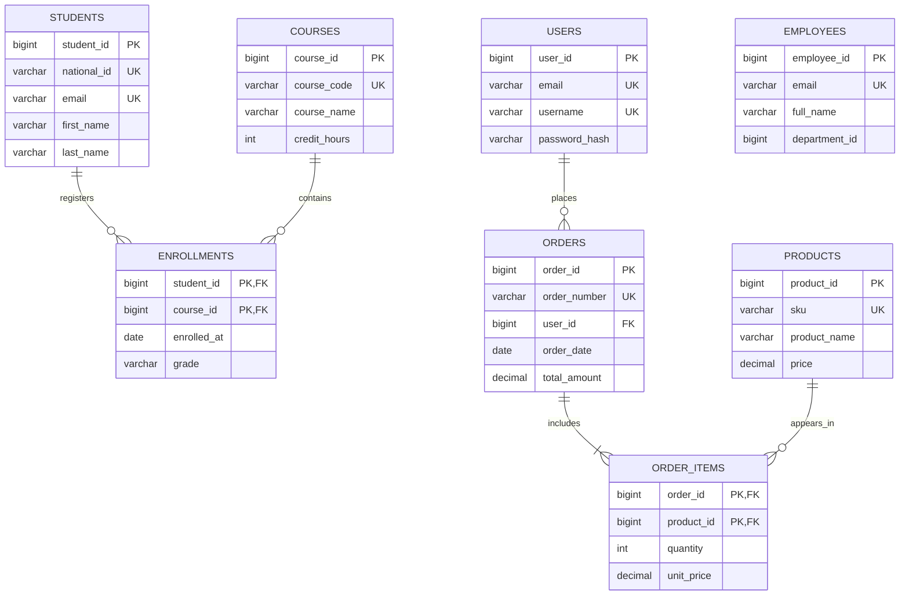

---

# 1. Primary Key

## Definition

A primary key is the column, or set of columns, selected to uniquely identify each row in a table.

## Properties

- It does not allow duplicate values.
- It does not allow `NULL`.
- A table can have only one primary key.
- It may contain one column or multiple columns.
- Database systems usually create an index for it automatically.

## Example

In the `students` table, `student_id` identifies each student:

```sql
CREATE TABLE students (
    student_id   BIGINT GENERATED ALWAYS AS IDENTITY,
    national_id  VARCHAR(30) NOT NULL,
    email        VARCHAR(255) NOT NULL,
    first_name   VARCHAR(100) NOT NULL,
    last_name    VARCHAR(100) NOT NULL,

    CONSTRAINT pk_students PRIMARY KEY (student_id)
);
```

## Diagram

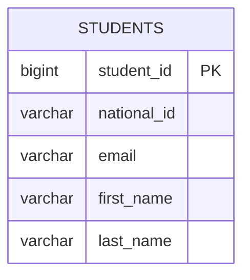

## Sample Data

| student_id | national_id | email | first_name | last_name |
|---:|---|---|---|---|
| 101 | NAT-1001 | <ali@example.com> | Ali | Ahmed |
| 102 | NAT-1002 | <sara@example.com> | Sara | Mohammed |

A new row cannot use `student_id = 101` because the primary key must remain unique.

## When to Use It

Almost every persistent table should have a primary key, even when no suitable business value exists.

## Common Mistake

Using a mutable field, such as an email address or a person’s name, as the primary key merely because it appears unique.

---

# 2. Foreign Key

## Definition

A foreign key is a column, or a set of columns, in one table that references a primary key or unique key in another table.

Its main purpose is to enforce **referential integrity**.

## Example

The `enrollments` table links students to courses:

```sql
CREATE TABLE courses (
    course_id    BIGINT GENERATED ALWAYS AS IDENTITY,
    course_code  VARCHAR(30) NOT NULL,
    course_name  VARCHAR(200) NOT NULL,

    CONSTRAINT pk_courses PRIMARY KEY (course_id),
    CONSTRAINT uq_courses_code UNIQUE (course_code)
);

CREATE TABLE enrollments (
    student_id   BIGINT NOT NULL,
    course_id    BIGINT NOT NULL,
    enrolled_at  DATE NOT NULL,
    grade        VARCHAR(5),

    CONSTRAINT pk_enrollments
        PRIMARY KEY (student_id, course_id),

    CONSTRAINT fk_enrollments_student
        FOREIGN KEY (student_id)
        REFERENCES students(student_id),

    CONSTRAINT fk_enrollments_course
        FOREIGN KEY (course_id)
        REFERENCES courses(course_id)
);
```

## Diagram

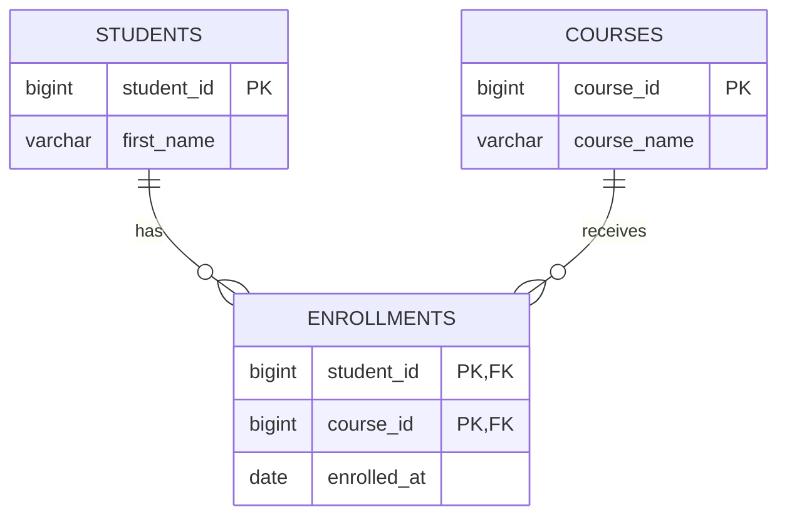

## What Does a Foreign Key Prevent?

The following statement fails if student `9999` does not exist:

```sql
INSERT INTO enrollments (student_id, course_id, enrolled_at)
VALUES (9999, 1, CURRENT_DATE);
```

## Update and Delete Policies

You can define what happens to child rows:

```sql
FOREIGN KEY (student_id)
REFERENCES students(student_id)
ON UPDATE CASCADE
ON DELETE RESTRICT
```

Common options:

| Option | Behavior |
|---|---|
| `RESTRICT` or `NO ACTION` | Prevents deleting the parent row while child rows exist |
| `CASCADE` | Automatically updates or deletes child rows |
| `SET NULL` | Sets the foreign key to `NULL` |
| `SET DEFAULT` | Sets the foreign key to its default value |

## Important Rule

Use `ON DELETE CASCADE` only when deleting the dependent rows is logically correct after deleting the parent.

---

# 3. Candidate Key

## Definition

A candidate key is a minimal set of columns that can uniquely identify a row.

“Minimal” means that no column can be removed while preserving uniqueness.

## Example

In the `users` table, the following may all be unique:

- `user_id`
- `email`
- `username`

Each one can identify a user and is therefore a candidate key.

```sql
CREATE TABLE users (
    user_id        BIGINT GENERATED ALWAYS AS IDENTITY,
    email          VARCHAR(255) NOT NULL,
    username       VARCHAR(100) NOT NULL,
    password_hash  TEXT NOT NULL,

    CONSTRAINT pk_users PRIMARY KEY (user_id),
    CONSTRAINT uq_users_email UNIQUE (email),
    CONSTRAINT uq_users_username UNIQUE (username)
);
```

## Diagram

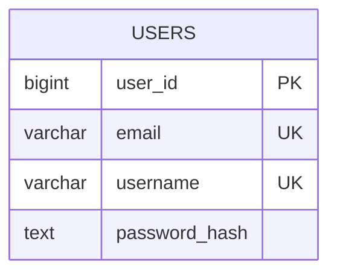

## Candidate Key Analysis

For the following rows:

| user_id | email | username |
|---:|---|---|
| 1 | <ali@example.com> | ali_dev |
| 2 | <sara@example.com> | sara_db |

These sets identify a row:

- `{user_id}` → candidate key.
- `{email}` → candidate key.
- `{username}` → candidate key.
- `{user_id, email}` → unique, but not minimal, so it is a super key rather than a candidate key.

## Candidate Key vs. Super Key

- Candidate key: unique and minimal.
- Super key: unique, but may contain unnecessary columns.

---

# 4. Alternate Key

## Definition

An alternate key is a candidate key that was not selected as the primary key.

In the `users` table:

- `user_id` is selected as the primary key.
- `email` and `username` remain alternate keys.

## Diagram

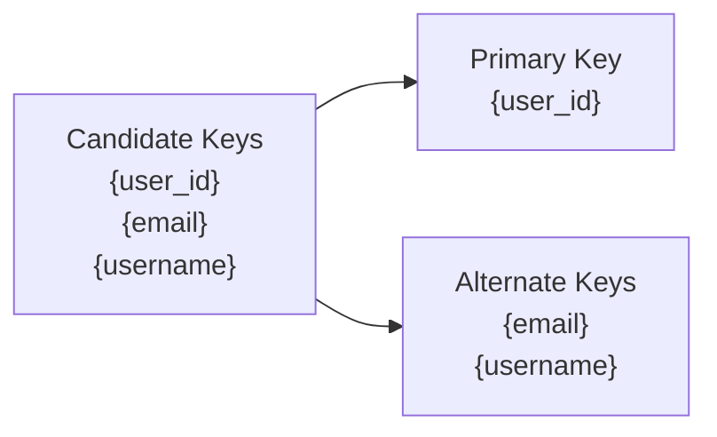

## SQL Implementation

Standard SQL does not define an `ALTERNATE KEY` keyword. Alternate keys are normally implemented with `UNIQUE` constraints:

```sql
ALTER TABLE users
ADD CONSTRAINT uq_users_email UNIQUE (email);

ALTER TABLE users
ADD CONSTRAINT uq_users_username UNIQUE (username);
```

## Typical Uses

- Signing in with an email address.
- Looking up a user by username.
- Preventing duplicate accounts.
- Integrating with external systems that use different identifiers.

## Note

Every alternate key is a candidate key, but not every `UNIQUE` constraint is necessarily a theoretical candidate key, especially if `NULL` is allowed or the column set is not minimal.

---

# 5. Composite Key

## Definition

A composite key contains two or more columns.

Uniqueness comes from the **combination of values**, not from a single column.

## Example

In the `enrollments` table:

- One student may take multiple courses.
- One course may have multiple students.
- The pair `(student_id, course_id)` identifies one enrollment.

```sql
CREATE TABLE enrollments (
    student_id   BIGINT NOT NULL,
    course_id    BIGINT NOT NULL,
    enrolled_at  DATE NOT NULL,
    grade        VARCHAR(5),

    CONSTRAINT pk_enrollments
        PRIMARY KEY (student_id, course_id),

    CONSTRAINT fk_enrollments_student
        FOREIGN KEY (student_id)
        REFERENCES students(student_id),

    CONSTRAINT fk_enrollments_course
        FOREIGN KEY (course_id)
        REFERENCES courses(course_id)
);
```

## Diagram


## Sample Data

| student_id | course_id | enrolled_at |
|---:|---:|---|
| 101 | 10 | 2026-08-01 |
| 101 | 11 | 2026-08-01 |
| 102 | 10 | 2026-08-02 |

`student_id = 101` and `course_id = 10` can each appear multiple times independently, but the pair `(101, 10)` cannot be duplicated.

## Advantage

A composite key directly models the business rule and is especially suitable for junction tables.

## Trade-Off

Any table that references the row may need to store all columns of the composite key.

---

# 6. Super Key

## Definition

A super key is any set of columns that can uniquely identify a row, whether it contains only necessary columns or additional columns.

## Example

For:

```text
EMPLOYEES(employee_id, email, full_name, department_id)
```

If both `employee_id` and `email` are unique, the following are super keys:

- `{employee_id}`
- `{email}`
- `{employee_id, full_name}`
- `{employee_id, email}`
- `{email, department_id}`
- `{employee_id, email, full_name, department_id}`

## Diagram

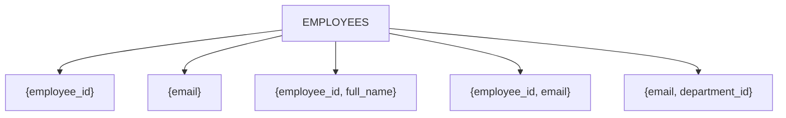

## Relationship to Candidate Keys

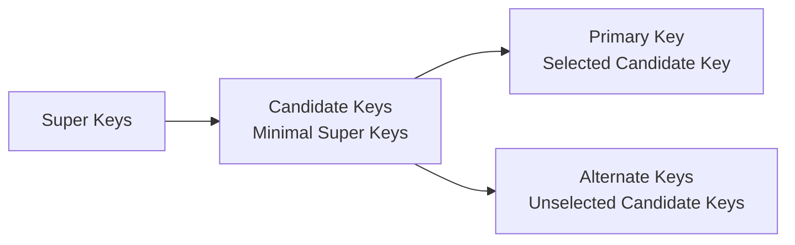

## Theoretical Rule

Every candidate key is a super key, but not every super key is a candidate key.

---

# 7. Unique Key

## Definition

A unique key, usually implemented with a `UNIQUE` constraint, prevents duplicate values in a column or column set.

## Example

```sql
CREATE TABLE products (
    product_id    BIGINT GENERATED ALWAYS AS IDENTITY,
    sku           VARCHAR(50) NOT NULL,
    barcode       VARCHAR(100),
    product_name  VARCHAR(200) NOT NULL,
    price         DECIMAL(12, 2) NOT NULL,

    CONSTRAINT pk_products PRIMARY KEY (product_id),
    CONSTRAINT uq_products_sku UNIQUE (sku),
    CONSTRAINT uq_products_barcode UNIQUE (barcode)
);
```

## Diagram

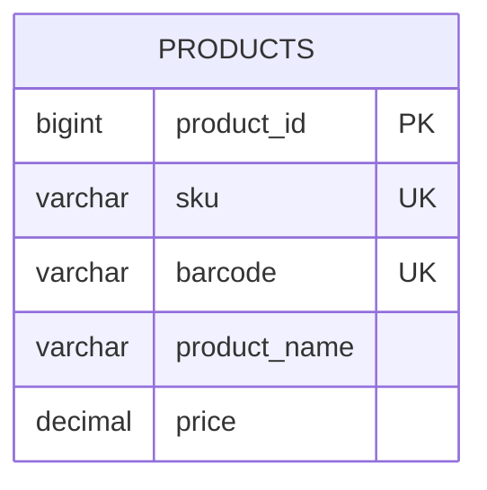

## Primary Key vs. Unique Key

| Comparison | Primary Key | Unique Key |
|---|---|---|
| Number per table | One | Multiple allowed |
| Allows `NULL` | No | Depends on the DBMS |
| Main purpose | Main row identifier | Enforce uniqueness and business rules |
| Referenced by foreign keys | Very common | Possible when the target is unique |

## NULL Behavior

`NULL` handling under `UNIQUE` differs by database system:

- PostgreSQL allows multiple `NULL` values by default.
- MySQL allows multiple `NULL` values.
- SQL Server typically allows one `NULL` in a conventional unique index.

Always verify the behavior of the target DBMS.

## Composite Unique Constraint

```sql
ALTER TABLE products
ADD CONSTRAINT uq_products_name_price
UNIQUE (product_name, price);
```

This prevents duplicate combinations, while still allowing the same name with a different price or the same price for a different name.

---

# 8. Natural Key

## Definition

A natural key is a real-world business value that already exists outside the database.

Examples:

- National ID.
- Passport number.
- Course code.
- Product SKU.
- Customer-visible order number.

## Example

```sql
CREATE TABLE citizens (
    national_id  VARCHAR(30) NOT NULL,
    full_name    VARCHAR(200) NOT NULL,
    birth_date   DATE NOT NULL,
    city         VARCHAR(100),

    CONSTRAINT pk_citizens PRIMARY KEY (national_id)
);
```

## Diagram

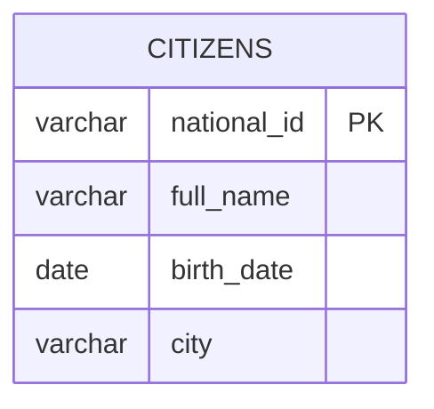

## Advantages

- Understandable to users and business teams.
- May remove the need for a separate identifier.
- Useful when integrating with systems that use the same value.

## Disadvantages

- The value may change.
- It may be long.
- It may contain sensitive information.
- Rules may vary across countries or organizations.
- It may not be globally unique despite appearing unique.

## Recommended Hybrid Design

Use a surrogate key as the primary key and enforce uniqueness on the natural key:

```sql
CREATE TABLE students (
    student_id   BIGINT GENERATED ALWAYS AS IDENTITY,
    national_id  VARCHAR(30) NOT NULL,
    email        VARCHAR(255) NOT NULL,

    CONSTRAINT pk_students PRIMARY KEY (student_id),
    CONSTRAINT uq_students_national_id UNIQUE (national_id),
    CONSTRAINT uq_students_email UNIQUE (email)
);
```

---

# 9. Surrogate Key

## Definition

A surrogate key is an identifier generated by the database or application and has no direct business meaning.

Examples:

- Sequence number.
- `IDENTITY`.
- `AUTO_INCREMENT`.
- UUID.

## Numeric Example

```sql
CREATE TABLE orders (
    order_id      BIGINT GENERATED ALWAYS AS IDENTITY,
    order_number  VARCHAR(40) NOT NULL,
    user_id       BIGINT NOT NULL,
    order_date    DATE NOT NULL,
    total_amount  DECIMAL(12, 2) NOT NULL,

    CONSTRAINT pk_orders PRIMARY KEY (order_id),
    CONSTRAINT uq_orders_order_number UNIQUE (order_number),
    CONSTRAINT fk_orders_user
        FOREIGN KEY (user_id)
        REFERENCES users(user_id)
);
```

## Diagram

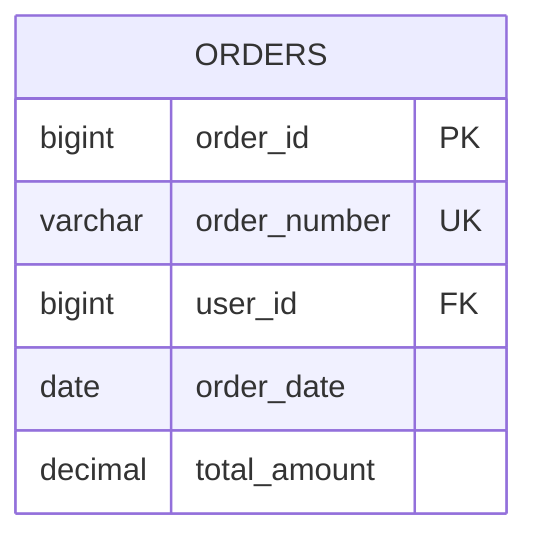

## UUID Example

```sql
CREATE TABLE api_clients (
    client_id    UUID PRIMARY KEY,
    client_name  VARCHAR(200) NOT NULL
);
```

PostgreSQL can generate UUIDs using:

```sql
CREATE EXTENSION IF NOT EXISTS pgcrypto;

CREATE TABLE api_clients (
    client_id    UUID PRIMARY KEY DEFAULT gen_random_uuid(),
    client_name  VARCHAR(200) NOT NULL
);
```

## Advantages

- Stable and independent of business data.
- Small and efficient when numeric.
- Works well when natural values may change.
- Reduces the spread of sensitive data across relationships.

## Disadvantages

- Has no meaning to users.
- Does not prevent duplicate business data by itself.
- Requires additional `UNIQUE` constraints for business rules.

## Important Rule

A surrogate key does not replace business-level uniqueness:

```sql
CONSTRAINT uq_orders_order_number UNIQUE (order_number)
```

---

# Comprehensive Comparison

| Type | Main Purpose | Allows NULL? | Allows Duplicates? | Can Be Composite? |
|---|---|---:|---:|---:|
| Primary Key | Main row identifier | No | No | Yes |
| Foreign Key | Connect tables | Yes, unless restricted | Usually yes | Yes |
| Candidate Key | Minimal unique identifier | No in theory | No | Yes |
| Alternate Key | Unselected candidate key | Depends on implementation | No | Yes |
| Composite Key | Identify a row with multiple columns | No when primary | No for the combination | It is composite by definition |
| Super Key | Any unique identifying set | Depends | No | Yes |
| Unique Key | Prevent duplicate values | Depends on DBMS | No | Yes |
| Natural Key | Real-world identifier | Usually no | No | Yes |
| Surrogate Key | Generated identifier | No when primary | No | Usually one column |

---

# Integrated Database Diagram

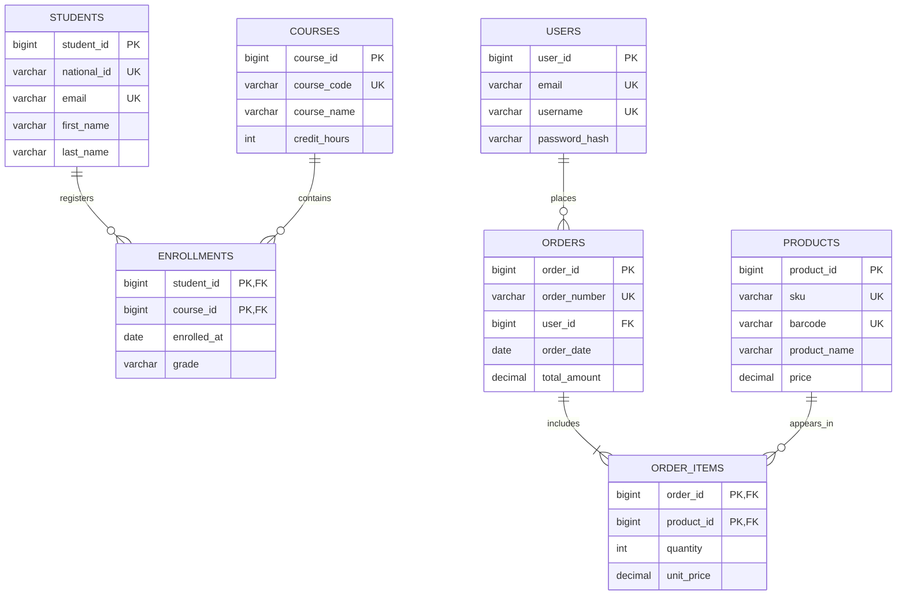

---

# Complete SQL Scenario

> The following examples use PostgreSQL-style SQL. They can be adapted for MySQL or SQL Server.

## Create Tables

```sql
CREATE TABLE users (
    user_id        BIGINT GENERATED ALWAYS AS IDENTITY,
    email          VARCHAR(255) NOT NULL,
    username       VARCHAR(100) NOT NULL,
    password_hash  TEXT NOT NULL,

    CONSTRAINT pk_users PRIMARY KEY (user_id),
    CONSTRAINT uq_users_email UNIQUE (email),
    CONSTRAINT uq_users_username UNIQUE (username)
);

CREATE TABLE students (
    student_id   BIGINT GENERATED ALWAYS AS IDENTITY,
    national_id  VARCHAR(30) NOT NULL,
    email        VARCHAR(255) NOT NULL,
    first_name   VARCHAR(100) NOT NULL,
    last_name    VARCHAR(100) NOT NULL,

    CONSTRAINT pk_students PRIMARY KEY (student_id),
    CONSTRAINT uq_students_national_id UNIQUE (national_id),
    CONSTRAINT uq_students_email UNIQUE (email)
);

CREATE TABLE courses (
    course_id     BIGINT GENERATED ALWAYS AS IDENTITY,
    course_code   VARCHAR(30) NOT NULL,
    course_name   VARCHAR(200) NOT NULL,
    credit_hours  INT NOT NULL CHECK (credit_hours > 0),

    CONSTRAINT pk_courses PRIMARY KEY (course_id),
    CONSTRAINT uq_courses_code UNIQUE (course_code)
);

CREATE TABLE enrollments (
    student_id   BIGINT NOT NULL,
    course_id    BIGINT NOT NULL,
    enrolled_at  DATE NOT NULL DEFAULT CURRENT_DATE,
    grade        VARCHAR(5),

    CONSTRAINT pk_enrollments
        PRIMARY KEY (student_id, course_id),

    CONSTRAINT fk_enrollments_student
        FOREIGN KEY (student_id)
        REFERENCES students(student_id)
        ON UPDATE CASCADE
        ON DELETE RESTRICT,

    CONSTRAINT fk_enrollments_course
        FOREIGN KEY (course_id)
        REFERENCES courses(course_id)
        ON UPDATE CASCADE
        ON DELETE RESTRICT
);

CREATE TABLE products (
    product_id    BIGINT GENERATED ALWAYS AS IDENTITY,
    sku           VARCHAR(50) NOT NULL,
    barcode       VARCHAR(100),
    product_name  VARCHAR(200) NOT NULL,
    price         DECIMAL(12, 2) NOT NULL CHECK (price >= 0),

    CONSTRAINT pk_products PRIMARY KEY (product_id),
    CONSTRAINT uq_products_sku UNIQUE (sku),
    CONSTRAINT uq_products_barcode UNIQUE (barcode)
);

CREATE TABLE orders (
    order_id      BIGINT GENERATED ALWAYS AS IDENTITY,
    order_number  VARCHAR(40) NOT NULL,
    user_id       BIGINT NOT NULL,
    order_date    DATE NOT NULL DEFAULT CURRENT_DATE,
    total_amount  DECIMAL(12, 2) NOT NULL CHECK (total_amount >= 0),

    CONSTRAINT pk_orders PRIMARY KEY (order_id),
    CONSTRAINT uq_orders_order_number UNIQUE (order_number),
    CONSTRAINT fk_orders_user
        FOREIGN KEY (user_id)
        REFERENCES users(user_id)
        ON DELETE RESTRICT
);

CREATE TABLE order_items (
    order_id    BIGINT NOT NULL,
    product_id  BIGINT NOT NULL,
    quantity    INT NOT NULL CHECK (quantity > 0),
    unit_price  DECIMAL(12, 2) NOT NULL CHECK (unit_price >= 0),

    CONSTRAINT pk_order_items
        PRIMARY KEY (order_id, product_id),

    CONSTRAINT fk_order_items_order
        FOREIGN KEY (order_id)
        REFERENCES orders(order_id)
        ON DELETE CASCADE,

    CONSTRAINT fk_order_items_product
        FOREIGN KEY (product_id)
        REFERENCES products(product_id)
        ON DELETE RESTRICT
);
```

## Insert Sample Data

```sql
INSERT INTO users (email, username, password_hash)
VALUES
    ('ali@example.com',  'ali_dev',  'HASH_1'),
    ('sara@example.com', 'sara_db',  'HASH_2');

INSERT INTO students (national_id, email, first_name, last_name)
VALUES
    ('NAT-1001', 'student1@example.com', 'Ali',  'Ahmed'),
    ('NAT-1002', 'student2@example.com', 'Sara', 'Mohammed');

INSERT INTO courses (course_code, course_name, credit_hours)
VALUES
    ('CS101', 'Introduction to Programming', 3),
    ('DB201', 'Database Systems', 3);

INSERT INTO enrollments (student_id, course_id, grade)
VALUES
    (1, 1, 'A'),
    (1, 2, 'B+'),
    (2, 2, 'A-');

INSERT INTO products (sku, barcode, product_name, price)
VALUES
    ('BOOK-DB-01', '978000000001', 'Database Systems Book', 45.00),
    ('COURSE-SQL', '978000000002', 'SQL Video Course', 75.00);

INSERT INTO orders (order_number, user_id, total_amount)
VALUES
    ('ORD-2026-0001', 1, 120.00);

INSERT INTO order_items (order_id, product_id, quantity, unit_price)
VALUES
    (1, 1, 1, 45.00),
    (1, 2, 1, 75.00);
```

## Query the Enrollment Relationships

```sql
SELECT
    s.student_id,
    s.first_name,
    s.last_name,
    c.course_code,
    c.course_name,
    e.grade
FROM enrollments e
JOIN students s
    ON s.student_id = e.student_id
JOIN courses c
    ON c.course_id = e.course_id
ORDER BY s.student_id, c.course_code;
```

## Query an Order and Its Items

```sql
SELECT
    o.order_number,
    u.username,
    p.sku,
    p.product_name,
    oi.quantity,
    oi.unit_price,
    oi.quantity * oi.unit_price AS line_total
FROM orders o
JOIN users u
    ON u.user_id = o.user_id
JOIN order_items oi
    ON oi.order_id = o.order_id
JOIN products p
    ON p.product_id = oi.product_id
WHERE o.order_number = 'ORD-2026-0001';
```

---

# Design Guidelines

## 1. Give Every Table a Primary Key

A primary key makes updates, deletes, joins, and indexing safer and simpler.

## 2. Separate Row Identity from Business Rules

Use a stable surrogate key for identity and `UNIQUE` constraints for business-level uniqueness.

## 3. Do Not Rely on the Application Alone

Database constraints protect data even when multiple applications or services write to the same database.

## 4. Choose Delete Policies Carefully

- Use `CASCADE` when child rows have no meaning without the parent.
- Use `RESTRICT` when deleting the parent must be blocked.
- Use `SET NULL` when the relationship is optional.

## 5. Index Foreign Keys When Needed

Some database systems do not automatically index foreign key columns:

```sql
CREATE INDEX idx_enrollments_student_id
ON enrollments(student_id);

CREATE INDEX idx_enrollments_course_id
ON enrollments(course_id);
```

## 6. Consider Key Size

Large keys are copied into indexes and foreign keys. Numeric keys are usually compact and efficient, while UUIDs are useful in distributed systems.

## 7. Avoid Spreading Sensitive Natural Keys

National IDs and emails may appear in many tables and logs. Prefer an internal surrogate identifier plus a `UNIQUE` constraint on the sensitive natural value.

---

# Review Questions

1. What is the difference between a candidate key and a super key?
2. Why is `email` an alternate key when `user_id` is selected as the primary key?
3. When is a composite key appropriate?
4. What is the risk of using `ON DELETE CASCADE` without careful analysis?
5. Why is a surrogate key alone insufficient to prevent duplicate business data?
6. How do `PRIMARY KEY` and `UNIQUE` differ in their handling of `NULL`?
7. Can a foreign key reference a unique key instead of a primary key?
8. When would you choose a UUID instead of an auto-incrementing number?

---

## Summary

- **Primary Key**: the main identifier for a row.
- **Foreign Key**: connects tables and preserves referential integrity.
- **Candidate Key**: a minimal unique identifier.
- **Alternate Key**: a candidate key not selected as the primary key.
- **Composite Key**: a key made of multiple columns.
- **Super Key**: any column set that uniquely identifies a row.
- **Unique Key**: a constraint that prevents duplicates.
- **Natural Key**: a real-world meaningful identifier.
- **Surrogate Key**: a generated identifier with no direct business meaning.

A robust design often combines a stable surrogate primary key, unique constraints on important natural values, and clear foreign keys that preserve relationships.
