<div dir="rtl">

# أنواع المفاتيح في قواعد البيانات

[English language](Readme.md)

> دليل عملي متكامل يشرح المفاتيح الأساسية في قواعد البيانات العلائقية، مع أمثلة SQL ومخططات Mermaid.

---

## الفهرس

1. [لماذا نستخدم المفاتيح؟](#لماذا-نستخدم-المفاتيح)
2. [النموذج التطبيقي المستخدم في الدليل](#النموذج-التطبيقي-المستخدم-في-الدليل)
3. [المفتاح الأساسي Primary Key](#1-المفتاح-الأساسي-primary-key)
4. [المفتاح الخارجي Foreign Key](#2-المفتاح-الخارجي-foreign-key)
5. [المفتاح المرشح Candidate Key](#3-المفتاح-المرشح-candidate-key)
6. [المفتاح البديل Alternate Key](#4-المفتاح-البديل-alternate-key)
7. [المفتاح المركب Composite Key](#5-المفتاح-المركب-composite-key)
8. [المفتاح الفائق Super Key](#6-المفتاح-الفائق-super-key)
9. [المفتاح الفريد Unique Key](#7-المفتاح-الفريد-unique-key)
10. [المفتاح الطبيعي Natural Key](#8-المفتاح-الطبيعي-natural-key)
11. [المفتاح الاصطناعي Surrogate Key](#9-المفتاح-الاصطناعي-surrogate-key)
12. [مقارنة شاملة](#مقارنة-شاملة)
13. [مخطط قاعدة البيانات المتكامل](#مخطط-قاعدة-البيانات-المتكامل)
14. [سيناريو SQL متكامل](#سيناريو-sql-متكامل)
15. [إرشادات التصميم](#إرشادات-التصميم)
16. [أسئلة مراجعة](#أسئلة-مراجعة)

---

## لماذا نستخدم المفاتيح؟

المفتاح في قاعدة البيانات هو حقل، أو مجموعة حقول، تُستخدم لتحقيق هدف واحد أو أكثر من الأهداف التالية:

- تمييز كل سجل بصورة فريدة.
- منع التكرار غير المرغوب.
- ربط الجداول ببعضها.
- ضمان سلامة العلاقات بين البيانات.
- تسريع البحث والفهرسة.
- التعبير عن قواعد العمل داخل قاعدة البيانات.

من دون المفاتيح قد تتكرر السجلات، أو تظهر علاقات تشير إلى بيانات غير موجودة، أو يصبح تحديث البيانات وحذفها أمرًا غير آمن.

---

## النموذج التطبيقي المستخدم في الدليل

سنستخدم منصة تعليمية مبسطة تحتوي على:

- طلاب.
- مقررات.
- تسجيلات الطلاب في المقررات.
- مستخدمين للنظام.
- موظفين.
- طلبات ومنتجات.

المخطط العام:

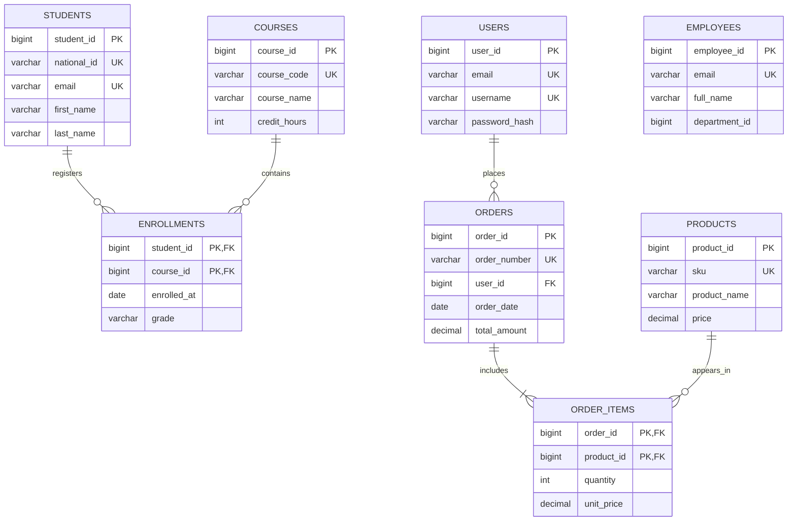

---

# 1. المفتاح الأساسي Primary Key

## التعريف

المفتاح الأساسي هو الحقل، أو مجموعة الحقول، المختارة لتحديد كل سجل داخل الجدول بصورة فريدة.

## الخصائص

- لا يقبل التكرار.
- لا يقبل `NULL`.
- يوجد مفتاح أساسي واحد فقط لكل جدول.
- قد يتكون من حقل واحد أو عدة حقول.
- تنشئ أنظمة قواعد البيانات عادةً فهرسًا للمفتاح الأساسي تلقائيًا.

## مثال

في جدول الطلاب، يحدد `student_id` كل طالب:

```sql
CREATE TABLE students (
    student_id   BIGINT GENERATED ALWAYS AS IDENTITY,
    national_id  VARCHAR(30) NOT NULL,
    email        VARCHAR(255) NOT NULL,
    first_name   VARCHAR(100) NOT NULL,
    last_name    VARCHAR(100) NOT NULL,

    CONSTRAINT pk_students PRIMARY KEY (student_id)
);
```

## المخطط

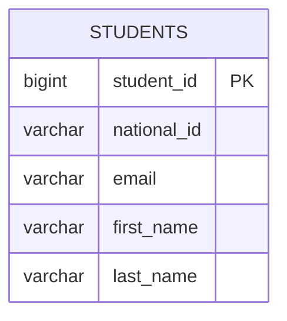

## مثال بيانات

| student_id | national_id | email | first_name | last_name |
|---:|---|---|---|---|
| 101 | NAT-1001 | <ali@example.com> | علي | أحمد |
| 102 | NAT-1002 | <sara@example.com> | سارة | محمد |

لا يمكن إضافة طالب جديد بالقيمة `student_id = 101`؛ لأن المفتاح الأساسي يجب أن يكون فريدًا.

## متى نستخدمه؟

يجب أن يحتوي كل جدول فعلي تقريبًا على مفتاح أساسي، حتى لو لم توجد قيمة طبيعية مناسبة داخل بيانات العمل.

## خطأ شائع

استخدام الاسم أو البريد الإلكتروني كمفتاح أساسي لمجرد أنه يبدو فريدًا. هذه القيم قد تتغير، بينما يفضَّل أن يكون المفتاح الأساسي ثابتًا.

---

# 2. المفتاح الخارجي Foreign Key

## التعريف

المفتاح الخارجي هو حقل، أو مجموعة حقول، في جدول تشير إلى مفتاح أساسي أو مفتاح فريد في جدول آخر.

وظيفته الأساسية هي الحفاظ على **التكامل المرجعي Referential Integrity**.

## مثال

جدول التسجيلات يربط الطلاب بالمقررات:

```sql
CREATE TABLE courses (
    course_id    BIGINT GENERATED ALWAYS AS IDENTITY,
    course_code  VARCHAR(30) NOT NULL,
    course_name  VARCHAR(200) NOT NULL,

    CONSTRAINT pk_courses PRIMARY KEY (course_id),
    CONSTRAINT uq_courses_code UNIQUE (course_code)
);

CREATE TABLE enrollments (
    student_id   BIGINT NOT NULL,
    course_id    BIGINT NOT NULL,
    enrolled_at  DATE NOT NULL,
    grade        VARCHAR(5),

    CONSTRAINT pk_enrollments
        PRIMARY KEY (student_id, course_id),

    CONSTRAINT fk_enrollments_student
        FOREIGN KEY (student_id)
        REFERENCES students(student_id),

    CONSTRAINT fk_enrollments_course
        FOREIGN KEY (course_id)
        REFERENCES courses(course_id)
);
```

## المخطط

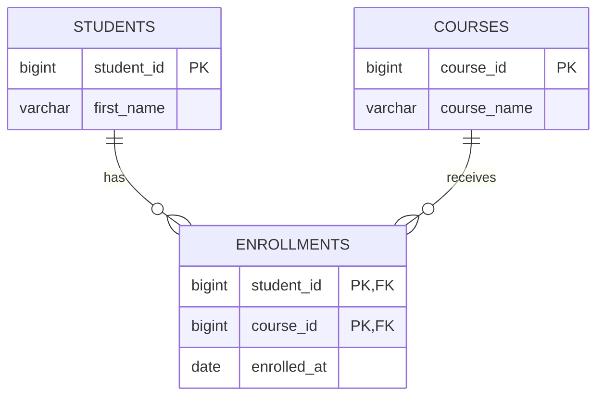

## ماذا يمنع المفتاح الخارجي؟

الأمر التالي يفشل إذا لم يوجد الطالب رقم `9999`:

```sql
INSERT INTO enrollments (student_id, course_id, enrolled_at)
VALUES (9999, 1, CURRENT_DATE);
```

## سياسات الحذف والتحديث

يمكن تحديد ما يحدث للسجلات التابعة:

```sql
FOREIGN KEY (student_id)
REFERENCES students(student_id)
ON UPDATE CASCADE
ON DELETE RESTRICT
```

أشهر الخيارات:

| الخيار | السلوك |
|---|---|
| `RESTRICT` أو `NO ACTION` | يمنع حذف السجل الأب إذا كانت له سجلات تابعة |
| `CASCADE` | يحذف أو يحدّث السجلات التابعة تلقائيًا |
| `SET NULL` | يضع قيمة المفتاح الخارجي `NULL` |
| `SET DEFAULT` | يضع القيمة الافتراضية |

## قاعدة مهمة

لا تستخدم `ON DELETE CASCADE` إلا عندما يكون حذف السجلات التابعة نتيجة صحيحة منطقيًا لحذف السجل الأب.

---

# 3. المفتاح المرشح Candidate Key

## التعريف

المفتاح المرشح هو أقل مجموعة ممكنة من الحقول تستطيع تحديد السجل بصورة فريدة.

كلمة **أقل Minimal** تعني أنه لا يمكن حذف أي حقل منه مع بقاء خاصية التفرد.

## مثال

في جدول المستخدمين قد تكون الحقول التالية فريدة:

- `user_id`
- `email`
- `username`

كل واحد منها يستطيع تحديد مستخدم واحد، لذلك تمثل جميعها مفاتيح مرشحة.

```sql
CREATE TABLE users (
    user_id        BIGINT GENERATED ALWAYS AS IDENTITY,
    email          VARCHAR(255) NOT NULL,
    username       VARCHAR(100) NOT NULL,
    password_hash  TEXT NOT NULL,

    CONSTRAINT pk_users PRIMARY KEY (user_id),
    CONSTRAINT uq_users_email UNIQUE (email),
    CONSTRAINT uq_users_username UNIQUE (username)
);
```

## المخطط

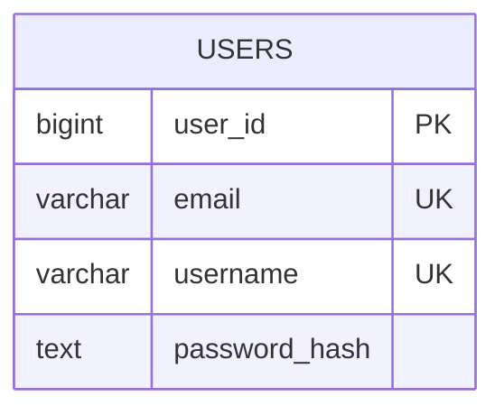

## تحليل المفاتيح المرشحة

للسجل:

| user_id | email | username |
|---:|---|---|
| 1 | <ali@example.com> | ali_dev |
| 2 | <sara@example.com> | sara_db |

المجموعات التالية تحدد السجل:

- `{user_id}` ← مفتاح مرشح.
- `{email}` ← مفتاح مرشح.
- `{username}` ← مفتاح مرشح.
- `{user_id, email}` ← يحدد السجل، لكنه ليس مفتاحًا مرشحًا لأنه يحتوي حقلًا زائدًا؛ لذا هو مفتاح فائق.

## الفرق بين المرشح والفائق

- المفتاح المرشح: فريد وأدنى Minimal.
- المفتاح الفائق: فريد، وقد يحتوي حقولًا زائدة.

---

# 4. المفتاح البديل Alternate Key

## التعريف

المفتاح البديل هو مفتاح مرشح لم يتم اختياره ليكون المفتاح الأساسي.

في جدول `users`:

- `user_id` تم اختياره مفتاحًا أساسيًا.
- `email` و`username` بقيا مفتاحين بديلين.

## المخطط

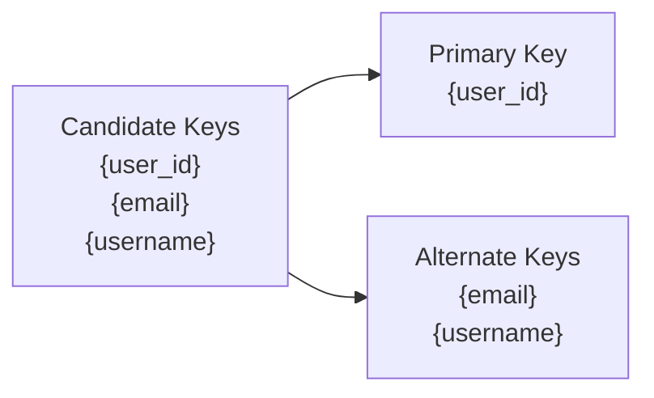

## تنفيذ SQL

لا توجد كلمة SQL قياسية باسم `ALTERNATE KEY`. يُطبَّق المفتاح البديل عادةً باستخدام قيد `UNIQUE`:

```sql
ALTER TABLE users
ADD CONSTRAINT uq_users_email UNIQUE (email);

ALTER TABLE users
ADD CONSTRAINT uq_users_username UNIQUE (username);
```

## متى يكون مفيدًا؟

- تسجيل الدخول بالبريد الإلكتروني.
- البحث باسم المستخدم.
- منع إنشاء حسابين بالقيمة نفسها.
- دعم التكامل مع نظام خارجي يستخدم معرفًا مختلفًا.

## ملاحظة

كل مفتاح بديل هو مفتاح مرشح، لكن ليس كل قيد `UNIQUE` بالضرورة مفتاحًا مرشحًا من الناحية النظرية؛ فقد يسمح النظام بـ`NULL` أو قد يكون القيد على مجموعة غير دنيا.

---

# 5. المفتاح المركب Composite Key

## التعريف

المفتاح المركب هو مفتاح يتكون من حقلين أو أكثر.

تتحقق فرادة السجل من خلال **تركيبة القيم** وليس من خلال حقل واحد منفرد.

## مثال

في جدول التسجيلات:

- يمكن للطالب التسجيل في عدة مقررات.
- يمكن للمقرر أن يحتوي عدة طلاب.
- التركيبة `(student_id, course_id)` تحدد عملية تسجيل واحدة.

```sql
CREATE TABLE enrollments (
    student_id   BIGINT NOT NULL,
    course_id    BIGINT NOT NULL,
    enrolled_at  DATE NOT NULL,
    grade        VARCHAR(5),

    CONSTRAINT pk_enrollments
        PRIMARY KEY (student_id, course_id),

    CONSTRAINT fk_enrollments_student
        FOREIGN KEY (student_id)
        REFERENCES students(student_id),

    CONSTRAINT fk_enrollments_course
        FOREIGN KEY (course_id)
        REFERENCES courses(course_id)
);
```

## المخطط


## مثال بيانات

| student_id | course_id | enrolled_at |
|---:|---:|---|
| 101 | 10 | 2026-08-01 |
| 101 | 11 | 2026-08-01 |
| 102 | 10 | 2026-08-02 |

القيمتان `student_id = 101` و`course_id = 10` يمكن أن تظهرا منفردتين عدة مرات، لكن لا يجوز تكرار الزوج `(101, 10)`.

## ميزة

يمثل قاعدة العمل مباشرة ويمنع التكرار الطبيعي في جداول الربط.

## تحدٍّ

كل جدول يشير إلى هذا السجل يحتاج غالبًا إلى تخزين كل أعمدة المفتاح المركب.

---

# 6. المفتاح الفائق Super Key

## التعريف

المفتاح الفائق هو أي مجموعة من الحقول تستطيع تحديد سجل واحد بصورة فريدة، سواء احتوت حقولًا ضرورية فقط أو حقولًا إضافية.

## مثال

في جدول الموظفين:

```text
EMPLOYEES(employee_id, email, full_name, department_id)
```

إذا كان كل من `employee_id` و`email` فريدًا، فالمجموعات التالية مفاتيح فائقة:

- `{employee_id}`
- `{email}`
- `{employee_id, full_name}`
- `{employee_id, email}`
- `{email, department_id}`
- `{employee_id, email, full_name, department_id}`

## المخطط

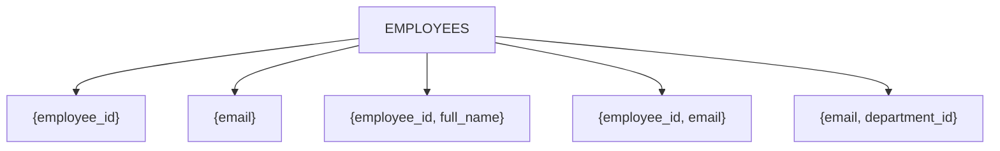

## العلاقة بالمفتاح المرشح

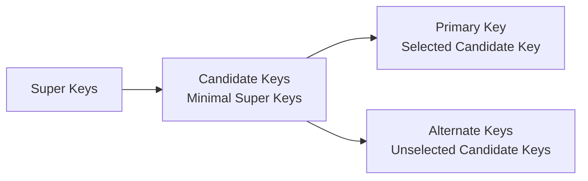

## قاعدة نظرية

كل مفتاح مرشح هو مفتاح فائق، لكن ليس كل مفتاح فائق مفتاحًا مرشحًا.

---

# 7. المفتاح الفريد Unique Key

## التعريف

المفتاح الفريد، أو قيد `UNIQUE`، يفرض عدم تكرار قيمة حقل أو مجموعة حقول.

## مثال

```sql
CREATE TABLE products (
    product_id    BIGINT GENERATED ALWAYS AS IDENTITY,
    sku           VARCHAR(50) NOT NULL,
    barcode       VARCHAR(100),
    product_name  VARCHAR(200) NOT NULL,
    price         DECIMAL(12, 2) NOT NULL,

    CONSTRAINT pk_products PRIMARY KEY (product_id),
    CONSTRAINT uq_products_sku UNIQUE (sku),
    CONSTRAINT uq_products_barcode UNIQUE (barcode)
);
```

## المخطط

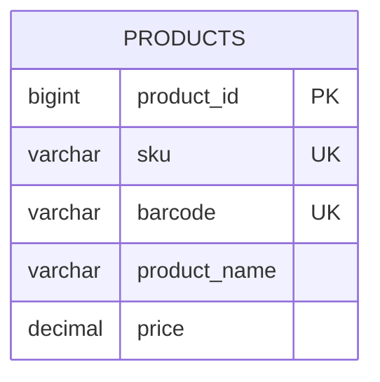

## الفرق عن المفتاح الأساسي

| المقارنة | Primary Key | Unique Key |
|---|---|---|
| العدد في الجدول | واحد فقط | يمكن وجود عدة قيود |
| قبول `NULL` | لا | يعتمد على نظام إدارة قاعدة البيانات |
| الهدف | المعرّف الرئيسي للسجل | منع التكرار وتطبيق قاعدة عمل |
| الاستخدام في العلاقات | شائع جدًا | يمكن الإشارة إليه إذا كان فريدًا |

## ملاحظة حول NULL

سلوك `NULL` داخل قيد `UNIQUE` يختلف بين الأنظمة:

- PostgreSQL يسمح افتراضيًا بعدة قيم `NULL`.
- MySQL يسمح بعدة قيم `NULL`.
- SQL Server يسمح عادةً بقيمة `NULL` واحدة في الفهرس الفريد التقليدي.

لذلك يجب مراجعة سلوك نظام قاعدة البيانات المستخدم.

## قيد فريد مركب

```sql
ALTER TABLE products
ADD CONSTRAINT uq_products_name_price
UNIQUE (product_name, price);
```

هذا يمنع تكرار التركيبة نفسها، لكنه لا يمنع تكرار الاسم وحده أو السعر وحده.

---

# 8. المفتاح الطبيعي Natural Key

## التعريف

المفتاح الطبيعي هو قيمة موجودة أصلًا في مجال العمل وتحمل معنى حقيقيًا خارج قاعدة البيانات.

أمثلة:

- رقم الهوية الوطنية.
- رقم جواز السفر.
- رمز المقرر.
- رقم المنتج التجاري SKU.
- رقم الطلب المعروض للعميل.

## مثال

```sql
CREATE TABLE citizens (
    national_id  VARCHAR(30) NOT NULL,
    full_name    VARCHAR(200) NOT NULL,
    birth_date   DATE NOT NULL,
    city         VARCHAR(100),

    CONSTRAINT pk_citizens PRIMARY KEY (national_id)
);
```

## المخطط

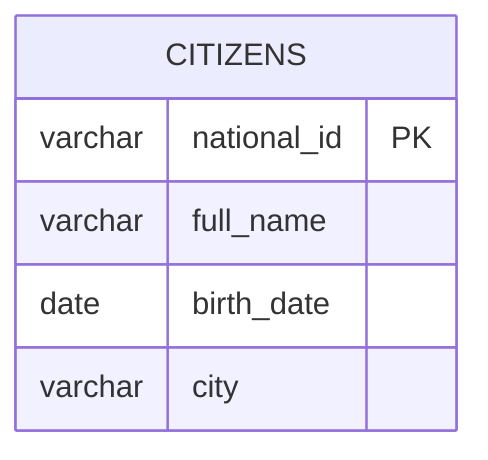

## المزايا

- مفهوم للمستخدمين وفرق العمل.
- قد يقلل الحاجة إلى معرف إضافي.
- مفيد في التكامل مع أنظمة تستخدم القيمة نفسها.

## العيوب

- قد تتغير القيمة بسبب تصحيح أو تغيير في العمل.
- قد تكون طويلة.
- قد تحتوي معلومات حساسة.
- قد تختلف قواعدها بين الدول أو المؤسسات.
- قد لا تكون فريدة عالميًا رغم الاعتقاد بذلك.

## تصميم هجين موصى به

استخدم مفتاحًا اصطناعيًا كمفتاح أساسي، مع قيد فريد على المفتاح الطبيعي:

```sql
CREATE TABLE students (
    student_id   BIGINT GENERATED ALWAYS AS IDENTITY,
    national_id  VARCHAR(30) NOT NULL,
    email        VARCHAR(255) NOT NULL,

    CONSTRAINT pk_students PRIMARY KEY (student_id),
    CONSTRAINT uq_students_national_id UNIQUE (national_id),
    CONSTRAINT uq_students_email UNIQUE (email)
);
```

---

# 9. المفتاح الاصطناعي Surrogate Key

## التعريف

المفتاح الاصطناعي هو معرف تنشئه قاعدة البيانات أو التطبيق، ولا يحمل معنى تجاريًا مباشرًا.

أمثلة:

- رقم متسلسل.
- `IDENTITY`.
- `AUTO_INCREMENT`.
- UUID.

## مثال رقمي

```sql
CREATE TABLE orders (
    order_id      BIGINT GENERATED ALWAYS AS IDENTITY,
    order_number  VARCHAR(40) NOT NULL,
    user_id       BIGINT NOT NULL,
    order_date    DATE NOT NULL,
    total_amount  DECIMAL(12, 2) NOT NULL,

    CONSTRAINT pk_orders PRIMARY KEY (order_id),
    CONSTRAINT uq_orders_order_number UNIQUE (order_number),
    CONSTRAINT fk_orders_user
        FOREIGN KEY (user_id)
        REFERENCES users(user_id)
);
```

## المخطط

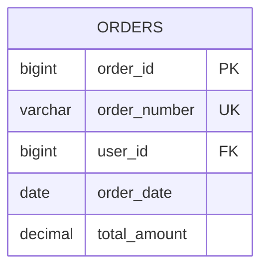

## مثال UUID

```sql
CREATE TABLE api_clients (
    client_id    UUID PRIMARY KEY,
    client_name  VARCHAR(200) NOT NULL
);
```

في PostgreSQL يمكن توليد UUID مثلًا باستخدام:

```sql
CREATE EXTENSION IF NOT EXISTS pgcrypto;

CREATE TABLE api_clients (
    client_id    UUID PRIMARY KEY DEFAULT gen_random_uuid(),
    client_name  VARCHAR(200) NOT NULL
);
```

## المزايا

- ثابت ولا يعتمد على بيانات العمل.
- صغير وسهل الربط إذا كان رقميًا.
- مناسب لتغيير القيم الطبيعية.
- يقلل انتشار البيانات الحساسة عبر العلاقات.

## العيوب

- لا يحمل معنى للمستخدم.
- لا يمنع تكرار البيانات الطبيعية وحده.
- يحتاج إلى قيود `UNIQUE` إضافية لتطبيق قواعد العمل.

## قاعدة مهمة

وجود مفتاح اصطناعي لا يغني عن فرض التفرد على القيم الطبيعية المهمة:

```sql
CONSTRAINT uq_orders_order_number UNIQUE (order_number)
```

---

# مقارنة شاملة

| النوع | الهدف الأساسي | يقبل NULL؟ | يقبل التكرار؟ | يمكن أن يكون مركبًا؟ |
|---|---|---:|---:|---:|
| Primary Key | المعرّف الرئيسي | لا | لا | نعم |
| Foreign Key | ربط الجداول | نعم إذا لم يُمنع | نعم غالبًا | نعم |
| Candidate Key | معرّف فريد أدنى | لا نظريًا | لا | نعم |
| Alternate Key | مفتاح مرشح غير مختار | وفق التنفيذ | لا | نعم |
| Composite Key | تحديد السجل بعدة حقول | لا إذا كان Primary | لا للتركيبة | هو مركب أصلًا |
| Super Key | أي مجموعة تحدد السجل | يعتمد | لا | نعم |
| Unique Key | منع التكرار | يعتمد على DBMS | لا | نعم |
| Natural Key | معرّف ذو معنى واقعي | غالبًا لا | لا | نعم |
| Surrogate Key | معرف مولد بلا معنى تجاري | لا إذا كان Primary | لا | عادةً حقل واحد |

---

# مخطط قاعدة البيانات المتكامل

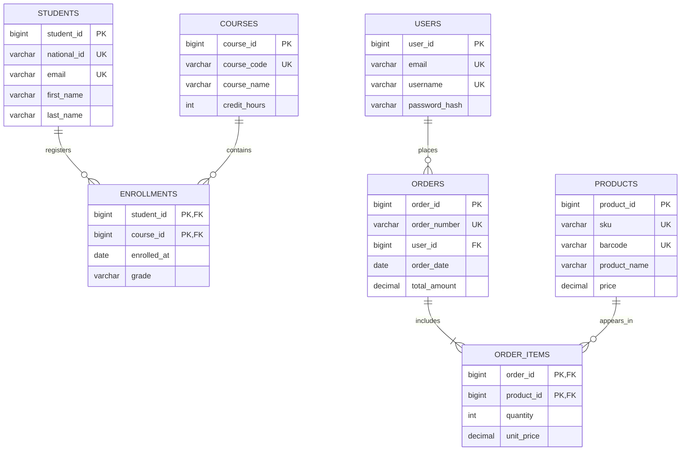

---

# سيناريو SQL متكامل

> الأمثلة التالية مكتوبة بأسلوب PostgreSQL. يمكن تكييفها بسهولة مع MySQL أو SQL Server.

## إنشاء الجداول

```sql
CREATE TABLE users (
    user_id        BIGINT GENERATED ALWAYS AS IDENTITY,
    email          VARCHAR(255) NOT NULL,
    username       VARCHAR(100) NOT NULL,
    password_hash  TEXT NOT NULL,

    CONSTRAINT pk_users PRIMARY KEY (user_id),
    CONSTRAINT uq_users_email UNIQUE (email),
    CONSTRAINT uq_users_username UNIQUE (username)
);

CREATE TABLE students (
    student_id   BIGINT GENERATED ALWAYS AS IDENTITY,
    national_id  VARCHAR(30) NOT NULL,
    email        VARCHAR(255) NOT NULL,
    first_name   VARCHAR(100) NOT NULL,
    last_name    VARCHAR(100) NOT NULL,

    CONSTRAINT pk_students PRIMARY KEY (student_id),
    CONSTRAINT uq_students_national_id UNIQUE (national_id),
    CONSTRAINT uq_students_email UNIQUE (email)
);

CREATE TABLE courses (
    course_id     BIGINT GENERATED ALWAYS AS IDENTITY,
    course_code   VARCHAR(30) NOT NULL,
    course_name   VARCHAR(200) NOT NULL,
    credit_hours  INT NOT NULL CHECK (credit_hours > 0),

    CONSTRAINT pk_courses PRIMARY KEY (course_id),
    CONSTRAINT uq_courses_code UNIQUE (course_code)
);

CREATE TABLE enrollments (
    student_id   BIGINT NOT NULL,
    course_id    BIGINT NOT NULL,
    enrolled_at  DATE NOT NULL DEFAULT CURRENT_DATE,
    grade        VARCHAR(5),

    CONSTRAINT pk_enrollments
        PRIMARY KEY (student_id, course_id),

    CONSTRAINT fk_enrollments_student
        FOREIGN KEY (student_id)
        REFERENCES students(student_id)
        ON UPDATE CASCADE
        ON DELETE RESTRICT,

    CONSTRAINT fk_enrollments_course
        FOREIGN KEY (course_id)
        REFERENCES courses(course_id)
        ON UPDATE CASCADE
        ON DELETE RESTRICT
);

CREATE TABLE products (
    product_id    BIGINT GENERATED ALWAYS AS IDENTITY,
    sku           VARCHAR(50) NOT NULL,
    barcode       VARCHAR(100),
    product_name  VARCHAR(200) NOT NULL,
    price         DECIMAL(12, 2) NOT NULL CHECK (price >= 0),

    CONSTRAINT pk_products PRIMARY KEY (product_id),
    CONSTRAINT uq_products_sku UNIQUE (sku),
    CONSTRAINT uq_products_barcode UNIQUE (barcode)
);

CREATE TABLE orders (
    order_id      BIGINT GENERATED ALWAYS AS IDENTITY,
    order_number  VARCHAR(40) NOT NULL,
    user_id       BIGINT NOT NULL,
    order_date    DATE NOT NULL DEFAULT CURRENT_DATE,
    total_amount  DECIMAL(12, 2) NOT NULL CHECK (total_amount >= 0),

    CONSTRAINT pk_orders PRIMARY KEY (order_id),
    CONSTRAINT uq_orders_order_number UNIQUE (order_number),
    CONSTRAINT fk_orders_user
        FOREIGN KEY (user_id)
        REFERENCES users(user_id)
        ON DELETE RESTRICT
);

CREATE TABLE order_items (
    order_id    BIGINT NOT NULL,
    product_id  BIGINT NOT NULL,
    quantity    INT NOT NULL CHECK (quantity > 0),
    unit_price  DECIMAL(12, 2) NOT NULL CHECK (unit_price >= 0),

    CONSTRAINT pk_order_items
        PRIMARY KEY (order_id, product_id),

    CONSTRAINT fk_order_items_order
        FOREIGN KEY (order_id)
        REFERENCES orders(order_id)
        ON DELETE CASCADE,

    CONSTRAINT fk_order_items_product
        FOREIGN KEY (product_id)
        REFERENCES products(product_id)
        ON DELETE RESTRICT
);
```

## إدخال بيانات

```sql
INSERT INTO users (email, username, password_hash)
VALUES
    ('ali@example.com',  'ali_dev',  'HASH_1'),
    ('sara@example.com', 'sara_db',  'HASH_2');

INSERT INTO students (national_id, email, first_name, last_name)
VALUES
    ('NAT-1001', 'student1@example.com', 'علي',  'أحمد'),
    ('NAT-1002', 'student2@example.com', 'سارة', 'محمد');

INSERT INTO courses (course_code, course_name, credit_hours)
VALUES
    ('CS101', 'Introduction to Programming', 3),
    ('DB201', 'Database Systems', 3);

INSERT INTO enrollments (student_id, course_id, grade)
VALUES
    (1, 1, 'A'),
    (1, 2, 'B+'),
    (2, 2, 'A-');

INSERT INTO products (sku, barcode, product_name, price)
VALUES
    ('BOOK-DB-01', '978000000001', 'Database Systems Book', 45.00),
    ('COURSE-SQL', '978000000002', 'SQL Video Course', 75.00);

INSERT INTO orders (order_number, user_id, total_amount)
VALUES
    ('ORD-2026-0001', 1, 120.00);

INSERT INTO order_items (order_id, product_id, quantity, unit_price)
VALUES
    (1, 1, 1, 45.00),
    (1, 2, 1, 75.00);
```

## استعلام يوضح العلاقات

```sql
SELECT
    s.student_id,
    s.first_name,
    s.last_name,
    c.course_code,
    c.course_name,
    e.grade
FROM enrollments e
JOIN students s
    ON s.student_id = e.student_id
JOIN courses c
    ON c.course_id = e.course_id
ORDER BY s.student_id, c.course_code;
```

## استعلام يوضح الطلب وعناصره

```sql
SELECT
    o.order_number,
    u.username,
    p.sku,
    p.product_name,
    oi.quantity,
    oi.unit_price,
    oi.quantity * oi.unit_price AS line_total
FROM orders o
JOIN users u
    ON u.user_id = o.user_id
JOIN order_items oi
    ON oi.order_id = o.order_id
JOIN products p
    ON p.product_id = oi.product_id
WHERE o.order_number = 'ORD-2026-0001';
```

---

# إرشادات التصميم

## 1. اجعل لكل جدول مفتاحًا أساسيًا

وجود مفتاح أساسي يسهل التحديث والحذف والربط والفهرسة.

## 2. افصل بين هوية السجل وقواعد العمل

استخدم مفتاحًا اصطناعيًا ثابتًا للهوية، ثم استخدم قيود `UNIQUE` لتطبيق التفرد التجاري.

## 3. لا تعتمد على التطبيق وحده

فرض التفرد والعلاقات داخل قاعدة البيانات يمنع الأخطاء حتى عند وجود عدة تطبيقات أو خدمات تتعامل مع البيانات.

## 4. اختر سياسات الحذف بعناية

- استخدم `CASCADE` عندما تكون السجلات التابعة بلا معنى دون الأب.
- استخدم `RESTRICT` عندما يجب منع حذف الأب.
- استخدم `SET NULL` عندما تكون العلاقة اختيارية.

## 5. افهرس المفاتيح الخارجية عند الحاجة

بعض الأنظمة لا تنشئ فهرسًا للمفتاح الخارجي تلقائيًا. إنشاء فهرس قد يحسن عمليات الربط والحذف والتحديث:

```sql
CREATE INDEX idx_enrollments_student_id
ON enrollments(student_id);

CREATE INDEX idx_enrollments_course_id
ON enrollments(course_id);
```

## 6. انتبه لحجم المفاتيح

المفتاح الكبير ينتشر في الفهارس والمفاتيح الخارجية. لذلك تكون الأعداد الصحيحة غالبًا فعالة، بينما تفيد UUIDs في الأنظمة الموزعة.

## 7. لا تستخدم بيانات حساسة كمفتاح منتشر

رقم الهوية أو البريد الإلكتروني قد يظهر في عدة جداول وسجلات، مما يزيد المخاطر. يمكن استخدام معرف اصطناعي داخلي مع قيد فريد على القيمة الحساسة.

---

# أسئلة مراجعة

1. ما الفرق بين المفتاح المرشح والمفتاح الفائق؟
2. لماذا يُعد `email` مفتاحًا بديلًا عند اختيار `user_id` مفتاحًا أساسيًا؟
3. متى يكون المفتاح المركب مناسبًا؟
4. ما خطر استخدام `ON DELETE CASCADE` بلا دراسة؟
5. لماذا لا يكفي المفتاح الاصطناعي وحده لمنع تكرار بيانات العمل؟
6. ما الفرق بين `PRIMARY KEY` و`UNIQUE` في التعامل مع `NULL`؟
7. هل يمكن للمفتاح الخارجي أن يشير إلى مفتاح فريد بدلًا من المفتاح الأساسي؟
8. متى نختار UUID بدلًا من رقم متسلسل؟

---

## خلاصة

- **Primary Key**: المعرّف الرئيسي للسجل.
- **Foreign Key**: يربط الجداول ويحافظ على التكامل المرجعي.
- **Candidate Key**: مفتاح فريد وأدنى يمكن اختياره كمفتاح أساسي.
- **Alternate Key**: مفتاح مرشح لم يتم اختياره كمفتاح أساسي.
- **Composite Key**: مفتاح يتكون من عدة حقول.
- **Super Key**: أي مجموعة حقول تحدد السجل بصورة فريدة.
- **Unique Key**: قيد يمنع التكرار.
- **Natural Key**: مفتاح ذو معنى واقعي.
- **Surrogate Key**: معرف مولد بلا معنى تجاري مباشر.

التصميم الجيد غالبًا يجمع بين مفتاح اصطناعي ثابت، وقيود فريدة على القيم الطبيعية، ومفاتيح خارجية واضحة تحفظ العلاقات.
