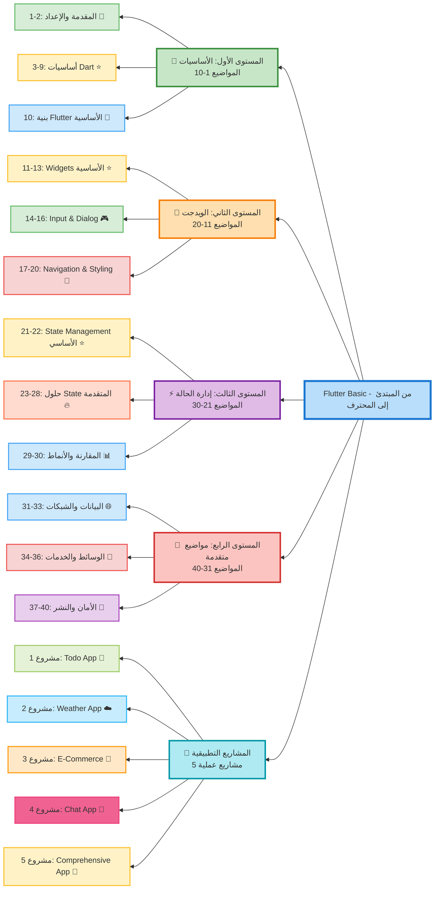

# خطة تعلم Flutter من المبتدئ إلى المحترف

## 📱 نبذة عن Flutter

Flutter هو إطار عمل مفتوح المصدر من Google لبناء تطبيقات متعددة المنصات (Android, iOS, Web, Desktop) من كود واحد باستخدام لغة Dart. يتميز بالأداء العالي، واجهات المستخدم الجميلة، والتطوير السريع.

---

## 🎯 أهداف الخطة التعليمية

- إتقان أساسيات لغة Dart
- فهم بنية تطبيقات Flutter
- بناء واجهات مستخدم تفاعلية
- التعامل مع البيانات والحالة
- الاتصال بالـ APIs والقواعد البيانات
- نشر التطبيقات على المتاجر

---

## 📊 مخطط المنهج الدراسي

### 🔑 مفتاح الرموز

- ⭐ **أساسي ومهم**: يجب إتقانه قبل المتابعة
- 🎮 **تفاعلي**: يركز على التفاعل مع المستخدم
- 🎨 **تصميمي**: يركز على الواجهات والتنسيق
- 🔥 **متقدم**: يتطلب فهم جيد للأساسيات
- 🌐 **اتصال خارجي**: التعامل مع APIs والبيانات
- 📸 **وسائط**: التعامل مع الصور والملفات
- 🔐 **أمان**: الحماية والنشر
- 🔧 **إعداد**: تجهيز بيئة العمل

---

## � العلاقة مع خطة تعلم Dart

هذه الخطة تركز على **Flutter Framework**، وتفترض معرفة أساسية بلغة Dart.

**إذا كنت مبتدئاً في Dart:**

- ابدأ أولاً بـ [خطة تعلم Dart الشاملة](../Dart%20basic/README.md)
- أكمل المواضيع 1-12 على الأقل قبل البدء بـ Flutter
- استخدم ملفات Dart المرجعية أثناء تعلم Flutter

**إذا كنت تعرف Dart:**

- يمكنك البدء مباشرة من الموضوع 10
- ارجع لملفات Dart عند الحاجة للمراجعة
- استفد من المواضيع المتقدمة (13-17) في Dart

---

## �📚 الفهرس

### المستوى الأول: الأساسيات (1-10)

> **📌 ملاحظة:** لتعلم أساسيات لغة Dart بشكل تفصيلي، راجع [خطة تعلم Dart الشاملة](../Dart%20basic/README.md) التي تغطي 17 موضوع من الأساسيات إلى المتقدم.

### [1. مقدمة إلى Flutter](Level%201%20-%20Basics/01_introduction.md)

**نبذة:** التعرف على Flutter وما يميزه، الفرق بين Flutter والأطر الأخرى (React Native, Xamarin)، فهم بنية Flutter Architecture، ومتى تستخدم Flutter في مشاريعك.

### [2. تثبيت وإعداد بيئة التطوير](Level%201%20-%20Basics/02_setup.md)

**نبذة:** تثبيت Flutter SDK، إعداد Android Studio أو VS Code، تثبيت المحاكيات (Emulators)، ربط الأجهزة الحقيقية، وإنشاء أول مشروع Flutter.

**📚 متطلب:** [إعداد بيئة Dart](../Dart%20basic/02_setup.md)

### [3. أساسيات لغة Dart](Level%201%20-%20Basics/03_dart_basics.md)

**نبذة:** تعلم أساسيات Dart: المتغيرات (var, final, const)، أنواع البيانات (int, double, String, bool, List, Map)، العمليات الحسابية والمنطقية، والتعليقات.

**📚 للتعمق:**

- [مقدمة إلى Dart](../Dart%20basic/01_introduction.md)
- [المتغيرات وأنواع البيانات](../Dart%20basic/03_variables.md)
- [العمليات والمعاملات](../Dart%20basic/04_operators.md)

### [4. التحكم في التدفق (Control Flow)](Level%201%20-%20Basics/04_control_flow.md)

**نبذة:** استخدام if/else، switch/case، الحلقات (for, while, do-while)، break و continue، والعبارات الشرطية المختصرة (ternary operator).

**📚 للتعمق:** [التحكم في التدفق - Dart](../Dart%20basic/05_control_flow.md)

### [5. الدوال (Functions)](Level%201%20-%20Basics/05_functions.md)

**نبذة:** تعريف الدوال، المعاملات (Parameters) المطلوبة والاختيارية، Named Parameters، Arrow Functions، الدوال المجهولة (Anonymous Functions)، والـ Callbacks.

**📚 للتعمق:** [الدوال في Dart](../Dart%20basic/06_functions.md)

### [6. البرمجة الكائنية في Dart (OOP)](Level%201%20-%20Basics/06_oop_dart.md)

**نبذة:** الفئات (Classes) والكائنات (Objects)، الـ Constructors، الوراثة (Inheritance)، التجريد (Abstract Classes)، الواجهات (Interfaces)، والـ Mixins.

**📚 للتعمق:**

- [البرمجة الكائنية - الجزء الأول](../Dart%20basic/08_oop_part1.md)
- [البرمجة الكائنية - الجزء الثاني](../Dart%20basic/09_oop_part2.md)

### [7. المجموعات والبيانات المتقدمة](Level%201%20-%20Basics/07_collections.md)

**نبذة:** التعامل مع Lists، Sets، Maps، العمليات على المجموعات (map, where, reduce, fold)، Generics، والـ Iterable.

**📚 للتعمق:**

- [المجموعات في Dart](../Dart%20basic/07_collections.md)
- [Generics](../Dart%20basic/13_generics.md)

### [8. معالجة الأخطاء (Error Handling)](Level%201%20-%20Basics/08_error_handling.md)

**نبذة:** استخدام try-catch-finally، رفع الاستثناءات (throw)، إنشاء استثناءات مخصصة، والتعامل مع الأخطاء بشكل احترافي.

**📚 للتعمق:** [الاستثناءات في Dart](../Dart%20basic/11_exceptions.md)

### [9. البرمجة غير المتزامنة (Async Programming)](Level%201%20-%20Basics/09_async_programming.md)

**نبذة:** فهم Future و async/await، Stream و StreamController، التعامل مع العمليات غير المتزامنة، والفرق بين Future و Stream.

**📚 للتعمق:** [البرمجة غير المتزامنة في Dart](../Dart%20basic/12_async.md)

### [10. بنية تطبيق Flutter الأساسية](Level%201%20-%20Basics/10_flutter_structure.md)

**نبذة:** فهم بنية المشروع (lib, pubspec.yaml, assets)، الـ Main Function، MaterialApp و CupertinoApp، Scaffold، وبناء أول تطبيق بسيط.

---

### المستوى الثاني: الـ Widgets الأساسية (11-20)

### [11. Widgets الأساسية](Level%202%20-%20Widgets/11_basic_widgets.md)

**نبذة:** التعرف على Text، Image، Icon، Container، SizedBox، Padding، Center، Align، وتخصيص الخصائص الأساسية.

### [12. Layout Widgets](Level%202%20-%20Widgets/12_layout_widgets.md)

**نبذة:** Row و Column، Stack و Positioned، Expanded و Flexible، Wrap، وبناء تخطيطات متجاوبة.

### [13. Button Widgets](Level%202%20-%20Widgets/13_button_widgets.md)

**نبذة:** Button Widgets (ElevatedButton, TextButton, IconButton, FloatingActionButton)، وأنواع الأزرار المختلفة.

### [14. Input Widgets](Level%202%20-%20Widgets/14_input_widgets.md)

**نبذة:** TextField، Checkbox، Radio، Switch، Slider، والتعامل مع المدخلات.

### [15. ScrollView Widgets](Level%202%20-%20Widgets/15_scrollview_widgets.md)

**نبذة:** SingleChildScrollView، ListView وأنواعه (builder, separated)، GridView، PageView، CustomScrollView، وتحسين الأداء مع القوائم الطويلة.

### [16. Dialog و SnackBar](Level%202%20-%20Widgets/16_dialog_snackbar.md)

**نبذة:** عرض AlertDialog، SimpleDialog، Custom Dialogs، BottomSheet، ModalBottomSheet، SnackBar، وأنماط التنبيهات المختلفة.

### [17. Navigation](Level%202%20-%20Widgets/17_navigation.md)

**نبذة:** الانتقال بين الصفحات باستخدام Navigator.push/pop، Named Routes، تمرير البيانات بين الصفحات، onGenerateRoute، وإدارة الـ Back Button.

### [18. Animation](Level%202%20-%20Widgets/18_animation.md)

**نبذة:** AnimationController، Tween، AnimatedContainer، AnimatedOpacity، Hero Animations، وإنشاء حركات بسيطة وجذابة.

### [19. Theme](Level%202%20-%20Widgets/19_theme.md)

**نبذة:** إنشاء Theme مخصص، ThemeData، الوضع الليلي (Dark Mode)، استخدام Colors و TextStyles، وتطبيق الأنماط عبر التطبيق بالكامل.

### [20. Card و ListTile](Level%202%20-%20Widgets/20_card_listtile.md)

**نبذة:** Card، ListTile، Divider، وبناء قوائم احترافية.

---

### المستوى الثالث: إدارة الحالة والبيانات (21-30)

### [21. مفهوم State Management](Level%203%20-%20State%20Management/21_state_management.md)

**نبذة:** فهم State في Flutter، الفرق بين StatelessWidget و StatefulWidget، Lifecycle Methods، setState()، ولماذا نحتاج لإدارة الحالة.

### [22. InheritedWidget](Level%203%20-%20State%20Management/22_inherited_widget.md)

**نبذة:** فهم InheritedWidget، إنشاء InheritedWidget مخصص، استخدامه لمشاركة البيانات، ومتى تستخدمه.

### [23. Provider](Level%203%20-%20State%20Management/23_provider.md)

**نبذة:** تثبيت واستخدام Provider، ChangeNotifier، Consumer و Provider.of، MultiProvider، وإدارة الحالة البسيطة والمعقدة.

### [24. Riverpod](Level%203%20-%20State%20Management/24_riverpod.md)

**نبذة:** مقدمة إلى Riverpod، الفرق عن Provider، StateProvider، FutureProvider، StreamProvider، وأفضل الممارسات.

### [25. BLoC Pattern](Level%203%20-%20State%20Management/25_bloc.md)

**نبذة:** فهم Bloc Pattern، Stream-based State Management، BlocProvider و BlocBuilder، Events و States، وبناء تطبيقات قابلة للاختبار.

### [26. GetX](Level%203%20-%20State%20Management/26_getx.md)

**نبذة:** مقدمة إلى GetX، State Management مع GetX، Reactive Programming، Obx و GetBuilder، والتنقل باستخدام Get.

### [27. MobX](Level%203%20-%20State%20Management/27_mobx.md)

**نبذة:** استخدام MobX في Flutter، Observable، Action، Computed، Reaction، وبناء تطبيقات تفاعلية.

### [28. Redux](Level%203%20-%20State%20Management/28_redux.md)

**نبذة:** فهم Redux Pattern، Store، Actions، Reducers، Middleware، وإدارة الحالة المعقدة.

### [29. State Comparison](Level%203%20-%20State%20Management/29_state_comparison.md)

**نبذة:** مقارنة شاملة بين حلول State Management المختلفة، متى تستخدم كل واحد، المزايا والعيوب.

### [30. State Patterns](Level%203%20-%20State%20Management/30_state_patterns.md)

**نبذة:** أنماط وأفضل ممارسات State Management، BLoC Pattern، MVVM، Clean Architecture، وبناء تطبيقات قابلة للصيانة.

---

### المستوى الرابع: المواضيع المتقدمة (31-40)

### [31. HTTP & API](Level%204%20-%20Advanced%20Topics/31_http_api.md)

**نبذة:** التعامل مع HTTP Requests، استخدام http و dio packages، GET/POST/PUT/DELETE، JSON Parsing، Error Handling.

### [32. Local Database](Level%204%20-%20Advanced%20Topics/32_local_database.md)

**نبذة:** استخدام SQLite، Hive، SharedPreferences، CRUD Operations، وإدارة البيانات المحلية.

### [33. Firebase](Level%204%20-%20Advanced%20Topics/33_firebase.md)

**نبذة:** إعداد Firebase، Authentication، Firestore Database، Cloud Storage، Push Notifications، وAnalytics.

### [34. Files & Media](Level%204%20-%20Advanced%20Topics/34_files_media.md)

**نبذة:** استخدام الكاميرا (image_picker, camera)، file_picker، path_provider، وإدارة الملفات والوسائط.

### [35. Maps & Location](Level%204%20-%20Advanced%20Topics/35_maps_location.md)

**نبذة:** Google Maps في Flutter، Geolocator، الحصول على الموقع الحالي، Geocoding، وتطبيقات الخرائط.

### [36. Notifications](Level%204%20-%20Advanced%20Topics/36_notifications.md)

**نبذة:** Local Notifications، Push Notifications مع Firebase، Notification Channels، وإدارة الإشعارات.

### [37. Internationalization](Level%204%20-%20Advanced%20Topics/37_internationalization.md)

**نبذة:** دعم اللغات المتعددة، flutter_localizations، easy_localization، RTL Support، وترجمة التطبيقات.

### [38. Security](Level%204%20-%20Advanced%20Topics/38_security.md)

**نبذة:** تشفير البيانات، flutter_secure_storage، Biometric Authentication، SSL Pinning، وأفضل ممارسات الأمان.

### [39. Testing](Level%204%20-%20Advanced%20Topics/39_testing.md)

**نبذة:** Unit Testing، Widget Testing، Integration Testing، Mockito، Test-Driven Development (TDD)، وضمان جودة التطبيق.

### [40. Deployment](Level%204%20-%20Advanced%20Topics/40_deployment.md)

**نبذة:** تجهيز التطبيق للنشر، إنشاء Icons و Splash Screens، التوقيع (Signing)، رفع التطبيق على Google Play و App Store، CI/CD.

---

## 🎯 مشاريع تطبيقية

### [مشروع 1: تطبيق قائمة المهام (Todo App)](project_01_todo.md)

**الوصف:** تطبيق بسيط لإدارة المهام اليومية مع إمكانية الإضافة، التعديل، والحذف، باستخدام Local Storage.

### [مشروع 2: تطبيق الطقس (Weather App)](project_02_weather.md)

**الوصف:** تطبيق يعرض حالة الطقس باستخدام API، مع واجهة مستخدم جذابة وتحديثات آنية.

### [مشروع 3: تطبيق التجارة الإلكترونية (E-Commerce App)](project_03_ecommerce.md)

**الوصف:** تطبيق متكامل للتسوق مع عربة الشراء، المفضلة، الدفع، وإدارة الطلبات باستخدام Firebase.

### [مشروع 4: تطبيق الشات (Chat App)](project_04_chat.md)

**الوصف:** تطبيق دردشة فورية مع Firebase Realtime Database، إرسال الصور، والإشعارات.

### [مشروع 5: تطبيق شامل (Full-Featured App)](project_05_comprehensive.md)

**الوصف:** مشروع متكامل يجمع كل المفاهيم: Authentication، APIs، Local Database، Maps، Notifications، وأكثر.

---

## 📖 ملاحظات هامة

### متطلبات البدء

- معرفة أساسية بالبرمجة (أي لغة)
- جهاز كمبيوتر (Windows, Mac, أو Linux)
- اتصال بالإنترنت لتحميل الحزم
- شغف بتعلم تطوير التطبيقات

### نصائح للتعلم الفعال

1. **الممارسة اليومية**: خصص ساعة على الأقل يومياً للتطبيق العملي
2. **بناء المشاريع**: لا تكتفي بقراءة الكود، بل اصنع تطبيقاتك الخاصة
3. **قراءة الوثائق**: اجعل [Flutter.dev](https://flutter.dev) مرجعك الأساسي
4. **المجتمع**: انضم لمجتمعات Flutter على Discord و Reddit
5. **Git**: استخدم GitHub لحفظ مشاريعك وتتبع تطورك
6. **الصبر**: التطوير يحتاج وقت، لا تستعجل وتعلم بشكل تدريجي

### مصادر إضافية

#### مصادر رسمية

- [Flutter Documentation](https://flutter.dev/docs)
- [Dart Documentation](https://dart.dev/guides)
- [Flutter YouTube Channel](https://www.youtube.com/c/flutterdev)
- [Pub.dev](https://pub.dev) - مكتبة الحزم
- [Flutter Cookbook](https://flutter.dev/docs/cookbook)
- [Flutter Community](https://flutter.dev/community)

#### مصادر داخل المستودع

- **[خطة تعلم Dart الشاملة](../Dart%20basic/README.md)** - 17 موضوع يغطي لغة Dart من الأساسيات إلى المواضيع المتقدمة
  - مثالية للمبتدئين في Dart
  - تغطي: Null Safety، Generics، Libraries، Advanced Topics
  - تحتوي على أمثلة عملية ومشاريع تطبيقية
- [مشاريع Dart العملية](../Dart%20basic/17_projects.md)
- [أفضل ممارسات Dart](../Dart%20basic/16_best_practices.md)

### الوقت المتوقع

- **المستوى الأول (1-10)**: 2-3 أسابيع
- **المستوى الثاني (11-20)**: 3-4 أسابيع
- **المستوى الثالث (21-30)**: 4-5 أسابيع
- **المستوى الرابع (31-40)**: 4-5 أسابيع
- **المشاريع العملية**: 3-4 أسابيع

**الإجمالي**: 4-5 أشهر للإتقان الكامل (بمعدل 2-3 ساعات يومياً)

---

## 🚀 ابدأ الآن

اختر الموضوع الأول واستمتع برحلة تعلم Flutter!

**تذكر**: كل خبير كان مبتدئاً يوماً ما. المهم أن تبدأ وتستمر! 💪

---

## 📊 تتبع التقدم

- [ ] المستوى الأول: الأساسيات (1-10)
- [ ] المستوى الثاني: الـ Widgets الأساسية (11-20)
- [ ] المستوى الثالث: إدارة الحالة والبيانات (21-30)
- [ ] المستوى الرابع: المواضيع المتقدمة (31-40)
- [ ] المشاريع التطبيقية (5 مشاريع)

---

**تاريخ الإنشاء:** نوفمبر 2025  
**الإصدار:** 1.0  
**المستوى:** من المبتدئ إلى المحترف

[🔙 العودة إلى الصفحة الرئيسية](../README.md)
