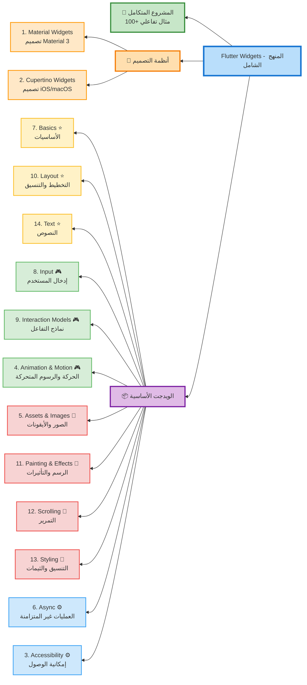

# Flutter Widgets - دليل شامل لتعلم جميع ويدجت Flutter

> **المصدر الرسمي:** [Flutter Widget Catalog](https://docs.flutter.dev/ui/widgets)

## 📚 المحتويات

- [مقدمة](#مقدمة)
- [🚀 المشروع المتكامل - تطبيق Flutter شامل](#-المشروع-المتكامل)
- [أنظمة التصميم (Design Systems)](#أنظمة-التصميم)
- [الويدجت الأساسية (Base Widgets)](#الويدجت-الأساسية)

---

## مقدمة

تقدم Flutter مجموعة واسعة من الويدجت المرئية والهيكلية والتفاعلية لبناء تطبيقات جميلة وسريعة. هذا الدليل يغطي جميع فئات الويدجت المتوفرة في Flutter SDK الرسمي.

### 📊 مخطط المنهج الدراسي



---

## 🚀 المشروع المتكامل

### [📱 Flutter Widgets Complete Project](./flutter_widgets_complete_project/)

**مشروع تطبيق Flutter شامل يحتوي على جميع الأمثلة العملية**

تطبيق متكامل يضم **100+ مثال تفاعلي** يغطي جميع فئات الويدجت الـ14:

- ✅ Material & Cupertino Widgets
- ✅ Animation & Motion
- ✅ Layout & Styling
- ✅ Input & Interaction
- ✅ Painting & Effects
- ✅ وأكثر من ذلك

**🎯 لتشغيل المشروع:**

```bash
cd flutter_widgets_complete_project
flutter pub get
flutter run
```

**📖 التوثيق الشامل:**

- [README](./flutter_widgets_complete_project/README.md) - دليل كامل للمشروع
- [QUICKSTART](./flutter_widgets_complete_project/QUICKSTART.md) - بداية سريعة
- [HOW_TO_RUN](./flutter_widgets_complete_project/HOW_TO_RUN.md) - كيفية التشغيل
- [COMPLETE_SUMMARY](./flutter_widgets_complete_project/COMPLETE_SUMMARY.md) - ملخص شامل

---

## أنظمة التصميم

### 1. [Material Widgets](./01_material_widgets.md)

**نظام التصميم Material 3**

ويدجت غنية بصرياً وحركياً تطبق مواصفات تصميم Material 3 من Google. تتضمن:

- الأزرار والبطاقات
- القوائم والحوارات
- أشرطة التطبيقات والتنقل
- عناصر الإدخال والنماذج
- المؤشرات والتنبيهات

**متى تستخدمها:** عند بناء تطبيقات Android أو تطبيقات تتبع لغة تصميم Material

---

### 2. [Cupertino Widgets](./02_cupertino_widgets.md)

**نظام التصميم iOS/macOS**

ويدجت جميلة عالية الدقة تتماشى مع إرشادات Apple's Human Interface Guidelines. تتضمن:

- الأزرار والمفاتيح بنمط iOS
- شرائط التنقل والتبويبات
- الحوارات والأوراق السفلية
- عناصر الاختيار والإدخال
- المؤشرات والتحديثات

**متى تستخدمها:** عند بناء تطبيقات iOS/macOS أو تطبيقات تحتاج مظهر Apple الأصلي

---

## الويدجت الأساسية

### 3. [Accessibility](./03_accessibility.md)

**إمكانية الوصول**

ويدجت لجعل تطبيقك قابلاً للوصول لجميع المستخدمين. تتضمن:

- `Semantics`: إضافة معلومات دلالية للويدجت
- `ExcludeSemantics`: استبعاد ويدجت من قراء الشاشة
- `MergeSemantics`: دمج معلومات الوصول من عدة ويدجت

**الأهمية:** ضرورية لجعل تطبيقك قابلاً للاستخدام من قبل ذوي الاحتياجات الخاصة

---

### 4. [Animation and Motion](./04_animation_motion.md)

**الحركة والرسوم المتحركة**

ويدجت لإضافة حركات وانتقالات سلسة. تتضمن:

- `AnimatedContainer`: حاوية تتحرك عند تغيير خصائصها
- `Hero`: انتقالات بطولية بين الشاشات
- `AnimatedOpacity`: تغيير الشفافية بسلاسة
- `AnimatedBuilder`: بناء رسوم متحركة مخصصة
- `TweenAnimationBuilder`: رسوم متحركة بسيطة بدون Controller

**الاستخدام:** إضافة حيوية وتفاعلية للتطبيق وتحسين تجربة المستخدم

---

### 5. [Assets, Images, and Icons](./05_assets_images_icons.md)

**الأصول والصور والأيقونات**

ويدجت لعرض الصور والأيقونات وإدارة الأصول. تتضمن:

- `Image`: عرض الصور من مصادر مختلفة
- `Icon`: عرض الأيقونات
- `AssetBundle`: إدارة أصول التطبيق
- `RawImage`: عرض صور منخفضة المستوى
- `CircleAvatar`: صور دائرية للملفات الشخصية

**الاستخدام:** عرض المحتوى المرئي والأيقونات في التطبيق

---

### 6. [Async](./06_async.md)

**العمليات غير المتزامنة**

ويدجت لدعم الأنماط غير المتزامنة. تتضمن:

- `FutureBuilder`: بناء واجهة بناءً على Future
- `StreamBuilder`: بناء واجهة بناءً على Stream
- `DefaultAssetBundle`: الوصول إلى الأصول بشكل غير متزامن

**الاستخدام:** التعامل مع البيانات من الشبكة أو قواعد البيانات

---

### 7. [Basics](./07_basics.md)

**الأساسيات - يجب معرفتها أولاً**

الويدجت الأساسية قبل بناء أول تطبيق Flutter. تتضمن:

- `Container`: حاوية للتنسيق والزخرفة
- `Row` و `Column`: ترتيب الويدجت أفقياً وعمودياً
- `Text`: عرض النصوص
- `Scaffold`: هيكل أساسي للشاشة
- `AppBar`: شريط التطبيق العلوي
- `FlutterLogo`: شعار Flutter

**الأهمية:** نقطة البداية لأي مطور Flutter

---

### 8. [Input](./08_input.md)

**إدخال المستخدم**

ويدجت لاستقبال إدخالات المستخدم. تتضمن:

- `TextField`: حقل إدخال نصي
- `Form`: نموذج لتجميع حقول الإدخال
- `Checkbox`: مربع اختيار
- `Radio`: أزرار اختيار دائرية
- `Switch`: مفتاح تبديل
- `Slider`: شريط تمرير
- `RawKeyboardListener`: الاستماع لأحداث لوحة المفاتيح

**الاستخدام:** جمع البيانات من المستخدم في النماذج والإعدادات

---

### 9. [Interaction Models](./09_interaction.md)

**نماذج التفاعل**

ويدجت للاستجابة للمس والتوجيه بين الشاشات. تتضمن:

- `GestureDetector`: اكتشاف الإيماءات (نقر، سحب، تكبير)
- `InkWell`: تأثير الحبر عند النقر (Material)
- `Dismissible`: السحب للحذف
- `Draggable`: السحب والإفلات
- `Navigator`: التنقل بين الشاشات
- `Scrollable`: إضافة إمكانية التمرير

**الاستخدام:** جعل التطبيق تفاعلياً وسهل الاستخدام

---

### 10. [Layout](./10_layout.md)

**التخطيط والتنسيق**

ويدجت لترتيب الويدجت الأخرى في أعمدة، صفوف، وشبكات. تتضمن:

- `Container`: حاوية مرنة مع تنسيق
- `Row` و `Column`: ترتيب خطي
- `Stack`: تكديس الويدجت فوق بعضها
- `GridView`: عرض شبكي
- `ListView`: قائمة قابلة للتمرير
- `Wrap`: التفاف تلقائي للعناصر
- `Expanded` و `Flexible`: توسيع المساحة
- `SizedBox`: صندوق بحجم محدد
- `Padding`: إضافة مسافات داخلية
- `Center`: توسيط العناصر
- `Align`: محاذاة العناصر

**الأهمية:** أساس بناء واجهات المستخدم المعقدة

---

### 11. [Painting and Effects](./11_painting_effects.md)

**الرسم والتأثيرات البصرية**

ويدجت لتطبيق تأثيرات مرئية دون تغيير التخطيط. تتضمن:

- `Opacity`: التحكم في الشفافية
- `ClipRRect`: قص بحواف دائرية
- `ClipOval`: قص بشكل بيضاوي
- `BackdropFilter`: تأثير ضبابي للخلفية
- `DecoratedBox`: إضافة زخارف
- `RotatedBox`: تدوير الويدجت
- `Transform`: تحويلات متقدمة (تدوير، تحجيم، إمالة)
- `CustomPaint`: رسم مخصص

**الاستخدام:** تحسين المظهر البصري وإضافة تأثيرات جمالية

---

### 12. [Scrolling](./12_scrolling.md)

**التمرير**

ويدجت لتمرير عدة عناصر داخل الشاشة. تتضمن:

- `ListView`: قائمة قابلة للتمرير
- `GridView`: شبكة قابلة للتمرير
- `SingleChildScrollView`: تمرير ويدجت واحدة
- `PageView`: تمرير صفحات كاملة
- `CustomScrollView`: تمرير مخصص متقدم
- `NestedScrollView`: تمرير متداخل
- `ScrollBar`: شريط التمرير
- `RefreshIndicator`: مؤشر السحب للتحديث
- `NotificationListener`: الاستماع لأحداث التمرير

**الاستخدام:** عرض محتوى أكبر من حجم الشاشة

---

### 13. [Styling](./13_styling.md)

**التنسيق والثيمات**

ويدجت لإدارة مظهر التطبيق والاستجابة للأحجام. تتضمن:

- `Theme`: تطبيق ثيم على التطبيق
- `MediaQuery`: معلومات عن حجم الشاشة والاتجاه
- `Padding`: إضافة مسافات
- `LayoutBuilder`: بناء واجهة حسب القيود
- `AspectRatio`: الحفاظ على نسبة العرض للارتفاع
- `FittedBox`: تحجيم وملائمة المحتوى
- `FractionallySizedBox`: تحجيم بنسبة من الأصل

**الاستخدام:** إنشاء تطبيقات متسقة ومتجاوبة مع جميع الأحجام

---

### 14. [Text](./14_text.md)

**النصوص**

ويدجت لعرض وتنسيق النصوص. تتضمن:

- `Text`: عرض نص بسيط
- `RichText`: نص بتنسيقات متعددة
- `SelectableText`: نص قابل للتحديد والنسخ
- `DefaultTextStyle`: تنسيق نص افتراضي
- `TextStyle`: أنماط النص (حجم، لون، خط)

**الاستخدام:** عرض جميع أنواع المحتوى النصي في التطبيق

---

## 🎯 خطة التعلم المقترحة

### المرحلة 1: الأساسيات (أسبوع 1-2)

1. ابدأ بـ **Basics** - تعلم Container, Row, Column, Text
2. انتقل لـ **Layout** - فهم كيفية تنسيق الواجهات
3. تعلم **Text** و **Assets, Images, Icons** - عرض المحتوى

### المرحلة 2: التفاعل (أسبوع 3-4)

4. **Input** - جمع بيانات المستخدم
5. **Interaction Models** - إضافة التفاعل
6. **Scrolling** - التعامل مع المحتوى الطويل

### المرحلة 3: أنظمة التصميم (أسبوع 5-6)

7. **Material Widgets** - للتطبيقات العامة
8. **Cupertino Widgets** - لتطبيقات iOS

### المرحلة 4: التقدم (أسبوع 7-8)

9. **Animation and Motion** - إضافة الحركة
10. **Painting and Effects** - التأثيرات البصرية
11. **Async** - التعامل مع البيانات غير المتزامنة

### المرحلة 5: الاحتراف (أسبوع 9-10)

12. **Styling** - إدارة الثيمات والتجاوب
13. **Accessibility** - جعل التطبيق قابل للوصول

---

## 📝 ملاحظات هامة

- **التدرج:** ابدأ بالويدجت الأساسية ثم انتقل للمتقدمة
- **الممارسة:** طبق كل ويدجت في مشروع صغير
- **الدمج:** جرب دمج ويدجت مختلفة معاً
- **التوثيق:** ارجع دائماً للتوثيق الرسمي عند الحاجة
- **Widget of the Week:** شاهد فيديوهات Flutter القصيرة (1 دقيقة) لكل ويدجت

---

## 🔗 روابط مفيدة

- [Widget Catalog الرسمي](https://docs.flutter.dev/ui/widgets)
- [Widget Index - قائمة كاملة بجميع الويدجت](https://docs.flutter.dev/reference/widgets)
- [Widget of the Week - فيديوهات قصيرة](https://www.youtube.com/playlist?list=PLjxrf2q8roU23XGwz3Km7sQZFTdB996iG)
- [Flutter Gallery - أمثلة تفاعلية](https://gallery.flutter.dev/)

---

## 🎓 نصائح للتعلم الفعال

1. **لا تحفظ كل شيء**: ركز على فهم المفاهيم والأنماط
2. **استخدم Hot Reload**: جرب التغييرات فوراً
3. **اقرأ الكود المصدري**: تعلم من أمثلة Flutter الرسمية
4. **شارك في المجتمع**: اطرح الأسئلة وساعد الآخرين
5. **بناء مشاريع**: أفضل طريقة للتعلم هي الممارسة العملية

---

**آخر تحديث:** نوفمبر 2025  
**إصدار Flutter:** 3.35.5
