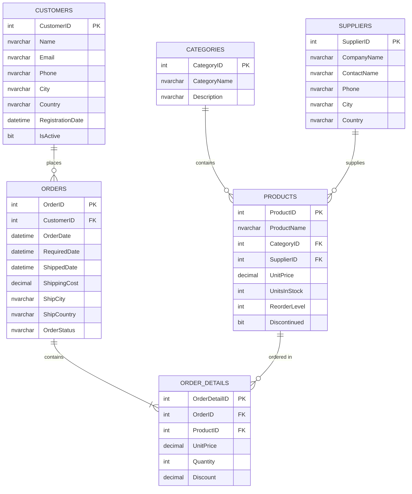

# مثال شامل: قاعدة بيانات نظام إدارة المتجر الإلكتروني

## 📊 المخطط العلائقي للجداول



---

## 🔧 إنشاء قاعدة البيانات والجداول

```sql
-- إنشاء قاعدة البيانات
CREATE DATABASE OnlineStoreDB;
GO

USE OnlineStoreDB;
GO

-- جدول الفئات
CREATE TABLE Categories (
    CategoryID INT PRIMARY KEY IDENTITY(1,1),
    CategoryName NVARCHAR(100) NOT NULL,
    Description NVARCHAR(500)
);

-- جدول الموردين
CREATE TABLE Suppliers (
    SupplierID INT PRIMARY KEY IDENTITY(1,1),
    CompanyName NVARCHAR(100) NOT NULL,
    ContactName NVARCHAR(100),
    Phone NVARCHAR(20),
    City NVARCHAR(50),
    Country NVARCHAR(50)
);

-- جدول العملاء
CREATE TABLE Customers (
    CustomerID INT PRIMARY KEY IDENTITY(1,1),
    Name NVARCHAR(100) NOT NULL,
    Email NVARCHAR(100) UNIQUE NOT NULL,
    Phone NVARCHAR(20),
    City NVARCHAR(50),
    Country NVARCHAR(50),
    RegistrationDate DATETIME DEFAULT GETDATE(),
    IsActive BIT DEFAULT 1
);

-- جدول المنتجات
CREATE TABLE Products (
    ProductID INT PRIMARY KEY IDENTITY(1,1),
    ProductName NVARCHAR(100) NOT NULL,
    CategoryID INT FOREIGN KEY REFERENCES Categories(CategoryID),
    SupplierID INT FOREIGN KEY REFERENCES Suppliers(SupplierID),
    UnitPrice DECIMAL(10,2) NOT NULL CHECK (UnitPrice >= 0),
    UnitsInStock INT DEFAULT 0 CHECK (UnitsInStock >= 0),
    ReorderLevel INT DEFAULT 10,
    Discontinued BIT DEFAULT 0
);

-- جدول الطلبات
CREATE TABLE Orders (
    OrderID INT PRIMARY KEY IDENTITY(1,1),
    CustomerID INT FOREIGN KEY REFERENCES Customers(CustomerID),
    OrderDate DATETIME DEFAULT GETDATE(),
    RequiredDate DATETIME,
    ShippedDate DATETIME,
    ShippingCost DECIMAL(10,2) DEFAULT 0,
    ShipCity NVARCHAR(50),
    ShipCountry NVARCHAR(50),
    OrderStatus NVARCHAR(20) DEFAULT 'Pending'
);

-- جدول تفاصيل الطلبات
CREATE TABLE OrderDetails (
    OrderDetailID INT PRIMARY KEY IDENTITY(1,1),
    OrderID INT FOREIGN KEY REFERENCES Orders(OrderID) ON DELETE CASCADE,
    ProductID INT FOREIGN KEY REFERENCES Products(ProductID),
    UnitPrice DECIMAL(10,2) NOT NULL,
    Quantity INT NOT NULL CHECK (Quantity > 0),
    Discount DECIMAL(3,2) DEFAULT 0 CHECK (Discount BETWEEN 0 AND 1)
);
GO
```

---

## 📥 إدراج بيانات تجريبية

```sql
-- إدراج الفئات
INSERT INTO Categories (CategoryName, Description) VALUES
(N'إلكترونيات', N'أجهزة إلكترونية وملحقاتها'),
(N'ملابس', N'ملابس رجالية ونسائية وأطفال'),
(N'كتب', N'كتب في مختلف المجالات'),
(N'رياضة', N'معدات ومستلزمات رياضية'),
(N'أثاث منزلي', N'أثاث وديكور منزلي');

-- إدراج الموردين
INSERT INTO Suppliers (CompanyName, ContactName, Phone, City, Country) VALUES
(N'شركة التقنية المتقدمة', N'أحمد محمد', '0501234567', N'الرياض', N'السعودية'),
(N'مؤسسة الأزياء العصرية', N'فاطمة علي', '0507654321', N'جدة', N'السعودية'),
(N'دار المعرفة للنشر', N'خالد حسن', '0509876543', N'القاهرة', N'مصر'),
(N'الرياضة الذهبية', N'سارة أحمد', '0506543210', N'دبي', N'الإمارات'),
(N'عالم الأثاث', N'محمد عبدالله', '0508765432', N'الدوحة', N'قطر');

-- إدراج العملاء
INSERT INTO Customers (Name, Email, Phone, City, Country) VALUES
(N'عبدالله السعيد', 'abdullah@email.com', '0551234567', N'الرياض', N'السعودية'),
(N'نورة الأحمد', 'noura@email.com', '0557654321', N'جدة', N'السعودية'),
(N'محمد القحطاني', 'mohammed@email.com', '0559876543', N'الدمام', N'السعودية'),
(N'سلمى حسن', 'salma@email.com', '0556543210', N'القاهرة', N'مصر'),
(N'عمر خالد', 'omar@email.com', '0558765432', N'دبي', N'الإمارات'),
(N'ليلى محمود', 'laila@email.com', '0552345678', N'أبوظبي', N'الإمارات'),
(N'يوسف إبراهيم', 'youssef@email.com', '0553456789', N'الكويت', N'الكويت'),
(N'هدى عبدالرحمن', 'huda@email.com', '0554567890', N'الدوحة', N'قطر'),
(N'فهد المطيري', 'fahad@email.com', '0555678901', N'مكة', N'السعودية'),
(N'ريم الزهراني', 'reem@email.com', '0556789012', N'المدينة', N'السعودية');

-- إدراج المنتجات
INSERT INTO Products (ProductName, CategoryID, SupplierID, UnitPrice, UnitsInStock, ReorderLevel) VALUES
(N'لابتوب HP ProBook', 1, 1, 3500.00, 25, 5),
(N'هاتف Samsung Galaxy', 1, 1, 2800.00, 50, 10),
(N'سماعات Sony WH-1000XM4', 1, 1, 1200.00, 30, 8),
(N'قميص رجالي قطني', 2, 2, 150.00, 100, 20),
(N'فستان نسائي', 2, 2, 280.00, 60, 15),
(N'كتاب تعلم SQL Server', 3, 3, 95.00, 40, 10),
(N'رواية عالمية', 3, 3, 65.00, 80, 15),
(N'دراجة رياضية', 4, 4, 1500.00, 15, 3),
(N'حذاء رياضي Nike', 4, 4, 450.00, 45, 10),
(N'طاولة طعام خشبية', 5, 5, 2200.00, 12, 3),
(N'كرسي مكتب مريح', 5, 5, 850.00, 20, 5),
(N'شاشة كمبيوتر 27 بوصة', 1, 1, 1100.00, 35, 7),
(N'لوحة مفاتيح ميكانيكية', 1, 1, 350.00, 55, 12),
(N'حقيبة يد نسائية', 2, 2, 320.00, 40, 10),
(N'كتاب برمجة Python', 3, 3, 110.00, 50, 12);

-- إدراج الطلبات
INSERT INTO Orders (CustomerID, OrderDate, RequiredDate, ShippingCost, ShipCity, ShipCountry, OrderStatus) VALUES
(1, '2024-01-15', '2024-01-20', 50.00, N'الرياض', N'السعودية', 'Shipped'),
(2, '2024-01-16', '2024-01-21', 45.00, N'جدة', N'السعودية', 'Delivered'),
(3, '2024-01-17', '2024-01-22', 55.00, N'الدمام', N'السعودية', 'Pending'),
(4, '2024-01-18', '2024-01-25', 80.00, N'القاهرة', N'مصر', 'Shipped'),
(5, '2024-01-19', '2024-01-24', 70.00, N'دبي', N'الإمارات', 'Delivered'),
(1, '2024-02-01', '2024-02-06', 50.00, N'الرياض', N'السعودية', 'Delivered'),
(2, '2024-02-03', '2024-02-08', 45.00, N'جدة', N'السعودية', 'Shipped'),
(6, '2024-02-05', '2024-02-10', 75.00, N'أبوظبي', N'الإمارات', 'Pending'),
(7, '2024-02-07', '2024-02-12', 65.00, N'الكويت', N'الكويت', 'Delivered'),
(8, '2024-02-10', '2024-02-15', 70.00, N'الدوحة', N'قطر', 'Shipped');

-- إدراج تفاصيل الطلبات
INSERT INTO OrderDetails (OrderID, ProductID, UnitPrice, Quantity, Discount) VALUES
(1, 1, 3500.00, 1, 0.10),
(1, 3, 1200.00, 2, 0.05),
(2, 4, 150.00, 3, 0.00),
(2, 5, 280.00, 2, 0.15),
(3, 6, 95.00, 5, 0.00),
(4, 2, 2800.00, 1, 0.08),
(4, 13, 350.00, 1, 0.00),
(5, 8, 1500.00, 1, 0.20),
(5, 9, 450.00, 2, 0.10),
(6, 12, 1100.00, 2, 0.12),
(7, 7, 65.00, 4, 0.00),
(7, 14, 320.00, 1, 0.05),
(8, 10, 2200.00, 1, 0.15),
(9, 11, 850.00, 2, 0.10),
(10, 15, 110.00, 3, 0.00);
GO
```

---

## 📊 الاستعلامات الشاملة

### 1️⃣ استعلامات SELECT الأساسية

```sql
-- عرض جميع المنتجات
SELECT * FROM Products;

-- عرض أسماء العملاء والمدن فقط
SELECT Name, City, Country FROM Customers;

-- عرض المنتجات المتوفرة في المخزن
SELECT ProductName, UnitsInStock, UnitPrice
FROM Products
WHERE UnitsInStock > 0;

-- عرض الطلبات المعلقة
SELECT OrderID, CustomerID, OrderDate, OrderStatus
FROM Orders
WHERE OrderStatus = 'Pending';

-- عرض المنتجات المتوقفة
SELECT ProductName, UnitPrice, UnitsInStock
FROM Products
WHERE Discontinued = 1;
```

### 2️⃣ استعلامات الفرز والترتيب

```sql
-- ترتيب المنتجات حسب السعر تنازلياً
SELECT ProductName, UnitPrice
FROM Products
ORDER BY UnitPrice DESC;

-- ترتيب العملاء حسب تاريخ التسجيل
SELECT Name, Email, RegistrationDate
FROM Customers
ORDER BY RegistrationDate ASC;

-- ترتيب متعدد الأعمدة
SELECT ProductName, CategoryID, UnitPrice
FROM Products
ORDER BY CategoryID, UnitPrice DESC;
```

### 3️⃣ استعلامات التجميع والدوال الإحصائية

```sql
-- عدد المنتجات الإجمالي
SELECT COUNT(*) AS TotalProducts FROM Products;

-- متوسط سعر المنتجات
SELECT AVG(UnitPrice) AS AveragePrice FROM Products;

-- أعلى وأقل سعر
SELECT 
    MAX(UnitPrice) AS MaxPrice,
    MIN(UnitPrice) AS MinPrice,
    AVG(UnitPrice) AS AvgPrice
FROM Products;

-- مجموع كميات المخزون
SELECT SUM(UnitsInStock) AS TotalStock FROM Products;

-- عدد العملاء في كل دولة
SELECT Country, COUNT(*) AS CustomerCount
FROM Customers
GROUP BY Country
ORDER BY CustomerCount DESC;

-- عدد المنتجات في كل فئة
SELECT CategoryID, COUNT(*) AS ProductCount
FROM Products
GROUP BY CategoryID;

-- متوسط سعر المنتجات في كل فئة
SELECT CategoryID, 
       COUNT(*) AS ProductCount,
       AVG(UnitPrice) AS AvgPrice,
       MIN(UnitPrice) AS MinPrice,
       MAX(UnitPrice) AS MaxPrice
FROM Products
GROUP BY CategoryID
ORDER BY AvgPrice DESC;
```

### 4️⃣ استعلامات HAVING

```sql
-- الفئات التي تحتوي على أكثر من منتج واحد
SELECT CategoryID, COUNT(*) AS ProductCount
FROM Products
GROUP BY CategoryID
HAVING COUNT(*) > 1;

-- الدول التي بها أكثر من عميل واحد
SELECT Country, COUNT(*) AS CustomerCount
FROM Customers
GROUP BY Country
HAVING COUNT(*) > 1;

-- الفئات التي متوسط أسعارها أكثر من 500
SELECT CategoryID, AVG(UnitPrice) AS AvgPrice
FROM Products
GROUP BY CategoryID
HAVING AVG(UnitPrice) > 500;
```

### 5️⃣ استعلامات JOIN - الربط بين الجداول

```sql
-- عرض المنتجات مع أسماء الفئات (INNER JOIN)
SELECT 
    p.ProductName,
    c.CategoryName,
    p.UnitPrice,
    p.UnitsInStock
FROM Products p
INNER JOIN Categories c ON p.CategoryID = c.CategoryID;

-- عرض المنتجات مع أسماء الموردين
SELECT 
    p.ProductName,
    s.CompanyName AS Supplier,
    s.Country AS SupplierCountry,
    p.UnitPrice
FROM Products p
INNER JOIN Suppliers s ON p.SupplierID = s.SupplierID;

-- عرض الطلبات مع أسماء العملاء
SELECT 
    o.OrderID,
    c.Name AS CustomerName,
    o.OrderDate,
    o.OrderStatus,
    o.ShippingCost
FROM Orders o
INNER JOIN Customers cu ON o.CustomerID = cu.CustomerID;

-- عرض تفاصيل الطلبات مع أسماء المنتجات
SELECT 
    od.OrderID,
    p.ProductName,
    od.Quantity,
    od.UnitPrice,
    od.Discount,
    (od.Quantity * od.UnitPrice * (1 - od.Discount)) AS Total
FROM OrderDetails od
INNER JOIN Products p ON od.ProductID = p.ProductID;

-- ربط 3 جداول: الطلبات - العملاء - المدن
SELECT 
    c.Name AS CustomerName,
    c.City,
    o.OrderID,
    o.OrderDate,
    o.OrderStatus
FROM Customers c
INNER JOIN Orders o ON c.CustomerID = o.CustomerID
ORDER BY c.Name, o.OrderDate;

-- ربط 4 جداول: تفاصيل الطلبات مع المنتج والفئة والطلب
SELECT 
    o.OrderID,
    o.OrderDate,
    p.ProductName,
    cat.CategoryName,
    od.Quantity,
    od.UnitPrice,
    (od.Quantity * od.UnitPrice * (1 - od.Discount)) AS LineTotal
FROM OrderDetails od
INNER JOIN Orders o ON od.OrderID = o.OrderID
INNER JOIN Products p ON od.ProductID = p.ProductID
INNER JOIN Categories cat ON p.CategoryID = cat.CategoryID;

-- LEFT JOIN: عرض جميع الفئات حتى لو لم يكن بها منتجات
SELECT 
    c.CategoryName,
    COUNT(p.ProductID) AS ProductCount
FROM Categories c
LEFT JOIN Products p ON c.CategoryID = p.CategoryID
GROUP BY c.CategoryName;

-- RIGHT JOIN: عرض جميع المنتجات حتى لو لم يكن لها مورد
SELECT 
    s.CompanyName,
    COUNT(p.ProductID) AS ProductCount
FROM Suppliers s
RIGHT JOIN Products p ON s.SupplierID = p.SupplierID
GROUP BY s.CompanyName;
```

### 6️⃣ استعلامات فرعية (Subqueries)

```sql
-- المنتجات الأغلى من المتوسط
SELECT ProductName, UnitPrice
FROM Products
WHERE UnitPrice > (SELECT AVG(UnitPrice) FROM Products);

-- العملاء الذين قاموا بعمل طلبات
SELECT Name, Email
FROM Customers
WHERE CustomerID IN (SELECT DISTINCT CustomerID FROM Orders);

-- المنتجات الأعلى سعراً في كل فئة
SELECT p.ProductName, p.CategoryID, p.UnitPrice
FROM Products p
WHERE p.UnitPrice = (
    SELECT MAX(UnitPrice) 
    FROM Products 
    WHERE CategoryID = p.CategoryID
);

-- عدد الطلبات لكل عميل
SELECT 
    c.Name,
    (SELECT COUNT(*) FROM Orders o WHERE o.CustomerID = c.CustomerID) AS OrderCount
FROM Customers c;

-- الموردين الذين لديهم منتجات بسعر أكثر من 1000
SELECT CompanyName
FROM Suppliers
WHERE SupplierID IN (
    SELECT DISTINCT SupplierID 
    FROM Products 
    WHERE UnitPrice > 1000
);
```

### 7️⃣ استعلامات CTE (Common Table Expressions)

```sql
-- CTE لحساب إجمالي كل طلب
WITH OrderTotals AS (
    SELECT 
        OrderID,
        SUM(Quantity * UnitPrice * (1 - Discount)) AS OrderTotal
    FROM OrderDetails
    GROUP BY OrderID
)
SELECT 
    o.OrderID,
    c.Name AS CustomerName,
    o.OrderDate,
    ot.OrderTotal
FROM Orders o
INNER JOIN Customers c ON o.CustomerID = c.CustomerID
INNER JOIN OrderTotals ot ON o.OrderID = ot.OrderID
ORDER BY ot.OrderTotal DESC;

-- CTE متعددة
WITH 
CategorySales AS (
    SELECT 
        p.CategoryID,
        SUM(od.Quantity * od.UnitPrice) AS TotalSales
    FROM OrderDetails od
    INNER JOIN Products p ON od.ProductID = p.ProductID
    GROUP BY p.CategoryID
),
CategoryInfo AS (
    SELECT 
        c.CategoryID,
        c.CategoryName,
        COUNT(p.ProductID) AS ProductCount
    FROM Categories c
    LEFT JOIN Products p ON c.CategoryID = p.CategoryID
    GROUP BY c.CategoryID, c.CategoryName
)
SELECT 
    ci.CategoryName,
    ci.ProductCount,
    ISNULL(cs.TotalSales, 0) AS TotalSales
FROM CategoryInfo ci
LEFT JOIN CategorySales cs ON ci.CategoryID = cs.CategoryID
ORDER BY TotalSales DESC;
```

### 8️⃣ Window Functions

```sql
-- ترقيم المنتجات حسب السعر
SELECT 
    ProductName,
    UnitPrice,
    ROW_NUMBER() OVER (ORDER BY UnitPrice DESC) AS PriceRank
FROM Products;

-- ترتيب المنتجات في كل فئة حسب السعر
SELECT 
    ProductName,
    CategoryID,
    UnitPrice,
    RANK() OVER (PARTITION BY CategoryID ORDER BY UnitPrice DESC) AS CategoryRank
FROM Products;

-- حساب المجموع التراكمي للمخزون
SELECT 
    ProductName,
    UnitsInStock,
    SUM(UnitsInStock) OVER (ORDER BY ProductID) AS CumulativeStock
FROM Products;

-- متوسط متحرك للأسعار
SELECT 
    ProductName,
    UnitPrice,
    AVG(UnitPrice) OVER (ORDER BY ProductID ROWS BETWEEN 2 PRECEDING AND CURRENT ROW) AS MovingAvg
FROM Products;

-- LAG و LEAD للمقارنة بين الصفوف
SELECT 
    OrderID,
    OrderDate,
    LAG(OrderDate) OVER (ORDER BY OrderDate) AS PreviousOrderDate,
    LEAD(OrderDate) OVER (ORDER BY OrderDate) AS NextOrderDate
FROM Orders;
```

### 9️⃣ استعلامات PIVOT

```sql
-- عدد المنتجات في كل فئة حسب المورد
SELECT *
FROM (
    SELECT 
        s.CompanyName,
        c.CategoryName,
        p.ProductID
    FROM Products p
    INNER JOIN Suppliers s ON p.SupplierID = s.SupplierID
    INNER JOIN Categories c ON p.CategoryID = c.CategoryID
) AS SourceTable
PIVOT (
    COUNT(ProductID)
    FOR CategoryName IN ([إلكترونيات], [ملابس], [كتب], [رياضة], [أثاث منزلي])
) AS PivotTable;

-- مبيعات حسب الشهر
SELECT *
FROM (
    SELECT 
        MONTH(o.OrderDate) AS OrderMonth,
        YEAR(o.OrderDate) AS OrderYear,
        od.Quantity * od.UnitPrice AS Sales
    FROM Orders o
    INNER JOIN OrderDetails od ON o.OrderID = od.OrderID
) AS SourceTable
PIVOT (
    SUM(Sales)
    FOR OrderMonth IN ([1], [2], [3], [4], [5], [6], [7], [8], [9], [10], [11], [12])
) AS PivotTable;
```

### 🔟 استعلامات CASE

```sql
-- تصنيف المنتجات حسب السعر
SELECT 
    ProductName,
    UnitPrice,
    CASE 
        WHEN UnitPrice < 100 THEN N'رخيص'
        WHEN UnitPrice BETWEEN 100 AND 500 THEN N'متوسط'
        WHEN UnitPrice BETWEEN 501 AND 1500 THEN N'مرتفع'
        ELSE N'غالي جداً'
    END AS PriceCategory
FROM Products;

-- تصنيف حالة المخزون
SELECT 
    ProductName,
    UnitsInStock,
    ReorderLevel,
    CASE 
        WHEN UnitsInStock = 0 THEN N'نفذ من المخزون'
        WHEN UnitsInStock < ReorderLevel THEN N'يحتاج إعادة طلب'
        WHEN UnitsInStock >= ReorderLevel * 2 THEN N'مخزون جيد'
        ELSE N'مخزون كافي'
    END AS StockStatus
FROM Products;

-- حساب نوع العميل حسب عدد الطلبات
SELECT 
    c.Name,
    COUNT(o.OrderID) AS OrderCount,
    CASE 
        WHEN COUNT(o.OrderID) = 0 THEN N'جديد'
        WHEN COUNT(o.OrderID) = 1 THEN N'عميل عادي'
        WHEN COUNT(o.OrderID) >= 2 THEN N'عميل مميز'
    END AS CustomerType
FROM Customers c
LEFT JOIN Orders o ON c.CustomerID = o.CustomerID
GROUP BY c.CustomerID, c.Name;
```

### 1️⃣1️⃣ استعلامات STRING

```sql
-- البحث في أسماء المنتجات
SELECT ProductName
FROM Products
WHERE ProductName LIKE N'%كتاب%';

-- دمج الأسماء
SELECT 
    Name,
    City + ', ' + Country AS FullLocation
FROM Customers;

-- طول النص
SELECT 
    ProductName,
    LEN(ProductName) AS NameLength
FROM Products;

-- استخراج جزء من النص
SELECT 
    Email,
    SUBSTRING(Email, 1, CHARINDEX('@', Email) - 1) AS Username,
    SUBSTRING(Email, CHARINDEX('@', Email) + 1, LEN(Email)) AS Domain
FROM Customers;

-- تحويل الحروف
SELECT 
    UPPER(ProductName) AS UpperCase,
    LOWER(ProductName) AS LowerCase
FROM Products;

-- استبدال النص
SELECT 
    ProductName,
    REPLACE(ProductName, N'كتاب', N'Book') AS EnglishName
FROM Products
WHERE ProductName LIKE N'%كتاب%';
```

### 1️⃣2️⃣ استعلامات التاريخ والوقت

```sql
-- الطلبات في الشهر الحالي
SELECT *
FROM Orders
WHERE MONTH(OrderDate) = MONTH(GETDATE())
  AND YEAR(OrderDate) = YEAR(GETDATE());

-- الفرق بين تواريخ الطلب والشحن
SELECT 
    OrderID,
    OrderDate,
    ShippedDate,
    DATEDIFF(DAY, OrderDate, ShippedDate) AS DaysToShip
FROM Orders
WHERE ShippedDate IS NOT NULL;

-- إضافة أيام للتاريخ
SELECT 
    OrderID,
    OrderDate,
    DATEADD(DAY, 7, OrderDate) AS EstimatedDelivery
FROM Orders;

-- استخراج أجزاء التاريخ
SELECT 
    OrderID,
    OrderDate,
    YEAR(OrderDate) AS OrderYear,
    MONTH(OrderDate) AS OrderMonth,
    DAY(OrderDate) AS OrderDay,
    DATENAME(WEEKDAY, OrderDate) AS WeekDay
FROM Orders;

-- تنسيق التاريخ
SELECT 
    OrderID,
    CONVERT(VARCHAR, OrderDate, 103) AS UKFormat,
    CONVERT(VARCHAR, OrderDate, 101) AS USFormat,
    FORMAT(OrderDate, 'yyyy-MM-dd') AS ISOFormat
FROM Orders;
```

### 1️⃣3️⃣ استعلامات UNION و INTERSECT و EXCEPT

```sql
-- UNION: دمج المدن من العملاء والموردين
SELECT City, N'عميل' AS Type FROM Customers
UNION
SELECT City, N'مورد' AS Type FROM Suppliers
ORDER BY City;

-- UNION ALL: مع التكرار
SELECT Country FROM Customers
UNION ALL
SELECT Country FROM Suppliers;

-- INTERSECT: المدن المشتركة بين العملاء والموردين
SELECT City FROM Customers
INTERSECT
SELECT City FROM Suppliers;

-- EXCEPT: المدن الموجودة في العملاء وليست في الموردين
SELECT City FROM Customers
EXCEPT
SELECT City FROM Suppliers;
```

### 1️⃣4️⃣ استعلامات EXISTS و NOT EXISTS

```sql
-- العملاء الذين لديهم طلبات
SELECT Name, Email
FROM Customers c
WHERE EXISTS (
    SELECT 1 FROM Orders o WHERE o.CustomerID = c.CustomerID
);

-- العملاء الذين ليس لديهم طلبات
SELECT Name, Email
FROM Customers c
WHERE NOT EXISTS (
    SELECT 1 FROM Orders o WHERE o.CustomerID = c.CustomerID
);

-- المنتجات التي لم يتم طلبها
SELECT ProductName, UnitPrice
FROM Products p
WHERE NOT EXISTS (
    SELECT 1 FROM OrderDetails od WHERE od.ProductID = p.ProductID
);

-- الفئات التي بها منتجات مطلوبة
SELECT CategoryName
FROM Categories c
WHERE EXISTS (
    SELECT 1 
    FROM Products p 
    INNER JOIN OrderDetails od ON p.ProductID = od.ProductID
    WHERE p.CategoryID = c.CategoryID
);
```

### 1️⃣5️⃣ استعلامات TOP و OFFSET-FETCH

```sql
-- أعلى 5 منتجات سعراً
SELECT TOP 5 ProductName, UnitPrice
FROM Products
ORDER BY UnitPrice DESC;

-- أعلى 10% من المنتجات سعراً
SELECT TOP 10 PERCENT ProductName, UnitPrice
FROM Products
ORDER BY UnitPrice DESC;

-- OFFSET-FETCH للترقيم الصفحي (Pagination)
-- الصفحة الأولى (أول 10 منتجات)
SELECT ProductName, UnitPrice
FROM Products
ORDER BY ProductID
OFFSET 0 ROWS
FETCH NEXT 10 ROWS ONLY;

-- الصفحة الثانية (منتجات 11-20)
SELECT ProductName, UnitPrice
FROM Products
ORDER BY ProductID
OFFSET 10 ROWS
FETCH NEXT 10 ROWS ONLY;
```

### 1️⃣6️⃣ استعلامات التقارير المتقدمة

```sql
-- تقرير المبيعات الشامل
SELECT 
    c.Name AS CustomerName,
    c.City,
    c.Country,
    COUNT(DISTINCT o.OrderID) AS TotalOrders,
    SUM(od.Quantity) AS TotalItemsPurchased,
    SUM(od.Quantity * od.UnitPrice * (1 - od.Discount)) AS TotalSpent,
    AVG(od.Quantity * od.UnitPrice * (1 - od.Discount)) AS AvgOrderValue
FROM Customers c
LEFT JOIN Orders o ON c.CustomerID = o.CustomerID
LEFT JOIN OrderDetails od ON o.OrderID = od.OrderID
GROUP BY c.CustomerID, c.Name, c.City, c.Country
ORDER BY TotalSpent DESC;

-- تقرير أداء المنتجات
SELECT 
    p.ProductName,
    cat.CategoryName,
    p.UnitPrice,
    p.UnitsInStock,
    COUNT(DISTINCT od.OrderID) AS TimesSold,
    SUM(od.Quantity) AS TotalQuantitySold,
    SUM(od.Quantity * od.UnitPrice * (1 - od.Discount)) AS TotalRevenue,
    p.UnitsInStock * p.UnitPrice AS StockValue
FROM Products p
INNER JOIN Categories cat ON p.CategoryID = cat.CategoryID
LEFT JOIN OrderDetails od ON p.ProductID = od.ProductID
GROUP BY p.ProductID, p.ProductName, cat.CategoryName, p.UnitPrice, p.UnitsInStock
ORDER BY TotalRevenue DESC;

-- تقرير الطلبات حسب الشهر
SELECT 
    YEAR(OrderDate) AS Year,
    MONTH(OrderDate) AS Month,
    DATENAME(MONTH, OrderDate) AS MonthName,
    COUNT(*) AS OrderCount,
    SUM(ShippingCost) AS TotalShippingCost,
    AVG(ShippingCost) AS AvgShippingCost
FROM Orders
GROUP BY YEAR(OrderDate), MONTH(OrderDate), DATENAME(MONTH, OrderDate)
ORDER BY Year, Month;

-- تقرير الموردين
SELECT 
    s.CompanyName,
    s.City,
    s.Country,
    COUNT(p.ProductID) AS ProductCount,
    AVG(p.UnitPrice) AS AvgProductPrice,
    SUM(p.UnitsInStock * p.UnitPrice) AS TotalStockValue
FROM Suppliers s
LEFT JOIN Products p ON s.SupplierID = p.SupplierID
GROUP BY s.SupplierID, s.CompanyName, s.City, s.Country
ORDER BY TotalStockValue DESC;

-- تقرير مقارنة الفئات
SELECT 
    cat.CategoryName,
    COUNT(DISTINCT p.ProductID) AS ProductCount,
    COUNT(DISTINCT od.OrderID) AS OrderCount,
    SUM(od.Quantity) AS TotalQuantitySold,
    SUM(od.Quantity * od.UnitPrice * (1 - od.Discount)) AS TotalRevenue,
    AVG(p.UnitPrice) AS AvgPrice
FROM Categories cat
LEFT JOIN Products p ON cat.CategoryID = p.CategoryID
LEFT JOIN OrderDetails od ON p.ProductID = od.ProductID
GROUP BY cat.CategoryID, cat.CategoryName
ORDER BY TotalRevenue DESC;
```

### 1️⃣7️⃣ استعلامات MERGE

```sql
-- تحديث المخزون بناءً على جدول مؤقت
CREATE TABLE #StockUpdates (
    ProductID INT,
    NewStock INT
);

INSERT INTO #StockUpdates VALUES (1, 30), (2, 55), (3, 35);

MERGE INTO Products AS Target
USING #StockUpdates AS Source
ON Target.ProductID = Source.ProductID
WHEN MATCHED THEN
    UPDATE SET Target.UnitsInStock = Source.NewStock
WHEN NOT MATCHED BY TARGET THEN
    INSERT (ProductID, UnitsInStock) VALUES (Source.ProductID, Source.NewStock);

DROP TABLE #StockUpdates;
```

### 1️⃣8️⃣ استعلامات Dynamic SQL

```sql
-- بناء استعلام ديناميكي
DECLARE @CategoryID INT = 1;
DECLARE @SQL NVARCHAR(MAX);

SET @SQL = N'SELECT ProductName, UnitPrice 
             FROM Products 
             WHERE CategoryID = @CatID';

EXEC sp_executesql @SQL, N'@CatID INT', @CatID = @CategoryID;

-- استعلام ديناميكي للفرز
DECLARE @SortColumn NVARCHAR(50) = 'UnitPrice';
DECLARE @SortOrder NVARCHAR(4) = 'DESC';

SET @SQL = N'SELECT ProductName, UnitPrice 
             FROM Products 
             ORDER BY ' + QUOTENAME(@SortColumn) + ' ' + @SortOrder;

EXEC(@SQL);
```

### 1️⃣9️⃣ استعلامات Transaction

```sql
-- معاملة لإضافة طلب جديد
BEGIN TRANSACTION;

BEGIN TRY
    DECLARE @NewOrderID INT;
    
    -- إدراج الطلب
    INSERT INTO Orders (CustomerID, OrderDate, ShippingCost, ShipCity, ShipCountry)
    VALUES (1, GETDATE(), 50.00, N'الرياض', N'السعودية');
    
    SET @NewOrderID = SCOPE_IDENTITY();
    
    -- إدراج تفاصيل الطلب
    INSERT INTO OrderDetails (OrderID, ProductID, UnitPrice, Quantity, Discount)
    VALUES 
        (@NewOrderID, 1, 3500.00, 1, 0.10),
        (@NewOrderID, 3, 1200.00, 1, 0.05);
    
    -- تحديث المخزون
    UPDATE Products SET UnitsInStock = UnitsInStock - 1 WHERE ProductID = 1;
    UPDATE Products SET UnitsInStock = UnitsInStock - 1 WHERE ProductID = 3;
    
    COMMIT TRANSACTION;
    PRINT N'تم إنشاء الطلب بنجاح';
END TRY
BEGIN CATCH
    ROLLBACK TRANSACTION;
    PRINT N'حدث خطأ: ' + ERROR_MESSAGE();
END CATCH;
```

### 2️⃣0️⃣ استعلامات JSON و XML

```sql
-- ========================================
-- التعامل مع JSON - الأساسيات
-- ========================================

-- 1. التحقق من صحة JSON
SELECT ISJSON('{"name":"أحمد","age":30}') AS IsValidJSON;  -- النتيجة: 1
SELECT ISJSON('invalid json') AS IsValidJSON;  -- النتيجة: 0

-- 2. استخراج قيمة من JSON
DECLARE @customerJson NVARCHAR(MAX) = N'{
    "customer": {
        "id": 101,
        "name": "عبدالله السعيد",
        "email": "abdullah@email.com",
        "city": "الرياض",
        "isActive": true
    }
}';

SELECT 
    JSON_VALUE(@customerJson, '$.customer.id') AS CustomerID,
    JSON_VALUE(@customerJson, '$.customer.name') AS CustomerName,
    JSON_VALUE(@customerJson, '$.customer.email') AS Email,
    JSON_VALUE(@customerJson, '$.customer.city') AS City,
    JSON_VALUE(@customerJson, '$.customer.isActive') AS IsActive;

-- 3. استخراج كائن JSON
DECLARE @orderJson NVARCHAR(MAX) = N'{
    "orderId": 1001,
    "customer": {
        "name": "نورة الأحمد",
        "email": "noura@email.com"
    },
    "items": [
        {"product": "لابتوب", "quantity": 1},
        {"product": "ماوس", "quantity": 2}
    ]
}';

-- استخراج كائن العميل
SELECT JSON_QUERY(@orderJson, '$.customer') AS CustomerObject;

-- استخراج مصفوفة العناصر
SELECT JSON_QUERY(@orderJson, '$.items') AS ItemsArray;

-- 4. تحويل JSON إلى جدول باستخدام OPENJSON
DECLARE @products NVARCHAR(MAX) = N'[
    {"id": 1, "name": "لابتوب HP", "price": 3500, "inStock": true},
    {"id": 2, "name": "هاتف Samsung", "price": 2800, "inStock": false},
    {"id": 3, "name": "سماعات Sony", "price": 1200, "inStock": true},
    {"id": 4, "name": "شاشة Dell", "price": 1100, "inStock": true}
]';

SELECT *
FROM OPENJSON(@products)
WITH (
    ProductID INT '$.id',
    ProductName NVARCHAR(100) '$.name',
    Price DECIMAL(10,2) '$.price',
    InStock BIT '$.inStock'
);

-- 5. تحويل نتائج الاستعلام إلى JSON
-- تحويل العملاء إلى JSON
SELECT 
    CustomerID AS id,
    Name AS name,
    Email AS email,
    City AS city,
    Country AS country
FROM Customers
WHERE Country = N'السعودية'
FOR JSON PATH;

-- تحويل مع تداخل
SELECT 
    CustomerID AS 'customer.id',
    Name AS 'customer.name',
    Email AS 'customer.email',
    City AS 'customer.address.city',
    Country AS 'customer.address.country'
FROM Customers
WHERE CustomerID <= 3
FOR JSON PATH;

-- مع عنصر جذر
SELECT CustomerID, Name, Email, City
FROM Customers
WHERE CustomerID <= 3
FOR JSON PATH, ROOT('customers');

-- 6. تعديل JSON باستخدام JSON_MODIFY
DECLARE @productJson NVARCHAR(MAX) = N'{
    "id": 1,
    "name": "لابتوب HP",
    "price": 3500,
    "stock": 10
}';

-- تحديث السعر
SET @productJson = JSON_MODIFY(@productJson, '$.price', 3200);
PRINT N'بعد تحديث السعر: ' + @productJson;

-- إضافة خاصية جديدة
SET @productJson = JSON_MODIFY(@productJson, '$.discount', 0.15);
PRINT N'بعد إضافة الخصم: ' + @productJson;

-- تحديث المخزون
SET @productJson = JSON_MODIFY(@productJson, '$.stock', 8);
PRINT N'بعد تحديث المخزون: ' + @productJson;

-- حذف خاصية
SET @productJson = JSON_MODIFY(@productJson, '$.discount', NULL);
PRINT N'بعد حذف الخصم: ' + @productJson;

-- 7. مثال عملي: استخراج تفاصيل طلب من JSON
DECLARE @fullOrder NVARCHAR(MAX) = N'{
    "orderId": 12345,
    "orderDate": "2024-01-15",
    "customer": {
        "id": 101,
        "name": "أحمد محمد",
        "email": "ahmed@email.com",
        "phone": "0501234567"
    },
    "items": [
        {"productId": 1, "name": "لابتوب", "quantity": 1, "price": 3500},
        {"productId": 2, "name": "ماوس", "quantity": 2, "price": 80},
        {"productId": 3, "name": "سماعات", "quantity": 1, "price": 1200}
    ],
    "shipping": {
        "cost": 50,
        "address": "الرياض، السعودية"
    }
}';

-- استخراج معلومات الطلب الأساسية
SELECT 
    JSON_VALUE(@fullOrder, '$.orderId') AS OrderID,
    JSON_VALUE(@fullOrder, '$.orderDate') AS OrderDate,
    JSON_VALUE(@fullOrder, '$.customer.name') AS CustomerName,
    JSON_VALUE(@fullOrder, '$.customer.email') AS CustomerEmail,
    JSON_VALUE(@fullOrder, '$.shipping.cost') AS ShippingCost;

-- استخراج العناصر كجدول
SELECT 
    JSON_VALUE(@fullOrder, '$.orderId') AS OrderID,
    items.*
FROM OPENJSON(@fullOrder, '$.items')
WITH (
    ProductID INT '$.productId',
    ProductName NVARCHAR(100) '$.name',
    Quantity INT '$.quantity',
    Price DECIMAL(10,2) '$.price',
    LineTotal AS Quantity * Price
);

-- 8. بناء JSON معقد من عدة جداول
-- JSON مع تداخل للطلبات والعناصر
SELECT 
    o.OrderID,
    o.OrderDate,
    o.OrderStatus,
    c.Name AS CustomerName,
    c.Email AS CustomerEmail,
    (
        SELECT 
            p.ProductName AS product,
            od.Quantity AS quantity,
            od.UnitPrice AS price,
            (od.Quantity * od.UnitPrice * (1 - od.Discount)) AS total
        FROM OrderDetails od
        INNER JOIN Products p ON od.ProductID = p.ProductID
        WHERE od.OrderID = o.OrderID
        FOR JSON PATH
    ) AS items,
    o.ShippingCost
FROM Orders o
INNER JOIN Customers c ON o.CustomerID = c.CustomerID
WHERE o.OrderID <= 3
FOR JSON PATH, ROOT('orders');

-- ========================================
-- التعامل مع XML
-- ========================================

-- تحويل نتائج إلى XML
SELECT 
    ProductID,
    ProductName,
    UnitPrice,
    UnitsInStock
FROM Products
WHERE CategoryID = 1
FOR XML PATH('Product'), ROOT('Products');

-- استعلام XML
DECLARE @xml XML = '<Products>
    <Product>
        <ID>1</ID>
        <Name>لابتوب HP</Name>
        <Price>3500</Price>
    </Product>
    <Product>
        <ID>2</ID>
        <Name>هاتف Samsung</Name>
        <Price>2800</Price>
    </Product>
</Products>';

-- استخراج قيم من XML
SELECT 
    @xml.value('(/Products/Product/ID)[1]', 'INT') AS ProductID,
    @xml.value('(/Products/Product/Name)[1]', 'NVARCHAR(100)') AS ProductName,
    @xml.value('(/Products/Product/Price)[1]', 'DECIMAL(10,2)') AS Price;

-- تحويل XML إلى جدول
SELECT 
    Product.value('(ID)[1]', 'INT') AS ProductID,
    Product.value('(Name)[1]', 'NVARCHAR(100)') AS ProductName,
    Product.value('(Price)[1]', 'DECIMAL(10,2)') AS Price
FROM @xml.nodes('/Products/Product') AS T(Product);

-- FOR XML AUTO (تلقائي بناءً على البنية)
SELECT 
    c.CustomerID,
    c.Name,
    o.OrderID,
    o.OrderDate
FROM Customers c
INNER JOIN Orders o ON c.CustomerID = o.CustomerID
WHERE c.CustomerID <= 2
FOR XML AUTO;
```

### 2️⃣1️⃣ إنشاء واستخدام Views

```sql
-- إنشاء View بسيط
CREATE VIEW vw_ProductsWithCategories
AS
SELECT 
    p.ProductID,
    p.ProductName,
    c.CategoryName,
    p.UnitPrice,
    p.UnitsInStock
FROM Products p
INNER JOIN Categories c ON p.CategoryID = c.CategoryID;
GO

-- استخدام View
SELECT * FROM vw_ProductsWithCategories
WHERE UnitPrice > 500;

-- إنشاء View متقدم مع إحصائيات
CREATE VIEW vw_CustomerOrderSummary
AS
SELECT 
    c.CustomerID,
    c.Name,
    c.Email,
    COUNT(DISTINCT o.OrderID) AS TotalOrders,
    ISNULL(SUM(od.Quantity * od.UnitPrice * (1 - od.Discount)), 0) AS TotalSpent
FROM Customers c
LEFT JOIN Orders o ON c.CustomerID = o.CustomerID
LEFT JOIN OrderDetails od ON o.OrderID = od.OrderID
GROUP BY c.CustomerID, c.Name, c.Email;
GO

-- استخدام View المتقدم
SELECT * FROM vw_CustomerOrderSummary
WHERE TotalOrders > 1
ORDER BY TotalSpent DESC;
```

### 2️⃣2️⃣ Stored Procedures (الإجراءات المخزنة)

```sql
-- إنشاء Stored Procedure بسيط
CREATE PROCEDURE sp_GetProductsByCategory
    @CategoryID INT
AS
BEGIN
    SELECT ProductID, ProductName, UnitPrice, UnitsInStock
    FROM Products
    WHERE CategoryID = @CategoryID
    ORDER BY ProductName;
END;
GO

-- استدعاء Stored Procedure
EXEC sp_GetProductsByCategory @CategoryID = 1;

-- Stored Procedure مع معاملات متعددة و OUTPUT
CREATE PROCEDURE sp_CreateOrder
    @CustomerID INT,
    @ProductID INT,
    @Quantity INT,
    @NewOrderID INT OUTPUT
AS
BEGIN
    BEGIN TRANSACTION;
    BEGIN TRY
        -- إنشاء الطلب
        INSERT INTO Orders (CustomerID, OrderDate, ShippingCost, OrderStatus)
        VALUES (@CustomerID, GETDATE(), 50.00, 'Pending');
        
        SET @NewOrderID = SCOPE_IDENTITY();
        
        -- إضافة تفاصيل الطلب
        DECLARE @UnitPrice DECIMAL(10,2);
        SELECT @UnitPrice = UnitPrice FROM Products WHERE ProductID = @ProductID;
        
        INSERT INTO OrderDetails (OrderID, ProductID, UnitPrice, Quantity, Discount)
        VALUES (@NewOrderID, @ProductID, @UnitPrice, @Quantity, 0);
        
        -- تحديث المخزون
        UPDATE Products 
        SET UnitsInStock = UnitsInStock - @Quantity
        WHERE ProductID = @ProductID;
        
        COMMIT TRANSACTION;
    END TRY
    BEGIN CATCH
        ROLLBACK TRANSACTION;
        THROW;
    END CATCH
END;
GO

-- استدعاء مع OUTPUT
DECLARE @OrderID INT;
EXEC sp_CreateOrder 
    @CustomerID = 1, 
    @ProductID = 2, 
    @Quantity = 1,
    @NewOrderID = @OrderID OUTPUT;
SELECT @OrderID AS NewOrderID;
```

### 2️⃣3️⃣ Triggers (المحفزات)

```sql
-- إنشاء Trigger للتدقيق
CREATE TABLE ProductAudit (
    AuditID INT IDENTITY(1,1) PRIMARY KEY,
    ProductID INT,
    ProductName NVARCHAR(100),
    OldPrice DECIMAL(10,2),
    NewPrice DECIMAL(10,2),
    ChangedBy NVARCHAR(100),
    ChangedDate DATETIME DEFAULT GETDATE()
);
GO

-- Trigger عند تحديث السعر
CREATE TRIGGER tr_Products_PriceUpdate
ON Products
AFTER UPDATE
AS
BEGIN
    IF UPDATE(UnitPrice)
    BEGIN
        INSERT INTO ProductAudit (ProductID, ProductName, OldPrice, NewPrice, ChangedBy)
        SELECT 
            d.ProductID,
            d.ProductName,
            d.UnitPrice AS OldPrice,
            i.UnitPrice AS NewPrice,
            SYSTEM_USER
        FROM deleted d
        INNER JOIN inserted i ON d.ProductID = i.ProductID
        WHERE d.UnitPrice <> i.UnitPrice;
    END
END;
GO

-- Trigger لمنع حذف المنتجات المطلوبة
CREATE TRIGGER tr_Products_PreventDelete
ON Products
INSTEAD OF DELETE
AS
BEGIN
    IF EXISTS (
        SELECT 1 
        FROM deleted d
        INNER JOIN OrderDetails od ON d.ProductID = od.ProductID
    )
    BEGIN
        RAISERROR (N'لا يمكن حذف منتج تم طلبه من قبل', 16, 1);
        ROLLBACK TRANSACTION;
    END
    ELSE
    BEGIN
        DELETE FROM Products
        WHERE ProductID IN (SELECT ProductID FROM deleted);
    END
END;
GO
```

### 2️⃣4️⃣ استخدام Indexes لتحسين الأداء

```sql
-- إنشاء Non-Clustered Index على عمود واحد
CREATE NONCLUSTERED INDEX IX_Products_CategoryID
ON Products(CategoryID);

-- إنشاء Composite Index
CREATE NONCLUSTERED INDEX IX_Products_Category_Price
ON Products(CategoryID, UnitPrice DESC);

-- إنشاء Index مع INCLUDE
CREATE NONCLUSTERED INDEX IX_Orders_CustomerID_Include
ON Orders(CustomerID)
INCLUDE (OrderDate, OrderStatus, ShippingCost);

-- عرض الفهارس الموجودة
SELECT 
    i.name AS IndexName,
    OBJECT_NAME(i.object_id) AS TableName,
    i.type_desc AS IndexType,
    COL_NAME(ic.object_id, ic.column_id) AS ColumnName
FROM sys.indexes i
INNER JOIN sys.index_columns ic ON i.object_id = ic.object_id AND i.index_id = ic.index_id
WHERE OBJECT_NAME(i.object_id) = 'Products'
ORDER BY i.name, ic.key_ordinal;

-- تحليل استخدام الفهارس
SELECT 
    OBJECT_NAME(s.object_id) AS TableName,
    i.name AS IndexName,
    s.user_seeks,
    s.user_scans,
    s.user_lookups,
    s.user_updates
FROM sys.dm_db_index_usage_stats s
INNER JOIN sys.indexes i ON s.object_id = i.object_id AND s.index_id = i.index_id
WHERE database_id = DB_ID()
ORDER BY s.user_seeks + s.user_scans + s.user_lookups DESC;
```

### 2️⃣5️⃣ Temporary Tables و Table Variables

```sql
-- إنشاء Local Temporary Table
CREATE TABLE #CustomerSales (
    CustomerID INT,
    CustomerName NVARCHAR(100),
    TotalSales DECIMAL(18,2)
);

INSERT INTO #CustomerSales
SELECT 
    c.CustomerID,
    c.Name,
    SUM(od.Quantity * od.UnitPrice * (1 - od.Discount))
FROM Customers c
INNER JOIN Orders o ON c.CustomerID = o.CustomerID
INNER JOIN OrderDetails od ON o.OrderID = od.OrderID
GROUP BY c.CustomerID, c.Name;

-- استخدام Temporary Table
SELECT * FROM #CustomerSales WHERE TotalSales > 1000;

-- حذف Temporary Table
DROP TABLE #CustomerSales;

-- استخدام Table Variable
DECLARE @TopProducts TABLE (
    ProductID INT,
    ProductName NVARCHAR(100),
    TotalSold INT
);

INSERT INTO @TopProducts
SELECT TOP 5
    p.ProductID,
    p.ProductName,
    SUM(od.Quantity) AS TotalSold
FROM Products p
INNER JOIN OrderDetails od ON p.ProductID = od.ProductID
GROUP BY p.ProductID, p.ProductName
ORDER BY SUM(od.Quantity) DESC;

SELECT * FROM @TopProducts;

-- Global Temporary Table (مرئية لجميع الجلسات)
CREATE TABLE ##SharedData (
    ID INT,
    Value NVARCHAR(100)
);

INSERT INTO ##SharedData VALUES (1, N'بيانات مشتركة');
```

### 2️⃣6️⃣ Cursors (مع التحذير من استخدامها)

```sql
-- ⚠️ تجنب استخدام Cursors قدر الإمكان - هذا مثال تعليمي فقط
DECLARE @ProductID INT;
DECLARE @ProductName NVARCHAR(100);
DECLARE @UnitPrice DECIMAL(10,2);

-- تعريف Cursor
DECLARE product_cursor CURSOR FOR
SELECT ProductID, ProductName, UnitPrice
FROM Products
WHERE CategoryID = 1;

-- فتح Cursor
OPEN product_cursor;

-- قراءة أول صف
FETCH NEXT FROM product_cursor INTO @ProductID, @ProductName, @UnitPrice;

-- حلقة لقراءة جميع الصفوف
WHILE @@FETCH_STATUS = 0
BEGIN
    PRINT N'المنتج: ' + @ProductName + N' - السعر: ' + CAST(@UnitPrice AS NVARCHAR(20));
    
    FETCH NEXT FROM product_cursor INTO @ProductID, @ProductName, @UnitPrice;
END;

-- إغلاق وحذف Cursor
CLOSE product_cursor;
DEALLOCATE product_cursor;

-- ✅ البديل الأفضل بدون Cursor
SELECT 
    ProductName,
    UnitPrice,
    N'المنتج: ' + ProductName + N' - السعر: ' + CAST(UnitPrice AS NVARCHAR(20)) AS DisplayText
FROM Products
WHERE CategoryID = 1;
```

### 2️⃣7️⃣ Error Handling المتقدم

```sql
-- معالجة الأخطاء باستخدام TRY...CATCH
BEGIN TRY
    -- محاولة إدراج بريد إلكتروني مكرر (سيفشل)
    INSERT INTO Customers (Name, Email, City, Country)
    VALUES (N'اختبار', 'abdullah@email.com', N'الرياض', N'السعودية');
END TRY
BEGIN CATCH
    SELECT 
        ERROR_NUMBER() AS ErrorNumber,
        ERROR_MESSAGE() AS ErrorMessage,
        ERROR_SEVERITY() AS ErrorSeverity,
        ERROR_STATE() AS ErrorState,
        ERROR_LINE() AS ErrorLine,
        ERROR_PROCEDURE() AS ErrorProcedure;
END CATCH;

-- إنشاء جدول لتسجيل الأخطاء
CREATE TABLE ErrorLog (
    ErrorID INT IDENTITY(1,1) PRIMARY KEY,
    ErrorNumber INT,
    ErrorMessage NVARCHAR(4000),
    ErrorProcedure NVARCHAR(128),
    ErrorLine INT,
    ErrorTime DATETIME DEFAULT GETDATE(),
    UserName NVARCHAR(128) DEFAULT SYSTEM_USER
);
GO

-- Stored Procedure مع معالجة أخطاء شاملة
CREATE PROCEDURE sp_UpdateProductPrice
    @ProductID INT,
    @NewPrice DECIMAL(10,2)
AS
BEGIN
    SET NOCOUNT ON;
    
    BEGIN TRY
        BEGIN TRANSACTION;
        
        -- التحقق من وجود المنتج
        IF NOT EXISTS (SELECT 1 FROM Products WHERE ProductID = @ProductID)
        BEGIN
            THROW 50001, N'المنتج غير موجود', 1;
        END
        
        -- التحقق من صحة السعر
        IF @NewPrice < 0
        BEGIN
            THROW 50002, N'السعر يجب أن يكون موجباً', 1;
        END
        
        -- تحديث السعر
        UPDATE Products
        SET UnitPrice = @NewPrice
        WHERE ProductID = @ProductID;
        
        COMMIT TRANSACTION;
        
        PRINT N'تم تحديث السعر بنجاح';
    END TRY
    BEGIN CATCH
        IF @@TRANCOUNT > 0
            ROLLBACK TRANSACTION;
        
        -- تسجيل الخطأ
        INSERT INTO ErrorLog (ErrorNumber, ErrorMessage, ErrorProcedure, ErrorLine)
        VALUES (
            ERROR_NUMBER(),
            ERROR_MESSAGE(),
            ERROR_PROCEDURE(),
            ERROR_LINE()
        );
        
        -- إعادة رفع الخطأ
        THROW;
    END CATCH
END;
GO
```

### 2️⃣8️⃣ CROSS APPLY و OUTER APPLY

```sql
-- استخدام CROSS APPLY مع دالة
-- الحصول على أعلى 3 منتجات لكل فئة
SELECT 
    c.CategoryName,
    p.ProductName,
    p.UnitPrice
FROM Categories c
CROSS APPLY (
    SELECT TOP 3 ProductName, UnitPrice
    FROM Products
    WHERE CategoryID = c.CategoryID
    ORDER BY UnitPrice DESC
) p
ORDER BY c.CategoryName, p.UnitPrice DESC;

-- OUTER APPLY - يُرجع جميع الفئات حتى لو لم يكن لها منتجات
SELECT 
    c.CategoryName,
    p.ProductName,
    p.UnitPrice
FROM Categories c
OUTER APPLY (
    SELECT TOP 1 ProductName, UnitPrice
    FROM Products
    WHERE CategoryID = c.CategoryID
    ORDER BY UnitPrice DESC
) p
ORDER BY c.CategoryName;

-- CROSS APPLY مع STRING_SPLIT
DECLARE @ProductIDs NVARCHAR(100) = '1,2,3,5,8';

SELECT 
    p.ProductID,
    p.ProductName,
    p.UnitPrice
FROM STRING_SPLIT(@ProductIDs, ',') s
CROSS APPLY (
    SELECT ProductID, ProductName, UnitPrice
    FROM Products
    WHERE ProductID = CAST(s.value AS INT)
) p;

-- مثال متقدم: آخر طلب لكل عميل
SELECT 
    c.Name AS CustomerName,
    lo.OrderID,
    lo.OrderDate,
    lo.OrderStatus
FROM Customers c
OUTER APPLY (
    SELECT TOP 1 OrderID, OrderDate, OrderStatus
    FROM Orders
    WHERE CustomerID = c.CustomerID
    ORDER BY OrderDate DESC
) lo
ORDER BY c.Name;
```

### 2️⃣9️⃣ Performance Analysis و Execution Plans

```sql
-- تفعيل عرض الإحصائيات
SET STATISTICS TIME ON;
SET STATISTICS IO ON;

-- استعلام لتحليل أدائه
SELECT 
    p.ProductName,
    c.CategoryName,
    SUM(od.Quantity) AS TotalSold
FROM Products p
INNER JOIN Categories c ON p.CategoryID = c.CategoryID
LEFT JOIN OrderDetails od ON p.ProductID = od.ProductID
GROUP BY p.ProductName, c.CategoryName
ORDER BY TotalSold DESC;

SET STATISTICS TIME OFF;
SET STATISTICS IO OFF;

-- عرض Execution Plan
-- في SSMS: اضغط Ctrl+M قبل تنفيذ الاستعلام

-- تحليل الاستعلامات البطيئة
SELECT TOP 10
    qs.execution_count,
    qs.total_elapsed_time / 1000000.0 AS total_elapsed_time_sec,
    qs.total_worker_time / 1000000.0 AS total_cpu_time_sec,
    SUBSTRING(qt.text, (qs.statement_start_offset/2)+1,
        ((CASE qs.statement_end_offset
            WHEN -1 THEN DATALENGTH(qt.text)
            ELSE qs.statement_end_offset
        END - qs.statement_start_offset)/2)+1) AS query_text
FROM sys.dm_exec_query_stats qs
CROSS APPLY sys.dm_exec_sql_text(qs.sql_handle) qt
ORDER BY qs.total_elapsed_time DESC;

-- تحديث الإحصائيات يدوياً
UPDATE STATISTICS Products;
UPDATE STATISTICS Orders;

-- عرض معلومات الإحصائيات
DBCC SHOW_STATISTICS ('Products', 'IX_Products_CategoryID');
```

### 3️⃣0️⃣ استعلامات متقدمة للتحليل

```sql
-- تحليل RFM (Recency, Frequency, Monetary)
WITH CustomerMetrics AS (
    SELECT 
        c.CustomerID,
        c.Name,
        MAX(o.OrderDate) AS LastOrderDate,
        COUNT(o.OrderID) AS OrderFrequency,
        SUM(od.Quantity * od.UnitPrice * (1 - od.Discount)) AS TotalMonetary
    FROM Customers c
    LEFT JOIN Orders o ON c.CustomerID = o.CustomerID
    LEFT JOIN OrderDetails od ON o.OrderID = od.OrderID
    GROUP BY c.CustomerID, c.Name
)
SELECT 
    Name,
    LastOrderDate,
    DATEDIFF(DAY, LastOrderDate, GETDATE()) AS DaysSinceLastOrder,
    OrderFrequency,
    TotalMonetary,
    CASE 
        WHEN DATEDIFF(DAY, LastOrderDate, GETDATE()) <= 30 THEN N'نشط'
        WHEN DATEDIFF(DAY, LastOrderDate, GETDATE()) <= 90 THEN N'متوسط النشاط'
        ELSE N'غير نشط'
    END AS RecencyStatus,
    CASE 
        WHEN OrderFrequency >= 3 THEN N'مميز'
        WHEN OrderFrequency = 2 THEN N'جيد'
        ELSE N'جديد'
    END AS FrequencyStatus,
    CASE 
        WHEN TotalMonetary >= 5000 THEN N'VIP'
        WHEN TotalMonetary >= 2000 THEN N'ممتاز'
        ELSE N'عادي'
    END AS MonetaryStatus
FROM CustomerMetrics
WHERE LastOrderDate IS NOT NULL
ORDER BY TotalMonetary DESC;

-- تحليل سلة المشتريات (Market Basket Analysis)
SELECT 
    p1.ProductName AS Product1,
    p2.ProductName AS Product2,
    COUNT(*) AS TimesOrderedTogether
FROM OrderDetails od1
INNER JOIN OrderDetails od2 ON od1.OrderID = od2.OrderID AND od1.ProductID < od2.ProductID
INNER JOIN Products p1 ON od1.ProductID = p1.ProductID
INNER JOIN Products p2 ON od2.ProductID = p2.ProductID
GROUP BY p1.ProductName, p2.ProductName
HAVING COUNT(*) > 1
ORDER BY TimesOrderedTogether DESC;

-- تحليل معدل التحويل
WITH CustomerStats AS (
    SELECT 
        COUNT(*) AS TotalCustomers,
        SUM(CASE WHEN EXISTS (SELECT 1 FROM Orders o WHERE o.CustomerID = c.CustomerID) THEN 1 ELSE 0 END) AS CustomersWithOrders
    FROM Customers c
)
SELECT 
    TotalCustomers,
    CustomersWithOrders,
    TotalCustomers - CustomersWithOrders AS CustomersWithoutOrders,
    CAST(CustomersWithOrders AS FLOAT) / TotalCustomers * 100 AS ConversionRate
FROM CustomerStats;
```

---

## 📈 إحصائيات عامة

```sql
-- ملخص شامل لقاعدة البيانات
SELECT 
    'Categories' AS TableName, COUNT(*) AS RecordCount FROM Categories
UNION ALL
SELECT 'Suppliers', COUNT(*) FROM Suppliers
UNION ALL
SELECT 'Customers', COUNT(*) FROM Customers
UNION ALL
SELECT 'Products', COUNT(*) FROM Products
UNION ALL
SELECT 'Orders', COUNT(*) FROM Orders
UNION ALL
SELECT 'OrderDetails', COUNT(*) FROM OrderDetails;

-- ملخص القيم
SELECT 
    (SELECT SUM(UnitPrice * UnitsInStock) FROM Products) AS TotalInventoryValue,
    (SELECT COUNT(*) FROM Products WHERE UnitsInStock < ReorderLevel) AS ProductsNeedReorder,
    (SELECT COUNT(DISTINCT CustomerID) FROM Orders) AS ActiveCustomers,
    (SELECT SUM(od.Quantity * od.UnitPrice * (1 - od.Discount)) 
     FROM OrderDetails od) AS TotalSalesRevenue;
```

---

## 🎯 ملاحظات هامة

1. **الأداء**: هذه الاستعلامات مصممة للتعلم. في بيئة الإنتاج، استخدم الفهارس المناسبة
2. **الأمان**: في التطبيقات الحقيقية، استخدم Parameters لمنع SQL Injection
3. **المعاملات**: استخدم Transactions للعمليات المترابطة
4. **النسخ الاحتياطي**: احفظ نسخ احتياطية قبل تنفيذ عمليات UPDATE أو DELETE
5. **الصلاحيات**: تأكد من منح الصلاحيات المناسبة للمستخدمين
6. **Cursors**: تجنب استخدام Cursors قدر الإمكان واستخدم بدائل SET-based
7. **Dynamic SQL**: استخدم sp_executesql بدلاً من EXEC لتحسين الأداء والأمان

---

## 📚 ملخص المواضيع المغطاة

تغطي هذه الأمثلة جميع مواضيع خطة التعلم من 1-40:

### الأساسيات (1-10)

✅ 1. مقدمة إلى SQL Server - مغطاة في هيكل قاعدة البيانات  
✅ 2. التثبيت والإعداد - CREATE DATABASE  
✅ 3. أنواع البيانات - جميع الأنواع مستخدمة في الجداول  
✅ 4. إنشاء قواعد البيانات والجداول - الأقسام 🔧  
✅ 5. عمليات DML - INSERT, UPDATE, DELETE في الأمثلة  
✅ 6. استعلامات SELECT - الأقسام 1️⃣ و 2️⃣ و 1️⃣5️⃣  
✅ 7. الدوال المدمجة - الأقسام 1️⃣1️⃣ و 1️⃣2️⃣  
✅ 8. JOINs - القسم 5️⃣  
✅ 9. GROUP BY - القسم 3️⃣ و 4️⃣  
✅ 10. Subqueries - القسم 6️⃣  

### المتوسط (11-20)

✅ 11. Indexes - القسم 2️⃣4️⃣  
✅ 12. Keys & Relationships - مطبقة في الجداول (FK, PK)  
✅ 13. Stored Procedures - القسم 2️⃣2️⃣  
✅ 14. Triggers - القسم 2️⃣3️⃣  
✅ 15. Transactions - القسم 1️⃣9️⃣  
✅ 16. Backup & Restore - مذكورة في الملاحظات  
✅ 17. Security - مذكورة في الملاحظات  
✅ 18. Views - القسم 2️⃣1️⃣  
✅ 19. CTEs - القسم 7️⃣  
✅ 20. Performance Tuning - القسم 2️⃣9️⃣  

### المتقدم (21-30)

✅ 21. Window Functions - القسم 8️⃣  
✅ 22. PIVOT/UNPIVOT - القسم 9️⃣  
✅ 23. CASE Expressions - القسم 🔟  
✅ 24. MERGE - القسم 1️⃣7️⃣  
✅ 25. Temporary Tables - القسم 2️⃣5️⃣  
✅ 26. Dynamic SQL - القسم 1️⃣8️⃣  
✅ 27. String Operations - القسم 1️⃣1️⃣  
✅ 28. JSON/XML - القسم 2️⃣0️⃣  
✅ 29. Cursors - القسم 2️⃣6️⃣  
✅ 30. Error Handling - القسم 2️⃣7️⃣  

### الخبير (31-40)

✅ 31. APPLY Operators - القسم 2️⃣8️⃣  
✅ 32. Partitioning - مذكورة في ملاحظات التحسين  
✅ 33. Full-Text Search - يمكن إضافتها كملحق  
✅ 34. CDC - مذكورة في Triggers (تتبع التغييرات)  
✅ 35. Temporal Tables - مذكورة في المفاهيم المتقدمة  
✅ 36. Statistics - القسم 2️⃣9️⃣  
✅ 37. Locks & Concurrency - مذكورة في Transactions  
✅ 38. Snapshots - مذكورة في الملاحظات  
✅ 39. In-Memory OLTP - مفاهيم متقدمة  
✅ 40. Spatial Data - مفاهيم متقدمة  

---

## 💡 نصائح للتطبيق العملي

1. **ابدأ بإنشاء قاعدة البيانات**: نفذ أكواد القسم 🔧 أولاً
2. **أدرج البيانات التجريبية**: نفذ أكواد القسم 📥
3. **جرب الاستعلامات بالترتيب**: ابدأ من الأساسية إلى المتقدمة
4. **راقب Execution Plans**: استخدم Ctrl+M في SSMS
5. **قارن الأداء**: جرب نفس الاستعلام بطرق مختلفة
6. **تدرب على التعديل**: غيّر المعاملات والشروط لفهم أعمق

---

## 🏠 العودة للفهرس

[🔙 العودة إلى الصفحة الرئيسية](README.md)
