# مقارنة بين طريق تنفيذ عملية ادراج البيانات بعده طرق

**📋 وصف الحالة**

لديك جدول `TenantTransaction` معقد يحتوي على:

- **Primary Key مركب**: `(tenantId, serviceId, id)`
- **Unique Constraint**: `(tenantId, serialNo)`
- **5 Foreign Key Constraints**
- **8 Indexes** لتحسين الأداء (1 Primary Key + 7 Non-Clustered)
- **Default Values** لـ `createdAt` و `updatedAt`

**التحدي**: كيف يمكن إدراج بيانات جديدة والحصول على البيانات المُدرجة بأكثر الطرق فعالية وأماناً؟

## 🔗 تكوين الجدول

راجع ملف [`TenantTransaction`](./table.sql) لمعرفة التكوين الكامل للجدول.

> **ملاحظة مهمة حول UDTT:** [`TenantTransactionData`](./udtt.sql) عبارة عن User-Defined Table Type (UDTT) يحتوي على أعمدة مشابهة لأعمدة الجدول [`TenantTransaction`](./table.sql). وهو متغير في الذاكرة وليس جدولاً فعلياً، لذلك:

- ✅ **لا يحتاج إلى فهرسة**: العمليات سريعة بدون overhead الفهارس
- ✅ **سريع جداً**: عمليات الذاكرة أسرع بـ 10-100 مرة من القرص
- ✅ **استهلاك ذاكرة محسن**: مصمم خصيصاً للبيانات المؤقتة
- ✅ **لا يؤثر على أداء قاعدة البيانات**: العمليات معزولة في الذاكرة
- ⚠️ **لا يستفيد من إحصائيات الجدول الأساسي**: Query Optimizer لا يملك معلومات عن البيانات
- 🔄 **هذا يجعل تقييم الطريقة الأولى ⭐⭐⭐⭐ (ممتاز)**

## الطرق المقترحة لإدراج البيانات في الجدول

### الطريقة الأولى: UDTT with Two-Step Insert

```sql
-- الخطوة الأولى: إدراج البيانات في UDTT
INSERT INTO @TenantTransaction
    (tenantId, serviceId, id, serialNo, currencyId, amount, toCurrencyId, toAmount, 
     [description], [status], creatorUserId, updatorUserId, createdAt, updatedAt)
VALUES
    (@tenantId, @serviceId, @transactionId, @serialNo, @currencyId, @amount, 
     null, null, @transactionDescription, @finalStatus, @creatorUserId, 
     @creatorUserId, @finalCreatedAt, GETDATE());

-- الخطوة الثانية: إدراج البيانات في الجدول الفعلي
INSERT INTO [TenantTransaction]
SELECT * FROM @TenantTransaction;
```

#### مخطط تسلسل العمليات - الطريقة الأولى

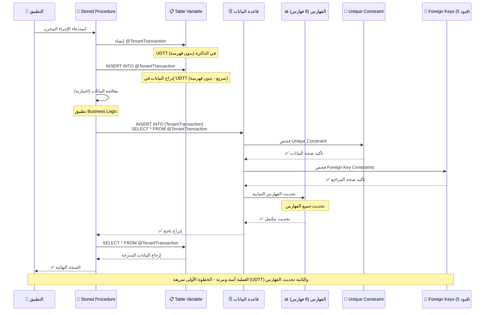

#### مخطط حالات العملية - الطريقة الأولى

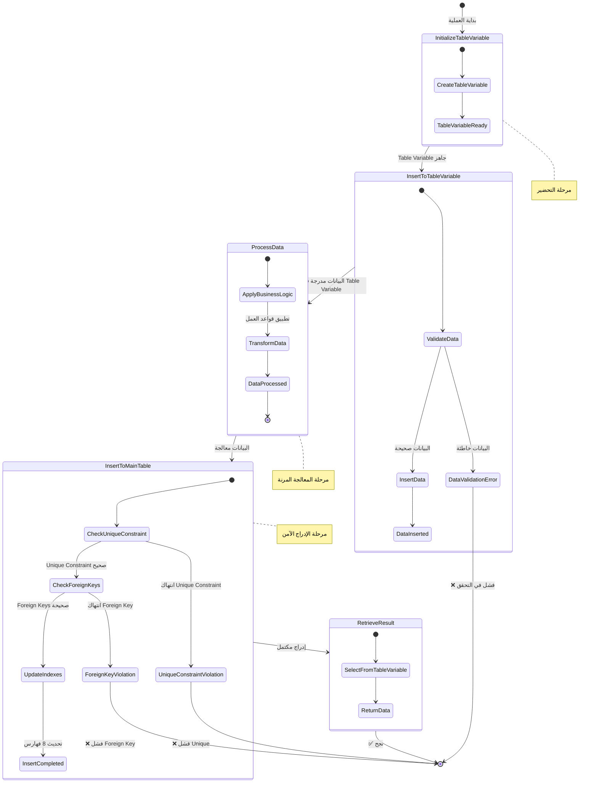

---

### الطريقة الثانية: INSERT with OUTPUT Clause

```sql
-- ادراج البيانات الى الجدول الفعلي مع OUTPUT
INSERT INTO [TenantTransaction]
    (tenantId, serviceId, id, serialNo, currencyId, amount, toCurrencyId, toAmount, 
     [description], [status], creatorUserId, updatorUserId, createdAt, updatedAt)

OUTPUT inserted.* INTO @TenantTransaction -- استخدام OUTPUT Clause لتخزين البيانات المُدرجة في UDTT

VALUES
    (@tenantId, @serviceId, @transactionId, @serialNo, @currencyId, @amount, 
     null, null, @transactionDescription, @finalStatus, @creatorUserId, 
     @creatorUserId, @finalCreatedAt, GETDATE());
```

#### مخطط تسلسل العمليات - الطريقة الثانية

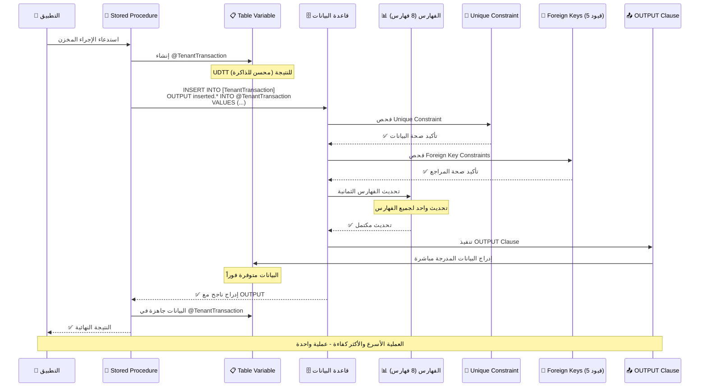

#### مخطط حالات العملية - الطريقة الثانية

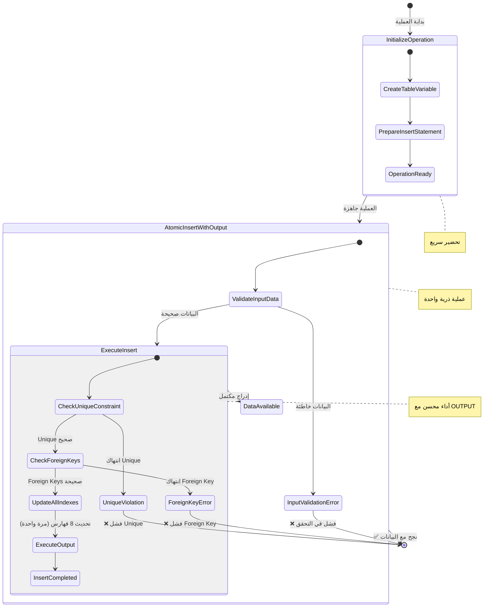

---

### الطريقة الثالثة: INSERT then SELECT Pattern

```sql
-- الخطوة الأولى: إدراج البيانات الى الجدول الفعلي
INSERT INTO [TenantTransaction]
    (tenantId, serviceId, id, serialNo, currencyId, amount, toCurrencyId, toAmount, 
     [description], [status], creatorUserId, updatorUserId, createdAt, updatedAt)
VALUES
    (@tenantId, @serviceId, @transactionId, @serialNo, @currencyId, @amount, 
     null, null, @transactionDescription, @finalStatus, @creatorUserId, 
     @creatorUserId, @finalCreatedAt, GETDATE());

-- الخطوة الثانية: استرجاع البيانات المُدرجة الى UDTT
INSERT INTO @TenantTransaction
SELECT *
FROM [TenantTransaction]
WHERE tenantId = @tenantId AND serviceId = @serviceId AND id = @transactionId;
```

#### مخطط تسلسل العمليات - الطريقة الثالثة

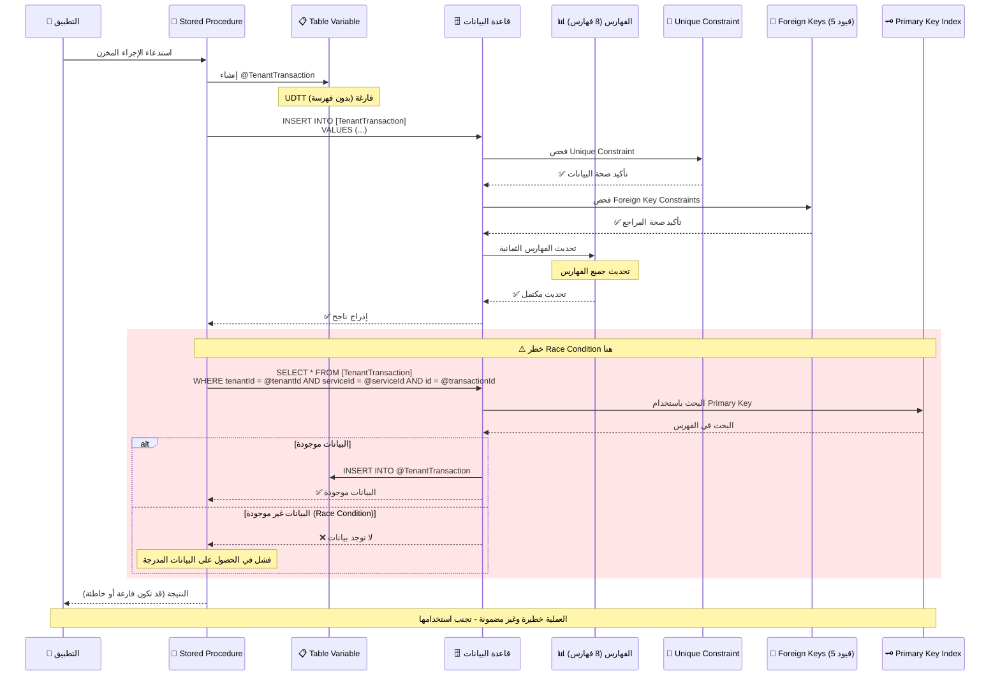

#### مخطط حالات العملية - الطريقة الثالثة

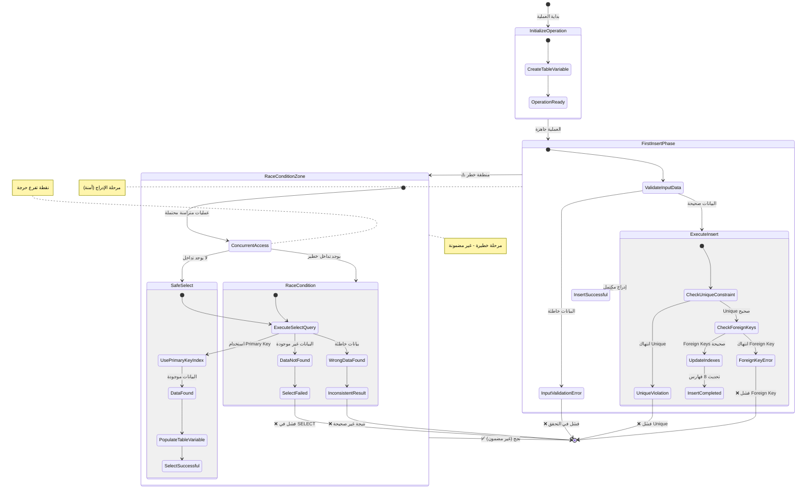

---

## التحليل المفصل والمقارنة

### 1. مقارنة الكفاءة والأداء (Performance & Efficiency)

| المعيار                          | الطريقة الأولى          | الطريقة الثانية      | الطريقة الثالثة          |
| -------------------------------- | ----------------------- | -------------------- | ------------------------ |
| **عدد العمليات**                 | 2 عمليات INSERT         | 1 عملية INSERT       | 1 INSERT + 1 SELECT      |
| **استخدام الذاكرة**              | منخفض (UDTT في الذاكرة) | منخفض (OUTPUT مباشر) | منخفض (UDTT + Query)     |
| **سرعة التنفيذ**                 | بطيء نسبياً              | الأسرع               | الأبطأ                   |
| **I/O Operations**               | 2 عمليات كتابة          | 1 عملية كتابة        | 1 كتابة + 1 قراءة        |
| **استفادة من Primary Key**       | ✅ كاملة                 | ✅ كاملة              | ⚠️ محدودة (composite key) |
| **استفادة من Unique Constraint** | ✅ تحقق آمن              | ✅ تحقق آمن           | ❌ خطر انتهاك             |
| **Network Round Trips**          | 2                       | 1                    | 2                        |
| **التقييم العام**                | ⭐⭐⭐⭐                    | ⭐⭐⭐⭐⭐                | ⭐⭐                       |

### 2. مقارنة الأمان (Security)

| المعيار                     | الطريقة الأولى       | الطريقة الثانية | الطريقة الثالثة |
| --------------------------- | -------------------- | --------------- | --------------- |
| **مقاومة Race Conditions**  | عالية                | عالية           | منخفضة جداً      |
| **Atomic Operations**       | نعم (في Transaction) | نعم             | لا              |
| **Data Consistency**        | مضمونة               | مضمونة          | غير مضمونة      |
| **Concurrency Safety**      | آمن                  | آمن             | غير آمن         |
| **حماية Unique Constraint** | ✅ محمي               | ✅ محمي          | ❌ عرضة للانتهاك |
| **Foreign Key Integrity**   | ✅ محمي               | ✅ محمي          | ⚠️ قد يفشل       |
| **Transaction Isolation**   | محمي                 | محمي            | عرضة للتداخل    |
| **التقييم العام**           | ⭐⭐⭐⭐                 | ⭐⭐⭐⭐⭐           | ⭐               |

### 3. مقارنة المرونة (Flexibility)

| المعيار                        | الطريقة الأولى   | الطريقة الثانية  | الطريقة الثالثة  |
| ------------------------------ | ---------------- | ---------------- | ---------------- |
| **تعديل البيانات قبل الإدراج** | ممكن             | محدود            | ممكن             |
| **معالجة البيانات المدرجة**    | سهل              | سهل              | سهل              |
| **التحكم في التوقيت**          | عالي             | متوسط            | عالي             |
| **إضافة Logic إضافي**          | سهل              | صعب              | سهل              |
| **التخصيص**                    | عالي             | متوسط            | عالي             |
| **معالجة Default Values**      | ✅ يطبق GETDATE() | ✅ يطبق GETDATE() | ✅ يطبق GETDATE() |
| **التقييم العام**              | ⭐⭐⭐⭐             | ⭐⭐⭐              | ⭐⭐⭐⭐             |

### 4. مقارنة القابلية للتطوير (Scalability)

| المعيار                      | الطريقة الأولى  | الطريقة الثانية | الطريقة الثالثة |
| ---------------------------- | --------------- | --------------- | --------------- |
| **معالجة البيانات الكبيرة**  | جيد             | ممتاز           | ضعيف            |
| **Multiple Inserts**         | ممكن            | ممكن            | معقد            |
| **Batch Operations**         | مدعوم           | مدعوم جزئياً     | غير مدعوم       |
| **Memory Scalability**       | جيد (UDTT محسن) | ممتاز           | جيد (UDTT محسن) |
| **Performance مع 8 Indexes** | جيد             | ممتاز           | ضعيف جداً        |
| **Performance تحت الضغط**    | جيد             | ممتاز           | ضعيف            |
| **التقييم العام**            | ⭐⭐⭐⭐            | ⭐⭐⭐⭐⭐           | ⭐⭐              |

### 5. مقارنة الصيانة (Maintainability)

| المعيار            | الطريقة الأولى | الطريقة الثانية | الطريقة الثالثة |
| ------------------ | -------------- | --------------- | --------------- |
| **وضوح الكود**     | واضح           | واضح جداً        | واضح            |
| **سهولة التعديل**  | سهل            | متوسط           | سهل             |
| **قابلية القراءة** | جيد            | ممتاز           | جيد             |
| **التعقيد**        | متوسط          | منخفض           | عالي            |
| **Documentation**  | يحتاج توثيق    | واضح ذاتياً      | يحتاج توثيق     |
| **Error Handling** | سهل            | متوسط           | معقد            |
| **التقييم العام**  | ⭐⭐⭐            | ⭐⭐⭐⭐⭐           | ⭐⭐⭐             |

### 6. مقارنة التوافق مع المعايير (Standards Compliance)

| المعيار                    | الطريقة الأولى | الطريقة الثانية | الطريقة الثالثة |
| -------------------------- | -------------- | --------------- | --------------- |
| **SQL Standards**          | متوافق         | متوافق          | متوافق          |
| **Best Practices**         | جيد            | ممتاز           | ضعيف            |
| **Error Handling**         | جيد            | جيد             | معقد            |
| **Transaction Management** | ممتاز          | ممتاز           | ضعيف            |
| **Resource Management**    | جيد            | ممتاز           | ضعيف            |
| **ACID Compliance**        | ✅ كامل         | ✅ كامل          | ❌ غير مكتمل     |
| **التقييم العام**          | ⭐⭐⭐⭐           | ⭐⭐⭐⭐⭐           | ⭐⭐              |

## التحليل التفصيلي لكل طريقة

### الطريقة الأولى: Two-Step Insert

**المزايا:**

- ✅ توفر مرونة عالية في معالجة البيانات
- ✅ سهولة إضافة منطق إضافي
- ✅ وضوح في الخطوات
- ✅ أمان عالي في البيئات المتزامنة
- ✅ تعامل آمن مع Composite Primary Key
- ✅ حماية كاملة للـ Foreign Keys

**العيوب:**

- ❌ UDTT لا تستفيد من إحصائيات الجدول الأساسي
- ❌ تعقيد إضافي في الكود

**التحليل الواقعي:**
مع وجود 8 فهارس على الجدول، هذه الطريقة تتطلب تحديث الفهارس مرتين، مما يؤثر على الأداء. لكن استخدام UDTT يجعل العملية الأولى سريعة جداً لأنها في الذاكرة بدون فهرسة.

### الطريقة الثانية: OUTPUT Clause (الأفضل)

**المزايا:**

- ✅ أداء ممتاز (عملية واحدة)
- ✅ استهلاك ذاكرة منخفض
- ✅ أمان عالي
- ✅ متوافق مع أفضل الممارسات
- ✅ مناسب للبيئات عالية الأداء
- ✅ تحديث الفهارس مرة واحدة فقط
- ✅ استفادة مثلى من Primary Key المركب
- ✅ حماية كاملة للـ Unique Constraint

**العيوب:**

- ❌ مرونة محدودة في المعالجة
- ❌ صعوبة إضافة منطق معقد

**التحليل الواقعي:**
مع البنية الحالية للجدول (8 فهارس + قيود متعددة)، هذه الطريقة تحقق أفضل أداء ممكن.

### الطريقة الثالثة: Insert then Select (خطيرة)

**المزايا:**

- ✅ مرونة عالية
- ✅ سهولة الفهم

**العيوب:**

- ❌ عرضة لـ Race Conditions خطيرة
- ❌ أداء ضعيف جداً مع 8 فهارس (تحديث ثم قراءة)
- ❌ عمليات I/O إضافية (SELECT بعد INSERT)
- ❌ غير آمن مع Composite Primary Key
- ❌ خطر انتهاك Unique Constraint على serialNo
- ❌ احتمالية فقدان البيانات في البيئات المتزامنة
- ❌ مشاكل مع Foreign Key Constraints

**التحليل الواقعي:**
مع الـ Unique Constraint على (tenantId, serialNo)، هذه الطريقة خطيرة جداً في البيئات المتزامنة.

## تحليل التعارض مع المكونات المختلفة

### مع Triggers

```sql
-- الطريقة الأولى: آمنة مع Triggers
CREATE TRIGGER TR_TenantTransaction_AfterInsert
ON TenantTransaction
AFTER INSERT
AS
BEGIN
    -- يعمل بشكل طبيعي مع جميع الطرق
    INSERT INTO AuditLog (tenantId, serviceId, transactionId, action, userId, createdAt)
    SELECT tenantId, serviceId, id, 'INSERT', creatorUserId, GETDATE()
    FROM inserted;
END

-- مشكلة مع INSTEAD OF Trigger
CREATE TRIGGER TR_TenantTransaction_InsteadOf
ON TenantTransaction
INSTEAD OF INSERT
AS
BEGIN
    -- قد يتعارض مع OUTPUT Clause
    INSERT INTO TenantTransaction (tenantId, serviceId, id, serialNo, currencyId, amount, description, status, creatorUserId, updatorUserId)
    SELECT tenantId, serviceId, id, serialNo, currencyId, amount, description, status, creatorUserId, updatorUserId
    FROM inserted;
END
```

### مع Indexes (تحليل واقعي)

```sql
-- الفهارس الموجودة تؤثر على الأداء
-- الطريقة الثانية تستفيد أكثر من:
-- 1. Primary Key: (tenantId, serviceId, id)
-- 2. Unique Key: (tenantId, serialNo)
-- 3. 8 إجمالي الفهارس (1 Primary + 7 Non-Clustered)

-- الطريقة الثالثة تعاني من:
-- - SELECT يحتاج فحص Primary Key
-- - قد لا يستفيد من Indexes بكفاءة
-- - تحديث الفهارس ثم قراءتها مباشرة (inefficient)

-- مثال على استعلام الطريقة الثالثة:
SELECT * FROM [TenantTransaction]
WHERE tenantId = @tenantId AND serviceId = @serviceId AND id = @transactionId;
-- هذا الاستعلام سيستخدم Primary Key Index بكفاءة
-- لكن المشكلة في التوقيت والـ Race Conditions
```

### مع Constraints (تحليل مفصل)

```sql
-- 1. Primary Key Constraint: PK_TenantTransaction (tenantId, serviceId, id)
-- جميع الطرق تتعامل معه بشكل طبيعي

-- 2. Unique Constraint: UQ_TenantTransaction (tenantId, serialNo)
-- الطريقة الثالثة خطيرة هنا:
-- Thread 1: INSERT (tenantId=1, serialNo='ABC123')
-- Thread 2: INSERT (tenantId=1, serialNo='ABC123') -- قد ينجح
-- Thread 1: SELECT -- قد يجد البيانات الخاطئة
-- Thread 2: SELECT -- قد يجد البيانات الخاطئة

-- 3. Foreign Key Constraints (5 قيود):
-- - FK_TenantTransaction_TenantService
-- - FK_TenantTransaction_TenantCurrency  
-- - FK_TenantTransaction_ToTenantCurrency
-- - FK_TenantTransaction_Creator
-- - FK_TenantTransaction_Updator

-- جميع الطرق تتعامل مع Foreign Keys بشكل طبيعي
-- لكن الطريقة الثالثة قد تواجه مشاكل في حالة:
-- - تغيير Foreign Key بين INSERT و SELECT
-- - حذف المرجع بين العمليتين
```

## مشاكل حقيقية مع الطريقة الثالثة

### مشكلة Race Condition مع Unique Constraint

```sql
-- سيناريو خطير:
-- Session 1:
BEGIN TRANSACTION;
INSERT INTO [TenantTransaction] 
VALUES (1, 100, 1001, 'ABC123', 'USD', 1000, NULL, NULL, 'Test', 20, 1, 1);

-- Session 2 (في نفس الوقت):
BEGIN TRANSACTION;
INSERT INTO [TenantTransaction] 
VALUES (1, 100, 1002, 'ABC123', 'USD', 2000, NULL, NULL, 'Test2', 20, 2, 2);
-- خطأ: انتهاك Unique Constraint

-- Session 1:
INSERT INTO @TenantTransaction
SELECT * FROM [TenantTransaction]
WHERE tenantId = 1 AND serviceId = 100 AND id = 1001;
-- قد يجد بيانات خاطئة أو لا يجد شيء

COMMIT;
```

### مشكلة مع Default Values

```sql
-- الطريقة الثالثة قد تواجه مشاكل مع:
-- createdAt DATETIME NOT NULL DEFAULT(GETDATE())
-- updatedAt DATETIME NOT NULL DEFAULT(GETDATE())

-- إذا تم INSERT في وقت مختلف عن SELECT
-- قد تختلف القيم المسترجعة عن القيم الفعلية المدرجة
```

## التوصيات النهائية حسب بيئة قاعدة البيانات

### بيئة بسيطة (Simple Environment)

- **استخدم الطريقة الثانية** (OUTPUT Clause)
- أقل تعقيد وأفضل أداء
- **مثال:**

```sql
INSERT INTO [TenantTransaction]
    (tenantId, serviceId, id, serialNo, currencyId, amount, description, status, creatorUserId, updatorUserId)
OUTPUT inserted.* INTO @TenantTransaction
VALUES
    (@tenantId, @serviceId, @transactionId, @serialNo, @currencyId, @amount, @description, @status, @creatorUserId, @updatorUserId);
```

### بيئة معقدة (Complex Environment)

- **استخدم الطريقة الأولى** إذا كان لديك:
  - INSTEAD OF Triggers
  - Business Logic معقد
  - Validation متقدم
- **مثال:**

```sql
-- إدراج في Table Variable أولاً للمعالجة
INSERT INTO @TenantTransaction
VALUES (@tenantId, @serviceId, @transactionId, @serialNo, @currencyId, @amount, NULL, NULL, @description, @status, @creatorUserId, @updatorUserId, GETDATE(), GETDATE());

-- معالجة إضافية هنا
-- ...

-- إدراج في الجدول الفعلي
INSERT INTO [TenantTransaction]
SELECT * FROM @TenantTransaction;
```

### بيئة عالية الأداء (High Performance)

- **استخدم الطريقة الثانية** حصرياً
- أفضل استغلال للـ 8 Indexes
- أقل استهلاك للموارد
- أمان كامل مع Constraints

### بيئة Legacy

- **تجنب الطريقة الثالثة** حتى لو كانت موجودة
- **اترقي إلى الطريقة الثانية** تدريجياً
- **إذا اضطررت للطريقة الثالثة، أضف حماية:**

```sql
BEGIN TRANSACTION;
INSERT INTO [TenantTransaction] (...) VALUES (...);
INSERT INTO @TenantTransaction 
SELECT * FROM [TenantTransaction] WITH (UPDLOCK, HOLDLOCK)
WHERE tenantId = @tenantId AND serviceId = @serviceId AND id = @transactionId;
COMMIT TRANSACTION;
```

## الخلاصة النهائية

| الطريقة             | التقييم العام | الاستخدام المفضل           | ملاحظات خاصة               |
| ------------------- | ------------- | -------------------------- | -------------------------- |
| **الطريقة الثانية** | ⭐⭐⭐⭐⭐         | **الأفضل للاستخدام العام** | مثالية مع 8 فهارس و 5 قيود |
| **الطريقة الأولى**  | ⭐⭐⭐⭐          | للحالات المعقدة            | جيدة مع UDTT محسن للذاكرة  |
| **الطريقة الثالثة** | ⭐             | **تجنب استخدامها**         | خطيرة مع Unique Constraint |

**الطريقة الثانية (OUTPUT Clause) هي الأفضل** لأنها:

- ✅ تحقق أفضل أداء مع البنية الحالية للجدول (8 فهارس)
- ✅ آمنة تماماً مع جميع القيود الموجودة
- ✅ تستفيد بكفاءة من جميع الفهارس
- ✅ تضمن ACID compliance كاملة
- ✅ الأكثر توافقاً مع معايير SQL Server الحديثة

**الطريقة الأولى محسنة مع UDTT** وتصبح أفضل لأن:

- ✅ **UDTT فائق السرعة**: عمليات الذاكرة أسرع بكثير من القرص
- ✅ **بدون فهرسة**: لا تحتاج وقت لإنشاء أو تحديث فهارس
- ✅ **استهلاك ذاكرة محسن**: مصمم خصيصاً للبيانات المؤقتة
- ✅ **مرونة عالية**: يمكن معالجة البيانات قبل الإدراج النهائي
- ⚠️ **العيب الوحيد**: تحديث الفهارس يحدث مرة واحدة فقط عند INSERT النهائي

---

### شجرة القرار لاختيار الطريقة المناسبة

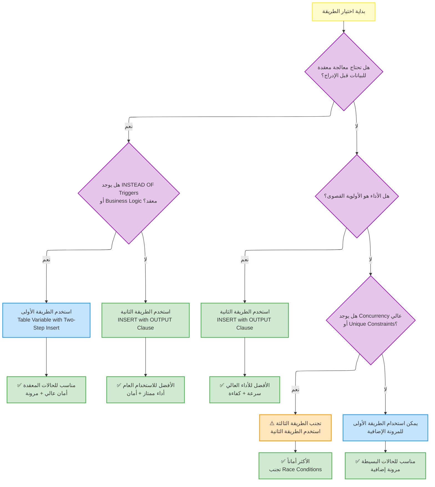

---

### مخطط التوصيات النهائية

```mermaid
---
config:
  layout: elk
---
graph TB
    subgraph "🏆 الأفضل للاستخدام العام"
        A[الطريقة الثانية<br/>INSERT with OUTPUT Clause<br/>⭐⭐⭐⭐⭐]
        A1[✅ أداء ممتاز]
        A2[✅ أمان عالي]
        A3[✅ استهلاك موارد منخفض]
        A4[✅ متوافق مع المعايير]
        A --> A1
        A --> A2
        A --> A3
        A --> A4
    end
    
    subgraph "🔧 للحالات المعقدة"
        B[الطريقة الأولى<br/>UDTT with Two-Step Insert<br/>⭐⭐⭐⭐]
        B1[✅ مرونة عالية]
        B2[✅ معالجة معقدة]
        B3[⚠️ أداء متوسط]
        B4[✅ أمان جيد]
        B --> B1
        B --> B2
        B --> B3
        B --> B4
    end
    
    subgraph "❌ تجنب الاستخدام"
        C[الطريقة الثالثة<br/>INSERT then SELECT Pattern<br/>⭐]
        C1[❌ خطر Race Conditions]
        C2[❌ أداء ضعيف]
        C3[❌ غير آمن]
        C4[❌ مشاكل مع Constraints]
        C --> C1
        C --> C2
        C --> C3
        C --> C4
    end
    
    classDef excellent fill:#4CAF5043, stroke:#4CAF50, stroke-width:3px;
    classDef good fill:#2196F343, stroke:#2196F3, stroke-width:2px;
    classDef poor fill:#F4433643, stroke:#F44336, stroke-width:2px;
    classDef positive fill:#4CAF5043, stroke:#4CAF50, stroke-width:1px;
    classDef warning fill:#FF980043, stroke:#FF9800, stroke-width:1px;
    classDef negative fill:#F4433643, stroke:#F44336, stroke-width:1px;
    
    class A excellent;
    class B good;
    class C poor;
    class A1,A2,A3,A4,B1,B2,B4 positive;
    class B3 warning;
    class C1,C2,C3,C4 negative;
```

---

## 📊 الرسوم التوضيحية

### مخطط UDTT vs Table Variable Performance

```mermaid
---
config:
  layout: elk
---
graph TB
    subgraph "UDTT (User-Defined Table Type)"
        A[TenantTransactionData]
        A1[✅ في الذاكرة]
        A2[✅ بدون فهرسة]
        A3[✅ سريع جداً]
        A4[✅ محسن للذاكرة]
        A5[⚠️ بدون إحصائيات]
        A --> A1
        A --> A2
        A --> A3
        A --> A4
        A --> A5
    end
    
    subgraph "Table Variable العادي"
        B[Table Variable]
        B1[✅ في الذاكرة]
        B2[❌ قد يحتاج فهرسة]
        B3[⚠️ أداء متغير]
        B4[⚠️ استهلاك ذاكرة أعلى]
        B5[❌ بدون إحصائيات]
        B --> B1
        B --> B2
        B --> B3
        B --> B4
        B --> B5
    end
    
    subgraph "الجدول الأساسي"
        C[TenantTransaction Table]
        C1[❌ على القرص]
        C2[✅ 8 فهارس]
        C3[⚠️ أداء متغير حسب الحمل]
        C4[❌ استهلاك I/O]
        C5[✅ إحصائيات كاملة]
        C --> C1
        C --> C2
        C --> C3
        C --> C4
        C --> C5
    end
    
    classDef udtt fill:#4CAF5043, stroke:#4CAF50, stroke-width:2px;
    classDef table fill:#2196F343, stroke:#2196F3, stroke-width:2px;
    classDef disk fill:#FF980043, stroke:#FF9800, stroke-width:2px;
    classDef positive fill:#4CAF5043, stroke:#4CAF50, stroke-width:1px;
    classDef warning fill:#FF980043, stroke:#FF9800, stroke-width:1px;
    classDef negative fill:#F4433643, stroke:#F44336, stroke-width:1px;
    
    class A udtt;
    class B table;
    class C disk;
    class A1,A2,A3,A4,B1,C2,C5 positive;
    class A5,B3,B4,C3 warning;
    class B2,B5,C1,C4 negative;
```

---

### مخطط مقارنة الطرق الثلاث

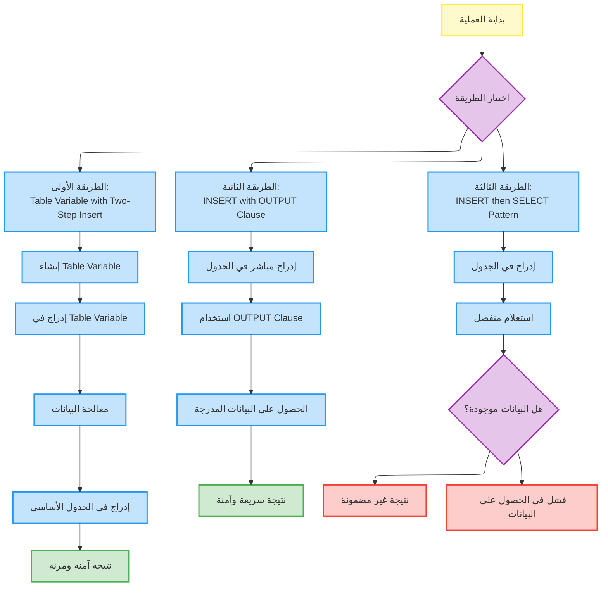

### مخطط Race Condition في الطريقة الثالثة

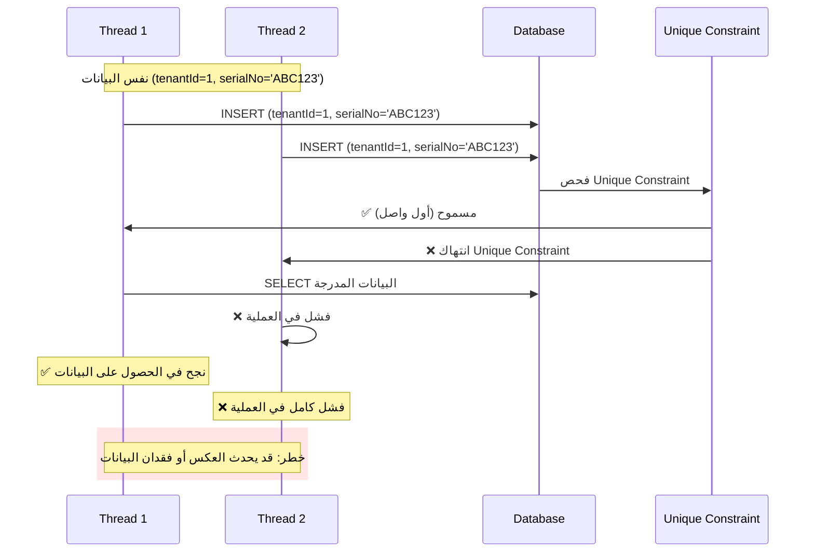

### مخطط تأثير الفهارس على الأداء

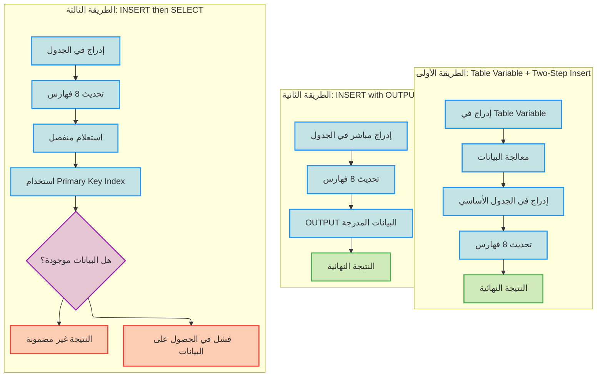
